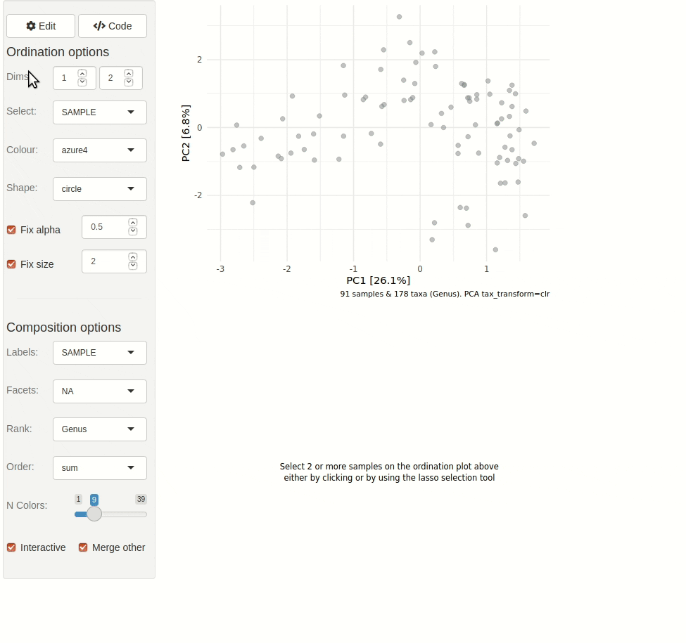

<!-- README.md is generated from README.Rmd. Please edit that file -->

```{r, include = FALSE}
knitr::opts_chunk$set(
  collapse = TRUE, comment = "#>",
  fig.path = "man/figures/README-", dev = "CairoPNG"
)
```

# microViz <a href='https://david-barnett.github.io/microViz/index.html'></a>

<!-- badges: start -->

[](https://github.com/david-barnett/microViz/actions) [](https://codecov.io/gh/david-barnett/microViz) [](https://hub.docker.com/r/barnettdavid/microviz-rocker-verse) [](https://joss.theoj.org/papers/4547b492f224a26d96938ada81fee3fa) [](https://zenodo.org/badge/latestdoi/307119750)

<!-- badges: end -->

## Overview

:package: `microViz` is an R package for analysis and visualization of microbiome sequencing data.

:hammer: `microViz` functions are intended to be easy to use and flexible.

:microscope: `microViz` extends and complements popular microbial ecology packages like `phyloseq`, `vegan`, & `microbiome`.

## Learn more

:paperclip: This website is the best place for documentation and examples: <https://david-barnett.github.io/microViz/>

-   [**This ReadMe**](https://david-barnett.github.io/microViz/) shows a few example analyses

-   **The [Reference](https://david-barnett.github.io/microViz/reference/index.html) page** lists all functions and links to help pages and examples

-   **The [Changelog](https://david-barnett.github.io/microViz/news/index.html)** describes important changes in new microViz package versions

-   **The Articles pages** give tutorials and further examples

    -   [Working with phyloseq objects](https://david-barnett.github.io/microViz/articles/web-only/phyloseq.html)

    -   [Fixing your taxa table with tax_fix](https://david-barnett.github.io/microViz/articles/web-only/tax-fixing.html)

    -   [Creating ordination plots](https://david-barnett.github.io/microViz/articles/web-only/ordination.html) (e.g. PCA or PCoA)

    -   [Interactive ordination plots with ord_explore](https://david-barnett.github.io/microViz/articles/web-only/ordination-interactive.html)

    -   [Visualising taxonomic compositions with comp_barplot](https://david-barnett.github.io/microViz/articles/web-only/compositions.html)
    
    -   [Heatmaps of microbiome composition and correlation](https://david-barnett.github.io/microViz/articles/web-only/heatmaps.html)

    -   [Modelling and plotting individual taxon associations with taxatrees](https://david-barnett.github.io/microViz/articles/web-only/modelling-taxa.html)

    -   More coming soon(ish)!
        Post on [GitHub discussions](https://github.com/david-barnett/microViz/discussions) if you have questions/requests

## Installation

You can install the latest available microViz package version using the following instructions.

``` r
# Installing from github requires the devtools package
install.packages("devtools") 

# To install the latest "released" version of this package
devtools::install_github("david-barnett/microViz@0.8.2") # check 0.8.2 is the latest release

# To install the very latest version:
devtools::install_github("david-barnett/microViz")
# If you encounter a bug please try the latest version & let me know if the bug persists!

# If the Bioconductor dependencies don't automatically install you can install
# them yourself like this:
if (!requireNamespace("BiocManager", quietly = TRUE)) install.packages("BiocManager") 
BiocManager::install(c("phyloseq", "microbiome", "ComplexHeatmap"))
```

:computer: **Windows users** - will need to have RTools installed so that your computer can build this package (follow instructions here: <http://jtleek.com/modules/01_DataScientistToolbox/02_10_rtools/>)

**:apple: macOS** **users** - might need to install [xquartz](https://www.xquartz.org/) to make the heatmaps work (to do this with homebrew, run the following command in your mac's Terminal: `brew install --cask xquartz`

:package: I highly recommend using [renv](https://rstudio.github.io/renv/index.html) for managing your R package installations across multiple projects.

:whale: Alternatively, for Docker users an image with the main branch installed is available at: <https://hub.docker.com/r/barnettdavid/microviz-rocker-verse>

:date: microViz is tested to work with R version 4 on Windows, MacOS, and Ubuntu 18 and 20.
R version 3.6.\* should probably work, but I don't formally test this.

## Interactive ordination exploration

```{r load, message=FALSE}
library(microViz)
```

microViz provides a Shiny app for an easy way to start exploring your microbiome data: all you need is a phyloseq object.

```{r example ord_explore}
# example data from corncob package
pseq <- corncob::ibd_phylo %>%
  tax_fix() %>%
  phyloseq_validate()
```

``` {.r}
ord_explore(pseq) # gif generated with microViz version 0.7.4 (plays at 1.75x speed)
```



## Example analyses

```{r packages}
library(phyloseq)
library(dplyr)
library(ggplot2)
```

```{r data setup}
# get some example data
data("dietswap", package = "microbiome")

# create a couple of numerical variables to use as constraints or conditions
dietswap <- dietswap %>%
  ps_mutate(
    weight = recode(bmi_group, obese = 3, overweight = 2, lean = 1),
    female = if_else(sex == "female", true = 1, false = 0),
    african = if_else(nationality == "AFR", true = 1, false = 0)
  )
# add a couple of missing values to show how microViz handles missing data
sample_data(dietswap)$african[c(3, 4)] <- NA
```

### Looking at your data

You have quite a few samples in your phyloseq object, and would like to visualise their compositions.
Perhaps these example data differ participant nationality?

```{r fig.height=5, fig.width=6, dpi=120}
dietswap %>%
  comp_barplot(
    tax_level = "Genus", n_taxa = 15, other_name = "Other",
    taxon_renamer = function(x) stringr::str_remove(x, " [ae]t rel."),
    palette = distinct_palette(n = 15, add = "grey90"),
    merge_other = FALSE, bar_outline_colour = "darkgrey"
  ) +
  coord_flip() +
  facet_wrap("nationality", nrow = 1, scales = "free") +
  labs(x = NULL, y = NULL) +
  theme(axis.text.y = element_blank(), axis.ticks.y = element_blank())
```


```{r, fig.width=5.5, fig.height=3.5, dpi=120}
htmp <- dietswap %>%
  ps_mutate(nationality = as.character(nationality)) %>%
  tax_transform("log2", add = 1, chain = TRUE) %>%
  comp_heatmap(
    taxa = tax_top(dietswap, n = 30), grid_col = NA, name = "Log2p",
    taxon_renamer = function(x) stringr::str_remove(x, " [ae]t rel."),
    colors = heat_palette(palette = viridis::turbo(11)),
    row_names_side = "left", row_dend_side = "right", sample_side = "bottom",
    sample_anno = sampleAnnotation(
      Nationality = anno_sample_cat(
        var = "nationality", col = c(AAM = "grey35", AFR = "grey85"),
        box_col = NA, legend_title = "Nationality", size = grid::unit(4, "mm")
      )
    )
  )

ComplexHeatmap::draw(
  object = htmp, annotation_legend_list = attr(htmp, "AnnoLegends"),
  merge_legends = TRUE
)
```


### Example ordination plot workflow

Ordination methods can also help you to visualise if overall microbial ecosystem composition differs markedly between groups, e.g. BMI.

Here is one option as an example:

1.  Filter out rare taxa (e.g. remove Genera not present in at least 10% of samples) - use `tax_filter()`
2.  Aggregate the taxa into bacterial families (for example) - use `tax_agg()`
3.  Transform the microbial data with the centre-log-ratio transformation - use `tax_transform()`
4.  Perform PCA with the clr-transformed features (equivalent to aitchison distance PCoA) - use `ord_calc()`
5.  Plot the first 2 axes of this PCA ordination, colouring samples by group and adding taxon loading arrows to visualise which taxa generally differ across your samples - use `ord_plot()`
6.  Customise the theme of the ggplot as you like and/or add features like ellipses or annotations

```{r ordination-plot, dpi=120}
# perform ordination
unconstrained_aitchison_pca <- dietswap %>%
  tax_filter(min_prevalence = 0.1, tax_level = "Genus") %>%
  tax_agg("Family") %>%
  tax_transform("clr") %>%
  ord_calc()
# ord_calc will automatically infer you want a "PCA" here
# specify explicitly with method = "PCA", or you can pick another method

# create plot
pca_plot <- unconstrained_aitchison_pca %>%
  ord_plot(
    plot_taxa = 1:6, colour = "bmi_group", size = 1.5,
    tax_vec_length = 0.325,
    tax_lab_style = tax_lab_style(max_angle = 90, aspect_ratio = 0.5),
    auto_caption = 8
  )

# customise plot
customised_plot <- pca_plot +
  stat_ellipse(aes(linetype = bmi_group, colour = bmi_group), size = 0.3) +
  scale_colour_brewer(palette = "Set1") +
  theme(legend.position = "bottom") +
  coord_fixed(ratio = 0.5, clip = "off") # makes rotated labels align correctly

# show plot
customised_plot
```

### PERMANOVA

You visualised your ordinated data in the plot above.
Below you can see how to perform a PERMANOVA to test the significance of BMI's association with overall microbial composition.
This example uses the Family-level aitchison distance to correspond with the plot above.

```{r permanova}
# calculate distances
aitchison_dists <- dietswap %>%
  tax_filter(min_prevalence = 0.1) %>%
  tax_transform("identity", rank = "Family") %>%
  dist_calc("aitchison")

# the more permutations you request, the longer it takes
# but also the more stable and precise your p-values become
aitchison_perm <- aitchison_dists %>% 
  dist_permanova(
    seed = 1234, # for set.seed to ensure reproducibility of random process
    n_processes = 1, n_perms = 99, # you should use at least 999!
    variables = "bmi_group"
  )

# view the permanova results
perm_get(aitchison_perm) %>% as.data.frame()

# view the info stored about the distance calculation
info_get(aitchison_perm)
```

### Constrained partial ordination

You could visualise the effect of the (numeric/logical) variables in your permanova directly using the `ord_plot` function with constraints (and conditions). 

```{r constrained-ord}
perm2 <- aitchison_dists %>% 
  dist_permanova(variables = c("weight", "african", "sex"), seed = 321)
```

We'll visualise the effect of nationality and bodyweight on sample composition, after first removing the effect of sex.

```{r constrained-ord-plot, fig.height=6, fig.width=6, dpi=120}
perm2 %>%
  ord_calc(constraints = c("weight", "african"), conditions = "female") %>%
  ord_plot(
    colour = "nationality", size = 2.5, alpha = 0.35,
    auto_caption = 7,
    constraint_vec_length = 1,
    constraint_vec_style = vec_constraint(size = 1.5, colour = "grey15"),
    constraint_lab_style = constraint_lab_style(
      max_angle = 90, size = 3, aspect_ratio = 0.35, colour = "black"
    )
  ) +
  stat_ellipse(aes(colour = nationality), size = 0.2) +
  scale_color_brewer(palette = "Set1") +
  coord_fixed(ratio = 0.35, clip = "off") +
  theme(legend.position = c(0.9, 0.1), legend.background = element_rect())
```

### Correlation Heatmaps

microViz heatmaps are powered by `ComplexHeatmap` and annotated with taxa prevalence and/or abundance.

```{r heatmap, dpi=120, fig.width=7, fig.height=5.5}
# set up the data with numerical variables and filter to top taxa
psq <- dietswap %>%
  ps_mutate(
    weight = recode(bmi_group, obese = 3, overweight = 2, lean = 1),
    female = if_else(sex == "female", true = 1, false = 0),
    african = if_else(nationality == "AFR", true = 1, false = 0)
  ) %>%
  tax_filter(
    tax_level = "Genus", min_prevalence = 1 / 10, min_sample_abundance = 1 / 10
  ) %>%
  tax_transform("identity", rank = "Genus")

# randomly select 30 taxa from the 50 most abundant taxa (just for an example)
set.seed(123)
taxa <- sample(tax_top(psq, n = 50), size = 30)
# actually draw the heatmap
cor_heatmap(
  data = psq, taxa = taxa,
  taxon_renamer = function(x) stringr::str_remove(x, " [ae]t rel."),
  tax_anno = taxAnnotation(
    Prev. = anno_tax_prev(undetected = 50),
    Log2 = anno_tax_box(undetected = 50, trans = "log2", zero_replace = 1)
  )
)
```

## Citation

:innocent: If you find any part of microViz useful to your work, please consider citing the JOSS article:

Barnett et al., (2021).
microViz: an R package for microbiome data visualization and statistics.
Journal of Open Source Software, 6(63), 3201, <https://doi.org/10.21105/joss.03201>

## Contributing

Bug reports, questions, suggestions for new features, and other contributions are all welcome.
Feel free to create a [GitHub Issue](https://github.com/david-barnett/microViz/issues) or write on the [Discussions](https://github.com/david-barnett/microViz/discussions) page.
Alternatively you could also contact me (David) on Twitter [\@\_david_barnett\_](https://twitter.com/_david_barnett_) .

This project is released with a [Contributor Code of Conduct](https://david-barnett.github.io/microViz/CODE_OF_CONDUCT.html) and by participating in this project you agree to abide by its terms.

## Session info

```{r session}
sessionInfo()
```
