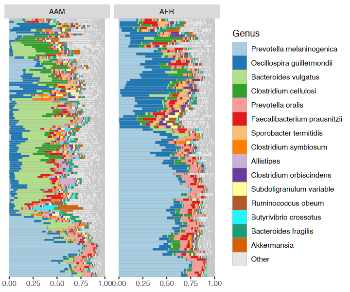
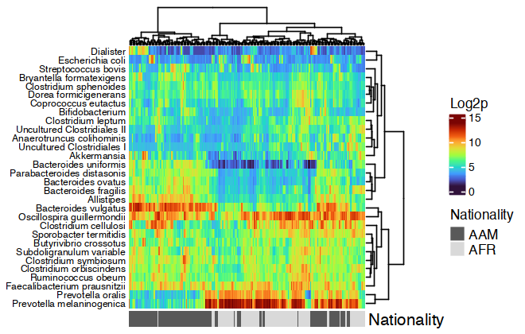
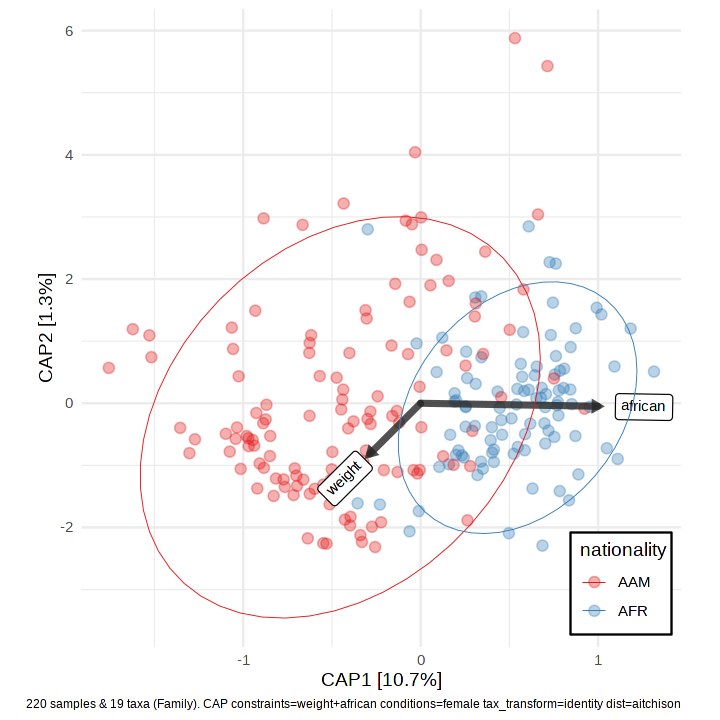
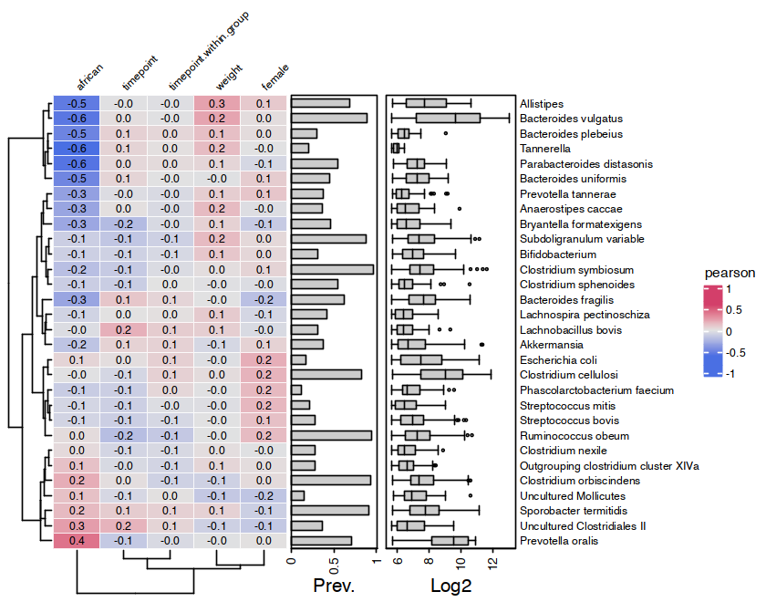

<!-- README.md is generated from README.Rmd. Please edit that file -->

# microViz <a href='https://david-barnett.github.io/microViz/index.html'></a>

<!-- badges: start -->

[](https://github.com/david-barnett/microViz/actions)
[](https://codecov.io/gh/david-barnett/microViz)


[](https://david-barnett.r-universe.dev/ui#package:microViz)
[](https://joss.theoj.org/papers/4547b492f224a26d96938ada81fee3fa)
[](https://scholar.google.com/scholar?oi=bibs&hl=en&cites=5439940108464463894)
[](https://zenodo.org/badge/latestdoi/307119750)

<!-- badges: end -->

## Overview

:package: `microViz` is an R package for analysis and visualization of
microbiome sequencing data.

:hammer: `microViz` functions are intended to be easy to use and
flexible.

:microscope: `microViz` extends and complements popular microbial
ecology packages like `phyloseq`, `vegan`, & `microbiome`.

## Learn more

:paperclip: This website is the best place for documentation and
examples: <https://david-barnett.github.io/microViz/>

-   [**This ReadMe**](https://david-barnett.github.io/microViz/) shows a
    few example analyses

-   **The
    [Reference](https://david-barnett.github.io/microViz/reference/index.html)
    page** lists all functions and links to help pages and examples

-   **The
    [Changelog](https://david-barnett.github.io/microViz/news/index.html)**
    describes important changes in new microViz package versions

-   **The Articles pages** give tutorials and further examples

    -   [Working with phyloseq
        objects](https://david-barnett.github.io/microViz/articles/web-only/phyloseq.html)

    -   [Fixing your taxa table with
        tax_fix](https://david-barnett.github.io/microViz/articles/web-only/tax-fixing.html)

    -   [Creating ordination
        plots](https://david-barnett.github.io/microViz/articles/web-only/ordination.html)
        (e.g. PCA or PCoA)

    -   [Interactive ordination plots with
        ord_explore](https://david-barnett.github.io/microViz/articles/web-only/ordination-interactive.html)

    -   [Visualising taxonomic compositions with
        comp_barplot](https://david-barnett.github.io/microViz/articles/web-only/compositions.html)

    -   [Heatmaps of microbiome composition and
        correlation](https://david-barnett.github.io/microViz/articles/web-only/heatmaps.html)

    -   [Modelling and plotting individual taxon associations with
        taxatrees](https://david-barnett.github.io/microViz/articles/web-only/modelling-taxa.html)

    -   More coming soon(ish)! Post on [GitHub
        discussions](https://github.com/david-barnett/microViz/discussions)
        if you have questions/requests

## Installation

microViz is not (yet) available from CRAN. You can install microViz from
R Universe, or from GitHub.

I recommend you first install the Bioconductor dependencies using the
code below.

``` r
if (!requireNamespace("BiocManager", quietly = TRUE)) install.packages("BiocManager")
BiocManager::install(c("phyloseq", "microbiome", "ComplexHeatmap"), update = FALSE)
```

### Installation of microViz from R Universe

``` r
install.packages(
  "microViz",
  repos = c(davidbarnett = "https://david-barnett.r-universe.dev", getOption("repos"))
)
```

### Installation of microViz from GitHub

``` r
# Installing from github requires the devtools package
install.packages("devtools")
# Windows users will also need to have RTools installed! http://jtleek.com/modules/01_DataScientistToolbox/02_10_rtools/

# To install the very latest version:
devtools::install_github("david-barnett/microViz")

# To install a specific "release" version of this package
devtools::install_github("david-barnett/microViz@0.9.4") 
```

### Installation notes

**:apple: macOS** **users** - might need to install
[xquartz](https://www.xquartz.org/) to make the heatmaps work (to do
this with homebrew, run the following command in your mac’s Terminal:
`brew install --cask xquartz`

:package: I highly recommend using
[renv](https://rstudio.github.io/renv/index.html) for managing your R
package installations across multiple projects.

:whale: For Docker users an image with the main branch installed is
available at:
<https://hub.docker.com/r/barnettdavid/microviz-rocker-verse>

:date: microViz is tested to work with R version 4 on Windows, MacOS,
and Ubuntu 18 and 20. R version 3.6.\* should probably work, but I don’t
formally test this.

## Interactive ordination exploration

``` r
library(microViz)
#> 
#> microViz version 0.9.5 - Copyright (C) 2021 David Barnett
#> * Website: https://david-barnett.github.io/microViz/
#> * Useful? For citation info, run: citation('microViz')
#> * Silence: suppressPackageStartupMessages(library(microViz))
```

microViz provides a Shiny app for an easy way to start exploring your
microbiome data: all you need is a phyloseq object.

``` r
# example data from corncob package
pseq <- corncob::ibd_phylo %>%
  tax_fix() %>%
  phyloseq_validate()
```

``` r
ord_explore(pseq) # gif generated with microViz version 0.7.4 (plays at 1.75x speed)
```


## Example analyses

``` r
library(phyloseq)
library(dplyr)
#> 
#> Attaching package: 'dplyr'
#> The following objects are masked from 'package:stats':
#> 
#>     filter, lag
#> The following object is masked from 'package:testthat':
#> 
#>     matches
#> The following objects are masked from 'package:base':
#> 
#>     intersect, setdiff, setequal, union
library(ggplot2)
```

``` r
# get some example data
data("dietswap", package = "microbiome")

# create a couple of numerical variables to use as constraints or conditions
dietswap <- dietswap %>%
  ps_mutate(
    weight = recode(bmi_group, obese = 3, overweight = 2, lean = 1),
    female = if_else(sex == "female", true = 1, false = 0),
    african = if_else(nationality == "AFR", true = 1, false = 0)
  )
# add a couple of missing values to show how microViz handles missing data
sample_data(dietswap)$african[c(3, 4)] <- NA
```

### Looking at your data

You have quite a few samples in your phyloseq object, and would like to
visualize their compositions. Perhaps these example data differ
participant nationality?

``` r
dietswap %>%
  comp_barplot(
    tax_level = "Genus", n_taxa = 15, other_name = "Other",
    taxon_renamer = function(x) stringr::str_remove(x, " [ae]t rel."),
    palette = distinct_palette(n = 15, add = "grey90"),
    merge_other = FALSE, bar_outline_colour = "darkgrey"
  ) +
  coord_flip() +
  facet_wrap("nationality", nrow = 1, scales = "free") +
  labs(x = NULL, y = NULL) +
  theme(axis.text.y = element_blank(), axis.ticks.y = element_blank())
#> Registered S3 method overwritten by 'seriation':
#>   method         from 
#>   reorder.hclust vegan
```



``` r
htmp <- dietswap %>%
  ps_mutate(nationality = as.character(nationality)) %>%
  tax_transform("log2", add = 1, chain = TRUE) %>%
  comp_heatmap(
    taxa = tax_top(dietswap, n = 30), grid_col = NA, name = "Log2p",
    taxon_renamer = function(x) stringr::str_remove(x, " [ae]t rel."),
    colors = heat_palette(palette = viridis::turbo(11)),
    row_names_side = "left", row_dend_side = "right", sample_side = "bottom",
    sample_anno = sampleAnnotation(
      Nationality = anno_sample_cat(
        var = "nationality", col = c(AAM = "grey35", AFR = "grey85"),
        box_col = NA, legend_title = "Nationality", size = grid::unit(4, "mm")
      )
    )
  )

ComplexHeatmap::draw(
  object = htmp, annotation_legend_list = attr(htmp, "AnnoLegends"),
  merge_legends = TRUE
)
```



### Example ordination plot workflow

Ordination methods can also help you to visualize if overall microbial
ecosystem composition differs markedly between groups, e.g. BMI.

Here is one option as an example:

1.  Filter out rare taxa (e.g. remove Genera not present in at least 10%
    of samples) - use `tax_filter()`
2.  Aggregate the taxa into bacterial families (for example) - use
    `tax_agg()`
3.  Transform the microbial data with the centered-log-ratio
    transformation - use `tax_transform()`
4.  Perform PCA with the clr-transformed features (equivalent to
    Aitchison distance PCoA) - use `ord_calc()`
5.  Plot the first 2 axes of this PCA ordination, colouring samples by
    group and adding taxon loading arrows to visualize which taxa
    generally differ across your samples - use `ord_plot()`
6.  Customise the theme of the ggplot as you like and/or add features
    like ellipses or annotations

``` r
# perform ordination
unconstrained_aitchison_pca <- dietswap %>%
  tax_filter(min_prevalence = 0.1, tax_level = "Genus") %>%
  tax_agg("Family") %>%
  tax_transform("clr") %>%
  ord_calc()
#> Proportional min_prevalence given: 0.1 --> min 23/222 samples.
# ord_calc will automatically infer you want a "PCA" here
# specify explicitly with method = "PCA", or you can pick another method

# create plot
pca_plot <- unconstrained_aitchison_pca %>%
  ord_plot(
    plot_taxa = 1:6, colour = "bmi_group", size = 1.5,
    tax_vec_length = 0.325,
    tax_lab_style = tax_lab_style(max_angle = 90, aspect_ratio = 0.5),
    auto_caption = 8
  )

# customise plot
customised_plot <- pca_plot +
  stat_ellipse(aes(linetype = bmi_group, colour = bmi_group), size = 0.3) +
  scale_colour_brewer(palette = "Set1") +
  theme(legend.position = "bottom") +
  coord_fixed(ratio = 0.5, clip = "off") # makes rotated labels align correctly

# show plot
customised_plot
```


### PERMANOVA

You visualised your ordinated data in the plot above. Below you can see
how to perform a PERMANOVA to test the significance of BMI’s association
with overall microbial composition. This example uses the Family-level
aitchison distance to correspond with the plot above.

``` r
# calculate distances
aitchison_dists <- dietswap %>%
  tax_filter(min_prevalence = 0.1) %>%
  tax_transform("identity", rank = "Family") %>%
  dist_calc("aitchison")
#> Proportional min_prevalence given: 0.1 --> min 23/222 samples.

# the more permutations you request, the longer it takes
# but also the more stable and precise your p-values become
aitchison_perm <- aitchison_dists %>% 
  dist_permanova(
    seed = 1234, # for set.seed to ensure reproducibility of random process
    n_processes = 1, n_perms = 99, # you should use at least 999!
    variables = "bmi_group"
  )
#> 2022-10-04 14:23:48 - Starting PERMANOVA with 99 perms with 1 processes
#> 2022-10-04 14:23:48 - Finished PERMANOVA

# view the permanova results
perm_get(aitchison_perm) %>% as.data.frame()
#>            Df  SumOfSqs         R2        F Pr(>F)
#> bmi_group   2  104.0678 0.04177157 4.773379   0.01
#> Residual  219 2387.2862 0.95822843       NA     NA
#> Total     221 2491.3540 1.00000000       NA     NA

# view the info stored about the distance calculation
info_get(aitchison_perm)
#> ps_extra info:
#> tax_agg = Family 
#> tax_transform = identity 
#> tax_scale = NA 
#> distMethod = aitchison 
#> ordMethod = NA 
#> constraints = NA 
#> conditions = NA
```

### Constrained partial ordination

You could visualise the effect of the (numeric/logical) variables in
your permanova directly using the `ord_plot` function with constraints
(and conditions).

``` r
perm2 <- aitchison_dists %>% 
  dist_permanova(variables = c("weight", "african", "sex"), seed = 321)
#> Dropping samples with missings: 2
#> 2022-10-04 14:23:48 - Starting PERMANOVA with 999 perms with 1 processes
#> 2022-10-04 14:23:50 - Finished PERMANOVA
```

We’ll visualise the effect of nationality and bodyweight on sample
composition, after first removing the effect of sex.

``` r
perm2 %>%
  ord_calc(constraints = c("weight", "african"), conditions = "female") %>%
  ord_plot(
    colour = "nationality", size = 2.5, alpha = 0.35,
    auto_caption = 7,
    constraint_vec_length = 1,
    constraint_vec_style = vec_constraint(size = 1.5, colour = "grey15"),
    constraint_lab_style = constraint_lab_style(
      max_angle = 90, size = 3, aspect_ratio = 0.35, colour = "black"
    )
  ) +
  stat_ellipse(aes(colour = nationality), size = 0.2) +
  scale_color_brewer(palette = "Set1") +
  coord_fixed(ratio = 0.35, clip = "off") +
  theme(legend.position = c(0.9, 0.1), legend.background = element_rect())
#> 
#> Centering (mean) and scaling (sd) the constraints and conditions:
#>  weight
#>  african
#>  female
```



### Correlation Heatmaps

microViz heatmaps are powered by `ComplexHeatmap` and annotated with
taxa prevalence and/or abundance.

``` r
# set up the data with numerical variables and filter to top taxa
psq <- dietswap %>%
  ps_mutate(
    weight = recode(bmi_group, obese = 3, overweight = 2, lean = 1),
    female = if_else(sex == "female", true = 1, false = 0),
    african = if_else(nationality == "AFR", true = 1, false = 0)
  ) %>%
  tax_filter(
    tax_level = "Genus", min_prevalence = 1 / 10, min_sample_abundance = 1 / 10
  ) %>%
  tax_transform("identity", rank = "Genus")
#> Proportional min_prevalence given: 0.1 --> min 23/222 samples.

# randomly select 30 taxa from the 50 most abundant taxa (just for an example)
set.seed(123)
taxa <- sample(tax_top(psq, n = 50), size = 30)
# actually draw the heatmap
cor_heatmap(
  data = psq, taxa = taxa,
  taxon_renamer = function(x) stringr::str_remove(x, " [ae]t rel."),
  tax_anno = taxAnnotation(
    Prev. = anno_tax_prev(undetected = 50),
    Log2 = anno_tax_box(undetected = 50, trans = "log2", zero_replace = 1)
  )
)
```



## Citation

:innocent: If you find any part of microViz useful to your work, please
consider citing the JOSS article:

Barnett et al., (2021). microViz: an R package for microbiome data
visualization and statistics. Journal of Open Source Software, 6(63),
3201, <https://doi.org/10.21105/joss.03201>

## Contributing

Bug reports, questions, suggestions for new features, and other
contributions are all welcome. Feel free to create a [GitHub
Issue](https://github.com/david-barnett/microViz/issues) or write on the
[Discussions](https://github.com/david-barnett/microViz/discussions)
page. Alternatively you could also contact me (David) on Twitter
[@\_david_barnett\_](https://twitter.com/_david_barnett_) .

This project is released with a [Contributor Code of
Conduct](https://david-barnett.github.io/microViz/CODE_OF_CONDUCT.html)
and by participating in this project you agree to abide by its terms.

## Session info

``` r
sessionInfo()
#> R version 4.2.0 (2022-04-22)
#> Platform: aarch64-apple-darwin20 (64-bit)
#> Running under: macOS Monterey 12.6
#> 
#> Matrix products: default
#> BLAS:   /Library/Frameworks/R.framework/Versions/4.2-arm64/Resources/lib/libRblas.0.dylib
#> LAPACK: /Library/Frameworks/R.framework/Versions/4.2-arm64/Resources/lib/libRlapack.dylib
#> 
#> locale:
#> [1] en_GB.UTF-8/en_GB.UTF-8/en_GB.UTF-8/C/en_GB.UTF-8/en_GB.UTF-8
#> 
#> attached base packages:
#> [1] stats     graphics  grDevices utils     datasets  methods   base     
#> 
#> other attached packages:
#> [1] ggplot2_3.3.6   dplyr_1.0.10    phyloseq_1.40.0 microViz_0.9.5 
#> [5] testthat_3.1.4  devtools_2.4.3  usethis_2.1.6  
#> 
#> loaded via a namespace (and not attached):
#>   [1] Rtsne_0.16             colorspace_2.0-3       rjson_0.2.21          
#>   [4] ellipsis_0.3.2         circlize_0.4.15        markdown_1.1          
#>   [7] XVector_0.36.0         GlobalOptions_0.1.2    fs_1.5.2              
#>  [10] gridtext_0.1.4         ggtext_0.1.1           clue_0.3-61           
#>  [13] rstudioapi_0.13        farver_2.1.1           remotes_2.4.2         
#>  [16] fansi_1.0.3            xml2_1.3.3             codetools_0.2-18      
#>  [19] splines_4.2.0          doParallel_1.0.17      cachem_1.0.6          
#>  [22] knitr_1.39             pkgload_1.3.0          ade4_1.7-19           
#>  [25] jsonlite_1.8.0         Cairo_1.5-15           cluster_2.1.3         
#>  [28] png_0.1-7              compiler_4.2.0         assertthat_0.2.1      
#>  [31] Matrix_1.4-1           fastmap_1.1.0          cli_3.4.0             
#>  [34] htmltools_0.5.3        prettyunits_1.1.1      tools_4.2.0           
#>  [37] igraph_1.3.4           gtable_0.3.1           glue_1.6.2            
#>  [40] GenomeInfoDbData_1.2.8 reshape2_1.4.4         Rcpp_1.0.9            
#>  [43] Biobase_2.56.0         vctrs_0.4.1            Biostrings_2.64.0     
#>  [46] rhdf5filters_1.8.0     multtest_2.52.0        ape_5.6-2             
#>  [49] nlme_3.1-157           iterators_1.0.14       xfun_0.31             
#>  [52] stringr_1.4.1          ps_1.7.0               brio_1.1.3            
#>  [55] lifecycle_1.0.2        zlibbioc_1.42.0        MASS_7.3-57           
#>  [58] scales_1.2.1           TSP_1.2-1              parallel_4.2.0        
#>  [61] biomformat_1.24.0      rhdf5_2.40.0           RColorBrewer_1.1-3    
#>  [64] ComplexHeatmap_2.12.1  yaml_2.3.5             memoise_2.0.1         
#>  [67] gridExtra_2.3          stringi_1.7.8          highr_0.9             
#>  [70] S4Vectors_0.34.0       foreach_1.5.2          permute_0.9-7         
#>  [73] seriation_1.3.6.9000   BiocGenerics_0.42.0    pkgbuild_1.3.1        
#>  [76] shape_1.4.6            GenomeInfoDb_1.32.4    rlang_1.0.5           
#>  [79] pkgconfig_2.0.3        bitops_1.0-7           matrixStats_0.62.0    
#>  [82] evaluate_0.15          lattice_0.20-45        purrr_0.3.4           
#>  [85] Rhdf5lib_1.18.0        labeling_0.4.2         processx_3.5.3        
#>  [88] tidyselect_1.1.2       plyr_1.8.7             magrittr_2.0.3        
#>  [91] R6_2.5.1               magick_2.7.3           IRanges_2.30.0        
#>  [94] generics_0.1.3         DBI_1.1.2              pillar_1.8.1          
#>  [97] withr_2.5.0            mgcv_1.8-40            survival_3.3-1        
#> [100] RCurl_1.98-1.8         tibble_3.1.8           corncob_0.3.0         
#> [103] crayon_1.5.1           utf8_1.2.2             microbiome_1.18.0     
#> [106] rmarkdown_2.14         viridis_0.6.2          GetoptLong_1.0.5      
#> [109] grid_4.2.0             data.table_1.14.2      callr_3.7.0           
#> [112] vegan_2.6-2            digest_0.6.29          tidyr_1.2.1           
#> [115] stats4_4.2.0           munsell_0.5.0          registry_0.5-1        
#> [118] viridisLite_0.4.1      sessioninfo_1.2.2
```
