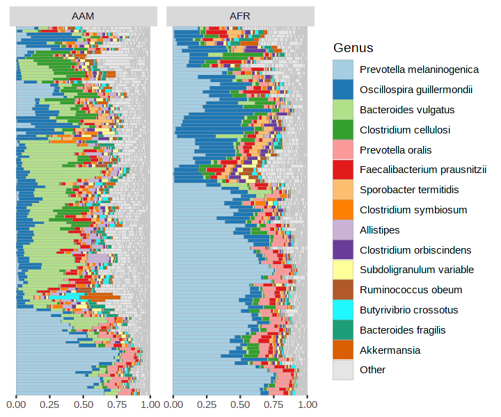
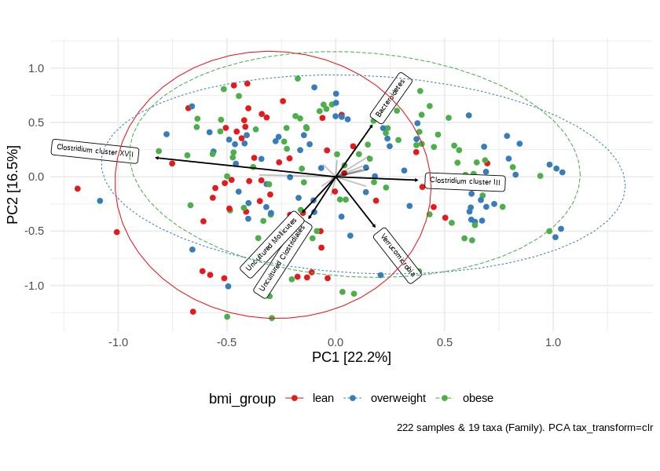
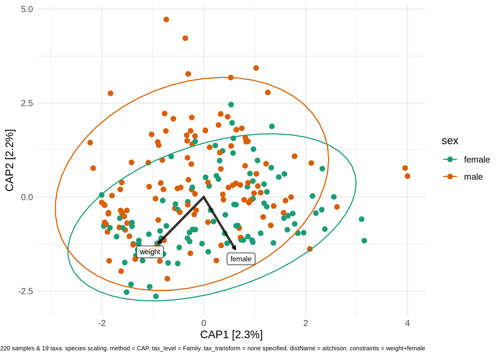
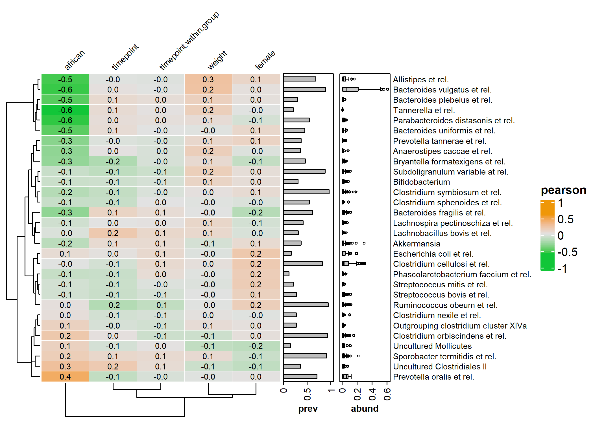

<!-- README.md is generated from README.Rmd. Please edit that file -->

# microViz <a href='https://david-barnett.github.io/microViz/index.html'></a>

<!-- badges: start -->

[](https://github.com/david-barnett/microViz/actions)
[](https://codecov.io/gh/david-barnett/microViz)
[](https://zenodo.org/badge/latestdoi/307119750)
[](https://hub.docker.com/r/barnettdavid/microviz-rocker-verse)
[](https://joss.theoj.org/papers/4547b492f224a26d96938ada81fee3fa)

<!-- badges: end -->

## Overview

:package: `microViz` is an R package for analysis and visualization of
microbiome sequencing data.

:hammer: `microViz` functions are intended to be easy to use and
flexible.

:microscope: `microViz` extends and complements popular microbial
ecology packages like `phyloseq`, `vegan`, & `microbiome`.

## Learn more

:paperclip: This website is the best place for documentation and
examples: <https://david-barnett.github.io/microViz/>

-   **The [“Get
    started”](https://david-barnett.github.io/microViz/articles/articles/microViz.html)
    page** shows a few example analyses (as does this ReadMe)

-   **The
    [Reference](https://david-barnett.github.io/microViz/reference/index.html)
    page** lists all functions and links to help pages and examples

-   **The
    [Changelog](https://david-barnett.github.io/microViz/news/index.html)**
    describes important changes in new microViz package versions

-   **The Articles pages** give tutorials and further examples

    -   [Working with phyloseq
        objects](https://david-barnett.github.io/microViz/articles/articles/phyloseq.html)

    -   [Fixing your taxa table with
        tax\_fix](https://david-barnett.github.io/microViz/articles/articles/tax-fixing.html)

    -   [Creating ordination
        plots](https://david-barnett.github.io/microViz/articles/ordination.html)
        (e.g. PCA or PCoA)

    -   [Interactive ordination plots with
        ord\_explore](https://david-barnett.github.io/microViz/articles/articles/Interactive-Ordination.html)

    -   [Visualising taxonomic compositions with
        comp\_barplot](https://david-barnett.github.io/microViz/articles/articles/Visualising-compositions.html)

    -   More coming soon! Post on [GitHub
        discussions](https://github.com/david-barnett/microViz/discussions)
        if you have questions/requests

## Installation

You can install the latest available microViz package version using the
following instructions.

``` r
# Installing from github requires the devtools package
install.packages("devtools") 

# You can install the latest versions of phyloseq and microbiome from Bioconductor:
if (!requireNamespace("BiocManager", quietly = TRUE)) install.packages("BiocManager") 
BiocManager::install(c("phyloseq", "microbiome"))

# To install the latest "released" version of this package
devtools::install_github("david-barnett/microViz@0.7.6") # check 0.7.6 is the latest release

# To install the very latest version:
devtools::install_github("david-barnett/microViz")
# If you encounter a bug please try the latest version & let me know if the bug persists!
```

:computer: **Windows users** - will need to have RTools installed so
that your computer can build this package (follow instructions here:
<http://jtleek.com/modules/01_DataScientistToolbox/02_10_rtools/>)

**:apple: macOS** **users** - might need to install
[xquartz](https://www.xquartz.org/) to make the heatmaps work (to do
this with homebrew, run the following command in your mac’s Terminal:
`brew install --cask xquartz`

:package: I highly recommend using
[renv](https://rstudio.github.io/renv/index.html) for managing your R
package installations across multiple projects.

:whale: Alternatively, for Docker users an image with the main branch
installed is available at:
<https://hub.docker.com/r/barnettdavid/microviz-rocker-verse>

:date: microViz is tested to work with R version 4 on Windows, MacOS,
and Ubuntu 18 and 20. R version 3.6.\* should probably work, but I don’t
formally test this.

## Interactive ordination exploration

``` r
library(microViz)
```

microViz provides a Shiny app for an easy way to start exploring your
microbiome data: all you need is a phyloseq object.

``` r
# example data from corncob package
pseq <- corncob::ibd_phylo %>% tax_fix() %>% phyloseq_validate()
```

``` r
ord_explore(pseq) # gif generated with microViz version 0.7.4 (plays at 1.75x speed)
```


## Example analyses

``` r
library(phyloseq)
library(dplyr)
#> Warning: package 'dplyr' was built under R version 4.0.4
#> 
#> Attaching package: 'dplyr'
#> The following objects are masked from 'package:stats':
#> 
#>     filter, lag
#> The following objects are masked from 'package:base':
#> 
#>     intersect, setdiff, setequal, union
library(ggplot2)
```

``` r
# get some example data
data("dietswap", package = "microbiome")

# create a couple of numerical variables to use as constraints or conditions
dietswap <- dietswap %>%
  ps_mutate(
    weight = recode(bmi_group, obese = 3, overweight = 2, lean = 1),
    female = if_else(sex == "female", true = 1, false = 0)
  )
# add a couple of missing values to show how microViz handles missing data
sample_data(dietswap)$female[c(3, 4)] <- NA
```

### Looking at your data

You have quite a few samples in your phyloseq object, and would like to
visualise their compositions. Perhaps these example data differ across
BMI groups?

``` r
dietswap %>%
  tax_filter(min_prevalence = 1) %>%
  comp_barplot(
    tax_level = "Genus",  n_taxa = 12, 
    merge_other = FALSE 
    # set merge_other = TRUE (the default) to remove outlines from inside "other" category
  ) +
  facet_wrap("bmi_group", nrow = 3, scales = "free") +
  labs(x = NULL, y = NULL) +
  theme(
    axis.text.x = element_blank(),
    axis.ticks.x = element_blank()
  )
#> Registered S3 method overwritten by 'seriation':
#>   method         from 
#>   reorder.hclust vegan
```



### Example ordination plot workflow

Maybe visually inspecting all your samples isn’t quite what you want.
Ordination methods can also help you to visualise if overall microbial
ecosystem composition differs markedly between groups, e.g. BMI.

Here is one option as an example:

1.  Filter out rare taxa (e.g. remove Genera not present in at least 10%
    of samples) - use `tax_filter()`
2.  Aggregate the taxa into bacterial families (for example) - use
    `tax_agg()`
3.  Transform the microbial data with the centre-log-ratio
    transformation - use `tax_transform()`
4.  Perform PCA with the clr-transformed features (equivalent to
    aitchison distance PCoA) - use `ord_calc()`
5.  Plot the first 2 axes of this PCA ordination, colouring samples by
    group and adding taxon loading arrows to visualise which taxa
    generally differ across your samples - use `ord_plot()`
6.  Customise the theme of the ggplot as you like and/or add features
    like ellipses or annotations

``` r
# perform ordination
unconstrained_aitchison_pca <-
  dietswap %>%
  tax_filter(min_prevalence = 0.1, tax_level = "Genus") %>%
  tax_agg("Family") %>%
  tax_transform("clr") %>%
  ord_calc() 
#> Proportional min_prevalence given: 0.1 --> min 23/222 samples.
# ord_calc will automatically infer you want a "PCA" here
# specify explicitly with method = "PCA", or you can pick another method

# create plot
pca_plot <- unconstrained_aitchison_pca %>%
  ord_plot(
    plot_taxa = 1:6, colour = "bmi_group", size = 2,
    tax_vec_length = 0.5,
    auto_caption = TRUE
  )

# customise plot
customised_plot <- pca_plot +
  stat_ellipse(aes(linetype = bmi_group, colour = bmi_group)) +
  scale_colour_brewer(palette = "Set1") +
  theme(legend.position = "bottom")

# show plot
customised_plot
```



### PERMANOVA

You visualised your ordinated data in the plot above. Below you can see
how to perform a PERMANOVA to test the significance of BMI’s association
with overall microbial composition. This example uses the Family-level
aitchison distance to correspond with the plot above.

``` r
# calculate distances
aitchison_dists <-
  dietswap %>%
  tax_filter(min_prevalence = 0.1, tax_level = "Genus") %>%
  tax_agg("Family") %>%
  tax_transform("identity") %>% 
  dist_calc("aitchison")
#> Proportional min_prevalence given: 0.1 --> min 23/222 samples.

# the more permutations you request, the longer it takes
# but also the more stable and precise your p-values become
aitchison_perm <- dist_permanova(
  data = aitchison_dists,
  seed = 1234, # for set.seed to ensure reproducibility of random process
  n_perms = 99, # you should use at least 999!
  n_processes = 1,
  variables = "bmi_group + female"
)
#> Dropping samples with missings: 2
#> 2021-05-20 08:57:15 - Starting PERMANOVA with 99 perms with 1 processes
#> 2021-05-20 08:57:16 - Finished PERMANOVA
# view the permanova results
perm_get(aitchison_perm) %>% as.data.frame()
#>            Df   SumOfSqs         R2        F Pr(>F)
#> bmi_group   2  106.32182 0.04332620 5.008911   0.01
#> female      1   53.22231 0.02168812 5.014697   0.01
#> Residual  216 2292.46559 0.93418103       NA     NA
#> Total     219 2453.98430 1.00000000       NA     NA
# view the info stored about the distance calculation
info_get(aitchison_perm)
#> ps_extra info:
#> tax_agg = Family 
#> tax_transform = identity 
#> tax_scale = NA 
#> distMethod = aitchison 
#> ordMethod = NA 
#> constraints = NA 
#> conditions = NA
```

### Constrained ordination

You could visualise the effect of the (numeric/logical) variables in
your permanova directly using the ord\_plot function with constraints.

``` r
perm2 <- dist_permanova(data = aitchison_dists, variables = c("weight", "female"), seed = 321)
#> Dropping samples with missings: 2
#> 2021-05-20 08:57:16 - Starting PERMANOVA with 999 perms with 1 processes
#> 2021-05-20 08:57:16 - Finished PERMANOVA
perm_get(perm2)
#> Permutation test for adonis under reduced model
#> Marginal effects of terms
#> Permutation: free
#> Number of permutations: 999
#> 
#> vegan::adonis2(formula = formula, data = metadata, permutations = n_perms, by = by, parallel = parall)
#>           Df SumOfSqs      R2      F Pr(>F)    
#> weight     1    56.06 0.02284 5.1927  0.001 ***
#> female     1    55.83 0.02275 5.1714  0.001 ***
#> Residual 217  2342.73 0.95466                  
#> Total    219  2453.98 1.00000                  
#> ---
#> Signif. codes:  0 '***' 0.001 '**' 0.01 '*' 0.05 '.' 0.1 ' ' 1

ord_calc(perm2, constraints = c("weight", "female")) %>%
  ord_plot(
    colour = "sex", size = 2,
    constraint_vec_style = list(colour = "black", size = 1.15),
    constraint_lab_style = list(colour = "black")
  ) +
  stat_ellipse(aes(colour = sex)) + scale_color_brewer(palette = "Dark2")
#> 
#> Centering (mean) and scaling (sd) the constraints and conditions:
#>  weight
#>  female
```



### Heatmaps

microViz heatmaps are powered by `ComplexHeatmap` and annotated with
taxa prevalence and/or abundance.

``` r
# set up the data with numerical variables and filter to top taxa
psq <- dietswap %>%
 ps_mutate(
   weight = recode(bmi_group, obese = 3, overweight = 2, lean = 1),
   female = if_else(sex == "female", true = 1, false = 0),
   african = if_else(nationality == "AFR", true = 1, false = 0)
 ) %>% 
  tax_filter(
    tax_level = "Genus", min_prevalence = 1 / 10, min_sample_abundance = 1 / 10
  ) %>% 
  tax_transform("identity", rank = "Genus")
#> Proportional min_prevalence given: 0.1 --> min 23/222 samples.

# randomly select 30 taxa from the 50 most abundant taxa (just for an example)
set.seed(123)
taxa <- sample(microbiome::top_taxa(ps_get(psq))[1:50], size = 30)
# actually draw the heatmap
cor_heatmap(psq, taxa, anno_tax = tax_anno(undetected = 50))
```



## Citation

:innocent: If you find any part of microViz useful to your work, please
consider citing the Zenodo archive DOI:
<https://doi.org/10.5281/zenodo.4644057>

Publication pending: microViz has been submitted to a peer-reviewed
journal.

## Contributing

Bug reports, questions, suggestions for new features, and other
contributions are all welcome. Feel free to create a [GitHub
Issue](https://github.com/david-barnett/microViz/issues) or write on the
[Discussions](https://github.com/david-barnett/microViz/discussions)
page. Alternatively you could also contact me (David) on Twitter
[@\_david\_barnett\_](https://twitter.com/_david_barnett_) .

This project is released with a [Contributor Code of
Conduct](https://david-barnett.github.io/microViz/CODE_OF_CONDUCT.html)
and by participating in this project you agree to abide by its terms.

## Session info

``` r
sessionInfo()
#> R version 4.0.3 (2020-10-10)
#> Platform: x86_64-pc-linux-gnu (64-bit)
#> Running under: Ubuntu 18.04.5 LTS
#> 
#> Matrix products: default
#> BLAS:   /usr/lib/x86_64-linux-gnu/openblas/libblas.so.3
#> LAPACK: /usr/lib/x86_64-linux-gnu/libopenblasp-r0.2.20.so
#> 
#> locale:
#>  [1] LC_CTYPE=en_GB.UTF-8       LC_NUMERIC=C               LC_TIME=en_GB.UTF-8       
#>  [4] LC_COLLATE=en_GB.UTF-8     LC_MONETARY=en_GB.UTF-8    LC_MESSAGES=en_GB.UTF-8   
#>  [7] LC_PAPER=en_GB.UTF-8       LC_NAME=C                  LC_ADDRESS=C              
#> [10] LC_TELEPHONE=C             LC_MEASUREMENT=en_GB.UTF-8 LC_IDENTIFICATION=C       
#> 
#> attached base packages:
#> [1] stats     graphics  grDevices utils     datasets  methods   base     
#> 
#> other attached packages:
#> [1] ggplot2_3.3.3   dplyr_1.0.6     phyloseq_1.34.0 microViz_0.7.6  devtools_2.4.0  usethis_2.0.1  
#> [7] pkgdown_1.6.1  
#> 
#> loaded via a namespace (and not attached):
#>   [1] nlme_3.1-149         matrixStats_0.58.0   fs_1.5.0             RColorBrewer_1.1-2  
#>   [5] progress_1.2.2       rprojroot_2.0.2      tools_4.0.3          utf8_1.2.1          
#>   [9] R6_2.5.0             vegan_2.5-7          BiocGenerics_0.36.1  mgcv_1.8-33         
#>  [13] colorspace_2.0-1     GetoptLong_1.0.5     permute_0.9-5        rhdf5filters_1.2.1  
#>  [17] ade4_1.7-16          withr_2.4.2          tidyselect_1.1.1     prettyunits_1.1.1   
#>  [21] processx_3.5.1       compiler_4.0.3       microbiome_1.12.0    cli_2.5.0           
#>  [25] Biobase_2.50.0       Cairo_1.5-12.2       TSP_1.1-10           desc_1.3.0          
#>  [29] labeling_0.4.2       scales_1.1.1         callr_3.7.0          stringr_1.4.0       
#>  [33] digest_0.6.27        rmarkdown_2.7        XVector_0.30.0       pkgconfig_2.0.3     
#>  [37] htmltools_0.5.1.1    sessioninfo_1.1.1    highr_0.9            fastmap_1.1.0       
#>  [41] GlobalOptions_0.1.2  rlang_0.4.11         shape_1.4.5          farver_2.1.0        
#>  [45] generics_0.1.0       jsonlite_1.7.2       magrittr_2.0.1       biomformat_1.18.0   
#>  [49] Matrix_1.3-2         Rcpp_1.0.6           munsell_0.5.0        S4Vectors_0.28.1    
#>  [53] Rhdf5lib_1.12.1      fansi_0.4.2          ape_5.5              lifecycle_1.0.0     
#>  [57] stringi_1.6.2        yaml_2.2.1           MASS_7.3-53          zlibbioc_1.36.0     
#>  [61] rhdf5_2.34.0         pkgbuild_1.2.0       Rtsne_0.15           plyr_1.8.6          
#>  [65] grid_4.0.3           parallel_4.0.3       crayon_1.4.1         lattice_0.20-41     
#>  [69] Biostrings_2.58.0    splines_4.0.3        multtest_2.46.0      circlize_0.4.12     
#>  [73] hms_1.1.0            magick_2.7.1         ComplexHeatmap_2.6.2 knitr_1.32          
#>  [77] ps_1.6.0             pillar_1.6.1         igraph_1.2.6         rjson_0.2.20        
#>  [81] reshape2_1.4.4       codetools_0.2-18     stats4_4.0.3         pkgload_1.2.1       
#>  [85] glue_1.4.2           corncob_0.2.0        evaluate_0.14        data.table_1.14.0   
#>  [89] remotes_2.3.0        png_0.1-7            vctrs_0.3.8          foreach_1.5.1       
#>  [93] testthat_3.0.2       gtable_0.3.0         purrr_0.3.4          tidyr_1.1.3         
#>  [97] clue_0.3-59          cachem_1.0.5         xfun_0.22            survival_3.2-7      
#> [101] seriation_1.2-9      tibble_3.1.2         iterators_1.0.13     registry_0.5-1      
#> [105] memoise_2.0.0        IRanges_2.24.1       cluster_2.1.0        ellipsis_0.3.2
```
