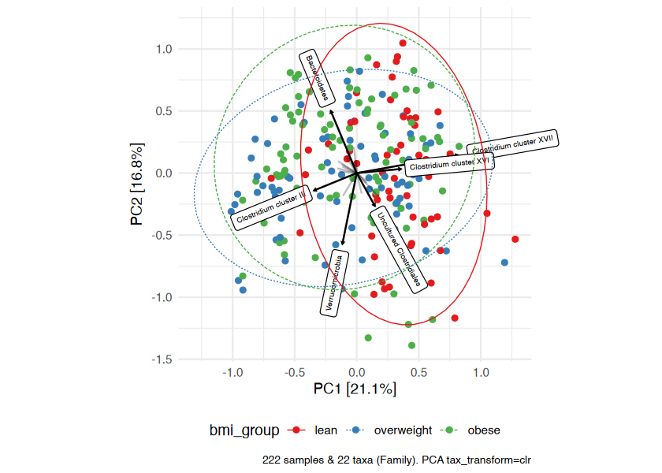

<!-- README.md is generated from README.Rmd. Please edit that file -->

# microViz

<!-- badges: start -->

<!-- badges: end -->

The goal of microViz is to make wrangling, stats and visualisation of
microbiome (16S) sequencing readcount data easier, modular and
reproducible. microViz wraps and extends core microbial ecology packages
like phyloseq, vegan, and microbiome.

## Installation

You can install the development version from
[GitHub](https://github.com/) with:

``` r
# install.packages("devtools")
devtools::install_github("david-barnett/microViz")
```

## Setup

``` r
library(microViz)
library(phyloseq)
library(vegan)
library(microbiome)
library(dplyr)
```

``` r
# get some example data
data("dietswap", package = "microbiome")

# create a couple of numerical variables to use as constraints or conditions
sample_data(dietswap)$weight <-
  recode(sample_data(dietswap)$bmi_group, obese = 3, overweight = 2, lean = 1)
# add a couple of missing values to demo automated dropping of observations with missings
sample_data(dietswap)$female <-
  if_else(sample_data(dietswap)$sex == "female", true = 1, false = 0)
sample_data(dietswap)$female[c(3, 4)] <- NA
```

## Example ordination plot workflow

PCA with clr-transformed features (equivalent to aitchison distance).

``` r
# compute and plot ordinations for demonstration of conditioning
unconstrained_aitchison_pca <- dietswap %>%
  tax_agg("Family") %>%
  tax_transform('clr') %>%
  ordin8(method = 'RDA')

unconstrained_aitchison_pca %>%
plot_ordin8(plot_taxa = 1:5, colour = 'bmi_group', auto_title = TRUE) +
stat_ellipse(aes(linetype = bmi_group, colour = bmi_group))
```



# Session info

``` r
devtools::session_info()
#> - Session info ---------------------------------------------------------------
#>  setting  value                       
#>  version  R version 4.0.1 (2020-06-06)
#>  os       Windows 10 x64              
#>  system   x86_64, mingw32             
#>  ui       RTerm                       
#>  language (EN)                        
#>  collate  English_United Kingdom.1252 
#>  ctype    English_United Kingdom.1252 
#>  tz       Europe/Berlin               
#>  date     2020-10-27                  
#> 
#> - Packages -------------------------------------------------------------------
#>  package      * version    date       lib
#>  ade4           1.7-15     2020-02-13 [1]
#>  ape            5.4        2020-06-03 [1]
#>  assertthat     0.2.1      2019-03-21 [1]
#>  backports      1.1.8      2020-06-17 [1]
#>  Biobase        2.48.0     2020-04-27 [1]
#>  BiocGenerics   0.34.0     2020-04-27 [1]
#>  biomformat     1.16.0     2020-04-27 [1]
#>  Biostrings     2.56.0     2020-04-27 [1]
#>  callr          3.5.1      2020-10-13 [1]
#>  cli            2.0.2      2020-02-28 [1]
#>  cluster        2.1.0      2019-06-19 [1]
#>  codetools      0.2-16     2018-12-24 [1]
#>  colorspace     1.4-1      2019-03-18 [1]
#>  crayon         1.3.4      2017-09-16 [1]
#>  data.table     1.12.8     2019-12-09 [1]
#>  desc           1.2.0      2018-05-01 [1]
#>  devtools       2.3.2      2020-09-18 [1]
#>  digest         0.6.25     2020-02-23 [1]
#>  dplyr        * 1.0.2      2020-08-18 [1]
#>  ellipsis       0.3.1      2020-05-15 [1]
#>  evaluate       0.14       2019-05-28 [1]
#>  fansi          0.4.1      2020-01-08 [1]
#>  farver         2.0.3      2020-01-16 [1]
#>  foreach        1.5.0      2020-03-30 [1]
#>  fs             1.5.0      2020-07-31 [1]
#>  generics       0.0.2      2018-11-29 [1]
#>  ggplot2      * 3.3.2      2020-06-19 [1]
#>  glue           1.4.2      2020-08-27 [1]
#>  gtable         0.3.0      2019-03-25 [1]
#>  htmltools      0.5.0      2020-06-16 [1]
#>  igraph         1.2.5      2020-03-19 [1]
#>  IRanges        2.22.2     2020-05-21 [1]
#>  iterators      1.0.12     2019-07-26 [1]
#>  jsonlite       1.7.1      2020-09-07 [1]
#>  knitr          1.30       2020-09-22 [1]
#>  labeling       0.3        2014-08-23 [1]
#>  lattice      * 0.20-41    2020-04-02 [1]
#>  lifecycle      0.2.0      2020-03-06 [1]
#>  magrittr       1.5        2014-11-22 [1]
#>  MASS           7.3-51.6   2020-04-26 [1]
#>  Matrix         1.2-18     2019-11-27 [1]
#>  memoise        1.1.0      2017-04-21 [1]
#>  mgcv           1.8-31     2019-11-09 [1]
#>  microbiome   * 1.10.0     2020-04-27 [1]
#>  microViz     * 0.0.0.9000 2020-10-27 [1]
#>  multtest       2.44.0     2020-04-27 [1]
#>  munsell        0.5.0      2018-06-12 [1]
#>  nlme           3.1-148    2020-05-24 [1]
#>  permute      * 0.9-5      2019-03-12 [1]
#>  phyloseq     * 1.32.0     2020-04-27 [1]
#>  pillar         1.4.6      2020-07-10 [1]
#>  pkgbuild       1.1.0      2020-07-13 [1]
#>  pkgconfig      2.0.3      2019-09-22 [1]
#>  pkgload        1.1.0      2020-05-29 [1]
#>  plyr           1.8.6      2020-03-03 [1]
#>  prettyunits    1.1.1      2020-01-24 [1]
#>  processx       3.4.4      2020-09-03 [1]
#>  ps             1.3.3      2020-05-08 [1]
#>  purrr          0.3.4      2020-04-17 [1]
#>  R6             2.4.1      2019-11-12 [1]
#>  Rcpp           1.0.5      2020-07-06 [1]
#>  remotes        2.2.0      2020-07-21 [1]
#>  reshape2       1.4.4      2020-04-09 [1]
#>  rhdf5          2.32.2     2020-07-03 [1]
#>  Rhdf5lib       1.10.1     2020-07-09 [1]
#>  rlang          0.4.7      2020-07-09 [1]
#>  rmarkdown      2.3        2020-06-18 [1]
#>  rprojroot      1.3-2      2018-01-03 [1]
#>  Rtsne          0.15       2018-11-10 [1]
#>  S4Vectors      0.26.1     2020-05-16 [1]
#>  scales         1.1.1      2020-05-11 [1]
#>  sessioninfo    1.1.1      2018-11-05 [1]
#>  stringi        1.4.6      2020-02-17 [1]
#>  stringr        1.4.0      2019-02-10 [1]
#>  survival       3.2-3      2020-06-13 [1]
#>  testthat       2.3.2      2020-03-02 [1]
#>  tibble         3.0.3      2020-07-10 [1]
#>  tidyr          1.1.0      2020-05-20 [1]
#>  tidyselect     1.1.0      2020-05-11 [1]
#>  usethis        1.6.3      2020-09-17 [1]
#>  vctrs          0.3.2      2020-07-15 [1]
#>  vegan        * 2.5-6      2019-09-01 [1]
#>  withr          2.3.0      2020-09-22 [1]
#>  xfun           0.15       2020-06-21 [1]
#>  XVector        0.28.0     2020-04-27 [1]
#>  yaml           2.2.1      2020-02-01 [1]
#>  zlibbioc       1.34.0     2020-04-27 [1]
#>  source                                 
#>  CRAN (R 4.0.0)                         
#>  CRAN (R 4.0.0)                         
#>  CRAN (R 4.0.0)                         
#>  CRAN (R 4.0.1)                         
#>  Bioconductor                           
#>  Bioconductor                           
#>  Bioconductor                           
#>  Bioconductor                           
#>  CRAN (R 4.0.3)                         
#>  CRAN (R 4.0.0)                         
#>  CRAN (R 4.0.1)                         
#>  CRAN (R 4.0.1)                         
#>  CRAN (R 4.0.0)                         
#>  CRAN (R 4.0.0)                         
#>  CRAN (R 4.0.0)                         
#>  CRAN (R 4.0.0)                         
#>  CRAN (R 4.0.3)                         
#>  CRAN (R 4.0.0)                         
#>  CRAN (R 4.0.2)                         
#>  CRAN (R 4.0.0)                         
#>  CRAN (R 4.0.0)                         
#>  CRAN (R 4.0.0)                         
#>  CRAN (R 4.0.0)                         
#>  CRAN (R 4.0.0)                         
#>  CRAN (R 4.0.2)                         
#>  CRAN (R 4.0.0)                         
#>  CRAN (R 4.0.2)                         
#>  CRAN (R 4.0.2)                         
#>  CRAN (R 4.0.0)                         
#>  CRAN (R 4.0.2)                         
#>  CRAN (R 4.0.0)                         
#>  Bioconductor                           
#>  CRAN (R 4.0.0)                         
#>  CRAN (R 4.0.3)                         
#>  CRAN (R 4.0.2)                         
#>  CRAN (R 4.0.0)                         
#>  CRAN (R 4.0.1)                         
#>  CRAN (R 4.0.0)                         
#>  CRAN (R 4.0.0)                         
#>  CRAN (R 4.0.1)                         
#>  CRAN (R 4.0.1)                         
#>  CRAN (R 4.0.0)                         
#>  CRAN (R 4.0.1)                         
#>  Bioconductor                           
#>  Github (david-barnett/microViz@39a1175)
#>  Bioconductor                           
#>  CRAN (R 4.0.0)                         
#>  CRAN (R 4.0.1)                         
#>  CRAN (R 4.0.0)                         
#>  Bioconductor                           
#>  CRAN (R 4.0.2)                         
#>  CRAN (R 4.0.2)                         
#>  CRAN (R 4.0.0)                         
#>  CRAN (R 4.0.0)                         
#>  CRAN (R 4.0.0)                         
#>  CRAN (R 4.0.0)                         
#>  CRAN (R 4.0.3)                         
#>  CRAN (R 4.0.0)                         
#>  CRAN (R 4.0.0)                         
#>  CRAN (R 4.0.0)                         
#>  CRAN (R 4.0.2)                         
#>  CRAN (R 4.0.3)                         
#>  CRAN (R 4.0.0)                         
#>  Bioconductor                           
#>  Bioconductor                           
#>  CRAN (R 4.0.2)                         
#>  CRAN (R 4.0.2)                         
#>  CRAN (R 4.0.0)                         
#>  CRAN (R 4.0.2)                         
#>  Bioconductor                           
#>  CRAN (R 4.0.0)                         
#>  CRAN (R 4.0.0)                         
#>  CRAN (R 4.0.0)                         
#>  CRAN (R 4.0.0)                         
#>  CRAN (R 4.0.2)                         
#>  CRAN (R 4.0.0)                         
#>  CRAN (R 4.0.2)                         
#>  CRAN (R 4.0.0)                         
#>  CRAN (R 4.0.0)                         
#>  CRAN (R 4.0.3)                         
#>  CRAN (R 4.0.2)                         
#>  CRAN (R 4.0.0)                         
#>  CRAN (R 4.0.2)                         
#>  CRAN (R 4.0.2)                         
#>  Bioconductor                           
#>  CRAN (R 4.0.0)                         
#>  Bioconductor                           
#> 
#> [1] C:/Program Files/R/R-4.0.1/library
```
