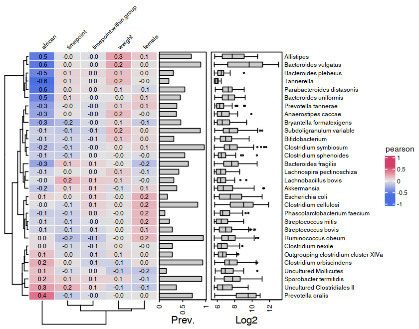

<!-- README.md is generated from README.Rmd. Please edit that file -->

# microViz <a href='https://david-barnett.github.io/microViz/index.html'></a>

<!-- badges: start -->

[](https://github.com/david-barnett/microViz/actions)
<!-- badges: end -->

microViz package provides functions for wrangling, stats and
visualisation of microbiome (16S) sequencing readcount data. These
functions are intended to be easy to use (with clear documentation) and
modular (for extensibility and flexibility). microViz wraps, extends and
complements, popular microbial ecology packages like phyloseq, vegan,
and microbiome.

**See the documentation website for full details and examples:**
<https://david-barnett.github.io/microViz/>

  - The [“Get
    started”](https://david-barnett.github.io/microViz/articles/articles/microViz.html)
    page, and also [this
    ReadMe](https://david-barnett.github.io/microViz/index.html), show a
    few example analyses.
  - The
    [reference](https://david-barnett.github.io/microViz/reference/index.html)
    page lists all functions and links to their documentation and
    examples
  - Example video of [Interactive Shiny
    app](https://david-barnett.github.io/microViz/articles/articles/Interactive-Ordination.html)
    for exploring your ordination plots\!
  - Other articles pages discuss and give tutorials and more complicated
    examples (coming soon\!)
  - The
    [changelog](https://david-barnett.github.io/microViz/news/index.html)
    describe important changes in new microViz package versions

## Installation

You can install the latest available microViz package version using the
following instructions.

``` r
# If you are on windows you will need to install RTools so that your computer can build this package
# Follow instructions here: http://jtleek.com/modules/01_DataScientistToolbox/02_10_rtools/

# If you are on macOS, you might need to install xquartz to make the heatmaps work (ComplexHeatmaps package)
# You can do this with homebrew, running the following command in your mac's Terminal: brew install --cask xquartz 

# If you don't already have the latest versions of phyloseq and microbiome, you should install these from bioconductor:

if (!requireNamespace("BiocManager", quietly = TRUE))
 install.packages("BiocManager")
BiocManager::install(c("phyloseq", "microbiome"))

# # Installing the latest version of this package # #
install.packages("devtools")
devtools::install_github("david-barnett/microViz@0.6.0") # check 0.6.0 is the latest version?
# advanced tip: add @<commit-hash> after microViz to install a version from a particular commit
```

## Examples below

``` r
library(microViz)
library(phyloseq)
library(dplyr)
library(ggplot2)
```

``` r
# get some example data
data("dietswap", package = "microbiome")

# create a couple of numerical variables to use as constraints or conditions
dietswap <- dietswap %>%
  ps_mutate(
    weight = recode(bmi_group, obese = 3, overweight = 2, lean = 1),
    female = if_else(sex == "female", true = 1, false = 0)
  )
# add a couple of missing values to show how microViz handles missing data
sample_data(dietswap)$female[c(3, 4)] <- NA
```

## Looking at your data

You have quite a few samples in your phyloseq object, and would like to
visualise their compositions. Perhaps these example data differ across
BMI groups?

``` r
dietswap %>%
  tax_filter(min_prevalence = 1) %>%
  comp_barplot(
    tax_level = "Genus",  n_taxa = 12, 
    merge_other = FALSE 
    # set merge_other = TRUE (the default) to remove outlines from inside "other" category
  ) +
  facet_wrap("bmi_group", nrow = 3, scales = "free") +
  labs(x = NULL, y = NULL) +
  theme(
    axis.text.x = element_blank(),
    axis.ticks.x = element_blank()
  )
#> Registered S3 method overwritten by 'seriation':
#>   method         from 
#>   reorder.hclust vegan
```


## Example ordination plot workflow

Maybe visually inspecting all your samples isn’t quite what you want.
Ordination methods can also help you to visualise if overall microbial
ecosystem composition differs markedly between groups, e.g. BMI.

Here is one option to try first:

1.  Filter out rare taxa (e.g. remove Genera not present in at least 10%
    of samples) - use `tax_filter()`
2.  Aggregate the taxa into bacterial families (for example) - use
    `tax_agg()`
3.  Transform the microbial data with the centre-log-ratio
    transformation - use `tax_transform()`
4.  Perform PCA with the clr-transformed features (equivalent to
    aitchison distance PCoA) - use `ord_calc()`
5.  Plot the first 2 axes of this PCA ordination, colouring samples by
    group and adding taxon loading arrows to visualise which taxa
    generally differ across your samples - use `ord_plot()`
6.  Customise the theme of the ggplot as you like and/or add features
    like ellipses or annotations

<!-- end list -->

``` r
# perform ordination
unconstrained_aitchison_pca <-
  dietswap %>%
  tax_filter(min_prevalence = 0.1, tax_level = "Genus") %>%
  tax_agg("Family") %>%
  tax_transform("clr") %>%
  ord_calc() 
#> Proportional min_prevalence given: 0.1 --> min 23/222 samples.
# will automatically infer you want a "PCA" here
# specify explicitly with method = "PCA", or you can pick another method

# create plot
pca_plot <- unconstrained_aitchison_pca %>%
  ord_plot(
    plot_taxa = 1:6, colour = "bmi_group", size = 2,
    tax_vec_length = 0.5,
    auto_caption = TRUE
  )

# customise plot
customised_plot <- pca_plot +
  stat_ellipse(aes(linetype = bmi_group, colour = bmi_group)) +
  scale_colour_brewer(palette = "Set1") +
  theme(legend.position = "bottom")

# show plot
customised_plot
```


## PERMANOVA

You visualised your ordinated data in the plot above. Below you can see
how to perform a PERMANOVA to test the significance of BMI. This example
uses the Family-level aitchison distance to correspond with the plot
above.

``` r
# calculate distances
aitchison_dists <-
  dietswap %>%
  tax_filter(min_prevalence = 0.1, tax_level = "Genus") %>%
  tax_agg("Family") %>%
  tax_transform("identity") %>% 
  dist_calc("aitchison")
#> Proportional min_prevalence given: 0.1 --> min 23/222 samples.

# the more permutations you request, the longer it takes
# but also the more stable and precise your p-values become
aitchison_perm <- dist_permanova(
  data = aitchison_dists,
  seed = 1234, # for set.seed to ensure reproducibility of random process
  n_perms = 99, # you should use at least 999!
  n_processes = 1,
  variables = "bmi_group + female"
)
#> Dropping samples with missings: 2
#> 2021-03-24 18:19:23 - Starting PERMANOVA with 99 perms with 1 processes
#> 2021-03-24 18:19:23 - Finished PERMANOVA
# view the permanova results
perm_get(aitchison_perm) %>% as.data.frame()
#>            Df   SumOfSqs         R2        F Pr(>F)
#> bmi_group   2  106.32182 0.04332620 5.008911   0.01
#> female      1   53.22231 0.02168812 5.014697   0.01
#> Residual  216 2292.46559 0.93418103       NA     NA
#> Total     219 2453.98430 1.00000000       NA     NA
# view the info stored about the distance calculation
info_get(aitchison_perm)
#> phyloseq info:
#> tax_agg = Family tax_transform = identity
```

## Constrained ordination

You could visualise the effect of the (numeric/logical) variables in
your permanova directly using the ord\_plot function with constraints.

``` r
perm2 <- dist_permanova(data = aitchison_dists, variables = c("weight", "female"), seed = 321)
#> Dropping samples with missings: 2
#> 2021-03-24 18:19:23 - Starting PERMANOVA with 999 perms with 1 processes
#> 2021-03-24 18:19:24 - Finished PERMANOVA
perm_get(perm2)
#> Permutation test for adonis under reduced model
#> Marginal effects of terms
#> Permutation: free
#> Number of permutations: 999
#> 
#> vegan::adonis2(formula = formula, data = metadata, permutations = n_perms, by = by, parallel = parall)
#>           Df SumOfSqs      R2      F Pr(>F)    
#> weight     1    56.06 0.02284 5.1927  0.001 ***
#> female     1    55.83 0.02275 5.1714  0.001 ***
#> Residual 217  2342.73 0.95466                  
#> Total    219  2453.98 1.00000                  
#> ---
#> Signif. codes:  0 '***' 0.001 '**' 0.01 '*' 0.05 '.' 0.1 ' ' 1

ord_calc(perm2, constraints = c("weight", "female")) %>%
  ord_plot(
    colour = "sex", size = 2,
    constraint_vec_style = list(colour = "black", size = 1.15),
    constraint_lab_style = list(colour = "black")
  ) +
  stat_ellipse(aes(colour = sex)) + scale_color_brewer(palette = "Dark2")
#> 
#> Centering (mean) and scaling (sd) the constraints and conditions:
#>  weight
#>  female
```


## Heatmaps

microViz heatmaps are powered by `ComplexHeatmap` and annotated with
taxa prevalence and/or abundance.

``` r
# set up the data with numerical variables and filter to top taxa
psq <- dietswap %>%
 ps_mutate(
   weight = recode(bmi_group, obese = 3, overweight = 2, lean = 1),
   female = if_else(sex == "female", true = 1, false = 0),
   african = if_else(nationality == "AFR", true = 1, false = 0)
 ) %>% 
  tax_filter(
    tax_level = "Genus", min_prevalence = 1 / 10, min_sample_abundance = 1 / 10
  ) %>% 
  tax_transform("identity", rank = "Genus")
#> Proportional min_prevalence given: 0.1 --> min 23/222 samples.

# randomly select 30 taxa from the 50 most abundant taxa (just for an example)
set.seed(123)
taxa <- sample(microbiome::top_taxa(ps_get(psq))[1:50], size = 30)
# actually draw the heatmap
cor_heatmap(psq, taxa, anno_tax = tax_anno(undetected = 50))
```



## Session info

``` r
devtools::session_info()
#> ─ Session info ───────────────────────────────────────────────────────────────────────────────────
#>  setting  value                       
#>  version  R version 4.0.3 (2020-10-10)
#>  os       Ubuntu 18.04.5 LTS          
#>  system   x86_64, linux-gnu           
#>  ui       X11                         
#>  language en_GB:en                    
#>  collate  en_GB.UTF-8                 
#>  ctype    en_GB.UTF-8                 
#>  tz       Europe/Amsterdam            
#>  date     2021-03-24                  
#> 
#> ─ Packages ───────────────────────────────────────────────────────────────────────────────────────
#>  package        * version    date       lib source        
#>  ade4             1.7-16     2020-10-28 [1] CRAN (R 4.0.3)
#>  ape              5.4-1      2020-08-13 [1] CRAN (R 4.0.3)
#>  assertthat       0.2.1      2019-03-21 [1] CRAN (R 4.0.3)
#>  Biobase          2.50.0     2020-10-27 [1] Bioconductor  
#>  BiocGenerics     0.36.0     2020-10-27 [1] Bioconductor  
#>  biomformat       1.18.0     2020-10-27 [1] Bioconductor  
#>  Biostrings       2.58.0     2020-10-27 [1] Bioconductor  
#>  cachem           1.0.4      2021-02-13 [1] CRAN (R 4.0.3)
#>  Cairo            1.5-12.2   2020-07-07 [1] CRAN (R 4.0.3)
#>  callr            3.5.1      2020-10-13 [1] CRAN (R 4.0.3)
#>  circlize         0.4.12     2021-01-08 [1] CRAN (R 4.0.3)
#>  cli              2.3.1      2021-02-23 [1] CRAN (R 4.0.3)
#>  clue             0.3-58     2020-12-03 [1] CRAN (R 4.0.3)
#>  cluster          2.1.0      2019-06-19 [2] CRAN (R 4.0.3)
#>  codetools        0.2-18     2020-11-04 [1] CRAN (R 4.0.3)
#>  colorspace       2.0-0      2020-11-11 [1] CRAN (R 4.0.3)
#>  ComplexHeatmap   2.6.2      2020-11-12 [1] Bioconductor  
#>  crayon           1.4.1      2021-02-08 [1] CRAN (R 4.0.3)
#>  data.table       1.14.0     2021-02-21 [1] CRAN (R 4.0.3)
#>  debugme          1.1.0      2017-10-22 [1] CRAN (R 4.0.3)
#>  desc             1.2.0      2018-05-01 [1] CRAN (R 4.0.3)
#>  devtools       * 2.3.2      2020-09-18 [1] CRAN (R 4.0.3)
#>  digest           0.6.27     2020-10-24 [1] CRAN (R 4.0.3)
#>  dplyr          * 1.0.5      2021-03-05 [1] CRAN (R 4.0.3)
#>  ellipsis         0.3.1      2020-05-15 [1] CRAN (R 4.0.3)
#>  evaluate         0.14       2019-05-28 [1] CRAN (R 4.0.3)
#>  fansi            0.4.2      2021-01-15 [1] CRAN (R 4.0.3)
#>  farver           2.1.0      2021-02-28 [1] CRAN (R 4.0.3)
#>  fastmap          1.1.0      2021-01-25 [1] CRAN (R 4.0.3)
#>  foreach          1.5.1      2020-10-15 [1] CRAN (R 4.0.3)
#>  fs               1.5.0      2020-07-31 [1] CRAN (R 4.0.3)
#>  generics         0.1.0      2020-10-31 [1] CRAN (R 4.0.3)
#>  GetoptLong       1.0.5      2020-12-15 [1] CRAN (R 4.0.3)
#>  ggplot2        * 3.3.3      2020-12-30 [1] CRAN (R 4.0.3)
#>  GlobalOptions    0.1.2      2020-06-10 [1] CRAN (R 4.0.3)
#>  glue             1.4.2      2020-08-27 [1] CRAN (R 4.0.3)
#>  gtable           0.3.0      2019-03-25 [1] CRAN (R 4.0.3)
#>  highr            0.8        2019-03-20 [1] CRAN (R 4.0.3)
#>  hms              1.0.0      2021-01-13 [1] CRAN (R 4.0.3)
#>  htmltools        0.5.1.1    2021-01-22 [1] CRAN (R 4.0.3)
#>  igraph           1.2.6      2020-10-06 [1] CRAN (R 4.0.3)
#>  IRanges          2.24.1     2020-12-12 [1] Bioconductor  
#>  iterators        1.0.13     2020-10-15 [1] CRAN (R 4.0.3)
#>  jsonlite         1.7.2      2020-12-09 [1] CRAN (R 4.0.3)
#>  knitr            1.31       2021-01-27 [1] CRAN (R 4.0.3)
#>  labeling         0.4.2      2020-10-20 [1] CRAN (R 4.0.3)
#>  lattice          0.20-41    2020-04-02 [2] CRAN (R 4.0.3)
#>  lifecycle        1.0.0      2021-02-15 [1] CRAN (R 4.0.3)
#>  magick           2.6.0      2021-01-13 [1] CRAN (R 4.0.3)
#>  magrittr         2.0.1      2020-11-17 [1] CRAN (R 4.0.3)
#>  MASS             7.3-53     2020-09-09 [2] CRAN (R 4.0.3)
#>  Matrix           1.3-2      2021-01-06 [1] CRAN (R 4.0.3)
#>  matrixStats      0.58.0     2021-01-29 [1] CRAN (R 4.0.3)
#>  memoise          2.0.0      2021-01-26 [1] CRAN (R 4.0.3)
#>  mgcv             1.8-33     2020-08-27 [2] CRAN (R 4.0.3)
#>  microbiome       1.12.0     2020-10-27 [1] Bioconductor  
#>  microViz       * 0.6.0.9002 2021-03-24 [1] local         
#>  multtest         2.46.0     2020-10-27 [1] Bioconductor  
#>  munsell          0.5.0      2018-06-12 [1] CRAN (R 4.0.3)
#>  nlme             3.1-149    2020-08-23 [2] CRAN (R 4.0.3)
#>  permute          0.9-5      2019-03-12 [1] CRAN (R 4.0.3)
#>  phyloseq       * 1.34.0     2020-10-27 [1] Bioconductor  
#>  pillar           1.5.1      2021-03-05 [1] CRAN (R 4.0.3)
#>  pkgbuild         1.2.0      2020-12-15 [1] CRAN (R 4.0.3)
#>  pkgconfig        2.0.3      2019-09-22 [1] CRAN (R 4.0.3)
#>  pkgdown        * 1.6.1      2020-09-12 [1] CRAN (R 4.0.3)
#>  pkgload          1.2.0      2021-02-23 [1] CRAN (R 4.0.3)
#>  plyr             1.8.6      2020-03-03 [1] CRAN (R 4.0.3)
#>  png              0.1-7      2013-12-03 [1] CRAN (R 4.0.3)
#>  prettyunits      1.1.1      2020-01-24 [1] CRAN (R 4.0.3)
#>  processx         3.4.5      2020-11-30 [1] CRAN (R 4.0.3)
#>  progress         1.2.2      2019-05-16 [1] CRAN (R 4.0.3)
#>  ps               1.6.0      2021-02-28 [1] CRAN (R 4.0.3)
#>  purrr            0.3.4      2020-04-17 [1] CRAN (R 4.0.3)
#>  R6               2.5.0      2020-10-28 [1] CRAN (R 4.0.3)
#>  RColorBrewer     1.1-2      2014-12-07 [1] CRAN (R 4.0.3)
#>  Rcpp             1.0.6      2021-01-15 [1] CRAN (R 4.0.3)
#>  registry         0.5-1      2019-03-05 [1] CRAN (R 4.0.3)
#>  remotes          2.2.0      2020-07-21 [1] CRAN (R 4.0.3)
#>  reshape2         1.4.4      2020-04-09 [1] CRAN (R 4.0.3)
#>  rhdf5            2.34.0     2020-10-27 [1] Bioconductor  
#>  rhdf5filters     1.2.0      2020-10-27 [1] Bioconductor  
#>  Rhdf5lib         1.12.1     2021-01-26 [1] Bioconductor  
#>  rjson            0.2.20     2018-06-08 [1] CRAN (R 4.0.3)
#>  rlang            0.4.10     2020-12-30 [1] CRAN (R 4.0.3)
#>  rmarkdown        2.7        2021-02-19 [1] CRAN (R 4.0.3)
#>  rprojroot        2.0.2      2020-11-15 [1] CRAN (R 4.0.3)
#>  Rtsne            0.15       2018-11-10 [1] CRAN (R 4.0.3)
#>  S4Vectors        0.28.1     2020-12-09 [1] Bioconductor  
#>  scales           1.1.1      2020-05-11 [1] CRAN (R 4.0.3)
#>  seriation        1.2-9      2020-10-01 [1] CRAN (R 4.0.3)
#>  sessioninfo      1.1.1      2018-11-05 [1] CRAN (R 4.0.3)
#>  shape            1.4.5      2020-09-13 [1] CRAN (R 4.0.3)
#>  stringi          1.5.3      2020-09-09 [1] CRAN (R 4.0.3)
#>  stringr          1.4.0      2019-02-10 [1] CRAN (R 4.0.3)
#>  survival         3.2-7      2020-09-28 [2] CRAN (R 4.0.3)
#>  testthat         3.0.2      2021-02-14 [1] CRAN (R 4.0.3)
#>  tibble           3.1.0      2021-02-25 [1] CRAN (R 4.0.3)
#>  tidyr            1.1.3      2021-03-03 [1] CRAN (R 4.0.3)
#>  tidyselect       1.1.0      2020-05-11 [1] CRAN (R 4.0.3)
#>  TSP              1.1-10     2020-04-17 [1] CRAN (R 4.0.3)
#>  usethis        * 2.0.1      2021-02-10 [1] CRAN (R 4.0.3)
#>  utf8             1.2.1      2021-03-12 [1] CRAN (R 4.0.3)
#>  vctrs            0.3.6      2020-12-17 [1] CRAN (R 4.0.3)
#>  vegan            2.5-7      2020-11-28 [1] CRAN (R 4.0.3)
#>  withr            2.4.1      2021-01-26 [1] CRAN (R 4.0.3)
#>  xfun             0.21       2021-02-10 [1] CRAN (R 4.0.3)
#>  XVector          0.30.0     2020-10-27 [1] Bioconductor  
#>  yaml             2.2.1      2020-02-01 [1] CRAN (R 4.0.3)
#>  zlibbioc         1.36.0     2020-10-27 [1] Bioconductor  
#> 
#> [1] /home/david/R/x86_64-pc-linux-gnu-library/4.0
#> [2] /opt/R/4.0.3/lib/R/library
```
