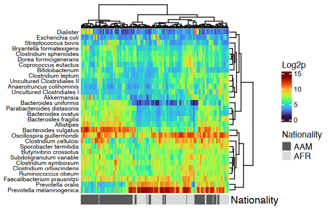
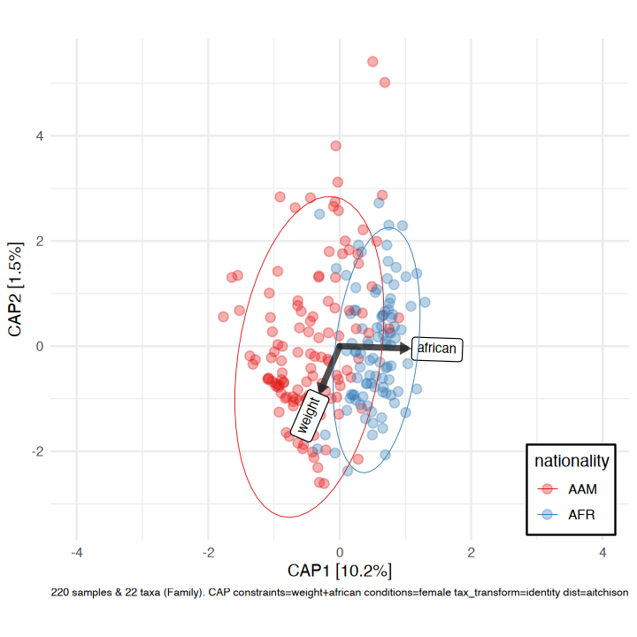

<!-- README.md is generated from README.Rmd. Please edit that file -->

# microViz <a href='https://david-barnett.github.io/microViz/index.html'></a>

<!-- badges: start -->

[](https://github.com/david-barnett/microViz/actions)
[](https://codecov.io/gh/david-barnett/microViz)


[](https://david-barnett.r-universe.dev/microViz)
[](https://joss.theoj.org/papers/4547b492f224a26d96938ada81fee3fa)
[](https://scholar.google.com/scholar?hl=en&as_sdt=2005&sciodt=0,5&cites=5439940108464463894&scipsc=&q=&scisbd=1)
[](https://zenodo.org/badge/latestdoi/307119750)
<!-- badges: end -->

## Overview

:package: `microViz` is an R package for analysis and visualization of
microbiome sequencing data.

:hammer: `microViz` functions are intended to be beginner-friendly but
flexible.

:microscope: `microViz` extends or complements popular microbial ecology
packages, including `phyloseq`, `vegan`, & `microbiome`.

## Learn more

:paperclip: This website is the best place for documentation and
examples: <https://david-barnett.github.io/microViz/>

- [**This ReadMe**](https://david-barnett.github.io/microViz/) shows a
  few example analyses

- **[The Getting Started
  guide](https://david-barnett.github.io/microViz/articles/shao19-analyses.html)**
  shows more example analyses and gives advice on using microViz with
  your own data

- **[The Reference
  page](https://david-barnett.github.io/microViz/reference/index.html)**
  lists all functions and links to help pages and examples

- **[The News
  page](https://david-barnett.github.io/microViz/news/index.html)**
  describes important changes in new microViz package versions

- **The Articles pages** give tutorials and further examples

  - [Working with phyloseq
    objects](https://david-barnett.github.io/microViz/articles/web-only/phyloseq.html)

  - [Fixing your taxa table with
    tax_fix](https://david-barnett.github.io/microViz/articles/web-only/tax-fixing.html)

  - [Creating ordination
    plots](https://david-barnett.github.io/microViz/articles/web-only/ordination.html)
    (e.g. PCA or PCoA)

  - [Interactive ordination plots with
    ord_explore](https://david-barnett.github.io/microViz/articles/web-only/ordination-interactive.html)

  - [Visualising taxonomic compositions with
    comp_barplot](https://david-barnett.github.io/microViz/articles/web-only/compositions.html)

  - [Heatmaps of microbiome composition and
    correlation](https://david-barnett.github.io/microViz/articles/web-only/heatmaps.html)

  - [Modelling and plotting individual taxon associations with
    taxatrees](https://david-barnett.github.io/microViz/articles/web-only/modelling-taxa.html)

- Post on [GitHub
  discussions](https://github.com/david-barnett/microViz/discussions) if
  you have questions/requests

## Installation

microViz is not (yet) available from CRAN. You can install microViz from
R Universe, or from GitHub.

I recommend you first install the Bioconductor dependencies using the
code below.

``` r
if (!requireNamespace("BiocManager", quietly = TRUE)) install.packages("BiocManager")
BiocManager::install(c("phyloseq", "microbiome", "ComplexHeatmap"), update = FALSE)
```

### Installation of microViz from R Universe

``` r
install.packages(
  "microViz",
  repos = c(davidbarnett = "https://david-barnett.r-universe.dev", getOption("repos"))
)
```

I also recommend you install the following suggested CRAN packages.

``` r
install.packages("ggtext") # for rotated labels on ord_plot() 
install.packages("ggraph") # for taxatree_plots()
install.packages("DT") # for tax_fix_interactive()
install.packages("corncob") # for beta binomial models in tax_model()
```

### Installation of microViz from GitHub

``` r
# Installing from GitHub requires the remotes package
install.packages("remotes")
# Windows users will also need to have RTools installed! http://jtleek.com/modules/01_DataScientistToolbox/02_10_rtools/

# To install the latest version:
remotes::install_github("david-barnett/microViz")

# To install a specific "release" version of this package, e.g. an old version 
remotes::install_github("david-barnett/microViz@0.13.0") 
```

### Installation notes

**:apple: macOS** **users** - might need to install
[xquartz](https://www.xquartz.org/) to make the heatmaps work (to do
this with homebrew, run the following command in your mac’s Terminal:
`brew install --cask xquartz`

:package: I recommend using
[renv](https://rstudio.github.io/renv/index.html) for managing your R
package installations across multiple projects.

:whale: For Docker users an image with the main branch installed is
available at:
<https://hub.docker.com/r/barnettdavid/microviz-rocker-verse>

:date: microViz is tested to work with recent R versions on Windows,
MacOS, and Ubuntu. R versions below 4 are no longer supported since
0.13.0 (R 4.0.0 was released in 2020).

## Interactive ordination exploration

``` r
library(microViz)
#> microViz version 0.13.0 - Copyright (C) 2021-2026 David Barnett
#> ! Website: https://david-barnett.github.io/microViz
#> ✔ Useful?  For citation details, run: `citation("microViz")`
#> ✖ Silence? `suppressPackageStartupMessages(library(microViz))`
```

microViz provides a Shiny app for an easy way to start exploring your
microbiome data: all you need is a phyloseq object.

``` r
# example data from corncob package
pseq <- microViz::ibd %>%
  tax_fix() %>%
  phyloseq_validate()
```

``` r
ord_explore(pseq) # gif generated with microViz version 0.7.4 (plays at 1.75x speed)
```


## Example analyses (on HITChip data)

``` r
library(phyloseq)
library(dplyr)
library(ggplot2)
```

``` r
# get some example data
data("dietswap", package = "microbiome")

# create a couple of numerical variables to use as constraints or conditions
dietswap <- dietswap %>%
  ps_mutate(
    weight = recode(bmi_group, obese = 3, overweight = 2, lean = 1),
    female = if_else(sex == "female", true = 1, false = 0),
    african = if_else(nationality == "AFR", true = 1, false = 0)
  )
# add a couple of missing values to show how microViz handles missing data
sample_data(dietswap)$african[c(3, 4)] <- NA
```

### Looking at your data

You have quite a few samples in your phyloseq object, and would like to
visualize their compositions. Perhaps these example data differ by
participant nationality?

``` r
dietswap %>%
  comp_barplot(
    tax_level = "Genus", n_taxa = 15, other_name = "Other",
    taxon_renamer = function(x) stringr::str_remove(x, " [ae]t rel."),
    palette = distinct_palette(n = 15, add = "grey90"),
    merge_other = FALSE, bar_outline_colour = "darkgrey"
  ) +
  coord_flip() +
  facet_wrap("nationality", nrow = 1, scales = "free") +
  labs(x = NULL, y = NULL) +
  theme(axis.text.y = element_blank(), axis.ticks.y = element_blank())
#> Registered S3 method overwritten by 'seriation':
#>   method         from 
#>   reorder.hclust vegan
```


``` r
htmp <- dietswap %>%
  ps_mutate(nationality = as.character(nationality)) %>%
  tax_transform("log2", add = 1, chain = TRUE) %>%
  comp_heatmap(
    taxa = tax_top(dietswap, n = 30), grid_col = NA, name = "Log2p",
    taxon_renamer = function(x) stringr::str_remove(x, " [ae]t rel."),
    colors = heat_palette(palette = viridis::turbo(11)),
    row_names_side = "left", row_dend_side = "right", sample_side = "bottom",
    sample_anno = sampleAnnotation(
      Nationality = anno_sample_cat(
        var = "nationality", col = c(AAM = "grey35", AFR = "grey85"),
        box_col = NA, legend_title = "Nationality", size = grid::unit(4, "mm")
      )
    )
  )

ComplexHeatmap::draw(
  object = htmp, annotation_legend_list = attr(htmp, "AnnoLegends"),
  merge_legends = TRUE
)
```



### Example ordination plot workflow

Ordination methods can also help you to visualize if overall microbial
ecosystem composition differs markedly between groups, e.g. BMI.

Here is one option as an example:

1.  Aggregate the taxa into bacterial families (for example) - use
    `tax_agg()`
2.  Transform the microbial data with the centered-log-ratio
    transformation - use `tax_transform()`
3.  Perform PCA with the clr-transformed features (equivalent to
    Aitchison distance PCoA) - use `ord_calc()`
4.  Plot the first 2 axes of this PCA ordination, colouring samples by
    group and adding taxon loading arrows to visualize which taxa
    generally differ across your samples - use `ord_plot()`
5.  Customise the theme of the ggplot as you like and/or add features
    like ellipses or annotations

``` r
# perform ordination
unconstrained_aitchison_pca <- dietswap %>%
  tax_agg("Family") %>%
  tax_transform("clr") %>%
  ord_calc()
# ord_calc will automatically infer you want a "PCA" here
# specify explicitly with method = "PCA", or you can pick another method

# create plot
pca_plot <- unconstrained_aitchison_pca %>%
  ord_plot(
    plot_taxa = 1:6, colour = "bmi_group", size = 1.5,
    tax_vec_length = 0.325,
    tax_lab_style = tax_lab_style(max_angle = 90, aspect_ratio = 1),
    auto_caption = 8
  )

# customise plot
customised_plot <- pca_plot +
  stat_ellipse(aes(linetype = bmi_group, colour = bmi_group), linewidth = 0.3) + # linewidth not size, since ggplot 3.4.0
  scale_colour_brewer(palette = "Set1") +
  theme(legend.position = "bottom") +
  coord_fixed(ratio = 1, clip = "off") # makes rotated labels align correctly

# show plot
customised_plot
```


### PERMANOVA

You visualised your ordinated data in the plot above. Below you can see
how to perform a PERMANOVA to test the significance of BMI’s association
with overall microbial composition. This example uses the Family-level
Aitchison distance to correspond with the plot above.

``` r
# calculate distances
aitchison_dists <- dietswap %>%
  tax_transform("identity", rank = "Family") %>%
  dist_calc("aitchison")

# the more permutations you request, the longer it takes
# but also the more stable and precise your p-values become
aitchison_perm <- aitchison_dists %>%
  dist_permanova(
    seed = 1234, # for set.seed to ensure reproducibility of random process
    n_processes = 1, n_perms = 99, # you should use at least 999!
    variables = "bmi_group"
  )
#> 2026-01-27 13:26:12.735146 - Starting PERMANOVA with 99 perms with 1 processes
#> 2026-01-27 13:26:12.765247 - Finished PERMANOVA

# view the permanova results
perm_get(aitchison_perm) %>% as.data.frame()
#>            Df   SumOfSqs         R2        F Pr(>F)
#> bmi_group   2   89.70978 0.03760034 4.278095   0.01
#> Residual  219 2296.16703 0.96239966       NA     NA
#> Total     221 2385.87681 1.00000000       NA     NA

# view the info stored about the distance calculation
info_get(aitchison_perm)
#> psExtra info:
#> tax_agg = "Family" tax_trans = "identity" dist_method = "aitchison"
```

### Constrained partial ordination

You could visualise the effect of the (numeric/logical) variables in
your permanova directly using the `ord_plot` function with constraints
(and conditions).

``` r
perm2 <- aitchison_dists %>%
  dist_permanova(variables = c("weight", "african", "sex"), seed = 321)
#> Dropping samples with missings: 2
#> 2026-01-27 13:26:12.777723 - Starting PERMANOVA with 999 perms with 1 processes
#> 2026-01-27 13:26:14.066681 - Finished PERMANOVA
```

We’ll visualise the effect of nationality and bodyweight on sample
composition, after first removing the effect of sex.

``` r
perm2 %>%
  ord_calc(constraints = c("weight", "african"), conditions = "female") %>%
  ord_plot(
    colour = "nationality", size = 2.5, alpha = 0.35,
    auto_caption = 7,
    constraint_vec_length = 1,
    constraint_vec_style = vec_constraint(1.5, colour = "grey15"),
    constraint_lab_style = constraint_lab_style(
      max_angle = 90, size = 3, aspect_ratio = 0.8, colour = "black"
    )
  ) +
  stat_ellipse(aes(colour = nationality), linewidth = 0.2) + 
  scale_color_brewer(palette = "Set1", guide = guide_legend(position = "inside")) +
  coord_fixed(ratio = 0.8, clip = "off", xlim = c(-4, 4)) +
  theme(legend.position.inside = c(0.9, 0.1), legend.background = element_rect())
#> 
#> Centering (mean) and scaling (sd) the constraints and/or conditions:
#>  weight
#>  african
#>  female
```



### Correlation Heatmaps

microViz heatmaps are powered by `ComplexHeatmap` and annotated with
taxa prevalence and/or abundance.

``` r
# set up the data with numerical variables and filter to top taxa
psq <- dietswap %>%
  ps_mutate(
    weight = recode(bmi_group, obese = 3, overweight = 2, lean = 1),
    female = if_else(sex == "female", true = 1, false = 0),
    african = if_else(nationality == "AFR", true = 1, false = 0)
  ) %>%
  tax_filter(
    tax_level = "Genus", min_prevalence = 1 / 10, min_sample_abundance = 1 / 10
  ) %>%
  tax_transform("identity", rank = "Genus")
#> Proportional min_prevalence given: 0.1 --> min 23/222 samples.

# randomly select 30 taxa from the 50 most abundant taxa (just for an example)
set.seed(123)
taxa <- sample(tax_top(psq, n = 50), size = 30)
# actually draw the heatmap
cor_heatmap(
  data = psq, taxa = taxa,
  taxon_renamer = function(x) stringr::str_remove(x, " [ae]t rel."),
  tax_anno = taxAnnotation(
    Prev. = anno_tax_prev(undetected = 50),
    Log2 = anno_tax_box(undetected = 50, trans = "log2", zero_replace = 1)
  )
)
```


## Citation

:innocent: If you find any part of microViz useful to your work, please
consider citing the JOSS article:

Barnett et al., (2021). microViz: an R package for microbiome data
visualization and statistics. Journal of Open Source Software, 6(63),
3201, <https://doi.org/10.21105/joss.03201>

## Contributing

Bug reports, questions, suggestions for new features, and other
contributions are all welcome. Feel free to create a [GitHub
Issue](https://github.com/david-barnett/microViz/issues) or write on the
[Discussions](https://github.com/david-barnett/microViz/discussions)
page.

This project is released with a [Contributor Code of
Conduct](https://david-barnett.github.io/microViz/CODE_OF_CONDUCT.html)
and by participating in this project you agree to abide by its terms.

## Session info

``` r
sessionInfo()
#> R version 4.5.2 (2025-10-31)
#> Platform: aarch64-apple-darwin20
#> Running under: macOS Sequoia 15.7.3
#> 
#> Matrix products: default
#> BLAS:   /System/Library/Frameworks/Accelerate.framework/Versions/A/Frameworks/vecLib.framework/Versions/A/libBLAS.dylib 
#> LAPACK: /Library/Frameworks/R.framework/Versions/4.5-arm64/Resources/lib/libRlapack.dylib;  LAPACK version 3.12.1
#> 
#> locale:
#> [1] en_US.UTF-8/en_US.UTF-8/en_US.UTF-8/C/en_US.UTF-8/en_US.UTF-8
#> 
#> time zone: Europe/Amsterdam
#> tzcode source: internal
#> 
#> attached base packages:
#> [1] stats     graphics  grDevices utils     datasets  methods   base     
#> 
#> other attached packages:
#> [1] ggplot2_4.0.1   dplyr_1.1.4     phyloseq_1.54.0 microViz_0.13.0
#> [5] testthat_3.3.2  devtools_2.4.6  usethis_3.2.1  
#> 
#> loaded via a namespace (and not attached):
#>   [1] gridExtra_2.3         remotes_2.5.0         permute_0.9-8        
#>   [4] rlang_1.1.7           magrittr_2.0.4        clue_0.3-66          
#>   [7] GetoptLong_1.1.0      ade4_1.7-23           otel_0.2.0           
#>  [10] matrixStats_1.5.0     compiler_4.5.2        mgcv_1.9-3           
#>  [13] png_0.1-8             vctrs_0.7.1           reshape2_1.4.5       
#>  [16] stringr_1.6.0         pkgconfig_2.0.3       shape_1.4.6.1        
#>  [19] crayon_1.5.3          fastmap_1.2.0         magick_2.8.6         
#>  [22] XVector_0.50.0        ellipsis_0.3.2        labeling_0.4.3       
#>  [25] ca_0.71.1             rmarkdown_2.30        markdown_2.0         
#>  [28] sessioninfo_1.2.3     purrr_1.2.1           xfun_0.56            
#>  [31] cachem_1.1.0          litedown_0.7          jsonlite_2.0.0       
#>  [34] biomformat_1.38.0     rhdf5filters_1.22.0   Rhdf5lib_1.32.0      
#>  [37] parallel_4.5.2        cluster_2.1.8.1       R6_2.6.1             
#>  [40] stringi_1.8.7         RColorBrewer_1.1-3    pkgload_1.4.1        
#>  [43] brio_1.1.5            Rcpp_1.1.1            Seqinfo_1.0.0        
#>  [46] iterators_1.0.14      knitr_1.51            IRanges_2.44.0       
#>  [49] Matrix_1.7-4          splines_4.5.2         igraph_2.2.1         
#>  [52] tidyselect_1.2.1      rstudioapi_0.17.1     yaml_2.3.12          
#>  [55] viridis_0.6.5         vegan_2.7-2           TSP_1.2.6            
#>  [58] ggtext_0.1.2          doParallel_1.0.17     codetools_0.2-20     
#>  [61] pkgbuild_1.4.8        lattice_0.22-7        tibble_3.3.1         
#>  [64] plyr_1.8.9            Biobase_2.70.0        withr_3.0.2          
#>  [67] S7_0.2.1              evaluate_1.0.5        Rtsne_0.17           
#>  [70] survival_3.8-3        xml2_1.3.8            circlize_0.4.17      
#>  [73] Biostrings_2.78.0     pillar_1.11.1         foreach_1.5.2        
#>  [76] stats4_4.5.2          generics_0.1.4        S4Vectors_0.48.0     
#>  [79] microbiome_1.32.0     commonmark_2.0.0      scales_1.4.0         
#>  [82] glue_1.8.0            tools_4.5.2           data.table_1.18.0    
#>  [85] registry_0.5-1        fs_1.6.6              rhdf5_2.54.1         
#>  [88] grid_4.5.2            Cairo_1.6-2           tidyr_1.3.2          
#>  [91] ape_5.8-1             seriation_1.5.8       colorspace_2.1-2     
#>  [94] nlme_3.1-168          cli_3.6.5             viridisLite_0.4.2    
#>  [97] ComplexHeatmap_2.26.0 gtable_0.3.6          digest_0.6.39        
#> [100] BiocGenerics_0.56.0   rjson_0.2.23          farver_2.1.2         
#> [103] memoise_2.0.1         htmltools_0.5.9       multtest_2.66.0      
#> [106] lifecycle_1.0.5       GlobalOptions_0.1.3   gridtext_0.1.5       
#> [109] MASS_7.3-65
```
