# Learn microbiome analysis with microViz

## Introduction

#### Overview

These exercises will cover some of the core concepts in microbiome data
analysis, using example data. You can follow along by writing code in
your own R Markdown notebook (or script).

- [**Part 1**](#intro-diversity) will introduce you to: phyloseq objects
  for microbiome data; basic bar charts for visualizing microbiome
  compositions; and alpha diversity indices.

- [**Part 2**](#dissimilarity-ordination-filtering) will introduce you
  to: ecological distances and dissimilarity measures; the use of PCoA
  plots and PERMANOVA; and how/why/when to filter your microbiome data
  (taxa/samples).

- [**Part 3**](#transformations-pca-da) will introduce you to: the
  Euclidean distance; log and CLR transformations; heatmaps for
  microbiome abundance data; Principal Components Analysis (PCA); and
  Differential Abundance (DA) testing methods.

#### Further resources

Refer to the [microViz
website](https://david-barnett.github.io/microViz/) to see help pages
for every function, as well as further tutorials.

The first version of this material was developed as part of the 2022
Evomics workshop on Genomics.

Some accompanying slides are available via the Evomics workshop’s
website: <http://evomics.org/2022-workshop-on-genomics-cesky-krumlov/>

#### Using your own data?

To apply these methods to your own data, you will first need to create a
phyloseq object containing your data. You can process your sequencing
data into a count table or biom file using e.g. DADA2 for 16S rRNA gene
amplicon sequencing data, or e.g. MetaPhlAn3 for shotgun metagenomic
data. Then see the article called [“Working with phyloseq
objects”](https://david-barnett.github.io/microViz/articles/web-only/phyloseq.html)
for more details on creating phyloseq objects.

#### Comments or questions?

Something missing or unclear? Spotted a mistake? Let me know on the
microViz [GitHub discussions
page](https://github.com/david-barnett/microViz/discussions).

------------------------------------------------------------------------

## Setup

Set R Markdown chunk output options:

``` r
knitr::opts_chunk$set(echo = TRUE, fig.width = 6, fig.height = 4, dpi = 120)
```

Load the R packages we will be using:

``` r
library(seriation)
library(dplyr)
library(purrr)
library(ggplot2)
library(phyloseq)
library(microViz)
library(shiny)
```

Get the two example datasets:

``` r
mice <- readRDS(url("https://github.com/david-barnett/evomics-material/raw/898766166ce151f837b8d668bdc0bf0f859a6dd3/data/mice.rds"))
data("shao19", package = "microViz")
```

We’ll primarily use these two datasets in these exercises, both are data
on the gut microbiome. The first is from a study of antibiotic
administration in mice, and the second is from a large birth cohort
study in human infants.

Each dataset was generated using different sequencing techniques, and
different sequence data processing approaches. But the analysis
approaches we will learn in these exercises can be readily applied to
both methods. The approaches are also appropriate for microbiome data
from other environments, not just gut microbiota!

- `mice` is 16S rRNA gene amplicon sequencing data, from the mouse
  antibiotics study
  - They used Illumina MiSeq and processed the data into ASVs using
    DADA2
- `shao19` is shotgun metagenomic data, from a 2019 study of infants
  born vaginally or by C-section.
  - They used Illumina HiSeq and the abundance of species-like features
    was inferred with metaphlan3.

So the data has already been processed from fastq files into counts per
taxon. This is the exciting bit, you get to explore and visualize the
data, and do statistics (yay!).

------------------------------------------------------------------------

## 1: Intro & Diversity

This section will introduce you to: phyloseq objects for microbiome
data; basic bar charts for visualizing microbiome compositions; and
alpha diversity indices.

------------------------------------------------------------------------

### Intro to phyloseq

This is a `phyloseq` S4 object, containing processed microbiota data
from the mouse study.

**Click here for more details about the mice dataset:**

**The mice data**

The data originate from a study on the effects of oral antibiotic
administration on flavivirus infection
(<https://www.ncbi.nlm.nih.gov/pubmed/29590614>). Sequence data was
generated from extracted nucleic acid from stool samples collected from
individually caged mice and amplified using primers specific for the V4
region using primers 515F/806R.

The study followed flavivirus infection after the following treatments:

1.  Koolaid: Antibiotics are provided to the mice via their drinking
    water. As many of the antibiotics taste bad, koolaid is added as a
    sweetener. Therefore, the appropriate control is water spiked and
    labelled *koolaid*.
2.  Ampicillin (Amp): <https://en.wikipedia.org/wiki/Ampicillin>
3.  Metronidazole (Met): <https://en.wikipedia.org/wiki/Metronidazole>
4.  Ampicillin + Metronidazole (Amp+Metro)

Treatments were supplied ad libitum for 2 weeks prior to viral infection
and maintained for 2 weeks post-infection. Primary outcome was mouse
survival. Each treatment group had two subgroups of mice that were
either a) left uninfected as controls or b) infected with West Nile
Virus via a subcutaneous foot pad injection.

Get a little familiar with the object. What does it have in it? Can you
look at each part?

The printed object shows you functions you can use to access the data
inside.

You can also use the `@` symbol.

``` r
mice
```

    ## phyloseq-class experiment-level object
    ## otu_table()   OTU Table:         [ 3229 taxa and 520 samples ]
    ## sample_data() Sample Data:       [ 520 samples by 11 sample variables ]
    ## tax_table()   Taxonomy Table:    [ 3229 taxa by 7 taxonomic ranks ]

``` r
# View(mice)
```

``` r
tax_table(mice) %>% head()
```

    ## Taxonomy Table:     [6 taxa by 7 taxonomic ranks]:
    ##         Kingdom    Phylum           Class                 Order            
    ## ASV0001 "Bacteria" "Bacteroidetes"  "Bacteroidia"         "Bacteroidales"  
    ## ASV0002 "Bacteria" "Proteobacteria" "Gammaproteobacteria" "Xanthomonadales"
    ## ASV0003 "Bacteria" "Bacteroidetes"  "Bacteroidia"         "Bacteroidales"  
    ## ASV0004 "Bacteria" "Bacteroidetes"  "Bacteroidia"         "Bacteroidales"  
    ## ASV0005 "Bacteria" "Bacteroidetes"  "Bacteroidia"         "Bacteroidales"  
    ## ASV0006 "Bacteria" "Bacteroidetes"  "Bacteroidia"         "Bacteroidales"  
    ##         Family               Genus              Species      
    ## ASV0001 "Porphyromonadaceae" NA                 NA           
    ## ASV0002 "Xanthomonadaceae"   "Stenotrophomonas" "maltophilia"
    ## ASV0003 "Porphyromonadaceae" NA                 NA           
    ## ASV0004 "Porphyromonadaceae" NA                 NA           
    ## ASV0005 "Porphyromonadaceae" NA                 NA           
    ## ASV0006 "Porphyromonadaceae" NA                 NA

``` r
rank_names(mice)
```

    ## [1] "Kingdom" "Phylum"  "Class"   "Order"   "Family"  "Genus"   "Species"

``` r
otu_table(mice)[1:15, 1:8]
```

    ## OTU Table:          [8 taxa and 15 samples]
    ##                      taxa are columns
    ##        ASV0001 ASV0002 ASV0003 ASV0004 ASV0005 ASV0006 ASV0007 ASV0008
    ## D14.A1    3343       0    4205    3470    3607    1210    1159    1852
    ## D14.B5    4332       0    5412    2494    3083    1451    1663    1745
    ## D0.D5     5344       0    3906    1439    2396    1402    1217    2078
    ## D0.E1     2994       0    4005    2188    2882    1267    1821    1788
    ## D0.E2     2315       0    3987     955    1665    1025     899    1342
    ## D0.E3     1972       0    4336    1876    3422    1208     551    1900
    ## D0.E4     2352       0    2561    1960    2060    1350    1095    1200
    ## D0.E5     1386       0    1752    1471    1363     724    1050     871
    ## D0.F1     3795       0    4052    2226    3130     539     162     247
    ## D0.F2     2867       0    2063     435    1412     410       0     150
    ## D0.F3     3850       0    4203     508    2839     533       0     230
    ## D0.F4     6740       0    5045    1356    5755     517      85     210
    ## D14.C1    2664       3    2892    1530    2176     735    1508    1577
    ## D0.F5     5303       3    4203    3313    4471    1241     344     441
    ## D0.G1     3052       0    3393    3209    2867     873     372    1512

``` r
# mice@otu_table[1:15, 1:10] # the same result
```

``` r
sample_variables(mice)
```

    ##  [1] "sample_id"       "barcode"         "run"             "plate"          
    ##  [5] "sample"          "sex"             "cage"            "treatment_days" 
    ##  [9] "treatment"       "virus"           "survival_status"

``` r
sample_data(mice)[1:15, 1:5]
```

    ##                 sample_id      barcode run plate sample
    ## D14.A1  1.Thackray.D14.A1 ACGAGACTGATT 368     1      1
    ## D14.B5 10.Thackray.D14.B5 ACCGGTATGTAC 368     1     10
    ## D0.D5  100.Thackray.D0.D5 ATCTACCGAAGC 368     2    100
    ## D0.E1  101.Thackray.D0.E1 ACTTGGTGTAAG 368     2    101
    ## D0.E2  102.Thackray.D0.E2 TCTTGGAGGTCA 368     2    102
    ## D0.E3  103.Thackray.D0.E3 TCACCTCCTTGT 368     2    103
    ## D0.E4  104.Thackray.D0.E4 GCACACCTGATA 368     2    104
    ## D0.E5  105.Thackray.D0.E5 GCGACAATTACA 368     2    105
    ## D0.F1  106.Thackray.D0.F1 TCATGCTCCATT 368     2    106
    ## D0.F2  107.Thackray.D0.F2 AGCTGTCAAGCT 368     2    107
    ## D0.F3  108.Thackray.D0.F3 GAGAGCAACAGA 368     2    108
    ## D0.F4  109.Thackray.D0.F4 TACTCGGGAACT 368     2    109
    ## D14.C1 11.Thackray.D14.C1 AATTGTGTCGGA 368     1     11
    ## D0.F5  110.Thackray.D0.F5 CGTGCTTAGGCT 368     2    110
    ## D0.G1  111.Thackray.D0.G1 TACCGAAGGTAT 368     2    111

``` r
sample_names(mice) %>% head(10)
```

    ##  [1] "D14.A1" "D14.B5" "D0.D5"  "D0.E1"  "D0.E2"  "D0.E3"  "D0.E4"  "D0.E5" 
    ##  [9] "D0.F1"  "D0.F2"

------------------------------------------------------------------------

### Looking at microbiome data

Okay, so how do we look at the microbiota abundance data? To do this,
we’re going to use the R package `microViz`

#### Barcharts: bad to better

Lets take a very small subset of this data to get started. Just the
control group (vehicle treatment) at day 13.

``` r
# We can filter the samples like this, using the sample_data information
mice %>%
  ps_filter(treatment_days == "D13", virus == "WNV2000", treatment == "Vehicle")
```

    ## phyloseq-class experiment-level object
    ## otu_table()   OTU Table:         [ 563 taxa and 10 samples ]
    ## sample_data() Sample Data:       [ 10 samples by 11 sample variables ]
    ## tax_table()   Taxonomy Table:    [ 563 taxa by 7 taxonomic ranks ]

We will start by naively plotting the raw data, and then make several
improvements to make the bar chart more informative.

##### Bad bars

``` r
mice %>%
  ps_filter(treatment_days == "D13", virus == "WNV2000", treatment == "Vehicle") %>%
  comp_barplot(
    tax_level = "unique", n_taxa = 12, bar_width = 0.7,
    sample_order = "asis", tax_transform_for_plot = "identity"
  ) +
  coord_flip()
```

    ## NAs detected in phyloseq tax_table:
    ## Consider using tax_fix() to make taxa uniquely identifiable
    ## NAs detected in phyloseq tax_table:
    ## Consider using tax_fix() to make taxa uniquely identifiable


What is going on here? The unique taxa have uninformative IDs, and we
also got a message about problems with the taxonomy table.

The total number of reads also varies a lot between samples! The total
number of reads for each sample is NOT a reliable indicator of the
biomass or bacterial load of each sample. So for now we will just
consider the relative abundance of each taxon, as proportions of the
total counts for that sample.

##### Compositions (%)

``` r
mice %>%
  ps_filter(treatment_days == "D13", virus == "WNV2000", treatment == "Vehicle") %>%
  comp_barplot(
    tax_level = "unique", n_taxa = 12, sample_order = "asis", bar_width = 0.7
  ) +
  coord_flip()
```

    ## NAs detected in phyloseq tax_table:
    ## Consider using tax_fix() to make taxa uniquely identifiable
    ## NAs detected in phyloseq tax_table:
    ## Consider using tax_fix() to make taxa uniquely identifiable


##### Fixing the tax_table

Let’s look at the taxonomy table interactively:

``` r
# tax_fix_interactive(mice) # run this in the R Console for an interactive look
```

Looks like we just need to fill in some blank cells when a sequence was
not classified at genus or family. `tax_fix` can do this, it just copies
down info from a higher rank classification. Let’s update our `mice`
phyloseq object with this fix.

``` r
mice <- tax_fix(mice, verbose = FALSE)
```

We can also rename the unique taxa with a more informative name,
according to their classification at the rank of Family (and how common
they are).

``` r
mice %>%
  taxa_names() %>%
  head()
```

    ## [1] "ASV0001" "ASV0002" "ASV0003" "ASV0004" "ASV0005" "ASV0006"

``` r
mice <- tax_rename(mice, rank = "Family")
mice %>%
  taxa_names() %>%
  head()
```

    ## [1] "Porphyromonadaceae 001" "Xanthomonadaceae 01"    "Porphyromonadaceae 002"
    ## [4] "Porphyromonadaceae 003" "Porphyromonadaceae 004" "Porphyromonadaceae 005"

Let’s try again with the better names.

``` r
mice %>%
  ps_filter(treatment_days == "D13", virus == "WNV2000", treatment == "Vehicle") %>%
  comp_barplot(
    tax_level = "unique", n_taxa = 12, sample_order = "asis", bar_width = 0.7
  ) +
  coord_flip()
```


Sadly we don’t have enough distinct colours to show all the unique taxa.

``` r
mice %>%
  ps_filter(treatment_days == "D13", virus == "WNV2000", treatment == "Vehicle") %>%
  comp_barplot(
    tax_level = "unique", n_taxa = 12, sample_order = "asis", bar_width = 0.7,
    merge_other = FALSE
  ) +
  coord_flip()
```


##### Aggregating taxa

So let’s “aggregate” all the counts into family-level groups. For each
family, this adds together all the counts from every ASV that belongs to
that family. We can do that by changing the `tax_level` argument to
“Family”.

``` r
mice %>%
  ps_filter(treatment_days == "D13", virus == "WNV2000", treatment == "Vehicle") %>%
  comp_barplot(
    tax_level = "Family", n_taxa = 10, bar_width = 0.7, sample_order = "asis"
  ) +
  coord_flip()
```

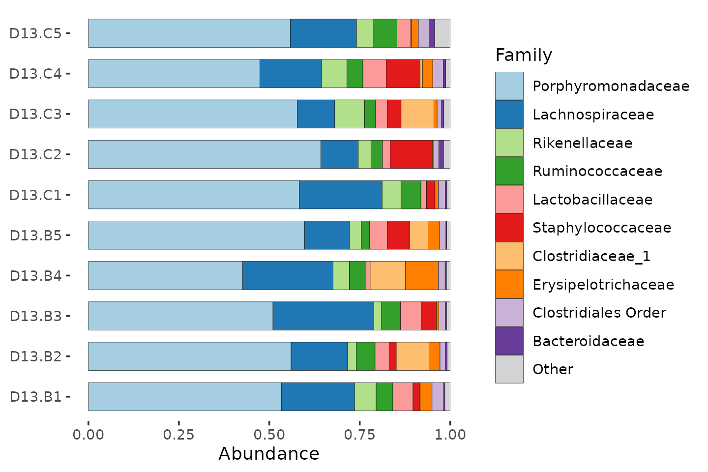

By aggregating at family level, we have sacrificed taxonomic resolution,
compared to using ASVs. But this way we can get an idea of which
families are the most abundant, and how variable the communities are.

Try making some similar plots aggregated at different taxonomic ranks.

``` r
# rank_names(mice)
# mice %>%
#   ps_filter(treatment_days == 'D13', virus == 'WNV2000', treatment == 'Vehicle') %>%
#   comp_barplot(tax_level = , n_taxa = 10, sample_order = 'asis', merge_other = FALSE)
```

``` r
mice %>%
  ps_filter(treatment_days == "D13", virus == "WNV2000", treatment == "Vehicle") %>%
  comp_barplot(
    tax_level = "Genus", n_taxa = 12, bar_width = 0.7,
    sample_order = "asis", merge_other = FALSE
  ) +
  coord_flip()
```


Many of the ASVs in this mice data, the *Porphyromonadaceae*, could not
be classified at genus level.

``` r
mice %>%
  ps_filter(treatment_days == "D13", virus == "WNV2000", treatment == "Vehicle") %>%
  comp_barplot(
    tax_level = "Phylum", n_taxa = 7, bar_width = 0.7, sample_order = "asis"
  ) +
  coord_flip()
```

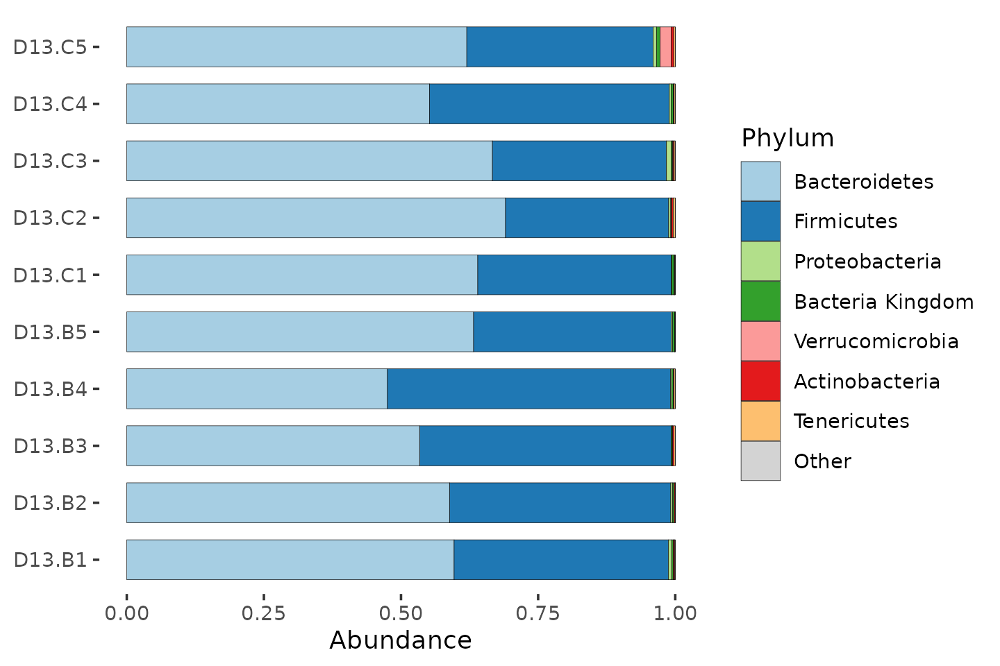

##### Fickle Phyla

A note on phylum names! There have been major changes this year and some
of these are now old names. Most published research is of course with
the old names (and still probably will be for a year or so).

------------------------------------------------------------------------

### Fun with barcharts

More examples/tutorial of visualizing microbiome data using stacked
barcharts can be found here:
<https://david-barnett.github.io/microViz/articles/web-only/compositions.html>

Try it out for yourself a bit!

Bar charts often look better when you sort the samples by similarity.
The webpage mentions using Bray-Curtis distances and hierarchical
clustering to sort samples. We haven’t discussed dissimilarity or
distances yet, but we will in the next set of exercises!

For now, just appreciate that it can make the bar charts easier to read!

------------------------------------------------------------------------

### Alpha diversity

How diverse is the bacterial microbiome of each sample?

#### Why is this interesting?

##### Biologically

- Lower gut microbiome diversity is related to worse health in adult
  humans.
- Higher diversity ecosystems are often considered healthier, more
  mature, and more resilient to perturbation.
- BUT: diverse == healthy does not hold for all ecosystems, e.g. early
  infant gut microbiome, so consider your own data and hypotheses
  carefully.

##### Practically

Diversity indices provide a simple one number summary of each ecosystem:
easy to compare and do stats with.

#### Richness

The more the merrier. The simplest measure is just counting, aka
“Observed Richness”. Let’s compute the observed richness and label each
sample with it.

``` r
mice %>%
  ps_filter(treatment_days == "D13", virus == "WNV2000", treatment == "Vehicle") %>%
  ps_calc_richness(rank = "Genus", index = "observed", varname = "N genera") %>%
  comp_barplot(
    tax_level = "Genus", n_taxa = 12, label = "N genera", bar_width = 0.7,
    sample_order = "asis", merge_other = FALSE # , tax_transform_for_plot = 'identity'
  ) +
  coord_flip()
```


#### Diversity

Richness and evenness matter in the calculation of true diversity
indices.

``` r
mice %>%
  ps_filter(treatment_days == "D13", virus == "WNV2000", treatment == "Vehicle") %>%
  ps_calc_diversity(rank = "Genus", index = "shannon") %>%
  ps_mutate(shannon_Genus = round(shannon_Genus, digits = 2)) %>%
  comp_barplot(
    tax_level = "Genus", n_taxa = 12, label = "shannon_Genus", bar_width = 0.7,
    sample_order = "asis", merge_other = FALSE
  ) +
  coord_flip()
```


#### Statistics with alpha diversity

So we have our alpha diversity values for this small subset of mice.

``` r
mice %>%
  ps_filter(treatment_days == "D13", virus == "WNV2000", treatment == "Vehicle") %>%
  ps_calc_diversity(rank = "Genus", index = "shannon") %>%
  samdat_tbl() %>%
  ggplot(aes(x = shannon_Genus, y = "Day 13\ncontrols")) +
  geom_point(position = position_jitter(height = 0.2), alpha = 0.5) +
  labs(x = "Shannon diversity (Genus)", y = NULL) +
  xlim(1, 2.5) +
  theme_bw()
```

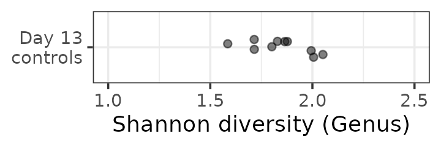

Let’s calculate alpha diversity for all mice after antibiotic or control
treatment, and make a comparison. I suspect that the average gut
microbiota diversity of the antibiotic exposed mice will differ from the
control group’s at day 3.

``` r
# First compute a new variable aggregating all the control mice together
mice <- mice %>%
  ps_mutate(antibiotics = treatment %in% c("Amp", "Metro", "AmpMetro"))
```

``` r
mice %>%
  ps_filter(treatment_days == "D13") %>%
  ps_calc_diversity(rank = "Genus", index = "shannon") %>%
  samdat_tbl() %>%
  ggplot(aes(y = antibiotics, x = shannon_Genus)) +
  geom_boxplot(width = 0.3) +
  geom_point(position = position_jitter(height = 0.2), alpha = 0.5) +
  theme_bw()
```

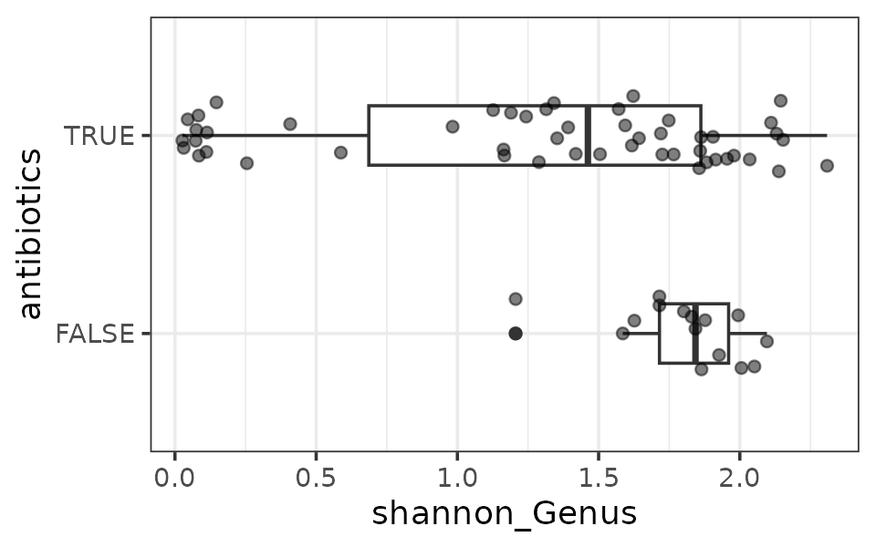

It looks like the antibiotics treated mice have lower gut microbiota
diversity on average. A simple statistical test supports this.

``` r
mice %>%
  ps_filter(treatment_days == "D13") %>%
  ps_calc_diversity(rank = "Genus", index = "shannon") %>%
  samdat_tbl() %>%
  wilcox.test(formula = shannon_Genus ~ antibiotics, data = .)
```

    ## 
    ##  Wilcoxon rank sum test with continuity correction
    ## 
    ## data:  shannon_Genus by antibiotics
    ## W = 533, p-value = 0.0142
    ## alternative hypothesis: true location shift is not equal to 0

You can apply more complex statistical tests as you like, e.g. adjusting
for covariates with linear regression, using
[`lm()`](https://rdrr.io/r/stats/lm.html)

``` r
mice %>%
  ps_filter(treatment_days == "D13") %>%
  ps_calc_diversity(rank = "Genus", index = "shannon") %>%
  samdat_tbl() %>%
  lm(formula = shannon_Genus ~ antibiotics + virus, data = .) %>%
  summary()
```

    ## 
    ## Call:
    ## lm(formula = shannon_Genus ~ antibiotics + virus, data = .)
    ## 
    ## Residuals:
    ##      Min       1Q   Median       3Q      Max 
    ## -1.34105 -0.20830  0.08928  0.48767  1.25856 
    ## 
    ## Coefficients:
    ##                 Estimate Std. Error t value Pr(>|t|)    
    ## (Intercept)       1.5947     0.2036   7.831 7.76e-11 ***
    ## antibioticsTRUE  -0.5445     0.1908  -2.854  0.00587 ** 
    ## virusWNV2000      0.3217     0.1742   1.847  0.06956 .  
    ## ---
    ## Signif. codes:  0 '***' 0.001 '**' 0.01 '*' 0.05 '.' 0.1 ' ' 1
    ## 
    ## Residual standard error: 0.6479 on 62 degrees of freedom
    ## Multiple R-squared:  0.1535, Adjusted R-squared:  0.1262 
    ## F-statistic: 5.622 on 2 and 62 DF,  p-value: 0.005706

Try it out for yourself at other time points? Practice making plots and
doing simple statistical tests.

What about richness?

------------------------------------------------------------------------

### Extension exercises for part 1

**Click here for an extension activity with an IBD dataset:**

This is an extension exercise, for those who are moving quickly.

**Inflammatory Bowel Disease study**

``` r
ibd <- microViz::ibd %>%
  tax_mutate(Species = NULL) %>% # ibd Species column was blank -> deleted
  ps_mutate(disease = ibd == "ibd", ibd = NULL) # adds disease state indicator variable
```

`ibd` is another phyloseq object containing 16S rRNA gene amplicon
sequencing data, from a 2012 study of Inflammatory Bowel Disease in
children and young adults.

It’s “old” data: they used 454 Pyrosequencing, and clustered the raw
sequences into “OTUs”.

Have a look at the data, like we did before for the `mice` dataset.

``` r
ibd
```

    ## phyloseq-class experiment-level object
    ## otu_table()   OTU Table:         [ 36349 taxa and 91 samples ]
    ## sample_data() Sample Data:       [ 91 samples by 15 sample variables ]
    ## tax_table()   Taxonomy Table:    [ 36349 taxa by 6 taxonomic ranks ]

``` r
#
```

You can perform alpha diversity analysis: Try comparing the alpha
diversity of the IBD patients against the healthy controls.

``` r
#
```

You can also try this stuff out on the Shao 2019 Birth cohort data.
Don’t worry if you don’t try this now, as we will look at Shao 2019
dataset in the next part of the lab.

``` r
shao19
```

    ## phyloseq-class experiment-level object
    ## otu_table()   OTU Table:         [ 819 taxa and 1644 samples ]
    ## sample_data() Sample Data:       [ 1644 samples by 11 sample variables ]
    ## tax_table()   Taxonomy Table:    [ 819 taxa by 6 taxonomic ranks ]
    ## phy_tree()    Phylogenetic Tree: [ 819 tips and 818 internal nodes ]

**Click here for additional notes on richness and readcount**

**Additional notes on richness and readcount**

Simple approaches like Observed Richness are sensitive to what
ecologists call “sampling effort”. For macroecologists, this is actually
how much time/effort you spent trying to count all the organisms present
in an ecosystem. In our case, the amount of total reads obtained
represents the sampling effort: more reads, more effort. Indeed we can
see that the samples with a much lower readcount have lower observed
richness.

(Furthermore, as this richness estimate is based on a sample, and not
the actual ecosystem, the richness estimate actually has quantifiable
uncertainty too.)

``` r
mice %>%
  ps_filter(treatment_days == "D13", virus == "WNV2000", treatment == "Amp") %>%
  ps_calc_richness(rank = "Genus", index = "observed", varname = "N genera") %>%
  comp_barplot(
    tax_level = "Genus", n_taxa = 12, label = "N genera", bar_width = 0.7,
    sample_order = "asis", merge_other = FALSE, tax_transform_for_plot = "identity"
  )
```


``` r
mice %>%
  ps_calc_richness(rank = "Genus", index = "observed", varname = "genera") %>%
  ps_mutate(readcount = sample_sums(mice)) %>%
  samdat_tbl() %>%
  ggplot(aes(readcount, genera)) +
  geom_point(alpha = 0.4, size = 2.5) +
  theme_bw(14)
```

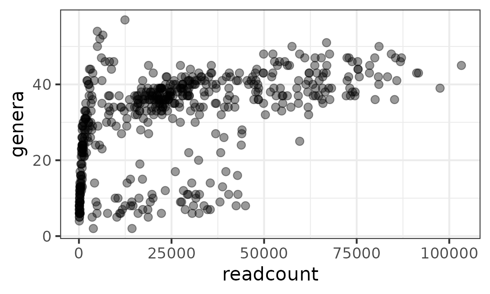

**What to do:**

1.  **Simple solution**: Ignore the problem. Whilst you can’t interpret
    the richness of any individual sample as being correct, it is still
    usually valid to compare richness across groups of samples, as the
    readcount variation is only random noise, and should be uncorrelated
    with your grouping variable (but do check this).
2.  **Harder solution**: Explore more rigorous methods like `breakaway`
    by Amy Willis and team.
    <https://www.frontiersin.org/articles/10.3389/fmicb.2019.02407/full>

------------------------------------------------------------------------

## 2: Dissimilarity, ordination, & filtering

This section will introduce you to ecological distances and
dissimilarity measures; the use of PCoA plots and PERMANOVA; and
how/why/when to filter your microbiome data (taxa/samples).

------------------------------------------------------------------------

Part 1 was relatively straightforward, at least conceptually. But there
is a lot more interesting stuff we can do with microbiome data.

We’ve looked at one sample at a time and calculated and compared simple
summary measures of sample alpha-diversity.

Alpha diversity is sometimes referred to as “within sample” diversity.

Now we’re going to look at “beta diversity”, or “between sample”
diversity.

For this part we’re going to swap to another dataset. So you get a
little bit more practice examining a phyloseq object. Look at the rank
names, sample data variables etc.

``` r
shao19 # this object has another part!
```

    ## phyloseq-class experiment-level object
    ## otu_table()   OTU Table:         [ 819 taxa and 1644 samples ]
    ## sample_data() Sample Data:       [ 1644 samples by 11 sample variables ]
    ## tax_table()   Taxonomy Table:    [ 819 taxa by 6 taxonomic ranks ]
    ## phy_tree()    Phylogenetic Tree: [ 819 tips and 818 internal nodes ]

``` r
#
```

------------------------------------------------------------------------

#### Filtering

First, we need to talk about filtering.

##### Sample filtering

You should check if any of your samples have a surprisingly low total
number of (classified) reads. This can suggest that something went wrong
in the lab (or during sample collection) and the data from this sample
might be unreliable.

You might already do this check for total reads and remove poor quality
samples during the fastq file processing.

``` r
shao19 %>%
  ps_mutate(reads = sample_sums(shao19)) %>%
  samdat_tbl() %>%
  ggplot(aes(x = reads)) +
  geom_freqpoly(bins = 500) +
  geom_rug(alpha = 0.5) +
  scale_x_log10(labels = scales::label_number()) +
  labs(x = "Number of classified reads", y = NULL) +
  theme_bw()
```

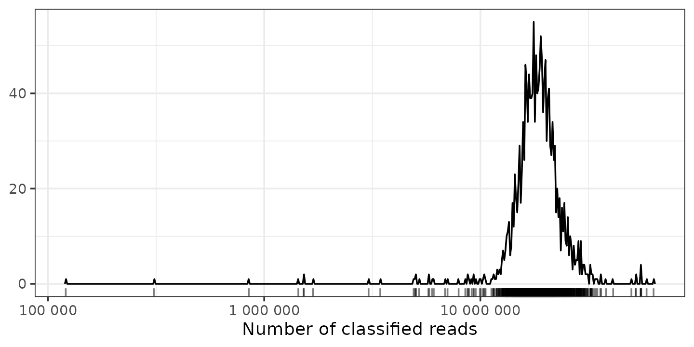

How many is enough? There is no easy answer.

These samples have great depth. There are a few with much less reads
than the rest, and a few with under a million. You might consider
dropping the samples with under a million reads, to see if it affects
your results, but in this case we won’t.

But 100,000 is still a lot, compared to what older sequencing machines
produced: 1000 reads might have been considered very good. So look at
the distribution for your data, in case there are obvious outliers, and
look at recent papers using a similar sequencing technique for what kind
of threshold they used.

There might also be relevant information for the type of sequencer you
used on e.g. Illumina website. e.g. for this type of sequencing Illumina
suggests you should expect at least a million reads (and this is good
for RNA seq analyses).
<https://support.illumina.com/bulletins/2017/04/considerations-for-rna-seq-read-length-and-coverage-.html>

If you are interested, go back and recreate this plot with the 16S
sequencing dataset `mice`.

``` r
# mice %>%
#   ps_mutate(reads = sample_sums(mice)) %>%
#   samdat_tbl() %>%
#   ggplot(aes(x = reads)) +
#   geom_freqpoly(bins = 30) +
#   ...
```

##### Taxon filtering

Okay, so we might remove “bad” samples, but how can a taxon be “bad”?

We probably want to filter out **rare** taxa, before performing some
kinds of analysis.

###### Why remove rare taxa?

**Rare taxa might sometimes be:**

1.  Sequencing errors
2.  Statistically problematic
3.  Biologically irrelevant

###### How to remove rare taxa?

**What is rare?** Two main concepts.

- Low **prevalence** - taxon only detected in a small number of samples
  in your dataset.
- Low **abundance** - relatively few reads assigned to that taxon (on
  average or in total)

Consider the impact of issues 1, 2, and 3. Let’s say we are not
interested in unique taxa that occur in fewer than 2% of samples, and
they have to have at least 10,000 reads in total across all samples.

``` r
# before filtering
ntaxa(shao19)
```

    ## [1] 819

``` r
# after filtering
shao19 %>%
  tax_filter(min_prevalence = 2 / 100, min_total_abundance = 10000) %>%
  ntaxa()
```

    ## Proportional min_prevalence given: 0.02 --> min 33/1644 samples.

    ## [1] 253

Wow so that would remove **most** of our unique taxa! What is going on?
Let’s make some plots!

``` r
# make table of summary statistics for the unique taxa in shao19
shaoTaxaStats <- tibble(
  taxon = taxa_names(shao19),
  prevalence = microbiome::prevalence(shao19),
  total_abundance = taxa_sums(shao19)
)
```

``` r
p <- shaoTaxaStats %>%
  ggplot(aes(total_abundance, prevalence)) +
  geom_point(alpha = 0.5) +
  geom_rug(alpha = 0.1) +
  scale_x_continuous(
    labels = scales::label_number(), name = "Total Abundance"
  ) +
  scale_y_continuous(
    labels = scales::label_percent(), breaks = scales::breaks_pretty(n = 9),
    name = "Prevalence (%)",
    sec.axis = sec_axis(
      trans = ~ . * nsamples(shao19), breaks = scales::breaks_pretty(n = 9),
      name = "Prevalence (N samples)"
    )
  ) +
  theme_bw()
```

    ## Warning: The `trans` argument of `sec_axis()` is deprecated as of ggplot2 3.5.0.
    ## ℹ Please use the `transform` argument instead.
    ## This warning is displayed once per session.
    ## Call `lifecycle::last_lifecycle_warnings()` to see where this warning was
    ## generated.

``` r
p
```


So most taxa have a low prevalence, and handful have way more reads than
most.

Let’s label those points to check which taxa are the big time players.

``` r
p + ggrepel::geom_text_repel(
  data = function(df) filter(df, total_abundance > 1e9 | prevalence > 0.6),
  mapping = aes(label = taxon), size = 2.5, min.segment.length = 0, force = 15
)
```


Those taxa make sense for this dataset of mostly infant gut microbiome
samples.

Now let’s zoom in on the less abundant taxa by log-transforming the
axes. We’ll also add lines indicating the thresholds of 2% prevalence
and 10000 reads abundance.

``` r
shaoTaxaStats %>%
  ggplot(aes(x = total_abundance, y = prevalence)) +
  geom_vline(xintercept = 10000, color = "red", linetype = "dotted") +
  geom_hline(yintercept = 2 / 100, color = "red", linetype = "dotted") +
  geom_point(alpha = 0.5) +
  geom_rug(alpha = 0.1) +
  scale_x_log10(labels = scales::label_number(), name = "Total Abundance") +
  scale_y_log10(
    labels = scales::label_percent(), breaks = scales::breaks_log(n = 9),
    name = "Prevalence (%)",
    sec.axis = sec_axis(
      trans = ~ . * nsamples(shao19), breaks = scales::breaks_log(n = 9),
      name = "Prevalence (N samples)"
    )
  ) +
  theme_bw()
```


We can break this down by phylum if we add the taxonomic table
information.

``` r
# don't worry about this code if it's confusing, just focus on the plot output
shao19 %>%
  tax_table() %>%
  as.data.frame() %>%
  as_tibble(rownames = "taxon") %>%
  left_join(shaoTaxaStats, by = "taxon") %>%
  add_count(phylum, name = "phylum_count", sort = TRUE) %>%
  mutate(phylum = factor(phylum, levels = unique(phylum))) %>% # to fix facet order
  mutate(phylum = forcats::fct_lump_n(phylum, n = 5)) %>%
  mutate(phylum = forcats::fct_explicit_na(phylum, na_level = "Other")) %>%
  ggplot(aes(total_abundance, prevalence)) +
  geom_vline(xintercept = 10000, color = "red", linetype = "dotted") +
  geom_hline(yintercept = 2 / 100, color = "red", linetype = "dotted") +
  geom_point(alpha = 0.5, size = 1) +
  geom_rug(alpha = 0.2) +
  scale_x_log10(
    labels = scales::label_log(), breaks = scales::breaks_log(n = 5),
    name = "Total Abundance"
  ) +
  scale_y_log10(
    labels = scales::label_percent(), breaks = scales::breaks_log(n = 9),
    name = "Prevalence (%)",
    sec.axis = sec_axis(
      trans = ~ . * nsamples(shao19), breaks = scales::breaks_log(n = 9),
      name = "Prevalence (N samples)"
    )
  ) +
  facet_wrap("phylum") +
  theme_bw(10)
```

    ## Warning: There was 1 warning in `mutate()`.
    ## ℹ In argument: `phylum = forcats::fct_explicit_na(phylum, na_level = "Other")`.
    ## Caused by warning:
    ## ! `fct_explicit_na()` was deprecated in forcats 1.0.0.
    ## ℹ Please use `fct_na_value_to_level()` instead.

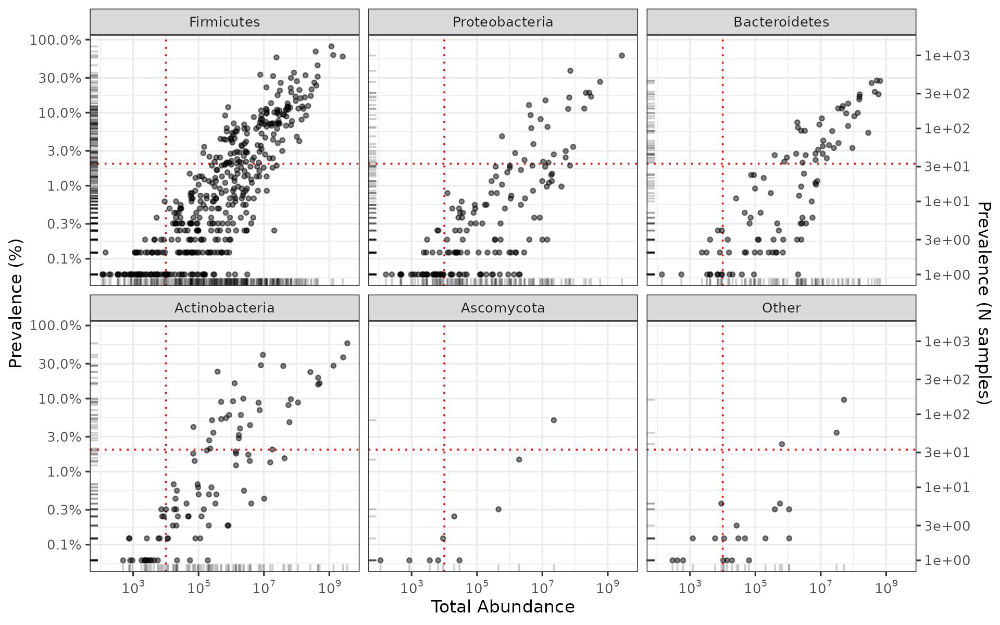

**How to pick a threshold?**

Depends on what analysis method you are filtering for!

- alpha diversity = DO NOT FILTER
- beta diversity = relevance of threshold depends on your distance
  measure (next topic!)
- differential abundance testing = stringent filtering, prevalence \>5%,
  \>10%? (last topic!)

------------------------------------------------------------------------

#### Dissimilarity measures

What are we doing? Calculating the dissimilarity of two samples’
compositions. We talked about these dissimilarity measures in the
lecture.

- Binary Jaccard - presence-absence only
- Bray-Curtis - abundance weighted
- UniFrac distances (unweighted, weighted, generalised)

To simplify and speed up the analyses, we’re going to take a smaller
part of the dataset. We’ll only look at the 300 infant fecal samples
from 4 days of age.

``` r
shao4 <- shao19 %>% ps_filter(family_role == "child", infant_age == 4)
```

We’re going to filter out rare taxa quite strictly, for similar reasons.
But we won’t overwrite our smaller dataset: we’ll do the filtering per
analysis.

``` r
shao4 %>%
  tax_filter(min_prevalence = 2.5 / 100) %>%
  tax_agg(rank = "genus") %>%
  tax_transform("binary") %>% # converts counts to absence/presence: 0/1
  dist_calc(dist = "jaccard")
```

    ## Proportional min_prevalence given: 0.025 --> min 8/306 samples.

    ## psExtra object - a phyloseq object with extra slots:
    ## 
    ## phyloseq-class experiment-level object
    ## otu_table()   OTU Table:         [ 35 taxa and 306 samples ]
    ## sample_data() Sample Data:       [ 306 samples by 11 sample variables ]
    ## tax_table()   Taxonomy Table:    [ 35 taxa by 5 taxonomic ranks ]
    ## 
    ## otu_get(counts = TRUE)        [ 35 taxa and 306 samples ]
    ## 
    ## psExtra info:
    ## tax_agg = "genus" tax_trans = "binary" 
    ## 
    ## jaccard distance matrix of size 306 
    ## 0.6666667 0.7333333 0.9375 0.8125 0.6428571 ...

So we get our pairwise dissimilarities, in a distance matrix attached as
an extra part on the original phyloseq object, as part of a container
object (a “ps_extra” class object created by microViz, which also stores
info about the aggregation and transformations you performed)

``` r
distances <- shao4 %>%
  tax_filter(min_prevalence = 2.5 / 100, verbose = FALSE) %>%
  tax_agg(rank = "genus") %>%
  tax_transform("binary") %>%
  dist_calc(dist = "jaccard") %>%
  dist_get()
```

You can extract the dissimilarities or distances with dist_get.

``` r
as.matrix(distances)[1:5, 1:5]
```

    ##             B01089_ba_4 B01190_ba_4 B01194_ba_4 B01196_ba_4 B01235_ba_4
    ## B01089_ba_4   0.0000000   0.6666667   0.7333333   0.9375000   0.8125000
    ## B01190_ba_4   0.6666667   0.0000000   0.7500000   0.9166667   0.8461538
    ## B01194_ba_4   0.7333333   0.7500000   0.0000000   0.4615385   0.3076923
    ## B01196_ba_4   0.9375000   0.9166667   0.4615385   0.0000000   0.4615385
    ## B01235_ba_4   0.8125000   0.8461538   0.3076923   0.4615385   0.0000000

The Binary Jaccard dissimilarities range between zero (identical) and
one (no shared genera).

``` r
range(distances)
```

    ## [1] 0 1

------------------------------------------------------------------------

#### Ordination

What can we do with these distances or dissimilarities? We can make an
ordination.

Ordination refers to the process of ordering things (in our case:
samples), so that similar things (samples) are closer to each other, and
dissimilar things (samples) are further away.

##### PCoA

Principal Co-ordinates Analysis is one kind of ordination.

Takes distance matrix and finds new dimensions (a co-ordinate system if
you like). The new dimensions are created with the aim to preserve the
original distances between samples, but to capture the majority of this
distance information in the first few dimensions. We like this because
it makes it easier to visualize the patterns in your data (in 2D or 3D).

There is helpful info about ordination methods including PCoA on the
GUide to STatistical Analysis in Microbial Ecology (GUSTA ME) website.
<https://sites.google.com/site/mb3gustame/dissimilarity-based-methods/principal-coordinates-analysis>
This website covers a lot of topics, we’ll cover PCoA now, and PCA in
the next session. The other topics may be interesting for you to read at
a later date if you’ll work on microbiome analysis.

``` r
shao4 %>%
  tax_filter(min_prevalence = 2.5 / 100, verbose = FALSE) %>%
  tax_agg(rank = "genus") %>%
  dist_calc(dist = "bray") %>%
  ord_calc(method = "PCoA") %>%
  ord_plot(alpha = 0.6, size = 2) +
  theme_classic(12) +
  coord_fixed(0.7)
```


To get a little insight into what has happened here, we can colour each
sample according to its dominant (most abundant) genus.

``` r
shao4 %>%
  tax_filter(min_prevalence = 2.5 / 100, verbose = FALSE) %>%
  ps_calc_dominant(rank = "genus", none = "Mixed", other = "Other") %>%
  tax_agg(rank = "genus") %>%
  dist_calc(dist = "bray") %>%
  ord_calc(method = "PCoA") %>%
  ord_plot(color = "dominant_genus", alpha = 0.6, size = 2) +
  scale_color_brewer(name = "Dominant Genus", palette = "Dark2") +
  theme_classic(12) +
  coord_fixed(0.7)
```


##### Interactive ordination!

`microViz` provides a Shiny app `ord_explore` to interactively create
and explore PCoA plots and other ordinations. See the code below to get
started. But read the instructions first.

**Here are a few things to try:**

- Colour the samples using the variables in the sample data
- Select a few samples to view their composition on barplots!
- Change some ordination options:
  - Different rank of taxonomic aggregation
  - Different distances we’ve discussed
- Copy the automatically generated code
  - Exit the app (press escape or click red button in R console!)
  - Paste and run the code to recreate the ordination plot
  - Customise the plot: change colour scheme, title, etc.
- Launch the app again with a different subset of the data
  - Practice using `ps_filter` etc.
  - e.g. plot the data of the mothers’ gut microbiomes!
  - compute one or more alpha diversity measures

**Beware:**

- UniFrac distances can be quite slow (over a minute) to calculate!
  - Filter to fewer samples and fewer taxa to speed it up (Before
    launching the app)
- There are many distances available, feel free to try out ones we
  haven’t talked about
  - BUT:
    - You shouldn’t use a distance that you don’t understand in your
      actual work, even if the plot looks nice! ;)
    - Some of them might not work…
      - They are mostly implemented in the package `vegan` and I haven’t
        tested them all
      - Errors will appear in the RStudio R console
      - You can report to me any distances that don’t work if you’re
        feeling helpful!
- There are other ordination methods available in `ord_explore`, which
  we haven’t discussed
  - We will discuss PCA and various transformations after dinner!
  - Some things we won’t have time to cover, but you can look here for
    info on topics like constrained ordination –\> TODO: insert gusta me
    ecology website link

``` r
# fire up the shiny app
# run these lines in your console (don't keep in script/notebook)
shao4 %>%
  tax_filter(min_prevalence = 2.5 / 100, verbose = FALSE) %>%
  # calculate new sample variables with dominant taxon (optional)
  ps_calc_dominant(rank = "genus", none = "Mixed", other = "Other") %>%
  # launch a Shiny app in your web browser!
  ord_explore()
```

``` r
# different options
# run this line in your console
shao19 %>%
  ps_filter(family_role == "mother") %>%
  tax_filter(min_prevalence = 2.5 / 100, verbose = FALSE) %>%
  # calculate a few sample variables for interest (optional)
  ps_calc_dominant(rank = "genus", none = "Mixed", other = "Other") %>%
  ps_calc_diversity(rank = "genus", index = "shannon") %>%
  ps_calc_richness(rank = "genus", index = "observed") %>%
  # launch a Shiny app in your web browser!
  ord_explore()
```

------------------------------------------------------------------------

#### PERMANOVA

Permutational multivariate analysis of variance.

- ANOVA - analysis of variance (statistical modelling approach)
- Multivariate - more than one dependent variable (multiple taxa!)
- Permutational - statistical significance estimates obtained by
  shuffling the data many times

For more details. See this excellent book chapter by Marti Anderson on
PERMANOVA:
<https://onlinelibrary.wiley.com/doi/full/10.1002/9781118445112.stat07841>

Sometimes also called NP-MANOVA (non-parametric MANOVA) e.g. on the
GUide to STatistical Analysis in Microbial Ecology
[website.](https://sites.google.com/site/mb3gustame/hypothesis-tests/manova/npmanova)

**TLDR:** Are those groups on the PCoA actually different??

``` r
shao4 %>%
  tax_filter(min_prevalence = 2.5 / 100, verbose = FALSE) %>%
  tax_agg(rank = "genus") %>%
  dist_calc(dist = "bray") %>%
  ord_calc(method = "PCoA") %>%
  ord_plot(alpha = 0.6, size = 2, color = "birth_mode") +
  theme_classic(12) +
  coord_fixed(0.7) +
  stat_ellipse(aes(color = birth_mode)) +
  scale_color_brewer(palette = "Set1")
```

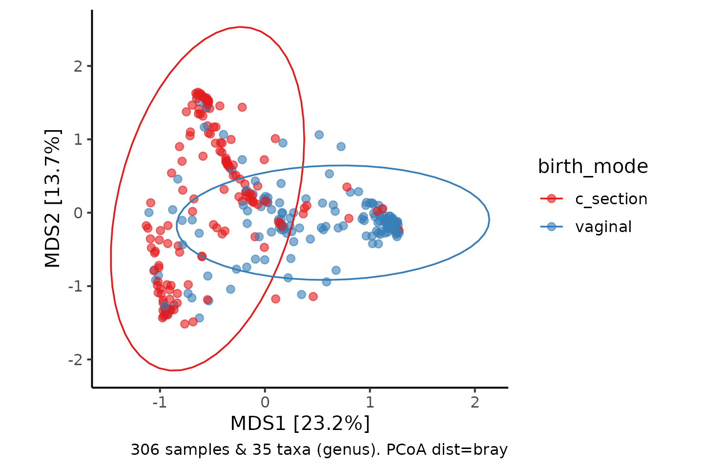

``` r
shao4 %>%
  tax_filter(min_prevalence = 2.5 / 100, verbose = FALSE) %>%
  tax_agg(rank = "genus") %>%
  dist_calc(dist = "bray") %>%
  dist_permanova(variables = "birth_mode", n_perms = 99, seed = 123) %>%
  perm_get()
```

    ## 2026-02-17 09:20:21.436197 - Starting PERMANOVA with 99 perms with 1 processes

    ## 2026-02-17 09:20:21.514686 - Finished PERMANOVA

    ## Permutation test for adonis under reduced model
    ## Marginal effects of terms
    ## Permutation: free
    ## Number of permutations: 99
    ## 
    ## vegan::adonis2(formula = formula, data = metadata, permutations = n_perms, by = by, parallel = parall)
    ##             Df SumOfSqs      R2      F Pr(>F)   
    ## birth_mode   1   13.790 0.12366 42.898   0.01 **
    ## Residual   304   97.727 0.87634                 
    ## Total      305  111.518 1.00000                 
    ## ---
    ## Signif. codes:  0 '***' 0.001 '**' 0.01 '*' 0.05 '.' 0.1 ' ' 1

``` r
# Use more permutations for a more reliable p.value in your real work (slower)
# Set a random seed number for reproducibility of this stochastic method
```

You can see from the model output that the p value, Pr(\>F) is below
0.05. So there is good statistical evidence that the bacterial gut
microbiota composition of c-section delivered infants has a different
composition than vaginally delivered infants at 4 days of age.

You should also report that you used Bray-Curtis dissimilarities,
calculated on genera. (after keeping only unique taxa with a prevalence
of at least 2.5%!)

It’s probably a good idea to decide on a couple of appropriate distance
measures up front for these tests, and report both (at least in
supplementary material), as the choice of distance measure can affect
results and conclusions!

You can also adjust for covariates in PERMANOVA, and often should,
depending on your study design. Let’s fit a more complex model,
adjusting for infant sex, birth weight, and the total number of assigned
reads.

``` r
shao4 %>%
  tax_filter(min_prevalence = 2.5 / 100, verbose = FALSE) %>%
  tax_agg(rank = "genus") %>%
  dist_calc(dist = "bray") %>%
  dist_permanova(
    variables = c("birth_mode", "sex", "birth_weight", "number_reads"),
    n_perms = 99, seed = 111
  ) %>%
  perm_get()
```

    ## Dropping samples with missings: 15

    ## 2026-02-17 09:20:21.780336 - Starting PERMANOVA with 99 perms with 1 processes

    ## 2026-02-17 09:20:22.499578 - Finished PERMANOVA

    ## Permutation test for adonis under reduced model
    ## Marginal effects of terms
    ## Permutation: free
    ## Number of permutations: 99
    ## 
    ## vegan::adonis2(formula = formula, data = metadata, permutations = n_perms, by = by, parallel = parall)
    ##               Df SumOfSqs      R2       F Pr(>F)   
    ## birth_mode     1   10.794 0.10163 34.8045   0.01 **
    ## sex            1    0.280 0.00264  0.9031   0.43   
    ## birth_weight   1    0.565 0.00532  1.8215   0.06 . 
    ## number_reads   1    2.873 0.02705  9.2656   0.01 **
    ## Residual     286   88.696 0.83509                  
    ## Total        290  106.211 1.00000                  
    ## ---
    ## Signif. codes:  0 '***' 0.001 '**' 0.01 '*' 0.05 '.' 0.1 ' ' 1

``` r
# Use more permutations for a more reliable p.value in your real work (slower)
# Set a random seed number for reproducibility of this stochastic method
```

------------------------------------------------------------------------

## 3: Transformations, PCA & DA

This section will introduce you to: the Euclidean distance; log and CLR
transformations; heatmaps for microbiome abundance data; Principal
Components Analysis (PCA); and Differential Abundance (DA) testing
methods.

------------------------------------------------------------------------

### Euclidean distances

What about Euclidean distances? What are those?

Euclidean distances are essentially a generalization of Pythagoras’
theorem to more dimensions. In our data every taxon is a feature, a
dimension, on which we calculate Euclidean distances.

- Pythagoras: $c = \sqrt{a^{2} + b^{2}}$

- Euclidean distance:

$$d(p,q) = \sqrt{\sum\limits_{i = 1}^{n_{taxa}}\left( p_{i} - q_{i} \right)^{2}}$$

**Issues**

- Sensitive to sparsity (double-zero problem) –\> filter rare taxa
- Excessive emphasis on high-abundance taxa –\> transform features first
- The PCoA looks weird! most samples bunched in the middle with spindly
  projections..

``` r
shao4 %>%
  tax_filter(min_prevalence = 2.5 / 100, verbose = FALSE) %>%
  tax_agg(rank = "genus") %>%
  dist_calc(dist = "euclidean") %>%
  ord_calc(method = "PCoA") %>%
  ord_plot(alpha = 0.6, size = 2) +
  theme_classic(12) +
  coord_fixed(0.7) +
  geom_rug(alpha = 0.1)
```


------------------------------------------------------------------------

### Abundance transformation

We already did two transformations with
[`tax_transform()`](https://david-barnett.github.io/microViz/reference/tax_transform.md):
binary (for Binary Jaccard distances) and compositional (for barplots).

Now we need log transformations, and the centered-log-ratio, CLR,
transformation.

#### Log transformations

First let’s look at the abundance again, this time with heatmaps.

``` r
# Getting the taxa in abundance order up front
# to keep it consistent across multiple plots
shao4_sorted <- shao4 %>%
  tax_sort(by = sum, at = "genus", trans = "compositional", tree_warn = FALSE)
```

Each column is a sample (from an infant), and each row is a taxon.

``` r
shao4_sorted %>%
  tax_transform(trans = "identity", rank = "genus") %>%
  comp_heatmap(
    samples = 1:20, taxa = 1:20, grid_lwd = 2, name = "Counts",
    tax_seriation = "Identity", sample_seriation = "Identity"
  )
```


``` r
shao4_sorted %>%
  tax_transform(trans = "compositional", rank = "genus") %>%
  comp_heatmap(
    samples = 1:20, taxa = 1:20, grid_lwd = 2, name = "Prop.",
    tax_seriation = "Identity", sample_seriation = "Identity"
  )
```

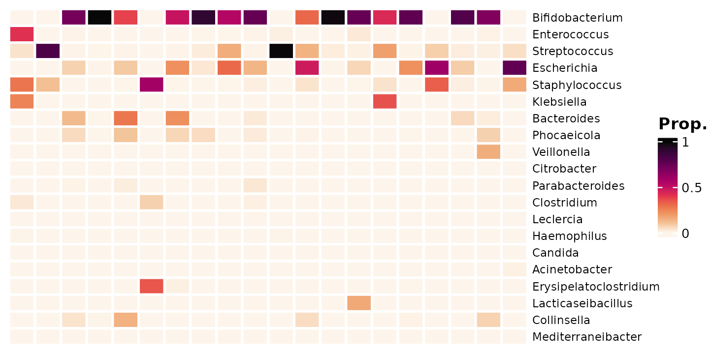

We can add the proportions on this small subset of data as numbers.

``` r
shao4_sorted %>%
  tax_transform(trans = "compositional", rank = "genus") %>%
  comp_heatmap(
    numbers = heat_numbers(fmt = "%.1f"), numbers_use_counts = FALSE,
    samples = 1:20, taxa = 1:20, grid_lwd = 2, name = "Prop.",
    tax_seriation = "Identity", sample_seriation = "Identity"
  )
```

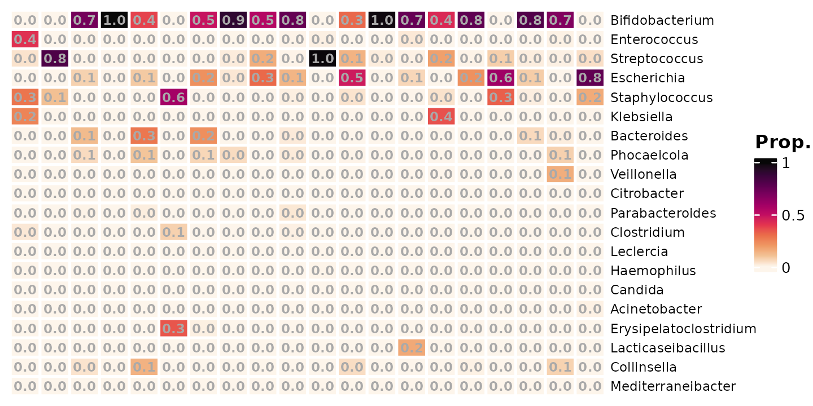

Even though we have picked the top 20 most abundant genera, there are
still a lot of zeros, We need to deal with the zeros, because `log(0)`
is undefined. The solution is to add a small amount to every value (or
just every zero), before applying the log transformation. This small
value is often called a pseudo-count.

What value should we use for the pseudo-count?

One option is to just add 1, and another popular option is to add half
of the smallest observed real value (from across the whole dataset).

``` r
shao4_sorted %>%
  tax_transform(rank = "genus", trans = "log10", zero_replace = 1) %>%
  comp_heatmap(
    samples = 1:20, taxa = 1:20, grid_lwd = 2, name = "log10\n(x+1)",
    tax_seriation = "Identity", sample_seriation = "Identity"
  )
```


``` r
shao4_sorted %>%
  tax_agg(rank = "genus") %>%
  # tax_transform(trans = 'compositional') %>% # compositional also possible
  tax_transform(trans = "log10", zero_replace = "halfmin", chain = TRUE) %>%
  comp_heatmap(
    samples = 1:20, taxa = 1:20, grid_lwd = 2, name = "log10\nhalfmin",
    tax_seriation = "Identity", sample_seriation = "Identity"
  )
```


In general, for zero replacement, keep it simple and **record your
approach**.

#### Centered Log Ratio transformation:

Compositionality problem is improved by the centered-log-ratio
transformation.

The centered log-ratio (clr) transformation uses the geometric mean of
the sample vector as the reference.

``` r
shao4_sorted %>%
  tax_agg(rank = "genus") %>%
  # tax_transform(trans = 'compositional') %>% # compositional also possible
  tax_transform(trans = "clr", zero_replace = "halfmin", chain = TRUE) %>%
  comp_heatmap(
    samples = 1:20, taxa = 1:20, grid_lwd = 2, name = "CLR\nhalfmin",
    colors = heat_palette(sym = TRUE),
    tax_seriation = "Identity", sample_seriation = "Identity"
  )
```

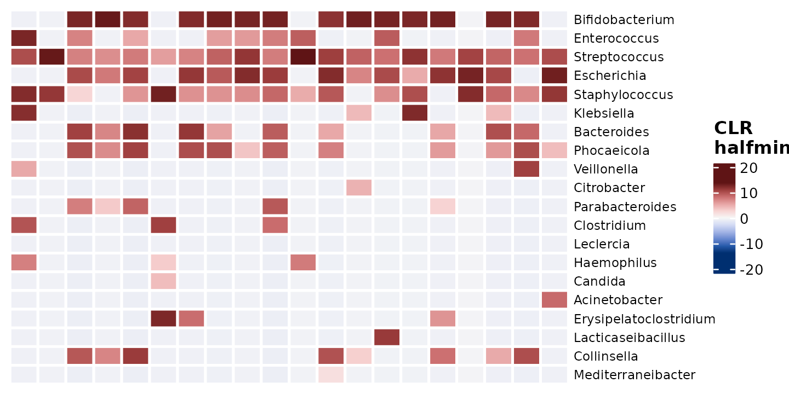

**Overview of CoDa problem.**

The sequencing data gives us relative abundances, not absolute
abundances. The total number of reads sequenced per sample is an
arbitrary total.

If one taxon blooms, whilst everything else stays stable, the relative
abundance of all other taxa must (appear to) go down.

This leads to two main types of problem:

- interpretation caveats: see differential abundance section later
- statistical issues: taxon abundances are not independent, but
  (weakly?) negatively correlated

This is worse with simpler ecosystems. There is the same problem in
theory with RNAseq data, but I suspect it is less bothersome because
there are many more competing “species” of RNA transcript than there are
bacterial species in even a very complex microbiome.

The centered-log-ratio transformation (along with some other similar
ratio transformations) are claimed to help with the statistical issues
by transforming the abundances from the simplex to the real space.

Practically, the CLR transformation involves finding the geometric mean
of each sample, and then dividing abundance of each taxon in that sample
by this geometric mean. Finally you take the natural log of this ratio.

For more details, check out Gloor 2017. [Microbiome Datasets are
Compositional: and this is not
optional](https://doi.org/10.3389/fmicb.2017.02224)

------------------------------------------------------------------------

### Fun with Heatmaps

Heatmaps look much better when you sort the rows by similarity (using
distances and hierarchical clustering!).

More examples/tutorial of visualizing microbiome data using heatmaps can
be found here:

<https://david-barnett.github.io/microViz/articles/web-only/heatmaps.html>

``` r
#
```

------------------------------------------------------------------------

### PCA

Principal Components Analysis.

Quite similar to Principal Co-ordinates Analysis.

In fact, PCA produces equivalent results to PCoA with euclidean
distances. So let’s perform the CLR-transform first and check PCA and
euclidean PCoA are the same.

``` r
shao4 %>%
  tax_filter(min_prevalence = 2.5 / 100, verbose = FALSE) %>%
  tax_transform(rank = "genus", trans = "clr", zero_replace = "halfmin") %>%
  dist_calc(dist = "euclidean") %>%
  ord_calc(method = "PCoA") %>%
  ord_plot(alpha = 0.6, size = 2, color = "birth_mode") +
  theme_classic(12) +
  coord_fixed(0.7) +
  scale_y_reverse()
```


``` r
shao4 %>%
  tax_filter(min_prevalence = 2.5 / 100, verbose = FALSE) %>%
  tax_transform(rank = "genus", trans = "clr", zero_replace = "halfmin") %>%
  ord_calc(method = "PCA") %>%
  ord_plot(alpha = 0.6, size = 2, color = "birth_mode") +
  theme_classic(12) +
  coord_fixed(0.7)
```


So why is PCA interesting for us? Because the Principal components are
built directly from a (linear) combination of the original features.

That means we know how much each taxon contributes to each PC axis, and
we can plot this information (loadings) as arrows, alongside the sample
points.

``` r
pca <- shao4 %>%
  tax_filter(min_prevalence = 2.5 / 100, verbose = FALSE) %>%
  tax_transform(rank = "genus", trans = "clr", zero_replace = "halfmin") %>%
  ord_calc(method = "PCA") %>%
  ord_plot(
    alpha = 0.6, size = 2, color = "birth_mode",
    plot_taxa = 1:6, tax_vec_length = 0.275,
    tax_lab_style = tax_lab_style(
      type = "text", max_angle = 90, aspect_ratio = 0.7,
      size = 3, fontface = "bold"
    ),
  ) +
  theme_classic(12) +
  coord_fixed(0.7, clip = "off")
pca
```

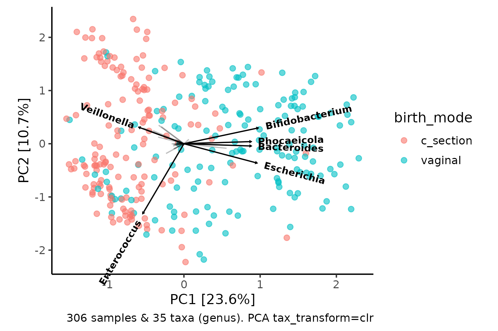

How to interpret the taxa loading vectors? Cautiously.

There are caveats and nuance to the interpretation of these plots, which
are called PCA bi-plots, and you can read more about here:
<https://sites.google.com/site/mb3gustame/indirect-gradient-analysis/pca>

The relative length and direction of an arrow indicates how much that
taxon contributes to the variation on each visible PC axis, e.g.
Variation in Enterococcus contributes quite a lot to variation along the
PC2 axis.

This allows you to infer that samples positioned at the bottom of the
plot will tend to have higher relative abundance of Enterococcus than
samples at the top of the plot.

Interestingly, samples on the right of the plot (which tend to be
vaginally-delivered infants) seem to have relatively more
Bifidobacterium, Bacteroides and Escherichia, whilst the C-section born
infants have relatively more Veillonella.

*(Side note, Phocaeicola were considered part of Bacteroides until this
year!)*

You might have already noticed this pattern, when exploring and making
barplots interactively with `ord_explore` earlier.

#### Iris plot

We can make another kind of barplot now, using the PCA information to
order our samples in a circular layout.

``` r
iris <- shao4 %>%
  tax_filter(min_prevalence = 2.5 / 100, verbose = FALSE) %>%
  tax_transform(rank = "genus", trans = "clr", zero_replace = "halfmin") %>%
  ord_calc(method = "PCA") %>%
  ord_plot_iris(
    tax_level = "genus", n_taxa = 12, other = "Other",
    anno_colour = "birth_mode",
    anno_colour_style = list(alpha = 0.6, size = 0.6, show.legend = FALSE)
  )
```

    ## Warning: Using `size` aesthetic for lines was deprecated in ggplot2 3.4.0.
    ## ℹ Please use `linewidth` instead.
    ## ℹ The deprecated feature was likely used in the microViz package.
    ##   Please report the issue to the authors.
    ## This warning is displayed once per session.
    ## Call `lifecycle::last_lifecycle_warnings()` to see where this warning was
    ## generated.

``` r
iris
```

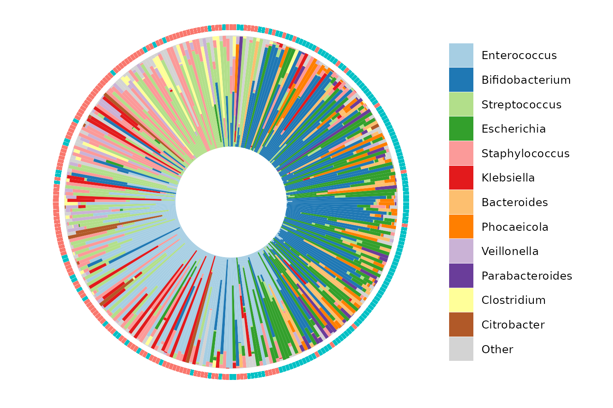

``` r
patchwork::wrap_plots(pca, iris, nrow = 1, guides = "collect")
```

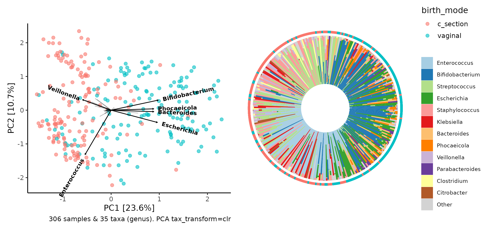

------------------------------------------------------------------------

### Taxon stats

From the PCA loadings and barplots above, we have some strong suspicions
about which taxa have a higher relative abundance in vaginally delivered
infants than in c-section delivered infants, and vice versa, but we can
also statistically test this. This is often called “differential
abundance” (DA) testing, in the style of “differential expression” (DE)
testing from the transcriptomics field.

``` r
shao4 %>%
  comp_barplot(
    tax_level = "genus", n_taxa = 12, facet_by = "birth_mode",
    label = NULL, bar_outline_colour = NA
  ) +
  coord_flip() +
  theme(axis.ticks.y = element_blank())
```


#### Model one taxon

We will start by creating a linear regression model for one genus,
Bacteroides. We will transform the count data by first making it
proportions, and then taking the binary logarithm, log2, after adding a
pseudocount.

``` r
bacteroidesRegression1 <- shao4 %>%
  tax_transform("compositional", rank = "genus") %>%
  tax_model(
    type = "lm", rank = "genus",
    trans = "log2", trans_args = list(zero_replace = "halfmin"),
    taxa = "Bacteroides", variables = "birth_mode",
    return_psx = FALSE
  ) %>%
  pluck(1)
```

    ## Modelling: Bacteroides

``` r
# looking at the regression results
summary(bacteroidesRegression1)
```

    ## 
    ## Call:
    ## Bacteroides ~ birth_mode
    ## 
    ## Residuals:
    ##     Min      1Q  Median      3Q     Max 
    ## -7.7492 -0.6172 -0.6172  2.6421 18.0804 
    ## 
    ## Coefficients:
    ##                   Estimate Std. Error t value Pr(>|t|)    
    ## (Intercept)       -19.3756     0.4863  -39.84   <2e-16 ***
    ## birth_modevaginal   7.1320     0.6812   10.47   <2e-16 ***
    ## ---
    ## Signif. codes:  0 '***' 0.001 '**' 0.01 '*' 0.05 '.' 0.1 ' ' 1
    ## 
    ## Residual standard error: 5.957 on 304 degrees of freedom
    ## Multiple R-squared:  0.265,  Adjusted R-squared:  0.2626 
    ## F-statistic: 109.6 on 1 and 304 DF,  p-value: < 2.2e-16

``` r
confint(bacteroidesRegression1)
```

    ##                        2.5 %     97.5 %
    ## (Intercept)       -20.332614 -18.418542
    ## birth_modevaginal   5.791662   8.472414

``` r
broom::tidy(bacteroidesRegression1, conf.int = TRUE)
```

    ## # A tibble: 2 × 7
    ##   term              estimate std.error statistic   p.value conf.low conf.high
    ##   <chr>                <dbl>     <dbl>     <dbl>     <dbl>    <dbl>     <dbl>
    ## 1 (Intercept)         -19.4      0.486     -39.8 1.08e-122   -20.3     -18.4 
    ## 2 birth_modevaginal     7.13     0.681      10.5 4.13e- 22     5.79      8.47

**Click here for optional `ggplot2` extension exercise:**

Starting from a dataframe like the one produced by the code below, plot:

1.  Easy: The percentage prevalence of Bacteroides in each birth_mode
    group
2.  Medium: The distribution of relative abundance of Bacteroides in
    each birth_mode group, omitting zeros, on a log2 scale
3.  Hard: Do task 1 or 2 for for several taxa in one plot - (hint:
    `pivot_longer`)

``` r
shao4 %>%
  tax_transform("compositional", rank = "genus") %>%
  ps_get() %>%
  ps_otu2samdat(taxa = "Bacteroides") %>%
  samdat_tbl()
```

We can fit a model with covariates, as we did for PERMANOVA. We are
going to convert the categorical variables into indicator (dummy)
variables, and scale the continuous covariates to 0 mean and SD 1
(z-scores). You’ll see this will make our subsequent plots easier to
interpret later.

``` r
shao4 <- shao4 %>%
  ps_mutate(
    C_section = if_else(birth_mode == "c_section", true = 1, false = 0),
    Female = if_else(sex == "female", true = 1, false = 0),
    Birth_weight_Z = scale(birth_weight, center = TRUE, scale = TRUE),
    Reads_Z = scale(number_reads, center = TRUE, scale = TRUE)
  )
```

``` r
bacteroidesRegression2 <- shao4 %>%
  tax_transform("compositional", rank = "genus") %>%
  tax_model(
    type = "lm", rank = "genus", taxa = "Bacteroides",
    trans = "log2", trans_args = list(zero_replace = "halfmin"),
    variables = c("C_section", "Female", "Birth_weight_Z", "Reads_Z"),
    return_psx = FALSE
  ) %>%
  pluck(1)
```

    ## Warning in do.call(fun, list(txt)): 15 / 306 values are NA in Female

    ## Warning in do.call(fun, list(txt)): 14 / 306 values are NA in Birth_weight_Z

    ## Modelling: Bacteroides

``` r
# looking at the regression results
summary(bacteroidesRegression2)
```

    ## 
    ## Call:
    ## Bacteroides ~ C_section + Female + Birth_weight_Z + Reads_Z
    ## 
    ## Residuals:
    ##     Min      1Q  Median      3Q     Max 
    ## -9.4271 -2.1555 -0.4115  2.8176 18.1784 
    ## 
    ## Coefficients:
    ##                Estimate Std. Error t value Pr(>|t|)    
    ## (Intercept)    -11.7942     0.6103 -19.325   <2e-16 ***
    ## C_section       -7.5696     0.7206 -10.505   <2e-16 ***
    ## Female          -0.3809     0.7101  -0.536    0.592    
    ## Birth_weight_Z   0.3277     0.3514   0.932    0.352    
    ## Reads_Z          0.5361     0.3620   1.481    0.140    
    ## ---
    ## Signif. codes:  0 '***' 0.001 '**' 0.01 '*' 0.05 '.' 0.1 ' ' 1
    ## 
    ## Residual standard error: 5.934 on 286 degrees of freedom
    ##   (15 observations deleted due to missingness)
    ## Multiple R-squared:  0.2854, Adjusted R-squared:  0.2754 
    ## F-statistic: 28.55 on 4 and 286 DF,  p-value: < 2.2e-16

``` r
broom::tidy(bacteroidesRegression2, conf.int = TRUE)
```

    ## # A tibble: 5 × 7
    ##   term           estimate std.error statistic  p.value conf.low conf.high
    ##   <chr>             <dbl>     <dbl>     <dbl>    <dbl>    <dbl>     <dbl>
    ## 1 (Intercept)     -11.8       0.610   -19.3   8.15e-54  -13.0      -10.6 
    ## 2 C_section        -7.57      0.721   -10.5   4.81e-22   -8.99      -6.15
    ## 3 Female           -0.381     0.710    -0.536 5.92e- 1   -1.78       1.02
    ## 4 Birth_weight_Z    0.328     0.351     0.932 3.52e- 1   -0.364      1.02
    ## 5 Reads_Z           0.536     0.362     1.48  1.40e- 1   -0.176      1.25

##### Many DA methods

This method is what MaAsLin2 does by default (except they call the
compositional transformation “Total Sum Scaling (TSS)”). This is quite a
straightforward method, so we will stick with this for today, but many
statistical methods have been developed for differential abundance
analyses.

Microbiome abundance data are quite awkward, statistically speaking, due
to their sparseness and compositionality. Each successive method claims
to handle some aspect of this awkwardness “better” than previous
methods.

The aim is to have a method with adequate power to detect true
associations, whilst controlling the type 1 error rate, the “false
positive” reporting of associations that are not “truly” present.

Results are surprisingly inconsistent across the different methods, as
demonstrated this year in a [fascinating analysis by Jacob Nearing and
colleagues](https://www.nature.com/articles/s41467-022-28034-z).

**What to do?**

- Filter out the noise & interpret results with caution! use multiple
  testing corrections
- Remember it’s all relative (abundance)
- Try multiple methods and/or use same method as previous study if
  replicating
  - Avoid Lefse and edgeR?
  - Beware: Not all methods allow covariate adjustment & few allow
    random effects (for time-series)

#### Model all the taxa!

We’re not normally interested in just one taxon! And often it’s also
hard to decide which taxonomic rank we are most interested in modelling!

*Lower ranks like species or ASVs give better resolution but also more
sparsity and classification uncertainty…* *Higher ranks e.g. classes,
could also be more powerful if you think most taxa within that class
will follow a similar pattern.*

So now we will fit a similar model for almost\* every taxon at every
rank we have available, from phylum down to species.

\*We’ll actually filter out species with a prevalence of less than 10%.

``` r
# The code for `taxatree_models` is quite similar to tax_model.
# However, you might need to run `tax_prepend_ranks` to ensure that each taxon at each rank is always unique.
shaoModels <- shao4 %>%
  tax_prepend_ranks() %>%
  tax_transform("compositional", rank = "species", keep_counts = TRUE) %>%
  tax_filter(min_prevalence = 0.1, undetected = 0, use_counts = TRUE) %>%
  taxatree_models(
    type = lm, trans = "log2", trans_args = list(zero_replace = "halfmin"),
    ranks = c("phylum", "class", "order", "family", "genus", "species"),
    variables = c("C_section", "Female", "Birth_weight_Z", "Reads_Z")
  )
```

    ## Proportional min_prevalence given: 0.1 --> min 31/306 samples.

    ## 2026-02-17 09:20:43.032768 - modelling at rank: phylum

    ## Warning in do.call(fun, list(txt)): 15 / 306 values are NA in Female

    ## Warning in do.call(fun, list(txt)): 14 / 306 values are NA in Birth_weight_Z

    ## 2026-02-17 09:20:43.1773 - modelling at rank: class

    ## Warning in do.call(fun, list(txt)): 15 / 306 values are NA in Female
    ## Warning in do.call(fun, list(txt)): 14 / 306 values are NA in Birth_weight_Z

    ## 2026-02-17 09:20:43.372981 - modelling at rank: order

    ## Warning in do.call(fun, list(txt)): 15 / 306 values are NA in Female
    ## Warning in do.call(fun, list(txt)): 14 / 306 values are NA in Birth_weight_Z

    ## 2026-02-17 09:20:43.632994 - modelling at rank: family

    ## Warning in do.call(fun, list(txt)): 15 / 306 values are NA in Female
    ## Warning in do.call(fun, list(txt)): 14 / 306 values are NA in Birth_weight_Z

    ## 2026-02-17 09:20:43.932335 - modelling at rank: genus

    ## Warning in do.call(fun, list(txt)): 15 / 306 values are NA in Female
    ## Warning in do.call(fun, list(txt)): 14 / 306 values are NA in Birth_weight_Z

    ## 2026-02-17 09:20:44.293511 - modelling at rank: species

    ## Warning in do.call(fun, list(txt)): 15 / 306 values are NA in Female
    ## Warning in do.call(fun, list(txt)): 14 / 306 values are NA in Birth_weight_Z

``` r
shaoModels
```

    ## psExtra object - a phyloseq object with extra slots:
    ## 
    ## phyloseq-class experiment-level object
    ## otu_table()   OTU Table:         [ 39 taxa and 306 samples ]
    ## sample_data() Sample Data:       [ 306 samples by 15 sample variables ]
    ## tax_table()   Taxonomy Table:    [ 39 taxa by 6 taxonomic ranks ]
    ## 
    ## otu_get(counts = TRUE)        [ 39 taxa and 306 samples ]
    ## 
    ## psExtra info:
    ## tax_agg = "species" tax_trans = "compositional" 
    ## 
    ## taxatree_models list:
    ## Ranks: phylum/class/order/family/genus/species

*Why filter the taxa? It’s less likely that we are interested in rare
taxa, and models of rare taxon abundances are more likely to be
unreliable. Reducing the the number of taxa modelled also makes the
process faster and makes visualizing the results easier!*

##### Getting stats from the models

Next we will get a data.frame containing the regression coefficient
estimates, test statistics and corresponding p values from all these
regression models.

``` r
shaoStats <- taxatree_models2stats(shaoModels)
shaoStats
```

    ## psExtra object - a phyloseq object with extra slots:
    ## 
    ## phyloseq-class experiment-level object
    ## otu_table()   OTU Table:         [ 39 taxa and 306 samples ]
    ## sample_data() Sample Data:       [ 306 samples by 15 sample variables ]
    ## tax_table()   Taxonomy Table:    [ 39 taxa by 6 taxonomic ranks ]
    ## 
    ## otu_get(counts = TRUE)        [ 39 taxa and 306 samples ]
    ## 
    ## psExtra info:
    ## tax_agg = "species" tax_trans = "compositional" 
    ## 
    ## taxatree_stats dataframe:
    ## 89 taxa at 6 ranks: phylum, class, order, family, genus, species 
    ## 4 terms: C_section, Female, Birth_weight_Z, Reads_Z

``` r
shaoStats %>% taxatree_stats_get()
```

    ## # A tibble: 356 × 8
    ##    term           taxon      rank  formula estimate std.error statistic  p.value
    ##    <fct>          <chr>      <fct> <chr>      <dbl>     <dbl>     <dbl>    <dbl>
    ##  1 C_section      p: Proteo… phyl… `p: Pr…  -3.72       0.812   -4.58   7.01e- 6
    ##  2 Female         p: Proteo… phyl… `p: Pr…  -0.0684     0.800   -0.0855 9.32e- 1
    ##  3 Birth_weight_Z p: Proteo… phyl… `p: Pr…  -0.253      0.396   -0.638  5.24e- 1
    ##  4 Reads_Z        p: Proteo… phyl… `p: Pr…  -0.369      0.408   -0.905  3.66e- 1
    ##  5 C_section      p: Actino… phyl… `p: Ac…  -4.25       0.739   -5.75   2.25e- 8
    ##  6 Female         p: Actino… phyl… `p: Ac…  -0.439      0.728   -0.603  5.47e- 1
    ##  7 Birth_weight_Z p: Actino… phyl… `p: Ac…   0.293      0.361    0.813  4.17e- 1
    ##  8 Reads_Z        p: Actino… phyl… `p: Ac…  -0.876      0.371   -2.36   1.90e- 2
    ##  9 C_section      p: Firmic… phyl… `p: Fi…   2.43       0.342    7.12   8.74e-12
    ## 10 Female         p: Firmic… phyl… `p: Fi…   0.697      0.337    2.07   3.95e- 2
    ## # ℹ 346 more rows

##### Adjusting p values

As we have performed a lot of statistical tests here, it is quite
possible that could we find some significant p-values by chance alone.

So we should correct for multiple testing / control the false discovery
rate or family-wise error rate.

Instead of applying these adjustment methods across all 86 taxa models
at all ranks, the default behaviour is to control the family-wise error
rate per taxonomic rank.

``` r
shaoStats <- shaoStats %>% taxatree_stats_p_adjust(method = "BH", grouping = "rank")
# notice the new variable
shaoStats %>% taxatree_stats_get()
```

    ## # A tibble: 356 × 9
    ## # Groups:   rank [6]
    ##    term  taxon rank  formula estimate std.error statistic  p.value p.adj.BH.rank
    ##    <fct> <chr> <fct> <chr>      <dbl>     <dbl>     <dbl>    <dbl>         <dbl>
    ##  1 C_se… p: P… phyl… `p: Pr…  -3.72       0.812   -4.58   7.01e- 6      2.81e- 5
    ##  2 Fema… p: P… phyl… `p: Pr…  -0.0684     0.800   -0.0855 9.32e- 1      9.32e- 1
    ##  3 Birt… p: P… phyl… `p: Pr…  -0.253      0.396   -0.638  5.24e- 1      6.45e- 1
    ##  4 Read… p: P… phyl… `p: Pr…  -0.369      0.408   -0.905  3.66e- 1      6.39e- 1
    ##  5 C_se… p: A… phyl… `p: Ac…  -4.25       0.739   -5.75   2.25e- 8      1.20e- 7
    ##  6 Fema… p: A… phyl… `p: Ac…  -0.439      0.728   -0.603  5.47e- 1      6.45e- 1
    ##  7 Birt… p: A… phyl… `p: Ac…   0.293      0.361    0.813  4.17e- 1      6.39e- 1
    ##  8 Read… p: A… phyl… `p: Ac…  -0.876      0.371   -2.36   1.90e- 2      5.07e- 2
    ##  9 C_se… p: F… phyl… `p: Fi…   2.43       0.342    7.12   8.74e-12      6.99e-11
    ## 10 Fema… p: F… phyl… `p: Fi…   0.697      0.337    2.07   3.95e- 2      9.03e- 2
    ## # ℹ 346 more rows

#### Plot all the taxatree_stats!

[`taxatree_plots()`](https://david-barnett.github.io/microViz/reference/taxatree_plots.md)
allows you to plot statistics (e.g. point estimates and significance)
from all of the taxa models onto a tree layout. The taxon models are
organised by rank, radiating out from the central root node from e.g.
Phyla around the center to Species in the outermost ring.

[`taxatree_plots()`](https://david-barnett.github.io/microViz/reference/taxatree_plots.md)
itself returns a list of plots, which you can arrange into one figure
with the [`patchwork`](https://patchwork.data-imaginist.com/) package
for example (and/or
[`cowplot`](https://wilkelab.org/cowplot/articles/plot_grid.html)).

``` r
shaoStats %>%
  taxatree_plots(node_size_range = c(1, 3), sig_stat = "p.adj.BH.rank") %>%
  patchwork::wrap_plots(ncol = 2, guides = "collect")
```

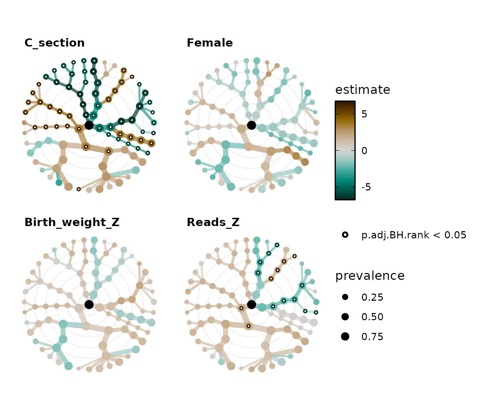

##### Taxatree Key

But how do we know which taxa are which nodes? We can create a labelled
grey tree with
[`taxatree_plotkey()`](https://david-barnett.github.io/microViz/reference/taxatree_plotkey.md).
This labels only some of the taxa based on certain conditions that we
specify.

``` r
set.seed(123) # label position
key <- shaoStats %>%
  taxatree_plotkey(
    taxon_renamer = function(x) stringr::str_remove(x, "[pfg]: "),
    # conditions below, for filtering taxa to be labelled
    rank == "phylum" | rank == "genus" & prevalence > 0.2
    # all phyla are labelled, and all genera with a prevalence of over 0.2
  )
key
```

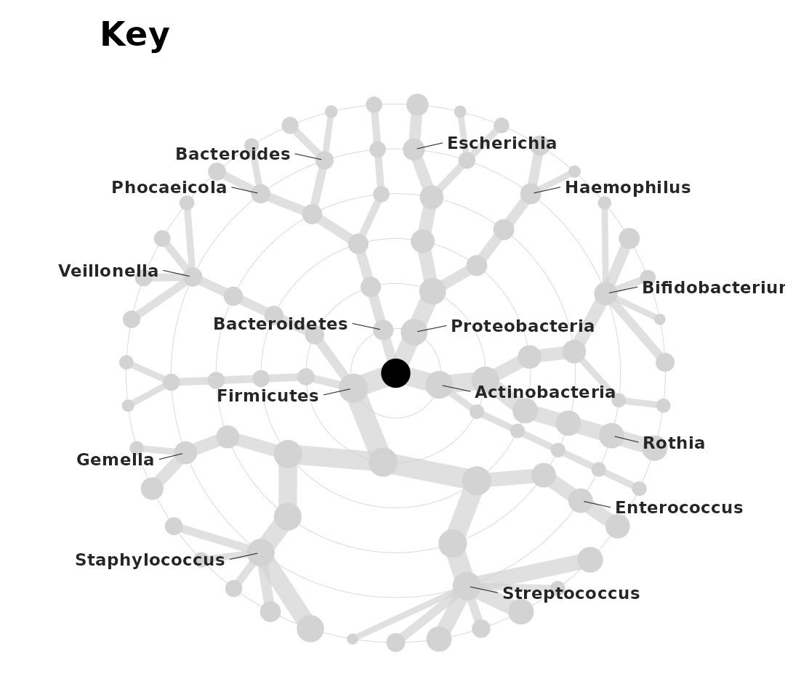

You can do more with these trees to customise them to your liking. See
an extended tutorial [here on the microViz
website](https://david-barnett.github.io/microViz/articles/web-only/modelling-taxa.html#plot-all-the-taxatree_stats):
including how to directly label taxa on the colored plots, change the
layout and style of the trees, and even how to use a different
regression modelling approach.

``` r
# try it out!
```

------------------------------------------------------------------------

## Session info

`session_info` records your package versions etc. This is useful for
debugging / reproducing analysis.

``` r
devtools::session_info()
```

    ## ─ Session info ───────────────────────────────────────────────────────────────
    ##  setting  value
    ##  version  R version 4.5.2 (2025-10-31)
    ##  os       Ubuntu 24.04.3 LTS
    ##  system   x86_64, linux-gnu
    ##  ui       X11
    ##  language en
    ##  collate  C.UTF-8
    ##  ctype    C.UTF-8
    ##  tz       UTC
    ##  date     2026-02-17
    ##  pandoc   3.1.11 @ /opt/hostedtoolcache/pandoc/3.1.11/x64/ (via rmarkdown)
    ##  quarto   NA
    ## 
    ## ─ Packages ───────────────────────────────────────────────────────────────────
    ##  package        * version  date (UTC) lib source
    ##  ade4             1.7-23   2025-02-14 [1] RSPM
    ##  ape              5.8-1    2024-12-16 [1] RSPM
    ##  backports        1.5.0    2024-05-23 [1] RSPM
    ##  Biobase          2.70.0   2025-10-29 [1] Bioconduc~
    ##  BiocGenerics     0.56.0   2025-10-29 [1] Bioconduc~
    ##  biomformat       1.38.0   2025-10-29 [1] Bioconduc~
    ##  Biostrings       2.78.0   2025-10-29 [1] Bioconduc~
    ##  broom            1.0.12   2026-01-27 [1] RSPM
    ##  bslib            0.10.0   2026-01-26 [1] RSPM
    ##  ca               0.71.1   2020-01-24 [1] RSPM
    ##  cachem           1.1.0    2024-05-16 [1] RSPM
    ##  circlize         0.4.17   2025-12-08 [1] RSPM
    ##  cli              3.6.5    2025-04-23 [1] RSPM
    ##  clue             0.3-66   2024-11-13 [1] RSPM
    ##  cluster          2.1.8.1  2025-03-12 [3] CRAN (R 4.5.2)
    ##  codetools        0.2-20   2024-03-31 [3] CRAN (R 4.5.2)
    ##  colorspace       2.1-2    2025-09-22 [1] RSPM
    ##  ComplexHeatmap   2.26.1   2026-02-03 [1] Bioconduc~
    ##  corncob          0.4.2    2025-03-29 [1] RSPM
    ##  crayon           1.5.3    2024-06-20 [1] RSPM
    ##  data.table       1.18.2.1 2026-01-27 [1] RSPM
    ##  desc             1.4.3    2023-12-10 [1] RSPM
    ##  devtools         2.4.6    2025-10-03 [1] RSPM
    ##  digest           0.6.39   2025-11-19 [1] RSPM
    ##  doParallel       1.0.17   2022-02-07 [1] RSPM
    ##  dplyr          * 1.2.0    2026-02-03 [1] RSPM
    ##  ellipsis         0.3.2    2021-04-29 [1] RSPM
    ##  evaluate         1.0.5    2025-08-27 [1] RSPM
    ##  farver           2.1.2    2024-05-13 [1] RSPM
    ##  fastmap          1.2.0    2024-05-15 [1] RSPM
    ##  forcats          1.0.1    2025-09-25 [1] RSPM
    ##  foreach          1.5.2    2022-02-02 [1] RSPM
    ##  fs               1.6.6    2025-04-12 [1] RSPM
    ##  generics         0.1.4    2025-05-09 [1] RSPM
    ##  GetoptLong       1.1.0    2025-11-28 [1] RSPM
    ##  ggforce          0.5.0    2025-06-18 [1] RSPM
    ##  ggplot2        * 4.0.2    2026-02-03 [1] RSPM
    ##  ggraph           2.2.2    2025-08-24 [1] RSPM
    ##  ggrepel          0.9.6    2024-09-07 [1] RSPM
    ##  GlobalOptions    0.1.3    2025-11-28 [1] RSPM
    ##  glue             1.8.0    2024-09-30 [1] RSPM
    ##  graphlayouts     1.2.2    2025-01-23 [1] RSPM
    ##  gridExtra        2.3      2017-09-09 [1] RSPM
    ##  gtable           0.3.6    2024-10-25 [1] RSPM
    ##  htmltools        0.5.9    2025-12-04 [1] RSPM
    ##  htmlwidgets      1.6.4    2023-12-06 [1] RSPM
    ##  httpuv           1.6.16   2025-04-16 [1] RSPM
    ##  igraph           2.2.2    2026-02-12 [1] RSPM
    ##  IRanges          2.44.0   2025-10-29 [1] Bioconduc~
    ##  iterators        1.0.14   2022-02-05 [1] RSPM
    ##  jquerylib        0.1.4    2021-04-26 [1] RSPM
    ##  jsonlite         2.0.0    2025-03-27 [1] RSPM
    ##  knitr            1.51     2025-12-20 [1] RSPM
    ##  labeling         0.4.3    2023-08-29 [1] RSPM
    ##  later            1.4.6    2026-02-13 [1] RSPM
    ##  lattice          0.22-7   2025-04-02 [3] CRAN (R 4.5.2)
    ##  lifecycle        1.0.5    2026-01-08 [1] RSPM
    ##  magrittr         2.0.4    2025-09-12 [1] RSPM
    ##  MASS             7.3-65   2025-02-28 [3] CRAN (R 4.5.2)
    ##  Matrix           1.7-4    2025-08-28 [3] CRAN (R 4.5.2)
    ##  matrixStats      1.5.0    2025-01-07 [1] RSPM
    ##  memoise          2.0.1    2021-11-26 [1] RSPM
    ##  mgcv             1.9-3    2025-04-04 [3] CRAN (R 4.5.2)
    ##  microbiome       1.32.0   2025-10-29 [1] Bioconduc~
    ##  microViz       * 0.13.0   2026-02-17 [1] local
    ##  mime             0.13     2025-03-17 [1] RSPM
    ##  multtest         2.66.0   2025-10-29 [1] Bioconduc~
    ##  nlme             3.1-168  2025-03-31 [3] CRAN (R 4.5.2)
    ##  otel             0.2.0    2025-08-29 [1] RSPM
    ##  patchwork        1.3.2    2025-08-25 [1] RSPM
    ##  permute          0.9-10   2026-02-06 [1] RSPM
    ##  phyloseq       * 1.54.0   2025-10-29 [1] Bioconduc~
    ##  pillar           1.11.1   2025-09-17 [1] RSPM
    ##  pkgbuild         1.4.8    2025-05-26 [1] RSPM
    ##  pkgconfig        2.0.3    2019-09-22 [1] RSPM
    ##  pkgdown          2.2.0    2025-11-06 [1] RSPM
    ##  pkgload          1.5.0    2026-02-03 [1] RSPM
    ##  plyr             1.8.9    2023-10-02 [1] RSPM
    ##  png              0.1-8    2022-11-29 [1] RSPM
    ##  polyclip         1.10-7   2024-07-23 [1] RSPM
    ##  promises         1.5.0    2025-11-01 [1] RSPM
    ##  purrr          * 1.2.1    2026-01-09 [1] RSPM
    ##  R6               2.6.1    2025-02-15 [1] RSPM
    ##  ragg             1.5.0    2025-09-02 [1] RSPM
    ##  RColorBrewer     1.1-3    2022-04-03 [1] RSPM
    ##  Rcpp             1.1.1    2026-01-10 [1] RSPM
    ##  registry         0.5-1    2019-03-05 [1] RSPM
    ##  remotes          2.5.0    2024-03-17 [1] RSPM
    ##  reshape2         1.4.5    2025-11-12 [1] RSPM
    ##  rhdf5            2.54.1   2025-12-04 [1] Bioconduc~
    ##  rhdf5filters     1.22.0   2025-10-29 [1] Bioconduc~
    ##  Rhdf5lib         1.32.0   2025-10-29 [1] Bioconduc~
    ##  rjson            0.2.23   2024-09-16 [1] RSPM
    ##  rlang            1.1.7    2026-01-09 [1] RSPM
    ##  rmarkdown        2.30     2025-09-28 [1] RSPM
    ##  Rtsne            0.17     2023-12-07 [1] RSPM
    ##  S4Vectors        0.48.0   2025-10-29 [1] Bioconduc~
    ##  S7               0.2.1    2025-11-14 [1] RSPM
    ##  sass             0.4.10   2025-04-11 [1] RSPM
    ##  scales           1.4.0    2025-04-24 [1] RSPM
    ##  Seqinfo          1.0.0    2025-10-29 [1] Bioconduc~
    ##  seriation      * 1.5.8    2025-08-20 [1] RSPM
    ##  sessioninfo      1.2.3    2025-02-05 [1] RSPM
    ##  shape            1.4.6.1  2024-02-23 [1] RSPM
    ##  shiny          * 1.12.1   2025-12-09 [1] RSPM
    ##  stringi          1.8.7    2025-03-27 [1] RSPM
    ##  stringr          1.6.0    2025-11-04 [1] RSPM
    ##  survival         3.8-3    2024-12-17 [3] CRAN (R 4.5.2)
    ##  systemfonts      1.3.1    2025-10-01 [1] RSPM
    ##  textshaping      1.0.4    2025-10-10 [1] RSPM
    ##  tibble           3.3.1    2026-01-11 [1] RSPM
    ##  tidygraph        1.3.1    2024-01-30 [1] RSPM
    ##  tidyr            1.3.2    2025-12-19 [1] RSPM
    ##  tidyselect       1.2.1    2024-03-11 [1] RSPM
    ##  TSP              1.2.6    2025-11-27 [1] RSPM
    ##  tweenr           2.0.3    2024-02-26 [1] RSPM
    ##  usethis          3.2.1    2025-09-06 [1] RSPM
    ##  utf8             1.2.6    2025-06-08 [1] RSPM
    ##  vctrs            0.7.1    2026-01-23 [1] RSPM
    ##  vegan            2.7-2    2025-10-08 [1] RSPM
    ##  viridis          0.6.5    2024-01-29 [1] RSPM
    ##  viridisLite      0.4.3    2026-02-04 [1] RSPM
    ##  withr            3.0.2    2024-10-28 [1] RSPM
    ##  xfun             0.56     2026-01-18 [1] RSPM
    ##  xtable           1.8-4    2019-04-21 [1] RSPM
    ##  XVector          0.50.0   2025-10-29 [1] Bioconduc~
    ##  yaml             2.3.12   2025-12-10 [1] RSPM
    ## 
    ##  [1] /home/runner/work/_temp/Library
    ##  [2] /opt/R/4.5.2/lib/R/site-library
    ##  [3] /opt/R/4.5.2/lib/R/library
    ##  * ── Packages attached to the search path.
    ## 
    ## ──────────────────────────────────────────────────────────────────────────────
