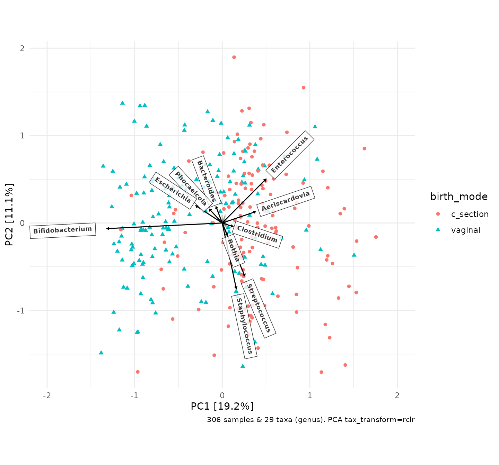

# Example analyses: Shao 2019 data

## Introduction

This article will demonstrate some of the data processing steps,
statistical analyses, and visualisations that can be performed with the
microViz package. It will also provide some tips for how to use microViz
with your own data, and point you to other articles for more details.

``` r
set.seed(1) # for reproducible stochastic processes
library(phyloseq)
library(ggplot2)
library(patchwork) # for combining multiple plots
library(microViz)
#> microViz version 0.13.0 - Copyright (C) 2021-2026 David Barnett
#> ! Website: https://david-barnett.github.io/microViz
#> ✔ Useful?  For citation details, run: `citation("microViz")`
#> ✖ Silence? `suppressPackageStartupMessages(library(microViz))`
```

The data used in this article are derived from faecal samples obtained
from infants and mothers participating in a large birth cohort study.

``` r
shao19
#> phyloseq-class experiment-level object
#> otu_table()   OTU Table:         [ 819 taxa and 1644 samples ]
#> sample_data() Sample Data:       [ 1644 samples by 11 sample variables ]
#> tax_table()   Taxonomy Table:    [ 819 taxa by 6 taxonomic ranks ]
#> phy_tree()    Phylogenetic Tree: [ 819 tips and 818 internal nodes ]
```

``` r
?shao19 # for more details on the dataset
```

**Note:** These human gut microbiota data were generated from shotgun
metagenomic sequencing, but microViz can be (and has been) used with
microbiota data from various other sources, including 16S and ITS marker
gene amplicon sequencing techniques, as well as HITChip profiling.
Environmental and *in vitro* microbiota datasets are all also welcome in
microViz, not just human gut bugs.

If you can put your data in a phyloseq object, then you can use microViz
with it. If you need guidance on how to create a phyloseq object from
your own data: [see this article for resource
links](https://david-barnett.github.io/microViz/articles/web-only/phyloseq.html#getting-your-data-into-phyloseq "Getting your data into phyloseq").

## Checking your data

You can check the basic characteristics of your phyloseq dataset using
standard phyloseq functions. microViz also provides a few helper
functions.

``` r
sample_names(shao19) %>% head()
#> [1] "B01042_mo"    "B01042_ba_10" "B01042_ba_7"  "B01089_mo"    "B01089_ba_4" 
#> [6] "B01089_ba_7"
```

Note: These taxa already have informative unique names, but if your
taxa_names are just numbers or sequences, look at the
[`tax_rename()`](https://david-barnett.github.io/microViz/reference/tax_rename.md)
function for one way to replace them with more readable/informative
unique names.

``` r
taxa_names(shao19) %>% head()
#> [1] "Escherichia coli"             "Bacteroides caccae"          
#> [3] "Bacteroides stercoris"        "Ruminococcus bromii"         
#> [5] "[Eubacterium] rectale"        "Bifidobacterium adolescentis"
```

``` r
sample_variables(shao19)
#>  [1] "subject_id"              "family_id"              
#>  [3] "sex"                     "family_role"            
#>  [5] "age"                     "infant_age"             
#>  [7] "birth_weight"            "birth_mode"             
#>  [9] "c_section_type"          "antibiotics_current_use"
#> [11] "number_reads"
```

``` r
samdat_tbl(shao19) # retrieve sample_data as a tibble
#> # A tibble: 1,644 × 12
#>    .sample_name subject_id family_id sex    family_role   age infant_age
#>    <chr>        <chr>      <chr>     <chr>  <chr>       <int>      <int>
#>  1 B01042_mo    B01042_mo  193       male   mother         32         NA
#>  2 B01042_ba_10 B01042_ba  193       male   child           0         10
#>  3 B01042_ba_7  B01042_ba  193       male   child           0          7
#>  4 B01089_mo    B01089_mo  194       female mother         38         NA
#>  5 B01089_ba_4  B01089_ba  194       female child           0          4
#>  6 B01089_ba_7  B01089_ba  194       female child           0          7
#>  7 B01089_ba_21 B01089_ba  194       female child           0         21
#>  8 B01128_ba_7  B01128_ba  195       male   child           0          7
#>  9 B01128_mo    B01128_mo  195       male   mother         32         NA
#> 10 B01190_ba_21 B01190_ba  196       male   child           0         21
#> # ℹ 1,634 more rows
#> # ℹ 5 more variables: birth_weight <dbl>, birth_mode <chr>,
#> #   c_section_type <chr>, antibiotics_current_use <chr>, number_reads <int>
```

``` r
otu_get(shao19, taxa = 1:3, samples = 1:5) # look at a tiny part of the otu_table
#> OTU Table:          [3 taxa and 5 samples]
#>                      taxa are columns
#>              Escherichia coli Bacteroides caccae Bacteroides stercoris
#> B01042_mo             5787899            2237960               1225392
#> B01042_ba_10           130453                  0                     0
#> B01042_ba_7                 0                  0                     0
#> B01089_mo             7371972             595532                746435
#> B01089_ba_4                 0                  0                     0
```

``` r
rank_names(shao19)
#> [1] "phylum"  "class"   "order"   "family"  "genus"   "species"
```

``` r
tax_table(shao19) %>% head(3)
#> Taxonomy Table:     [3 taxa by 6 taxonomic ranks]:
#>                       phylum           class                 order             
#> Escherichia coli      "Proteobacteria" "Gammaproteobacteria" "Enterobacterales"
#> Bacteroides caccae    "Bacteroidetes"  "Bacteroidia"         "Bacteroidales"   
#> Bacteroides stercoris "Bacteroidetes"  "Bacteroidia"         "Bacteroidales"   
#>                       family               genus        
#> Escherichia coli      "Enterobacteriaceae" "Escherichia"
#> Bacteroides caccae    "Bacteroidaceae"     "Bacteroides"
#> Bacteroides stercoris "Bacteroidaceae"     "Bacteroides"
#>                       species                
#> Escherichia coli      "Escherichia coli"     
#> Bacteroides caccae    "Bacteroides caccae"   
#> Bacteroides stercoris "Bacteroides stercoris"
```

The function
[`phyloseq_validate()`](https://david-barnett.github.io/microViz/reference/phyloseq_validate.md)
can be used to check for common problems with phyloseq objects, so I
suggest running it on your data before trying to start your analyses.

``` r
shao19 <- phyloseq_validate(shao19) # no messages or warnings means no detected problems
```

### Fixing your tax_table

One common problem you will encounter either when you run
phyloseq_validate or shortly after, are problematic entries in the
taxonomy table. For example if many or all of the “species” rank entries
are `"s__"` or `"unknown_species"` or `NA` etc. The same species name
should not appear under multiple genera, so these duplicated or
uninformative entries need to be replaced before you can proceed.

[See this
article](https://david-barnett.github.io/microViz/articles/web-only/tax-fixing.html "Fixing your tax_table")
for a discussion of how to fix these problems using
[`tax_fix()`](https://david-barnett.github.io/microViz/reference/tax_fix.md)
and maybe
[`tax_fix_interactive()`](https://david-barnett.github.io/microViz/reference/tax_fix_interactive.md)
and/or
[`tax_filter()`](https://david-barnett.github.io/microViz/reference/tax_filter.md).
As a last resort you could also try deleting entirely unwanted taxa by
using
[`tax_select()`](https://david-barnett.github.io/microViz/reference/tax_select.md).

## Modify your sample_data

Later in these example analyses we will need modified version of the
sample variables stored in the sample_data slot of the phyloseq object.
The
[`ps_mutate()`](https://david-barnett.github.io/microViz/reference/ps_mutate.md)
function provides an easy way to modify your phyloseq sample_data (ps is
short for phyloseq). You can use
[`ps_mutate()`](https://david-barnett.github.io/microViz/reference/ps_mutate.md)
in a similar way to
[`dplyr::mutate()`](https://dplyr.tidyverse.org/reference/mutate.html).
If you are unfamiliar with the [dplyr](https://dplyr.tidyverse.org)
package, I highly recommend you look at the [dplyr
website](https://dplyr.tidyverse.org/), to learn about some incredibly
handy tools for data transformation, and because several of the microViz
data transformation functions are used in a similar way.

``` r
shao19 <- shao19 %>%
  ps_mutate(
    Csection = ifelse(birth_mode == "c_section", yes = 1, no = 0),
    birth_mode3 = dplyr::recode(
      c_section_type,
      Elective_CS = "CS Elective", Emergency_CS = "CS Emergency", .missing = "Vaginal"
    )
  )
```

## Subset your samples

For the first part of this example analyses we will look at only one
sample per infant, from the timepoint when they were 4 days old. The
microViz function
[`ps_filter()`](https://david-barnett.github.io/microViz/reference/ps_filter.md)
makes this easy. You use
[`ps_filter()`](https://david-barnett.github.io/microViz/reference/ps_filter.md)
in a similar way to
[`dplyr::filter()`](https://dplyr.tidyverse.org/reference/filter.html),
to filter samples using variables in the sample_data.

We will also use
[`ps_dedupe()`](https://david-barnett.github.io/microViz/reference/ps_dedupe.md)
to “deduplicate” samples, to ensure that we definitely only keep one
sample per family (e.g. if any infant has more than one sample at age 4,
or if there are twins).

- **Note 1:** Observe that `==` is used here, not `=`

- **Note 2**: By default,
  [`ps_filter()`](https://david-barnett.github.io/microViz/reference/ps_filter.md)
  also removes taxa that no longer appear in the filtered dataset (zero
  total counts). This is different to
  [`phyloseq::subset_samples()`](https://rdrr.io/pkg/phyloseq/man/subset_samples-methods.html)
  and
  [`phyloseq::prune_samples()`](https://rdrr.io/pkg/phyloseq/man/prune_samples-methods.html).

``` r
shao4d <- shao19 %>%
  ps_filter(family_role == "child", infant_age == 4, .keep_all_taxa = TRUE) %>%
  ps_dedupe(vars = "family_id")
#> 306 groups: with 1 samples each
#> Dropped 0 samples.
shao4d
#> phyloseq-class experiment-level object
#> otu_table()   OTU Table:         [ 353 taxa and 306 samples ]
#> sample_data() Sample Data:       [ 306 samples by 13 sample variables ]
#> tax_table()   Taxonomy Table:    [ 353 taxa by 6 taxonomic ranks ]
#> phy_tree()    Phylogenetic Tree: [ 353 tips and 352 internal nodes ]
```

## Composition barplot

Let us look at the compositions of infant samples from age of 4 days,
grouping the samples by birth mode. The
[`comp_barplot()`](https://david-barnett.github.io/microViz/reference/comp_barplot.md)
function make generating an attractive and informative ggplot2 bar chart
easy: by default it automatically sorts the samples by microbiota
similarity, sorts the taxa by overall abundance, and applies a sensible
categorical colour palette with many colours. Taxa not assigned a colour
are merged into one light grey bar by default, but can be shown
un-merged, as in this example.

``` r
shao4d %>%
  comp_barplot("genus", n_taxa = 15, merge_other = FALSE, label = NULL) +
  facet_wrap(vars(birth_mode), scales = "free") + # scales = "free" is IMPORTANT!
  coord_flip() +
  ggtitle(
    "Neonatal gut microbiota composition at 4 days",
    "Substanstial differences are visible in profiles of high abundance taxa"
  ) +
  theme(axis.ticks.y = element_blank(), strip.text = element_text(face = "bold"))
```


As practice, try modifying this barplot by changing some of the
[`comp_barplot()`](https://david-barnett.github.io/microViz/reference/comp_barplot.md)
arguments, try for example: using a different dissimilarity measure to
sort the samples, displaying a different taxonomic rank, colouring fewer
taxa, and/or removing the bar outlines.

Check out [the article on composition bar
plots](https://david-barnett.github.io/microViz/articles/web-only/compositions.html "Composition bar plots")
for more guidance and ideas.

## Ordination plot

microViz provides an easy workflow for creating ordination plots
including
[PCA](https://sites.google.com/site/mb3gustame/indirect-gradient-analysis/principal-components-analysis "GUSTA ME PCA introduction"),
[PCoA](https://sites.google.com/site/mb3gustame/dissimilarity-based-methods/principal-coordinates-analysis "GUSTA ME PCoA introduction")
and
[NMDS](https://sites.google.com/site/mb3gustame/dissimilarity-based-methods/non-metric-multidimensional-scaling "GUSTA ME NMDS introduction")
using ggplot2, including plotting taxa loadings arrows for PCA.
Preparing for an ordination plot requires a few steps.

1.  [`tax_filter()`](https://david-barnett.github.io/microViz/reference/tax_filter.md)
    to filter out rare taxa - this is an optional step, relevant for
    some ordination methods
2.  [`tax_agg()`](https://david-barnett.github.io/microViz/reference/tax_agg.md)
    to aggregate taxa at your chosen taxonomic rank, e.g. genus
3.  [`tax_transform()`](https://david-barnett.github.io/microViz/reference/tax_transform.md)
    to transform the abundance counts (important for PCA, but
    inappropriate for many dissimilarity-based ordinations)
4.  [`dist_calc()`](https://david-barnett.github.io/microViz/reference/dist_calc.md)
    to calculate a sample-sample distance or dissimilarity matrix (only
    needed for [dissimilarity-based
    methods](https://sites.google.com/site/mb3gustame/dissimilarity-based-methods "GUSTA Me dissimilarity based methods"),
    e.g. PCoA or NMDS)
5.  [`ord_calc()`](https://david-barnett.github.io/microViz/reference/ord_calc.md)
    to perform the ordination analysis
6.  [`ord_plot()`](https://david-barnett.github.io/microViz/reference/ord_plot.md)
    to plot any two dimensions of your ordinated data

``` r
shao4d_psX <- shao4d %>%
  # keep only taxa belonging to genera that have over 100 counts in at least 5% of samples
  tax_filter(min_prevalence = 0.05, undetected = 100, tax_level = "genus") %>%
  # aggregate counts at genus-level & transform with robust CLR transformation
  tax_transform(trans = "rclr", rank = "genus") %>%
  # no distances are needed for PCA: so skip dist_calc and go straight to ord_calc
  ord_calc(method = "PCA")
#> Proportional min_prevalence given: 0.05 --> min 16/306 samples.

shao4d_psX
#> psExtra object - a phyloseq object with extra slots:
#> 
#> phyloseq-class experiment-level object
#> otu_table()   OTU Table:         [ 29 taxa and 306 samples ]
#> sample_data() Sample Data:       [ 306 samples by 13 sample variables ]
#> tax_table()   Taxonomy Table:    [ 29 taxa by 5 taxonomic ranks ]
#> 
#> otu_get(counts = TRUE)        [ 29 taxa and 306 samples ]
#> 
#> psExtra info:
#> tax_agg = "genus" tax_trans = "rclr" 
#> 
#> ordination of class: rda cca 
#> rda(formula = OTU ~ 1, data = data)
#> Ordination info:
#> method = 'PCA'   
```

**Note:** microViz will record your choices in steps 2 through 5, by
adding additional information to the phyloseq object, which is now
called a
“[psExtra](https://david-barnett.github.io/microViz/articles/ps_extra-replaced.html "A note on ps_extra to psExtra transition")”.
By default the psExtra object will also store: the original counts OTU
table (before any transformation); the distance matrix; and ordination
object. To retrieve each of these, use `ps_get(counts = TRUE)`,
[`dist_get()`](https://david-barnett.github.io/microViz/reference/psExtra-accessors.md),
or
[`ord_get()`](https://david-barnett.github.io/microViz/reference/psExtra-accessors.md).

``` r
PCA_plot <- shao4d_psX %>%
  ord_plot(
    colour = "birth_mode", shape = "birth_mode",
    plot_taxa = 10:1,
    tax_vec_length = 0.3,
    tax_lab_style = tax_lab_style(
      type = "label", max_angle = 90, aspect_ratio = 1,
      size = 2.5, alpha = 0.8, fontface = "bold", # style the labels
      label.r = unit(0, "mm") # square corners of labels - see ?geom_label
    )
  ) +
  coord_fixed(ratio = 1, clip = "off", xlim = c(-2, 2))
# match coord_fixed() ratio to tax_lab_style() aspect_ratio for correct text angles

PCA_plot
```



As this PCA plot is a ggplot object, you can adjust the aesthetic scales
(colour, shape, size etc.) and theme elements in [the usual ggplot
ways](https://ggplot2.tidyverse.org/ "ggplot2 website"). However,
styling the taxon loadings arrows and labels can only be done within the
[`ord_plot()`](https://david-barnett.github.io/microViz/reference/ord_plot.md)
call itself.

``` r
PCA_plot_custom <- PCA_plot +
  # add a convex hull around the points for each group, to aid the eye
  stat_chull(
    mapping = aes(colour = birth_mode, linetype = birth_mode),
    linewidth = 0.5, alpha = 0.5, show.legend = FALSE
  ) +
  scale_shape_manual(
    name = "Birth mode",
    values = c("circle", "circle open"), labels = c("C-section", "Vaginal")
  ) +
  # set a custom colour scale and customise the legend order and appearance
  scale_color_manual(
    name = "Birth mode",
    values = c("black", "grey45"), labels = c("C-section", "Vaginal"),
    guide = guide_legend(override.aes = list(size = 4))
  ) +
  # add a title and delete the automatic caption
  labs(title = "4-day-old gut microbiota and birth mode", caption = NULL) +
  # put the legend at the bottom and draw a border around it
  theme(legend.position = "bottom", legend.background = element_rect())

PCA_plot_custom
```


There are many choices to make during ordination analysis and
visualisation. Try customising the ordination plot itself: change the
arguments in
[`ord_plot()`](https://david-barnett.github.io/microViz/reference/ord_plot.md)
(e.g. map the shape aesthetic to the infant sex, and plot the 1st & 4th
principal components); or use ggplot functions to change the appearance
of the plot (e.g. pick a new theme or modify the current theme to remove
the the panel.grid).

Try out some different choices for the ordination analysis itself,
e.g. make an NMDS plot using Bray-Curtis dissimilarities calculating
using class-level data. If that sounds like too much typing, you might
like to skip ahead to the section on creating and exploring [Interactive
ordination plots](#interactive-ordination-plots) with
[`ord_explore()`](https://david-barnett.github.io/microViz/reference/ord_explore.md).

**Note 1:** Most of the distance calculation and ordination analysis
methods are implemented or collected within the brilliant [vegan
package](https://vegandevs.github.io/vegan/articles/FAQ-vegan.html "What is vegan?")
developed by the statisticians Jari Oksanen and Gavin Simpson, amongst
others. microViz uses vegan functions internally, and provides a ggplot2
approach to visualising the ordination results.

**Note 2:** Constrained and conditioned ordination analyses, e.g. RDA,
are also possible. If you understand the rationale behind these
analyses, feel free to try out setting the constraints and/or conditions
arguments in
[`ord_calc()`](https://david-barnett.github.io/microViz/reference/ord_calc.md).
If these concepts are new to you, the [**“GUSTA ME”** ***GUide to
STatistical Analysis in Microbial
Ecology***](https://sites.google.com/site/mb3gustame/) website is one
good resource for learning more about useful methods like [redundancy
analysis](https://sites.google.com/site/mb3gustame/constrained-analyses/redundancy-analysis "Redundancy analysis")
and [partial redundancy
analysis](https://sites.google.com/site/mb3gustame/constrained-analyses/redundancy-analysis/partial-redundancy-analysis "Partial redundancy analysis").
It is easy to produce quite misleading plots through the misuse of
[constrained
analyses](https://sites.google.com/site/mb3gustame/constrained-analyses "GUSTA ME constrained analyses intro"),
so be careful! 😇

## Ordination-sorted circular barplot

For additional insight into your ordination plot results, microViz
provides a novel approach to pairing a circular microbiota composition
bar chart, or “iris” plot, with an ordination plot. The samples on the
circular bar chart are ordered using the rotational order of the samples
on the ordination plot axes!

``` r
irisPlot <- shao4d_psX %>%
  ord_plot_iris(
    axes = c(1, 2), tax_level = "genus", n_taxa = 8,
    anno_binary = "Csection", # add an annotation ring indicating C-section birth
    anno_binary_style = list(size = 0.5, colour = "black"), # from ord plot colour scale
    ord_plot = "none" # we'll reuse the customised PCA plot from earlier
  ) +
  guides(fill = guide_legend(ncol = 3)) +
  theme(legend.position = "bottom")

patchwork::wrap_plots(PCA_plot_custom, irisPlot, nrow = 1, widths = c(5, 4))
```


## Interactive ordination plots

Want to create an ordination plot and/or explore your dataset, but don’t
fancy much typing?

Starting with just a validated phyloseq object you can run
[`ord_explore()`](https://david-barnett.github.io/microViz/reference/ord_explore.md)
to interactively create and explore ordination plots.

``` r
ord_explore(shao19)
```


As shown in the video clip above, your default web browser will open a
new window (or tab), and display an interactive
[shiny](https://shiny.posit.co/) application. Select options from the
menu to build an interactive ordination plot, and click on/lasso select
samples to view their compositions. Click the “Options” button to change
the ordination settings. Click on the “Code” button to generate code
that you can copy-paste into your script/notebook to reproduce the
ordination plot.

## Composition heatmap

Heatmaps can be a useful way to display taxonomic composition of your
samples, in addition to or instead of bar charts. You can transform the
taxa using
[`tax_transform()`](https://david-barnett.github.io/microViz/reference/tax_transform.md),
various kinds of log transformations (including clr or rclr) can be
helpful to illustrate relative abundance patterns for both low abundance
and high abundance taxa on the same plot. This is an advantage of
heatmaps over
[`comp_barplot()`](https://david-barnett.github.io/microViz/reference/comp_barplot.md),
where patterns involving low relative abundance taxa can be hard to
spot.

``` r
shao4d %>%
  tax_transform(trans = "rclr", rank = "genus") %>%
  tax_filter(min_prevalence = 0.1, use_counts = TRUE) %>%
  comp_heatmap(
    colors = heat_palette(sym = TRUE), grid_col = NA,
    sample_side = "bottom", name = "Robust\nCLR",
    sample_anno = sampleAnnotation(
      "Birth mode" = anno_sample("birth_mode3"),
      col = list("Birth mode" = c(
        "CS Elective" = "black", "CS Emergency" = "orange", "Vaginal" = "lightgrey"
      ))
    )
  )
#> Proportional min_prevalence given: 0.1 --> min 31/306 samples.
```


See the microViz [heatmaps
article](https://david-barnett.github.io/microViz/articles/web-only/heatmaps.html "Heatmaps")
for more guidance on making composition heatmaps.

[See the ComplexHeatmap online
book](https://jokergoo.github.io/ComplexHeatmap-reference/book/ "ComplexHeatmap book")
for more information on controlling the display of Complex Heatmaps.

## Statistical testing

microViz can also help you perform and visualise the results of
statistical tests. A couple of simple examples follow.

### PERMANOVA

One common method for assessing whether a variable has is associated
with an overall difference in microbiota composition in your dataset is
permutational multivariate analysis of variance (PERMANOVA). For a great
introduction to PERMANOVA, [see this resource by Marti J
Anderson](https://doi.org/10.1002/9781118445112.stat07841 "Permutational Multivariate Analysis of Variance (PERMANOVA)").

vegan provides the
[`vegan::adonis2()`](https://vegandevs.github.io/vegan/reference/adonis.html)
function for performing PERMANOVA analyses. microViz provides a
convenience function,
[`dist_permanova()`](https://david-barnett.github.io/microViz/reference/dist_permanova.md)
which allows you to use the distance matrix stored in a psExtra object
to perform PERMANOVA with adonis2, and store the result in the psExtra
too.

``` r
shao4d_perm <- shao4d %>%
  tax_transform("identity", rank = "genus") %>%
  dist_calc("aitchison") %>%
  dist_permanova(
    variables = c("birth_mode", "sex", "number_reads"),
    n_perms = 99, # you should use more permutations in your real analyses!
    n_processes = 1
  )
#> Dropping samples with missings: 15
#> 2026-02-17 09:23:42.803591 - Starting PERMANOVA with 99 perms with 1 processes
#> 2026-02-17 09:23:43.345632 - Finished PERMANOVA

shao4d_perm %>% perm_get()
#> Permutation test for adonis under reduced model
#> Marginal effects of terms
#> Permutation: free
#> Number of permutations: 99
#> 
#> vegan::adonis2(formula = formula, data = metadata, permutations = n_perms, by = by, parallel = parall)
#>               Df SumOfSqs      R2       F Pr(>F)   
#> birth_mode     1    10596 0.09060 29.4369   0.01 **
#> sex            1      411 0.00352  1.1427   0.30   
#> number_reads   1     1287 0.01101  3.5765   0.01 **
#> Residual     287   103310 0.88328                  
#> Total        290   116961 1.00000                  
#> ---
#> Signif. codes:  0 '***' 0.001 '**' 0.01 '*' 0.05 '.' 0.1 ' ' 1
```

### Differential abundance testing

microViz provides functions for applying various statistical modelling
methods to microbiome data, see the [statistical modelling article for a
longer
discussion](https://david-barnett.github.io/microViz/articles/web-only/modelling-taxa.html "Statistical modelling of individual taxa").

microViz does not introduce any novel statistical method for
differential abundance testing, but allows you to apply various methods,
including those from other packages, on multiple taxa across multiple
taxonomic ranks of aggregation, using the
[`taxatree_models()`](https://david-barnett.github.io/microViz/reference/taxatree_models.md)
function. If you want to apply statistical tests to many or all taxa in
a single rank, you could use the
[`tax_model()`](https://david-barnett.github.io/microViz/reference/tax_model.md)
function.

microViz offers a somewhat novel general approach to visualising the
results (effect estimates and significance) of many tests across
multiple ranks, “Taxonomic Association Trees”, a heatmap-style
visualisation with results arranged in a tree structure, following the
hierarchy of taxonomic rank relationships in the taxonomy table:
[`taxatree_plots()`](https://david-barnett.github.io/microViz/reference/taxatree_plots.md).

#### Taxonomic association tree plots

Starting with a simple approach borrowed from
[MaAsLin2](https://huttenhower.sph.harvard.edu/maaslin/), let’s perform
simple linear regression using log2-transformed relative abundances (as
the dependent variable). We will test for differences in the average
relative abundance of each taxon between infants born by C-section and
vaginally delivered infants.

``` r
# First transform and filter the taxa, ready for statistical modelling #

shao4d_prev10 <- shao4d %>%
  # prepend the 1st letter of the rank to each tax_table entry, to ensure all are unique
  tax_prepend_ranks() %>%
  tax_transform(trans = "compositional", rank = "genus") %>% 
  # for various statistical, biological, and practical reasons, let's strictly filter taxa
  tax_filter(min_prevalence = 0.1, use_counts = TRUE)
#> Proportional min_prevalence given: 0.1 --> min 31/306 samples.

shao4d_prev10
#> psExtra object - a phyloseq object with extra slots:
#> 
#> phyloseq-class experiment-level object
#> otu_table()   OTU Table:         [ 18 taxa and 306 samples ]
#> sample_data() Sample Data:       [ 306 samples by 13 sample variables ]
#> tax_table()   Taxonomy Table:    [ 18 taxa by 5 taxonomic ranks ]
#> 
#> otu_get(counts = TRUE)        [ 18 taxa and 306 samples ]
#> 
#> psExtra info:
#> tax_agg = "genus" tax_trans = "compositional"
```

``` r
shao4d_treeStats <- shao4d_prev10 %>%
  # run all the statistical models
  taxatree_models(
    ranks = c("phylum", "class", "order", "family", "genus"),
    trans = "log2", trans_args = list(add = "halfmin"),
    variables = "Csection", type = lm # modelling function
  ) %>%
  # extract stats from the models
  taxatree_models2stats(.keep_models = TRUE) %>%
  # adjust the p values for multiple testing, within each rank
  taxatree_stats_p_adjust(method = "fdr", grouping = "rank")
#> 2026-02-17 09:23:43.767481 - modelling at rank: phylum
#> 2026-02-17 09:23:43.925934 - modelling at rank: class
#> 2026-02-17 09:23:44.135947 - modelling at rank: order
#> 2026-02-17 09:23:44.421221 - modelling at rank: family
#> 2026-02-17 09:23:44.753546 - modelling at rank: genus
```

``` r
shao4d_treeStats
#> psExtra object - a phyloseq object with extra slots:
#> 
#> phyloseq-class experiment-level object
#> otu_table()   OTU Table:         [ 18 taxa and 306 samples ]
#> sample_data() Sample Data:       [ 306 samples by 13 sample variables ]
#> tax_table()   Taxonomy Table:    [ 18 taxa by 5 taxonomic ranks ]
#> 
#> otu_get(counts = TRUE)        [ 18 taxa and 306 samples ]
#> 
#> psExtra info:
#> tax_agg = "genus" tax_trans = "compositional" 
#> 
#> taxatree_models list:
#> Ranks: phylum/class/order/family/genus
#> taxatree_stats dataframe:
#> 57 taxa at 5 ranks: phylum, class, order, family, genus 
#> 1 terms: Csection
```

The models are stored in a nested list. A list of ranks containing lists
of taxa.

``` r
taxatree_models_get(shao4d_treeStats)$genus$`g: Phocaeicola`
#> 
#> Call:
#> `g: Phocaeicola` ~ Csection
#> 
#> Coefficients:
#> (Intercept)     Csection  
#>     -12.400       -7.057
```

The stats extracted from each model (with the help of
[`broom::tidy()`](https://generics.r-lib.org/reference/tidy.html)) are
stored in a tibble (data frame).

``` r
taxatree_stats_get(shao4d_treeStats)
#> # A tibble: 57 × 9
#> # Groups:   rank [5]
#>    term     taxon            rank  formula estimate std.error statistic  p.value
#>    <fct>    <chr>            <fct> <chr>      <dbl>     <dbl>     <dbl>    <dbl>
#>  1 Csection p: Proteobacter… phyl… `p: Pr…    -2.58     0.767     -3.36 8.68e- 4
#>  2 Csection p: Bacteroidetes phyl… `p: Ba…    -8.73     0.698    -12.5  3.13e-29
#>  3 Csection p: Actinobacter… phyl… `p: Ac…    -4.67     0.679     -6.88 3.38e-11
#>  4 Csection p: Firmicutes    phyl… `p: Fi…     2.73     0.327      8.36 2.22e-15
#>  5 Csection c: Gammaproteob… class `c: Ga…    -2.67     0.768     -3.48 5.72e- 4
#>  6 Csection c: Bacteroidia   class `c: Ba…    -8.73     0.698    -12.5  3.13e-29
#>  7 Csection c: Actinomycetia class `c: Ac…    -4.47     0.684     -6.53 2.68e-10
#>  8 Csection c: Bacilli       class `c: Ba…     2.56     0.338      7.56 4.93e-13
#>  9 Csection c: Coriobacteri… class `c: Co…    -2.52     0.451     -5.59 5.12e- 8
#> 10 Csection c: Clostridia    class `c: Cl…     1.58     0.599      2.64 8.64e- 3
#> # ℹ 47 more rows
#> # ℹ 1 more variable: p.adj.fdr.rank <dbl>
```

Let’s make a labelled tree plot:

``` r
treePlotsSimple <- shao4d_treeStats %>%
  # specify which taxa will get labeled (adds a "label" variable to the stats tibble)
  taxatree_label(p.adj.fdr.rank < 0.01, rank %in% c("phylum", "genus")) %>%
  # make the plots (1 per predictor variable, so a list of 1 in this example)
  taxatree_plots(
    sig_stat = "p.adj.fdr.rank", sig_threshold = 0.01,
    drop_ranks = FALSE # drop_ranks = TRUE has a bug in version 0.10.4 :(
  )

treePlotsSimple %>% str(max.level = 1) # just a list with a single ggplot inside
#> List of 1
#>  $ Csection: <ggraph>
#>   ..@ data       : lyt_tbl_ [58 × 17] (S3: layout_tbl_graph/layout_ggraph/tbl_df/tbl/data.frame)
#>  - attr(*, "graph")=Classes 'tbl_graph', 'igraph'  hidden list of 10
#>   ..- attr(*, "active")= chr "edges"
#>  - attr(*, "circular")= logi TRUE
#>   ..@ layers     :List of 10
#>   ..@ scales     :Classes 'ScalesList', 'ggproto', 'gg' <ggproto object: Class ScalesList, gg>
#>     add: function
#>     add_defaults: function
#>     add_missing: function
#>     backtransform_df: function
#>     clone: function
#>     find: function
#>     get_scales: function
#>     has_scale: function
#>     input: function
#>     map_df: function
#>     n: function
#>     non_position_scales: function
#>     scales: list
#>     set_palettes: function
#>     train_df: function
#>     transform_df: function
#>     super:  <ggproto object: Class ScalesList, gg> 
#>   ..@ guides     :Classes 'Guides', 'ggproto', 'gg' <ggproto object: Class Guides, gg>
#>     add: function
#>     assemble: function
#>     build: function
#>     draw: function
#>     get_custom: function
#>     get_guide: function
#>     get_params: function
#>     get_position: function
#>     guides: NULL
#>     merge: function
#>     missing: <ggproto object: Class GuideNone, Guide, gg>
#>         add_title: function
#>         arrange_layout: function
#>         assemble_drawing: function
#>         available_aes: any
#>         build_decor: function
#>         build_labels: function
#>         build_ticks: function
#>         build_title: function
#>         draw: function
#>         draw_early_exit: function
#>         elements: list
#>         extract_decor: function
#>         extract_key: function
#>         extract_params: function
#>         get_layer_key: function
#>         hashables: list
#>         measure_grobs: function
#>         merge: function
#>         override_elements: function
#>         params: list
#>         process_layers: function
#>         setup_elements: function
#>         setup_params: function
#>         train: function
#>         transform: function
#>         super:  <ggproto object: Class GuideNone, Guide, gg>
#>     package_box: function
#>     print: function
#>     process_layers: function
#>     setup: function
#>     subset_guides: function
#>     train: function
#>     update_params: function
#>     super:  <ggproto object: Class Guides, gg> 
#>   ..@ mapping    : <ggplot2::mapping>  Named list()
#>   ..@ theme      : <theme> List of 144
#>  .. .. $ line                            : <ggplot2::element_line>
#>  .. ..  ..@ colour       : chr "black"
#>  .. ..  ..@ linewidth    : num 0.5
#>  .. ..  ..@ linetype     : num 1
#>  .. ..  ..@ lineend      : chr "butt"
#>  .. ..  ..@ linejoin     : chr "round"
#>  .. ..  ..@ arrow        : logi FALSE
#>  .. ..  ..@ arrow.fill   : chr "black"
#>  .. ..  ..@ inherit.blank: logi TRUE
#>  .. .. $ rect                            : <ggplot2::element_rect>
#>  .. ..  ..@ fill         : chr "white"
#>  .. ..  ..@ colour       : chr "black"
#>  .. ..  ..@ linewidth    : num 0.5
#>  .. ..  ..@ linetype     : num 1
#>  .. ..  ..@ linejoin     : chr "round"
#>  .. ..  ..@ inherit.blank: logi TRUE
#>  .. .. $ text                            : <ggplot2::element_text>
#>  .. ..  ..@ family       : chr "sans"
#>  .. ..  ..@ face         : chr "plain"
#>  .. ..  ..@ italic       : chr NA
#>  .. ..  ..@ fontweight   : num NA
#>  .. ..  ..@ fontwidth    : num NA
#>  .. ..  ..@ colour       : chr "black"
#>  .. ..  ..@ size         : num 11
#>  .. ..  ..@ hjust        : num 0.5
#>  .. ..  ..@ vjust        : num 0.5
#>  .. ..  ..@ angle        : num 0
#>  .. ..  ..@ lineheight   : num 0.9
#>  .. ..  ..@ margin       : <ggplot2::margin> num [1:4] 0 0 0 0
#>  .. ..  ..@ debug        : logi FALSE
#>  .. ..  ..@ inherit.blank: logi FALSE
#>  .. .. $ title                           : <ggplot2::element_text>
#>  .. ..  ..@ family       : NULL
#>  .. ..  ..@ face         : NULL
#>  .. ..  ..@ italic       : chr NA
#>  .. ..  ..@ fontweight   : num NA
#>  .. ..  ..@ fontwidth    : num NA
#>  .. ..  ..@ colour       : NULL
#>  .. ..  ..@ size         : NULL
#>  .. ..  ..@ hjust        : NULL
#>  .. ..  ..@ vjust        : NULL
#>  .. ..  ..@ angle        : NULL
#>  .. ..  ..@ lineheight   : NULL
#>  .. ..  ..@ margin       : NULL
#>  .. ..  ..@ debug        : NULL
#>  .. ..  ..@ inherit.blank: logi TRUE
#>  .. .. $ point                           : <ggplot2::element_point>
#>  .. ..  ..@ colour       : chr "black"
#>  .. ..  ..@ shape        : num 19
#>  .. ..  ..@ size         : num 1.5
#>  .. ..  ..@ fill         : chr "white"
#>  .. ..  ..@ stroke       : num 0.5
#>  .. ..  ..@ inherit.blank: logi TRUE
#>  .. .. $ polygon                         : <ggplot2::element_polygon>
#>  .. ..  ..@ fill         : chr "white"
#>  .. ..  ..@ colour       : chr "black"
#>  .. ..  ..@ linewidth    : num 0.5
#>  .. ..  ..@ linetype     : num 1
#>  .. ..  ..@ linejoin     : chr "round"
#>  .. ..  ..@ inherit.blank: logi TRUE
#>  .. .. $ geom                            : <ggplot2::element_geom>
#>  .. ..  ..@ ink        : chr "black"
#>  .. ..  ..@ paper      : chr "white"
#>  .. ..  ..@ accent     : chr "#3366FF"
#>  .. ..  ..@ linewidth  : num 0.5
#>  .. ..  ..@ borderwidth: num 0.5
#>  .. ..  ..@ linetype   : int 1
#>  .. ..  ..@ bordertype : int 1
#>  .. ..  ..@ family     : chr "sans"
#>  .. ..  ..@ fontsize   : num 3.87
#>  .. ..  ..@ pointsize  : num 1.5
#>  .. ..  ..@ pointshape : num 19
#>  .. ..  ..@ colour     : NULL
#>  .. ..  ..@ fill       : NULL
#>  .. .. $ spacing                         : 'simpleUnit' num 5.5points
#>  .. ..  ..- attr(*, "unit")= int 8
#>  .. .. $ margins                         : <ggplot2::margin> num [1:4] 5.5 5.5 5.5 5.5
#>  .. .. $ aspect.ratio                    : NULL
#>  .. .. $ axis.title                      : <ggplot2::element_blank>
#>  .. .. $ axis.title.x                    : <ggplot2::element_text>
#>  .. ..  ..@ family       : NULL
#>  .. ..  ..@ face         : NULL
#>  .. ..  ..@ italic       : chr NA
#>  .. ..  ..@ fontweight   : num NA
#>  .. ..  ..@ fontwidth    : num NA
#>  .. ..  ..@ colour       : NULL
#>  .. ..  ..@ size         : NULL
#>  .. ..  ..@ hjust        : NULL
#>  .. ..  ..@ vjust        : num 1
#>  .. ..  ..@ angle        : NULL
#>  .. ..  ..@ lineheight   : NULL
#>  .. ..  ..@ margin       : <ggplot2::margin> num [1:4] 2.75 0 0 0
#>  .. ..  ..@ debug        : NULL
#>  .. ..  ..@ inherit.blank: logi TRUE
#>  .. .. $ axis.title.x.top                : <ggplot2::element_text>
#>  .. ..  ..@ family       : NULL
#>  .. ..  ..@ face         : NULL
#>  .. ..  ..@ italic       : chr NA
#>  .. ..  ..@ fontweight   : num NA
#>  .. ..  ..@ fontwidth    : num NA
#>  .. ..  ..@ colour       : NULL
#>  .. ..  ..@ size         : NULL
#>  .. ..  ..@ hjust        : NULL
#>  .. ..  ..@ vjust        : num 0
#>  .. ..  ..@ angle        : NULL
#>  .. ..  ..@ lineheight   : NULL
#>  .. ..  ..@ margin       : <ggplot2::margin> num [1:4] 0 0 2.75 0
#>  .. ..  ..@ debug        : NULL
#>  .. ..  ..@ inherit.blank: logi TRUE
#>  .. .. $ axis.title.x.bottom             : NULL
#>  .. .. $ axis.title.y                    : <ggplot2::element_text>
#>  .. ..  ..@ family       : NULL
#>  .. ..  ..@ face         : NULL
#>  .. ..  ..@ italic       : chr NA
#>  .. ..  ..@ fontweight   : num NA
#>  .. ..  ..@ fontwidth    : num NA
#>  .. ..  ..@ colour       : NULL
#>  .. ..  ..@ size         : NULL
#>  .. ..  ..@ hjust        : NULL
#>  .. ..  ..@ vjust        : num 1
#>  .. ..  ..@ angle        : num 90
#>  .. ..  ..@ lineheight   : NULL
#>  .. ..  ..@ margin       : <ggplot2::margin> num [1:4] 0 2.75 0 0
#>  .. ..  ..@ debug        : NULL
#>  .. ..  ..@ inherit.blank: logi TRUE
#>  .. .. $ axis.title.y.left               : NULL
#>  .. .. $ axis.title.y.right              : <ggplot2::element_text>
#>  .. ..  ..@ family       : NULL
#>  .. ..  ..@ face         : NULL
#>  .. ..  ..@ italic       : chr NA
#>  .. ..  ..@ fontweight   : num NA
#>  .. ..  ..@ fontwidth    : num NA
#>  .. ..  ..@ colour       : NULL
#>  .. ..  ..@ size         : NULL
#>  .. ..  ..@ hjust        : NULL
#>  .. ..  ..@ vjust        : num 1
#>  .. ..  ..@ angle        : num -90
#>  .. ..  ..@ lineheight   : NULL
#>  .. ..  ..@ margin       : <ggplot2::margin> num [1:4] 0 0 0 2.75
#>  .. ..  ..@ debug        : NULL
#>  .. ..  ..@ inherit.blank: logi TRUE
#>  .. .. $ axis.text                       : <ggplot2::element_blank>
#>  .. .. $ axis.text.x                     : <ggplot2::element_text>
#>  .. ..  ..@ family       : NULL
#>  .. ..  ..@ face         : NULL
#>  .. ..  ..@ italic       : chr NA
#>  .. ..  ..@ fontweight   : num NA
#>  .. ..  ..@ fontwidth    : num NA
#>  .. ..  ..@ colour       : NULL
#>  .. ..  ..@ size         : NULL
#>  .. ..  ..@ hjust        : NULL
#>  .. ..  ..@ vjust        : num 1
#>  .. ..  ..@ angle        : NULL
#>  .. ..  ..@ lineheight   : NULL
#>  .. ..  ..@ margin       : <ggplot2::margin> num [1:4] 2.2 0 0 0
#>  .. ..  ..@ debug        : NULL
#>  .. ..  ..@ inherit.blank: logi TRUE
#>  .. .. $ axis.text.x.top                 : <ggplot2::element_text>
#>  .. ..  ..@ family       : NULL
#>  .. ..  ..@ face         : NULL
#>  .. ..  ..@ italic       : chr NA
#>  .. ..  ..@ fontweight   : num NA
#>  .. ..  ..@ fontwidth    : num NA
#>  .. ..  ..@ colour       : NULL
#>  .. ..  ..@ size         : NULL
#>  .. ..  ..@ hjust        : NULL
#>  .. ..  ..@ vjust        : num 0
#>  .. ..  ..@ angle        : NULL
#>  .. ..  ..@ lineheight   : NULL
#>  .. ..  ..@ margin       : <ggplot2::margin> num [1:4] 0 0 2.2 0
#>  .. ..  ..@ debug        : NULL
#>  .. ..  ..@ inherit.blank: logi TRUE
#>  .. .. $ axis.text.x.bottom              : NULL
#>  .. .. $ axis.text.y                     : <ggplot2::element_text>
#>  .. ..  ..@ family       : NULL
#>  .. ..  ..@ face         : NULL
#>  .. ..  ..@ italic       : chr NA
#>  .. ..  ..@ fontweight   : num NA
#>  .. ..  ..@ fontwidth    : num NA
#>  .. ..  ..@ colour       : NULL
#>  .. ..  ..@ size         : NULL
#>  .. ..  ..@ hjust        : num 1
#>  .. ..  ..@ vjust        : NULL
#>  .. ..  ..@ angle        : NULL
#>  .. ..  ..@ lineheight   : NULL
#>  .. ..  ..@ margin       : <ggplot2::margin> num [1:4] 0 2.2 0 0
#>  .. ..  ..@ debug        : NULL
#>  .. ..  ..@ inherit.blank: logi TRUE
#>  .. .. $ axis.text.y.left                : NULL
#>  .. .. $ axis.text.y.right               : <ggplot2::element_text>
#>  .. ..  ..@ family       : NULL
#>  .. ..  ..@ face         : NULL
#>  .. ..  ..@ italic       : chr NA
#>  .. ..  ..@ fontweight   : num NA
#>  .. ..  ..@ fontwidth    : num NA
#>  .. ..  ..@ colour       : NULL
#>  .. ..  ..@ size         : NULL
#>  .. ..  ..@ hjust        : num 0
#>  .. ..  ..@ vjust        : NULL
#>  .. ..  ..@ angle        : NULL
#>  .. ..  ..@ lineheight   : NULL
#>  .. ..  ..@ margin       : <ggplot2::margin> num [1:4] 0 0 0 2.2
#>  .. ..  ..@ debug        : NULL
#>  .. ..  ..@ inherit.blank: logi TRUE
#>  .. .. $ axis.text.theta                 : NULL
#>  .. .. $ axis.text.r                     : <ggplot2::element_text>
#>  .. ..  ..@ family       : NULL
#>  .. ..  ..@ face         : NULL
#>  .. ..  ..@ italic       : chr NA
#>  .. ..  ..@ fontweight   : num NA
#>  .. ..  ..@ fontwidth    : num NA
#>  .. ..  ..@ colour       : NULL
#>  .. ..  ..@ size         : NULL
#>  .. ..  ..@ hjust        : num 0.5
#>  .. ..  ..@ vjust        : NULL
#>  .. ..  ..@ angle        : NULL
#>  .. ..  ..@ lineheight   : NULL
#>  .. ..  ..@ margin       : <ggplot2::margin> num [1:4] 0 2.2 0 2.2
#>  .. ..  ..@ debug        : NULL
#>  .. ..  ..@ inherit.blank: logi TRUE
#>  .. .. $ axis.ticks                      : <ggplot2::element_blank>
#>  .. .. $ axis.ticks.x                    : NULL
#>  .. .. $ axis.ticks.x.top                : NULL
#>  .. .. $ axis.ticks.x.bottom             : NULL
#>  .. .. $ axis.ticks.y                    : NULL
#>  .. .. $ axis.ticks.y.left               : NULL
#>  .. .. $ axis.ticks.y.right              : NULL
#>  .. .. $ axis.ticks.theta                : NULL
#>  .. .. $ axis.ticks.r                    : NULL
#>  .. .. $ axis.minor.ticks.x.top          : NULL
#>  .. .. $ axis.minor.ticks.x.bottom       : NULL
#>  .. .. $ axis.minor.ticks.y.left         : NULL
#>  .. .. $ axis.minor.ticks.y.right        : NULL
#>  .. .. $ axis.minor.ticks.theta          : NULL
#>  .. .. $ axis.minor.ticks.r              : NULL
#>  .. .. $ axis.ticks.length               : 'rel' num 0.5
#>  .. .. $ axis.ticks.length.x             : NULL
#>  .. .. $ axis.ticks.length.x.top         : NULL
#>  .. .. $ axis.ticks.length.x.bottom      : NULL
#>  .. .. $ axis.ticks.length.y             : NULL
#>  .. .. $ axis.ticks.length.y.left        : NULL
#>  .. .. $ axis.ticks.length.y.right       : NULL
#>  .. .. $ axis.ticks.length.theta         : NULL
#>  .. .. $ axis.ticks.length.r             : NULL
#>  .. .. $ axis.minor.ticks.length         : 'rel' num 0.75
#>  .. .. $ axis.minor.ticks.length.x       : NULL
#>  .. .. $ axis.minor.ticks.length.x.top   : NULL
#>  .. .. $ axis.minor.ticks.length.x.bottom: NULL
#>  .. .. $ axis.minor.ticks.length.y       : NULL
#>  .. .. $ axis.minor.ticks.length.y.left  : NULL
#>  .. .. $ axis.minor.ticks.length.y.right : NULL
#>  .. .. $ axis.minor.ticks.length.theta   : NULL
#>  .. .. $ axis.minor.ticks.length.r       : NULL
#>  .. .. $ axis.line                       : <ggplot2::element_blank>
#>  .. .. $ axis.line.x                     : NULL
#>  .. .. $ axis.line.x.top                 : NULL
#>  .. .. $ axis.line.x.bottom              : NULL
#>  .. .. $ axis.line.y                     : NULL
#>  .. .. $ axis.line.y.left                : NULL
#>  .. .. $ axis.line.y.right               : NULL
#>  .. .. $ axis.line.theta                 : NULL
#>  .. .. $ axis.line.r                     : NULL
#>  .. .. $ legend.background               : <ggplot2::element_blank>
#>  .. .. $ legend.margin                   : NULL
#>  .. .. $ legend.spacing                  : 'rel' num 2
#>  .. .. $ legend.spacing.x                : NULL
#>  .. .. $ legend.spacing.y                : NULL
#>  .. .. $ legend.key                      : <ggplot2::element_blank>
#>  .. .. $ legend.key.size                 : 'simpleUnit' num 1.2lines
#>  .. ..  ..- attr(*, "unit")= int 3
#>  .. .. $ legend.key.height               : NULL
#>  .. .. $ legend.key.width                : NULL
#>  .. .. $ legend.key.spacing              : NULL
#>  .. .. $ legend.key.spacing.x            : NULL
#>  .. .. $ legend.key.spacing.y            : NULL
#>  .. .. $ legend.key.justification        : NULL
#>  .. .. $ legend.frame                    : NULL
#>  .. .. $ legend.ticks                    : NULL
#>  .. .. $ legend.ticks.length             : 'rel' num 0.2
#>  .. .. $ legend.axis.line                : NULL
#>  .. .. $ legend.text                     : <ggplot2::element_text>
#>  .. ..  ..@ family       : NULL
#>  .. ..  ..@ face         : NULL
#>  .. ..  ..@ italic       : chr NA
#>  .. ..  ..@ fontweight   : num NA
#>  .. ..  ..@ fontwidth    : num NA
#>  .. ..  ..@ colour       : NULL
#>  .. ..  ..@ size         : 'rel' num 0.8
#>  .. ..  ..@ hjust        : NULL
#>  .. ..  ..@ vjust        : NULL
#>  .. ..  ..@ angle        : NULL
#>  .. ..  ..@ lineheight   : NULL
#>  .. ..  ..@ margin       : NULL
#>  .. ..  ..@ debug        : NULL
#>  .. ..  ..@ inherit.blank: logi TRUE
#>  .. .. $ legend.text.position            : NULL
#>  .. .. $ legend.title                    : <ggplot2::element_text>
#>  .. ..  ..@ family       : NULL
#>  .. ..  ..@ face         : NULL
#>  .. ..  ..@ italic       : chr NA
#>  .. ..  ..@ fontweight   : num NA
#>  .. ..  ..@ fontwidth    : num NA
#>  .. ..  ..@ colour       : NULL
#>  .. ..  ..@ size         : NULL
#>  .. ..  ..@ hjust        : num 0
#>  .. ..  ..@ vjust        : NULL
#>  .. ..  ..@ angle        : NULL
#>  .. ..  ..@ lineheight   : NULL
#>  .. ..  ..@ margin       : NULL
#>  .. ..  ..@ debug        : NULL
#>  .. ..  ..@ inherit.blank: logi TRUE
#>  .. .. $ legend.title.position           : NULL
#>  .. .. $ legend.position                 : chr "right"
#>  .. .. $ legend.position.inside          : NULL
#>  .. .. $ legend.direction                : NULL
#>  .. .. $ legend.byrow                    : NULL
#>  .. .. $ legend.justification            : chr "center"
#>  .. .. $ legend.justification.top        : NULL
#>  .. .. $ legend.justification.bottom     : NULL
#>  .. .. $ legend.justification.left       : NULL
#>  .. .. $ legend.justification.right      : NULL
#>  .. .. $ legend.justification.inside     : NULL
#>  .. ..  [list output truncated]
#>  .. .. @ complete: logi TRUE
#>  .. .. @ validate: logi TRUE
#>   ..@ coordinates:Classes 'CoordCartesian', 'Coord', 'ggproto', 'gg' <ggproto object: Class CoordCartesian, Coord, gg>
#>     aspect: function
#>     backtransform_range: function
#>     clip: off
#>     default: TRUE
#>     distance: function
#>     draw_panel: function
#>     expand: FALSE
#>     is_free: function
#>     is_linear: function
#>     labels: function
#>     limits: list
#>     modify_scales: function
#>     range: function
#>     ratio: 1
#>     render_axis_h: function
#>     render_axis_v: function
#>     render_bg: function
#>     render_fg: function
#>     reverse: none
#>     setup_data: function
#>     setup_layout: function
#>     setup_panel_guides: function
#>     setup_panel_params: function
#>     setup_params: function
#>     train_panel_guides: function
#>     transform: function
#>     super:  <ggproto object: Class CoordCartesian, Coord, gg> 
#>   ..@ facet      :Classes 'FacetNull', 'Facet', 'ggproto', 'gg' <ggproto object: Class FacetNull, Facet, gg>
#>     attach_axes: function
#>     attach_strips: function
#>     compute_layout: function
#>     draw_back: function
#>     draw_front: function
#>     draw_labels: function
#>     draw_panel_content: function
#>     draw_panels: function
#>     finish_data: function
#>     format_strip_labels: function
#>     init_gtable: function
#>     init_scales: function
#>     map_data: function
#>     params: list
#>     set_panel_size: function
#>     setup_data: function
#>     setup_panel_params: function
#>     setup_params: function
#>     shrink: TRUE
#>     train_scales: function
#>     vars: function
#>     super:  <ggproto object: Class FacetNull, Facet, gg> 
#>   ..@ layout     :Classes 'Layout', 'ggproto', 'gg' <ggproto object: Class Layout, gg>
#>     coord: NULL
#>     coord_params: list
#>     facet: NULL
#>     facet_params: list
#>     finish_data: function
#>     get_scales: function
#>     layout: NULL
#>     map_position: function
#>     panel_params: NULL
#>     panel_scales_x: NULL
#>     panel_scales_y: NULL
#>     render: function
#>     render_labels: function
#>     reset_scales: function
#>     resolve_label: function
#>     setup: function
#>     setup_panel_guides: function
#>     setup_panel_params: function
#>     train_position: function
#>     super:  <ggproto object: Class Layout, gg> 
#>   ..@ labels     : <ggplot2::labels> List of 1
#>  .. .. $ title: Factor w/ 1 level "Csection": 1
#>   ..@ meta       : list()
#>   ..@ plot_env   :<environment: 0x55dd59c92b40>
```

``` r
treePlotsSimple$Csection %>%
  # add labels to the plot, only for the taxa indicated earlier
  taxatree_plot_labels(
    taxon_renamer = function(x) gsub(x = x, pattern = "[pg]: ", replacement = "")
  ) +
  coord_fixed(expand = TRUE, clip = "off") + # allow scale expansion
  scale_x_continuous(expand = expansion(mult = 0.2)) # make space for labels
#> Warning: Removed 1 row containing missing values or values outside the scale range
#> (`geom_text_repel()`).
```


Check out the [statistical modelling
article](https://david-barnett.github.io/microViz/articles/web-only/modelling-taxa.html "Statistical modelling of individual taxa")
for many more tree examples, including covariate-adjusted regression.

## Longitudinal data?

microViz doesn’t yet contain much functionality designed for
longitudinal data (more specifically, multiple timepoints of microbiome
data from the same individual/site/experimental run/etc.), but there are
already a few ways you can use microViz to help visualise your repeated
samples.

Let us create a dataset containing 10 infants with numerous samples
across multiple ages.

``` r
# some dplyr wrangling to get the names of the infants we want!
repeatedInfants <- shao19 %>%
  samdat_tbl() %>%
  dplyr::filter(family_role == "child") %>%
  dplyr::group_by(subject_id) %>%
  dplyr::summarise(nSamples = dplyr::n()) %>%
  dplyr::arrange(desc(nSamples)) %>%
  dplyr::pull(subject_id) %>%
  head(10)

shaoRepeated <- shao19 %>%
  ps_filter(subject_id %in% repeatedInfants) %>%
  ps_arrange(subject_id, infant_age) %>% # put the samples in age order, per infant
  ps_mutate(age_factor = factor(infant_age)) # useful for plotting

samdat_tbl(shaoRepeated)
#> # A tibble: 48 × 15
#>    .sample_name  subject_id family_id sex    family_role   age infant_age
#>    <chr>         <chr>      <chr>     <chr>  <chr>       <int>      <int>
#>  1 A00502_ba_4   A00502_ba  27        female child           0          4
#>  2 A00502_ba_7   A00502_ba  27        female child           0          7
#>  3 A00502_ba_21  A00502_ba  27        female child           0         21
#>  4 A00502_ba_226 A00502_ba  27        female child           0        226
#>  5 A01166_ba_4   A01166_ba  47        female child           0          4
#>  6 A01166_ba_7   A01166_ba  47        female child           0          7
#>  7 A01166_ba_21  A01166_ba  47        female child           0         21
#>  8 A01166_ba_420 A01166_ba  47        female child           0        420
#>  9 A01173_ba_4   A01173_ba  48        female child           0          4
#> 10 A01173_ba_7   A01173_ba  48        female child           0          7
#> # ℹ 38 more rows
#> # ℹ 8 more variables: birth_weight <dbl>, birth_mode <chr>,
#> #   c_section_type <chr>, antibiotics_current_use <chr>, number_reads <int>,
#> #   Csection <dbl>, birth_mode3 <chr>, age_factor <fct>
```

Try
[`ord_explore()`](https://david-barnett.github.io/microViz/reference/ord_explore.md)
on this dataset (or any dataset with repeated samples arranged in time
order).

You can try: colour samples by subject_id, map the size of the points to
infant_age, and try selecting “paths” and infants from the “add” menu,
to follow infants trajectories over time.

``` r
ord_explore(shaoRepeated)
```

Use the “Code” button to get example code, and you’ll be able to
recreate something fun like this.

``` r
shaoRepeated %>%
  tax_transform(rank = "genus", trans = "identity") %>%
  dist_calc(dist = "bray") %>%
  ord_calc(method = "auto") %>%
  ord_plot(colour = "subject_id", alpha = 0.5, size = "infant_age") %>%
  add_paths(
    id_var = "subject_id",
    id_values = c("A01166_ba", "SID523133_ba", "A01173_ba", "SID512120_ba", "SID519128_ba"),
    mapping = aes(colour = subject_id)
  ) +
  scale_color_viridis_d(option = "turbo")
```


To learn how to sort samples by time, or in some other manual order,
such as in the example below, check out the [section on sorting samples
by time in the composition barplots
article](https://david-barnett.github.io/microViz/articles/web-only/compositions.html#sorting-by-time "Sort barcharts by time").

[](https://david-barnett.github.io/microViz/articles/web-only/compositions.html#sorting-by-time)

## Session info

``` r
devtools::session_info()
#> ─ Session info ───────────────────────────────────────────────────────────────
#>  setting  value
#>  version  R version 4.5.2 (2025-10-31)
#>  os       Ubuntu 24.04.3 LTS
#>  system   x86_64, linux-gnu
#>  ui       X11
#>  language en
#>  collate  C.UTF-8
#>  ctype    C.UTF-8
#>  tz       UTC
#>  date     2026-02-17
#>  pandoc   3.1.11 @ /opt/hostedtoolcache/pandoc/3.1.11/x64/ (via rmarkdown)
#>  quarto   NA
#> 
#> ─ Packages ───────────────────────────────────────────────────────────────────
#>  package        * version  date (UTC) lib source
#>  ade4             1.7-23   2025-02-14 [1] RSPM
#>  ape              5.8-1    2024-12-16 [1] RSPM
#>  backports        1.5.0    2024-05-23 [1] RSPM
#>  Biobase          2.70.0   2025-10-29 [1] Bioconduc~
#>  BiocGenerics     0.56.0   2025-10-29 [1] Bioconduc~
#>  biomformat       1.38.0   2025-10-29 [1] Bioconduc~
#>  Biostrings       2.78.0   2025-10-29 [1] Bioconduc~
#>  broom            1.0.12   2026-01-27 [1] RSPM
#>  bslib            0.10.0   2026-01-26 [1] RSPM
#>  ca               0.71.1   2020-01-24 [1] RSPM
#>  cachem           1.1.0    2024-05-16 [1] RSPM
#>  circlize         0.4.17   2025-12-08 [1] RSPM
#>  cli              3.6.5    2025-04-23 [1] RSPM
#>  clue             0.3-66   2024-11-13 [1] RSPM
#>  cluster          2.1.8.1  2025-03-12 [3] CRAN (R 4.5.2)
#>  codetools        0.2-20   2024-03-31 [3] CRAN (R 4.5.2)
#>  colorspace       2.1-2    2025-09-22 [1] RSPM
#>  commonmark       2.0.0    2025-07-07 [1] RSPM
#>  ComplexHeatmap   2.26.1   2026-02-03 [1] Bioconduc~
#>  corncob          0.4.2    2025-03-29 [1] RSPM
#>  crayon           1.5.3    2024-06-20 [1] RSPM
#>  data.table       1.18.2.1 2026-01-27 [1] RSPM
#>  desc             1.4.3    2023-12-10 [1] RSPM
#>  devtools         2.4.6    2025-10-03 [1] RSPM
#>  digest           0.6.39   2025-11-19 [1] RSPM
#>  doParallel       1.0.17   2022-02-07 [1] RSPM
#>  dplyr            1.2.0    2026-02-03 [1] RSPM
#>  ellipsis         0.3.2    2021-04-29 [1] RSPM
#>  evaluate         1.0.5    2025-08-27 [1] RSPM
#>  farver           2.1.2    2024-05-13 [1] RSPM
#>  fastmap          1.2.0    2024-05-15 [1] RSPM
#>  foreach          1.5.2    2022-02-02 [1] RSPM
#>  fs               1.6.6    2025-04-12 [1] RSPM
#>  generics         0.1.4    2025-05-09 [1] RSPM
#>  GetoptLong       1.1.0    2025-11-28 [1] RSPM
#>  ggforce          0.5.0    2025-06-18 [1] RSPM
#>  ggplot2        * 4.0.2    2026-02-03 [1] RSPM
#>  ggraph           2.2.2    2025-08-24 [1] RSPM
#>  ggrepel          0.9.6    2024-09-07 [1] RSPM
#>  ggtext           0.1.2    2022-09-16 [1] RSPM
#>  GlobalOptions    0.1.3    2025-11-28 [1] RSPM
#>  glue             1.8.0    2024-09-30 [1] RSPM
#>  graphlayouts     1.2.2    2025-01-23 [1] RSPM
#>  gridExtra        2.3      2017-09-09 [1] RSPM
#>  gridtext         0.1.5    2022-09-16 [1] RSPM
#>  gtable           0.3.6    2024-10-25 [1] RSPM
#>  htmltools        0.5.9    2025-12-04 [1] RSPM
#>  htmlwidgets      1.6.4    2023-12-06 [1] RSPM
#>  igraph           2.2.2    2026-02-12 [1] RSPM
#>  IRanges          2.44.0   2025-10-29 [1] Bioconduc~
#>  iterators        1.0.14   2022-02-05 [1] RSPM
#>  jquerylib        0.1.4    2021-04-26 [1] RSPM
#>  jsonlite         2.0.0    2025-03-27 [1] RSPM
#>  knitr            1.51     2025-12-20 [1] RSPM
#>  labeling         0.4.3    2023-08-29 [1] RSPM
#>  lattice          0.22-7   2025-04-02 [3] CRAN (R 4.5.2)
#>  lifecycle        1.0.5    2026-01-08 [1] RSPM
#>  litedown         0.9      2025-12-18 [1] RSPM
#>  magrittr         2.0.4    2025-09-12 [1] RSPM
#>  markdown         2.0      2025-03-23 [1] RSPM
#>  MASS             7.3-65   2025-02-28 [3] CRAN (R 4.5.2)
#>  Matrix           1.7-4    2025-08-28 [3] CRAN (R 4.5.2)
#>  matrixStats      1.5.0    2025-01-07 [1] RSPM
#>  memoise          2.0.1    2021-11-26 [1] RSPM
#>  mgcv             1.9-3    2025-04-04 [3] CRAN (R 4.5.2)
#>  microbiome       1.32.0   2025-10-29 [1] Bioconduc~
#>  microViz       * 0.13.0   2026-02-17 [1] local
#>  multtest         2.66.0   2025-10-29 [1] Bioconduc~
#>  nlme             3.1-168  2025-03-31 [3] CRAN (R 4.5.2)
#>  otel             0.2.0    2025-08-29 [1] RSPM
#>  patchwork      * 1.3.2    2025-08-25 [1] RSPM
#>  permute          0.9-10   2026-02-06 [1] RSPM
#>  phyloseq       * 1.54.0   2025-10-29 [1] Bioconduc~
#>  pillar           1.11.1   2025-09-17 [1] RSPM
#>  pkgbuild         1.4.8    2025-05-26 [1] RSPM
#>  pkgconfig        2.0.3    2019-09-22 [1] RSPM
#>  pkgdown          2.2.0    2025-11-06 [1] RSPM
#>  pkgload          1.5.0    2026-02-03 [1] RSPM
#>  plyr             1.8.9    2023-10-02 [1] RSPM
#>  png              0.1-8    2022-11-29 [1] RSPM
#>  polyclip         1.10-7   2024-07-23 [1] RSPM
#>  purrr            1.2.1    2026-01-09 [1] RSPM
#>  R6               2.6.1    2025-02-15 [1] RSPM
#>  ragg             1.5.0    2025-09-02 [1] RSPM
#>  RColorBrewer     1.1-3    2022-04-03 [1] RSPM
#>  Rcpp             1.1.1    2026-01-10 [1] RSPM
#>  registry         0.5-1    2019-03-05 [1] RSPM
#>  remotes          2.5.0    2024-03-17 [1] RSPM
#>  reshape2         1.4.5    2025-11-12 [1] RSPM
#>  rhdf5            2.54.1   2025-12-04 [1] Bioconduc~
#>  rhdf5filters     1.22.0   2025-10-29 [1] Bioconduc~
#>  Rhdf5lib         1.32.0   2025-10-29 [1] Bioconduc~
#>  rjson            0.2.23   2024-09-16 [1] RSPM
#>  rlang            1.1.7    2026-01-09 [1] RSPM
#>  rmarkdown        2.30     2025-09-28 [1] RSPM
#>  Rtsne            0.17     2023-12-07 [1] RSPM
#>  S4Vectors        0.48.0   2025-10-29 [1] Bioconduc~
#>  S7               0.2.1    2025-11-14 [1] RSPM
#>  sass             0.4.10   2025-04-11 [1] RSPM
#>  scales           1.4.0    2025-04-24 [1] RSPM
#>  Seqinfo          1.0.0    2025-10-29 [1] Bioconduc~
#>  seriation        1.5.8    2025-08-20 [1] RSPM
#>  sessioninfo      1.2.3    2025-02-05 [1] RSPM
#>  shape            1.4.6.1  2024-02-23 [1] RSPM
#>  stringi          1.8.7    2025-03-27 [1] RSPM
#>  stringr          1.6.0    2025-11-04 [1] RSPM
#>  survival         3.8-3    2024-12-17 [3] CRAN (R 4.5.2)
#>  systemfonts      1.3.1    2025-10-01 [1] RSPM
#>  textshaping      1.0.4    2025-10-10 [1] RSPM
#>  tibble           3.3.1    2026-01-11 [1] RSPM
#>  tidygraph        1.3.1    2024-01-30 [1] RSPM
#>  tidyr            1.3.2    2025-12-19 [1] RSPM
#>  tidyselect       1.2.1    2024-03-11 [1] RSPM
#>  TSP              1.2.6    2025-11-27 [1] RSPM
#>  tweenr           2.0.3    2024-02-26 [1] RSPM
#>  usethis          3.2.1    2025-09-06 [1] RSPM
#>  utf8             1.2.6    2025-06-08 [1] RSPM
#>  vctrs            0.7.1    2026-01-23 [1] RSPM
#>  vegan            2.7-2    2025-10-08 [1] RSPM
#>  viridis          0.6.5    2024-01-29 [1] RSPM
#>  viridisLite      0.4.3    2026-02-04 [1] RSPM
#>  withr            3.0.2    2024-10-28 [1] RSPM
#>  xfun             0.56     2026-01-18 [1] RSPM
#>  xml2             1.5.2    2026-01-17 [1] RSPM
#>  XVector          0.50.0   2025-10-29 [1] Bioconduc~
#>  yaml             2.3.12   2025-12-10 [1] RSPM
#> 
#>  [1] /home/runner/work/_temp/Library
#>  [2] /opt/R/4.5.2/lib/R/site-library
#>  [3] /opt/R/4.5.2/lib/R/library
#>  * ── Packages attached to the search path.
#> 
#> ──────────────────────────────────────────────────────────────────────────────
```
