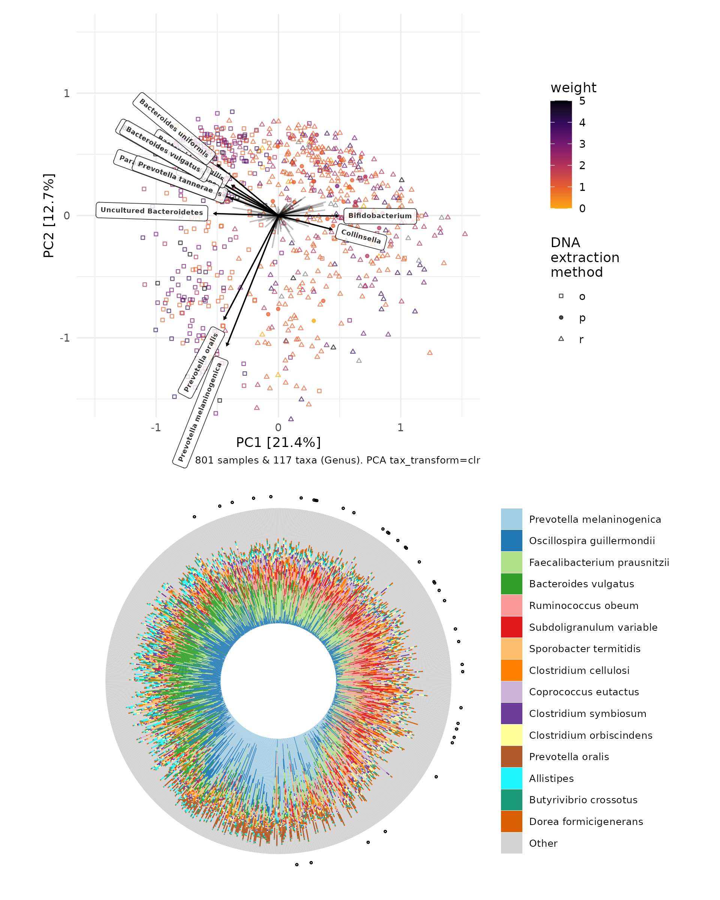
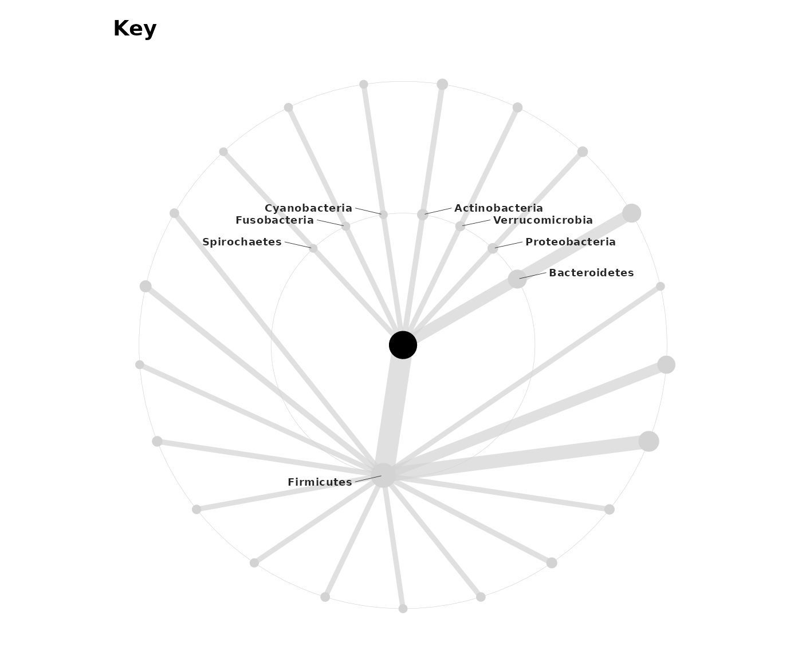

# Example analyses with atlas1006 data

This document shows an example `microViz` analysis workflow using
example data `atlas1006` from the `microbiome` package.

## Load necessary packages

``` r
library(dplyr)
library(ggplot2)
library(patchwork)
library(phyloseq)
library(microbiome)
library(microViz)
```

## Get example data

``` r
# get some example data
data("atlas1006", package = "microbiome")

# create a couple of numerical variables (often more useful than character strings)
ps <- atlas1006 %>%
  ps_mutate(
    weight = recode(
      .x = bmi_group, morbidobese = 5, severeobese = 4,
      obese = 3, overweight = 2, lean = 1, underweight = 0
    ),
    lean = if_else(weight < 2, true = 1, false = 0, missing = 0),
    female = if_else(sex == "female", true = 1, false = 0),
    extract_P = if_else(DNA_extraction_method == "p", true = 1, false = 0)
  ) %>%
  # only look at the baseline time point if multiple samples available
  # and drop samples with no DNA extraction method info
  ps_filter(time == 0, !is.na(DNA_extraction_method)) %>%
  # remove the sample data variables about time
  ps_select(-time)

# add a couple of missing values to show how microViz handles missing data
sample_data(ps)$female[c(3, 4)] <- NA

# look at phyloseq object description
ps
#> phyloseq-class experiment-level object
#> otu_table()   OTU Table:         [ 125 taxa and 801 samples ]
#> sample_data() Sample Data:       [ 801 samples by 13 sample variables ]
#> tax_table()   Taxonomy Table:    [ 125 taxa by 3 taxonomic ranks ]
```

``` r
# this example data has a slightly odd tax_table because it comes from HITChip data (instead of sequencing)
# the taxonomic assignment is done differently, so we need to ensure taxon names are not repeated across columns
# it can otherwise be used the same as sequencing data for this example
tax_table(ps) %>% head(3)
#> Taxonomy Table:     [3 taxa by 3 taxonomic ranks]:
#>                  Phylum            Family            Genus             
#> Actinomycetaceae "Actinobacteria"  "Actinobacteria"  "Actinomycetaceae"
#> Aerococcus       "Firmicutes"      "Bacilli"         "Aerococcus"      
#> Akkermansia      "Verrucomicrobia" "Verrucomicrobia" "Akkermansia"
ps <- ps %>% tax_prepend_ranks()
tax_table(ps) %>% head(3)
#> Taxonomy Table:     [3 taxa by 3 taxonomic ranks]:
#>                  Phylum               Family               Genus                
#> Actinomycetaceae "P: Actinobacteria"  "F: Actinobacteria"  "G: Actinomycetaceae"
#> Aerococcus       "P: Firmicutes"      "F: Bacilli"         "G: Aerococcus"      
#> Akkermansia      "P: Verrucomicrobia" "F: Verrucomicrobia" "G: Akkermansia"
# replace any uninformative tax_table values
ps <- ps %>% tax_fix()

# look at the effect of removing rare Genera, e.g. how many Genera are present in at least 5% of samples?
ps %>% tax_filter(min_prevalence = 5 / 100, tax_level = "Genus")
#> Proportional min_prevalence given: 0.05 --> min 41/801 samples.
#> phyloseq-class experiment-level object
#> otu_table()   OTU Table:         [ 117 taxa and 801 samples ]
#> sample_data() Sample Data:       [ 801 samples by 13 sample variables ]
#> tax_table()   Taxonomy Table:    [ 117 taxa by 3 taxonomic ranks ]
# we will use this udring other analyses, but not overwrite the original phyloseq object as the
# unfiltered set of taxa would be required if we were performing e.g. alpha diversity analyses
```

## Exploring your data

### Ordination plots

Ordination methods can help you to visualize variation in overall
microbial ecosystem composition, and look at whether it might differ
markedly between groups, e.g. weight.

Here is one option to try first:

1.  Filter out rare taxa (e.g. remove Genera not present in at least 5%
    of samples) - use
    [`tax_filter()`](https://david-barnett.github.io/microViz/reference/tax_filter.md)
2.  Aggregate the taxa into bacterial families (for example) - use
    [`tax_agg()`](https://david-barnett.github.io/microViz/reference/tax_agg.md)
3.  Transform the microbial data with the centered-log-ratio
    transformation - use
    [`tax_transform()`](https://david-barnett.github.io/microViz/reference/tax_transform.md)
4.  Perform PCA with the CLR-transformed features (equivalent to
    Aitchison distance PCoA) - use
    [`ord_calc()`](https://david-barnett.github.io/microViz/reference/ord_calc.md)
5.  Plot the first 2 axes of this PCA ordination, colouring samples by
    group and adding taxon loading arrows to visualise which taxa
    generally differ across your samples - use
    [`ord_plot()`](https://david-barnett.github.io/microViz/reference/ord_plot.md)
6.  Customise the theme of the ggplot as you like and/or add features
    like ellipses or annotations

``` r
clr_pca <- ps %>%
  tax_filter(min_prevalence = 5 / 100, tax_level = "Genus") %>%
  tax_agg("Genus") %>% # aggregate taxa at Genus level
  tax_transform("clr") %>% # centered log ratio transformation
  ord_calc(method = "PCA") # Note: PCA is RDA without constraints (& ord_calc uses an RDA method to perform PCA)
#> Proportional min_prevalence given: 0.05 --> min 41/801 samples.
```

``` r
clr_pca
#> psExtra object - a phyloseq object with extra slots:
#> 
#> phyloseq-class experiment-level object
#> otu_table()   OTU Table:         [ 117 taxa and 801 samples ]
#> sample_data() Sample Data:       [ 801 samples by 13 sample variables ]
#> tax_table()   Taxonomy Table:    [ 117 taxa by 3 taxonomic ranks ]
#> 
#> otu_get(counts = TRUE)        [ 117 taxa and 801 samples ]
#> 
#> psExtra info:
#> tax_agg = "Genus" tax_trans = "clr" 
#> 
#> ordination of class: rda cca 
#> rda(formula = OTU ~ 1, data = data)
#> Ordination info:
#> method = 'PCA'   
```

``` r
clr_pca %>%
  ord_plot(colour = "weight", shape = "DNA_extraction_method", alpha = 0.7, size = 1.5) +
  scale_colour_viridis_c(option = "inferno", direction = -1, end = 0.8) +
  scale_shape_manual(
    values = c(o = "square open", r = "triangle open", p = "circle"),
    name = "DNA\nextraction\nmethod"
  )
```


### Taxonomic compositions?

Using a PCA ordination allows us reliably draw biplots, showing which
taxa are associated with this major variation in sample microbiota
composition as represented on axes PC1 and PC2.

``` r
pca <- clr_pca %>%
  ord_plot(
    colour = "weight", shape = "DNA_extraction_method", alpha = 0.7, size = 1,
    plot_taxa = 12:1, tax_vec_length = 0.3,
    taxon_renamer = function(x) stringr::str_remove_all(x, "^G: | [ae]t rel."),
    center = TRUE,
    tax_lab_style = tax_lab_style(
      type = "label", max_angle = 90, fontface = "bold",
      alpha = 0.8, size = 2
    )
  ) +
  scale_colour_viridis_c(option = "inferno", direction = -1, end = 0.8) +
  scale_shape_manual(
    values = c(o = "square open", r = "triangle open", p = "circle"),
    name = "DNA\nextraction\nmethod"
  ) +
  # essential for correct label angles
  coord_fixed(clip = "off", xlim = c(-1.5, 1.5), ylim = c(-1.5, 1.5))
```

``` r
pca
```


What about the actual compositions of these 800 samples?

``` r
iris <- clr_pca %>%
  ord_plot_iris(
    tax_level = "Genus", n_taxa = 15,
    anno_binary = "extract_P",
    anno_binary_style = list(y = 1.1, size = 0.5, alpha = 0.3, shape = 1),
    taxon_renamer = function(x) stringr::str_remove_all(x, "^G: | [ae]t rel.")
  )

iris
```


You can arrange both plots together with patchwork package.

``` r
pca / iris
```



## Testing hypotheses

### PERMANOVA

What variables is the overall microbial community variation associated
with?

``` r
ps %>%
  tax_filter(min_prevalence = 5 / 100, tax_level = "Genus") %>%
  tax_agg("Genus") %>%
  dist_calc("aitchison") %>%
  dist_permanova(
    variables = c("DNA_extraction_method", "weight", "female"),
    n_perms = 99, # this is a low number of permutations for speed, you should set more e.g. 9999
    seed = 12345, complete_cases = TRUE, verbose = "max"
  )
#> Proportional min_prevalence given: 0.05 --> min 41/801 samples.
#> Dropping samples with missings: 17
#> weight has NAs: 15
#> female has NAs: 2
#> 2026-02-17 09:18:41.524177 - Starting PERMANOVA with 99 perms with 1 processes
#> 2026-02-17 09:18:45.660807 - Finished PERMANOVA
#> psExtra object - a phyloseq object with extra slots:
#> 
#> phyloseq-class experiment-level object
#> otu_table()   OTU Table:         [ 117 taxa and 784 samples ]
#> sample_data() Sample Data:       [ 784 samples by 13 sample variables ]
#> tax_table()   Taxonomy Table:    [ 117 taxa by 3 taxonomic ranks ]
#> 
#> psExtra info:
#> tax_agg = "Genus" 
#> 
#> aitchison distance matrix of size 784 
#> 9.502794 11.75488 13.7951 12.73163 10.81304 ...
#> 
#> permanova:
#> Permutation test for adonis under reduced model
#> Marginal effects of terms
#> Permutation: free
#> Number of permutations: 99
#> 
#> vegan::adonis2(formula = formula, data = metadata, permutations = n_perms, by = by, parallel = parall)
#>                        Df SumOfSqs      R2       F Pr(>F)   
#> DNA_extraction_method   2     7990 0.13059 60.0845   0.01 **
#> weight                  1      241 0.00394  3.6254   0.01 **
#> female                  1      297 0.00485  4.4609   0.01 **
#> Residual              779    51796 0.84657                  
#> Total                 783    61183 1.00000                  
#> ---
#> Signif. codes:  0 '***' 0.001 '**' 0.01 '*' 0.05 '.' 0.1 ' ' 1
```

### Visualising significant predictors?

(Partial) Constrained ordination can be useful to show microbial
variation explained by predictors significant in PERMANOVA analyses.

``` r
# constraints need to be on the same or similar scales for comparability
# so make binary variables and scale the weight variable
ps <- ps %>%
  ps_mutate(
    wt_scaled = c(scale(weight, center = TRUE, scale = TRUE)),
    P = if_else(DNA_extraction_method == "p", 1, 0),
    R = if_else(DNA_extraction_method == "r", 1, 0),
    O = if_else(DNA_extraction_method == "o", 1, 0)
  )
```

``` r
constr_ord <- ps %>%
  tax_filter(min_prevalence = 5 / 100, tax_level = "Genus") %>%
  tax_agg("Genus") %>%
  tax_transform("clr") %>%
  ord_calc(
    method = "RDA", constraints = c("female", "wt_scaled", "P", "R", "O")
  )
#> Proportional min_prevalence given: 0.05 --> min 41/801 samples.
#> Dropping samples with missings: 17
#> 
#> Centering (mean) and scaling (sd) the constraints and/or conditions:
#>  female
#>  wt_scaled
#>  P
#>  R
#>  O
#> 
#> Some constraints or conditions were aliased because they were redundant. This can happen if terms
#> are constant or linearly dependent (collinear): 'O'
```

``` r
constr_ord
#> psExtra object - a phyloseq object with extra slots:
#> 
#> phyloseq-class experiment-level object
#> otu_table()   OTU Table:         [ 117 taxa and 784 samples ]
#> sample_data() Sample Data:       [ 784 samples by 17 sample variables ]
#> tax_table()   Taxonomy Table:    [ 117 taxa by 3 taxonomic ranks ]
#> 
#> otu_get(counts = TRUE)        [ 117 taxa and 801 samples ]
#> 
#> psExtra info:
#> tax_agg = "Genus" tax_trans = "clr" 
#> 
#> ordination of class: rda cca 
#> rda(formula = OTU ~ female + wt_scaled + P + R + O, data = data)
#> Ordination info:
#> method = 'RDA'   constraints = 'female+wt_scaled+P+R+O'  
```

``` r
ord_plot(constr_ord, plot_taxa = 10:1, colour = "DNA_extraction_method", shape = 1) +
  scale_color_brewer(palette = "Set2", name = "DNA\nextraction\nmethod")
```


As DNA extraction method dominates the plot above, we could try
“partialing out” the variation explained by DNA extraction method, prior
to constraining on the other factors of interest.

``` r
ps %>%
  tax_filter(min_prevalence = 5 / 100, tax_level = "Genus") %>%
  tax_agg("Genus") %>%
  tax_transform("clr") %>%
  ord_calc(
    method = "RDA", conditions = c("P", "R", "O"),
    constraints = c("female", "wt_scaled")
  ) %>%
  ord_plot(plot_taxa = 10:1, colour = "DNA_extraction_method", shape = 1) +
  scale_color_brewer(palette = "Set2", name = "DNA\nextraction\nmethod")
#> Proportional min_prevalence given: 0.05 --> min 41/801 samples.
#> Dropping samples with missings: 17
#> 
#> Centering (mean) and scaling (sd) the constraints and/or conditions:
#>  female
#>  wt_scaled
#>  P
#>  R
#>  O
#> 
#> Some constraints or conditions were aliased because they were redundant. This can happen if terms
#> are constant or linearly dependent (collinear): 'O'
```


### Taxon models

What are the effects of these factors on individual taxa? Let’s use beta
binomial regression models to find out. We will skip fitting models for
genera here, only for speed of generating this example. You should
include all ranks (which is the default) for the best use of
taxatree_plots.

See the taxon modelling article for a more comprehensive look at the
taxatree\_\* family of functions.

``` r
library(corncob)
tt_models <- ps %>%
  tax_filter(min_prevalence = 5 / 100, tax_level = "Genus") %>%
  taxatree_models(
    ranks = c("Phylum", "Family"),
    variables = c("female", "wt_scaled", "P", "R"),
    type = "bbdml", verbose = "max"
  )
#> Proportional min_prevalence given: 0.05 --> min 41/801 samples.
#> 2026-02-17 09:18:50.092115 - modelling at rank: Phylum
#> Warning in do.call(fun, list(txt)): 2 / 801 values are NA in female
#> Warning in do.call(fun, list(txt)): 15 / 801 values are NA in wt_scaled
#> 2026-02-17 09:18:52.818239 - modelling at rank: Family
#> Warning in do.call(fun, list(txt)): 2 / 801 values are NA in female
#> Warning in do.call(fun, list(txt)): 15 / 801 values are NA in wt_scaled
tt_stats <- taxatree_models2stats(tt_models, param = "mu")
```

Visualize the results compactly on a microViz taxonomic association
tree.

``` r
tt_stats %>%
  taxatree_plotkey(
    node_size_range = c(2, 8), size_stat = list(mean = mean),
    rank == "Phylum",
    taxon_renamer = function(x) stringr::str_remove_all(x, "^.: | [ae]t rel.")
  )
```



``` r
tt_stats %>%
  taxatree_plots(
    node_size_range = c(1, 5), size_stat = list(mean = mean)
  ) %>%
  .[c("P", "R", "female", "wt_scaled")] %>%
  wrap_plots(., ncol = 2, guides = "collect")
```


#### Example interpretation (illustrative only):

- DNA extraction methods P and R are associated with significantly
  higher levels of Actinobacteria and lower Bacteroides, relative to the
  reference of extraction method O.
- There are associations between weight and various taxa, but these are
  not as strong as the associations with extraction method.

## Disclaimer

This document is intended only to be an example of the kind of analyses
and visualization you can do with microViz. The analysis of the
atlas1006 data is not intended to be considered theoretically sound or
biologically interpretable.

## Session info

``` r
devtools::session_info()
#> ─ Session info ───────────────────────────────────────────────────────────────────────────────────
#>  setting  value
#>  version  R version 4.5.2 (2025-10-31)
#>  os       Ubuntu 24.04.3 LTS
#>  system   x86_64, linux-gnu
#>  ui       X11
#>  language en
#>  collate  C.UTF-8
#>  ctype    C.UTF-8
#>  tz       UTC
#>  date     2026-02-17
#>  pandoc   3.1.11 @ /opt/hostedtoolcache/pandoc/3.1.11/x64/ (via rmarkdown)
#>  quarto   NA
#> 
#> ─ Packages ───────────────────────────────────────────────────────────────────────────────────────
#>  package            * version       date (UTC) lib source
#>  ade4                 1.7-23        2025-02-14 [1] RSPM
#>  ape                  5.8-1         2024-12-16 [1] RSPM
#>  backports            1.5.0         2024-05-23 [1] RSPM
#>  Biobase              2.70.0        2025-10-29 [1] Bioconduc~
#>  BiocGenerics         0.56.0        2025-10-29 [1] Bioconduc~
#>  biomformat           1.38.0        2025-10-29 [1] Bioconduc~
#>  Biostrings           2.78.0        2025-10-29 [1] Bioconduc~
#>  broom                1.0.12        2026-01-27 [1] RSPM
#>  bslib                0.10.0        2026-01-26 [1] RSPM
#>  cachem               1.1.0         2024-05-16 [1] RSPM
#>  checkmate            2.3.4         2026-02-03 [1] RSPM
#>  cli                  3.6.5         2025-04-23 [1] RSPM
#>  cluster              2.1.8.1       2025-03-12 [3] CRAN (R 4.5.2)
#>  codetools            0.2-20        2024-03-31 [3] CRAN (R 4.5.2)
#>  colorspace           2.1-2         2025-09-22 [1] RSPM
#>  commonmark           2.0.0         2025-07-07 [1] RSPM
#>  corncob            * 0.4.2         2025-03-29 [1] RSPM
#>  crayon               1.5.3         2024-06-20 [1] RSPM
#>  data.table           1.18.2.1      2026-01-27 [1] RSPM
#>  desc                 1.4.3         2023-12-10 [1] RSPM
#>  detectseparation     0.3           2022-08-26 [1] RSPM
#>  devtools             2.4.6         2025-10-03 [1] RSPM
#>  digest               0.6.39        2025-11-19 [1] RSPM
#>  dplyr              * 1.2.0         2026-02-03 [1] RSPM
#>  ellipsis             0.3.2         2021-04-29 [1] RSPM
#>  evaluate             1.0.5         2025-08-27 [1] RSPM
#>  farver               2.1.2         2024-05-13 [1] RSPM
#>  fastmap              1.2.0         2024-05-15 [1] RSPM
#>  foreach              1.5.2         2022-02-02 [1] RSPM
#>  fs                   1.6.6         2025-04-12 [1] RSPM
#>  generics             0.1.4         2025-05-09 [1] RSPM
#>  ggforce              0.5.0         2025-06-18 [1] RSPM
#>  ggplot2            * 4.0.2         2026-02-03 [1] RSPM
#>  ggraph               2.2.2         2025-08-24 [1] RSPM
#>  ggrepel              0.9.6         2024-09-07 [1] RSPM
#>  ggtext               0.1.2         2022-09-16 [1] RSPM
#>  glue                 1.8.0         2024-09-30 [1] RSPM
#>  graphlayouts         1.2.2         2025-01-23 [1] RSPM
#>  gridExtra            2.3           2017-09-09 [1] RSPM
#>  gridtext             0.1.5         2022-09-16 [1] RSPM
#>  gtable               0.3.6         2024-10-25 [1] RSPM
#>  htmltools            0.5.9         2025-12-04 [1] RSPM
#>  htmlwidgets          1.6.4         2023-12-06 [1] RSPM
#>  igraph               2.2.2         2026-02-12 [1] RSPM
#>  IRanges              2.44.0        2025-10-29 [1] Bioconduc~
#>  iterators            1.0.14        2022-02-05 [1] RSPM
#>  jquerylib            0.1.4         2021-04-26 [1] RSPM
#>  jsonlite             2.0.0         2025-03-27 [1] RSPM
#>  knitr                1.51          2025-12-20 [1] RSPM
#>  labeling             0.4.3         2023-08-29 [1] RSPM
#>  lattice              0.22-7        2025-04-02 [3] CRAN (R 4.5.2)
#>  lifecycle            1.0.5         2026-01-08 [1] RSPM
#>  litedown             0.9           2025-12-18 [1] RSPM
#>  lpSolveAPI           5.5.2.0-17.15 2026-02-13 [1] RSPM
#>  magrittr             2.0.4         2025-09-12 [1] RSPM
#>  markdown             2.0           2025-03-23 [1] RSPM
#>  MASS                 7.3-65        2025-02-28 [3] CRAN (R 4.5.2)
#>  Matrix               1.7-4         2025-08-28 [3] CRAN (R 4.5.2)
#>  memoise              2.0.1         2021-11-26 [1] RSPM
#>  mgcv                 1.9-3         2025-04-04 [3] CRAN (R 4.5.2)
#>  microbiome         * 1.32.0        2025-10-29 [1] Bioconduc~
#>  microViz           * 0.13.0        2026-02-17 [1] local
#>  multtest             2.66.0        2025-10-29 [1] Bioconduc~
#>  nlme                 3.1-168       2025-03-31 [3] CRAN (R 4.5.2)
#>  numDeriv             2016.8-1.1    2019-06-06 [1] RSPM
#>  otel                 0.2.0         2025-08-29 [1] RSPM
#>  patchwork          * 1.3.2         2025-08-25 [1] RSPM
#>  permute              0.9-10        2026-02-06 [1] RSPM
#>  phyloseq           * 1.54.0        2025-10-29 [1] Bioconduc~
#>  pillar               1.11.1        2025-09-17 [1] RSPM
#>  pkgbuild             1.4.8         2025-05-26 [1] RSPM
#>  pkgconfig            2.0.3         2019-09-22 [1] RSPM
#>  pkgdown              2.2.0         2025-11-06 [1] RSPM
#>  pkgload              1.5.0         2026-02-03 [1] RSPM
#>  plyr                 1.8.9         2023-10-02 [1] RSPM
#>  polyclip             1.10-7        2024-07-23 [1] RSPM
#>  purrr                1.2.1         2026-01-09 [1] RSPM
#>  R6                   2.6.1         2025-02-15 [1] RSPM
#>  ragg                 1.5.0         2025-09-02 [1] RSPM
#>  RColorBrewer         1.1-3         2022-04-03 [1] RSPM
#>  Rcpp                 1.1.1         2026-01-10 [1] RSPM
#>  registry             0.5-1         2019-03-05 [1] RSPM
#>  remotes              2.5.0         2024-03-17 [1] RSPM
#>  reshape2             1.4.5         2025-11-12 [1] RSPM
#>  rhdf5                2.54.1        2025-12-04 [1] Bioconduc~
#>  rhdf5filters         1.22.0        2025-10-29 [1] Bioconduc~
#>  Rhdf5lib             1.32.0        2025-10-29 [1] Bioconduc~
#>  rlang                1.1.7         2026-01-09 [1] RSPM
#>  rmarkdown            2.30          2025-09-28 [1] RSPM
#>  ROI                  1.0-2         2026-01-12 [1] RSPM
#>  ROI.plugin.lpsolve   1.0-2         2023-07-07 [1] RSPM
#>  Rtsne                0.17          2023-12-07 [1] RSPM
#>  S4Vectors            0.48.0        2025-10-29 [1] Bioconduc~
#>  S7                   0.2.1         2025-11-14 [1] RSPM
#>  sass                 0.4.10        2025-04-11 [1] RSPM
#>  scales               1.4.0         2025-04-24 [1] RSPM
#>  Seqinfo              1.0.0         2025-10-29 [1] Bioconduc~
#>  sessioninfo          1.2.3         2025-02-05 [1] RSPM
#>  slam                 0.1-55        2024-11-13 [1] RSPM
#>  stringi              1.8.7         2025-03-27 [1] RSPM
#>  stringr              1.6.0         2025-11-04 [1] RSPM
#>  survival             3.8-3         2024-12-17 [3] CRAN (R 4.5.2)
#>  systemfonts          1.3.1         2025-10-01 [1] RSPM
#>  textshaping          1.0.4         2025-10-10 [1] RSPM
#>  tibble               3.3.1         2026-01-11 [1] RSPM
#>  tidygraph            1.3.1         2024-01-30 [1] RSPM
#>  tidyr                1.3.2         2025-12-19 [1] RSPM
#>  tidyselect           1.2.1         2024-03-11 [1] RSPM
#>  trust                0.1-9         2026-02-11 [1] RSPM
#>  tweenr               2.0.3         2024-02-26 [1] RSPM
#>  usethis              3.2.1         2025-09-06 [1] RSPM
#>  vctrs                0.7.1         2026-01-23 [1] RSPM
#>  vegan                2.7-2         2025-10-08 [1] RSPM
#>  viridis              0.6.5         2024-01-29 [1] RSPM
#>  viridisLite          0.4.3         2026-02-04 [1] RSPM
#>  withr                3.0.2         2024-10-28 [1] RSPM
#>  xfun                 0.56          2026-01-18 [1] RSPM
#>  xml2                 1.5.2         2026-01-17 [1] RSPM
#>  XVector              0.50.0        2025-10-29 [1] Bioconduc~
#>  yaml                 2.3.12        2025-12-10 [1] RSPM
#> 
#>  [1] /home/runner/work/_temp/Library
#>  [2] /opt/R/4.5.2/lib/R/site-library
#>  [3] /opt/R/4.5.2/lib/R/library
#>  * ── Packages attached to the search path.
#> 
#> ──────────────────────────────────────────────────────────────────────────────────────────────────
```
