# Visualising compositions

``` r
options(width = 100)
library(microViz)
library(phyloseq)
library(ggplot2)
library(patchwork) # for arranging groups of plots
knitr::opts_chunk$set(fig.height = 6, fig.width = 9)
```

``` r
# get example phyloseq data from corncob package and tidy up
pseq <- microViz::ibd %>%
  tax_filter(min_prevalence = 2) %>%
  tax_fix() %>%
  phyloseq_validate()
```

The `comp_barplot` function allows you to visualize the taxonomic
compositions of your microbiome samples in a flexible, scalable,
group-able, and visually appealing way.

## Quick example barplot

Visualize the top Genera across all the female samples from this
inflammatory bowel disease study dataset. The order of the samples is
automatically set by their “bray”-curtis dissimilarity.

By default, the top 8 taxa are shown. These taxa are chosen by their
total count abundance across all plotted samples.

``` r
pseq %>%
  ps_filter(gender == "female") %>%
  comp_barplot(tax_level = "Genus") +
  coord_flip() # horizontal bars are often more readable
#> Registered S3 method overwritten by 'seriation':
#>   method         from 
#>   reorder.hclust vegan
```


## Customising the barplot

### comp_barplot arguments

The output of comp_barplot can be customised in several ways. See the
comment alongside each argument for an explanation of its effect.

``` r
pseq %>%
  ps_filter(gender == "female") %>%
  comp_barplot(
    tax_level = "Genus",
    label = "DiseaseState", # name an alternative variable to label axis
    n_taxa = 15, # give more taxa unique colours
    taxon_renamer = function(x) stringr::str_replace_all(x, "_", " "), # remove underscores
    other_name = "Other genera", # set custom name for the "other" category
    merge_other = FALSE, # split the "Other" category to display alpha diversity
    bar_width = 0.7, # reduce the bar width to 70% of one row
    bar_outline_colour = "grey5" # is the default (use NA to remove outlines)
  ) +
  coord_flip()
```


**Other notes:**

- Dissimilarity is calculated using only the visibly distinct taxa, to
  optimize sorting for visual similarity. You can change this by setting
  `order_with_all_taxa = TRUE`, to always use all taxa for similarity
  sorting.
- The colour palette is important, to allow (adjacent) taxa to be
  distinguished. The palette microViz uses is generated by the
  `distinct_palette` function, which starts with the Paired and Dark2
  palettes from ColorBrewer and continues with further distinct colours
  generated at <http://medialab.github.io/iwanthue/> (all colors, soft
  k-means).

### Colour palette customisation

You can use the
[`tax_palette()`](https://david-barnett.github.io/microViz/reference/tax_palette.md)
function to help create a custom colour palette for use in (multiple)
barplots. Try to ensure you assign a colour for every taxon you expect
to see separately on your barplot.

``` r
myPal <- tax_palette(
  data = pseq, rank = "Genus", n = 25, pal = "greenArmytage",
  add = c(Other = "white")
)
tax_palette_plot(myPal)
```

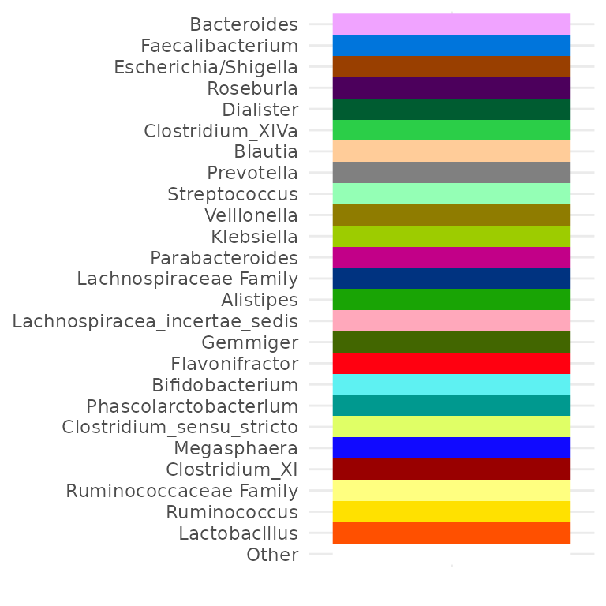

``` r
# Override existing values
myPal["Bacteroides"] <- "grey75"
myPal["Streptococcus"] <- "black"
myPal["Klebsiella"] <- "darkorange"
# Add more values
myPal["Enterobacteriaceae Family"] <- "hotpink"
tax_palette_plot(myPal)
```

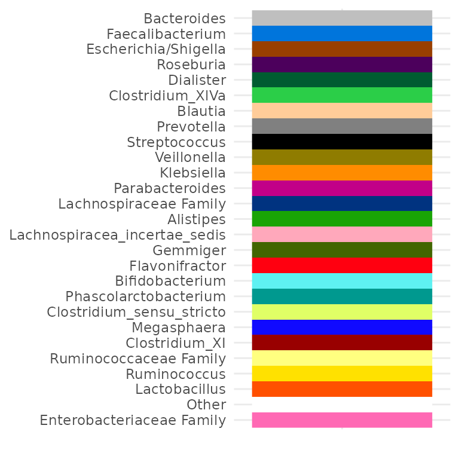

``` r
pseq %>%
  ps_filter(gender == "female") %>%
  comp_barplot(
    tax_level = "Genus", palette = myPal,
    n_taxa = 12, other_name = "Other", merge_other = FALSE
  ) +
  coord_flip()
```


### Alternative taxa ordering

By default taxa are ordered by overall `sum` of their counts across all
samples in your dataset. You can sort taxa by another function, such as
`prev` for prevalence.

``` r
pseq %>%
  ps_filter(gender == "male") %>%
  comp_barplot(tax_level = "Genus", tax_order = prev, merge_other = FALSE) +
  coord_flip()
```

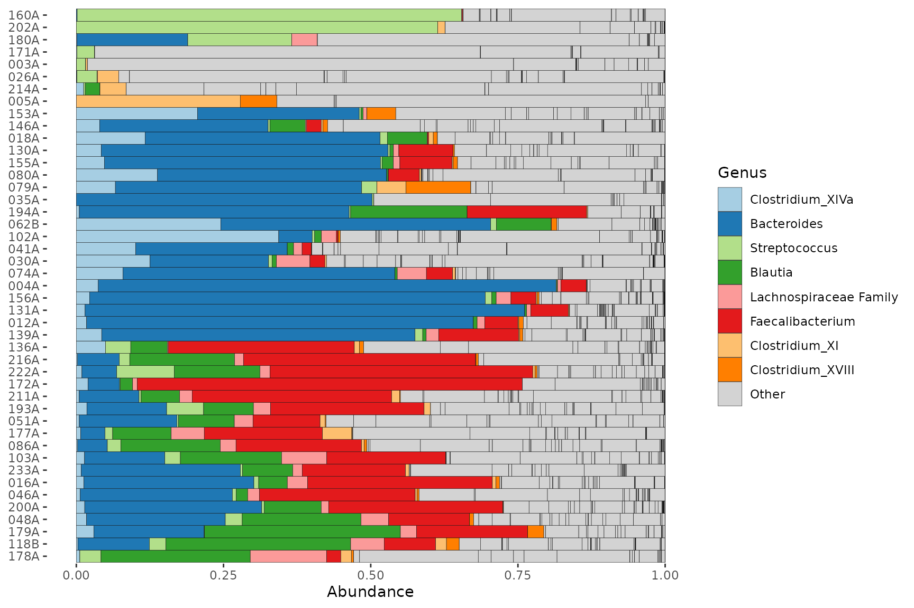

### Customising taxa order

It is easy (since microViz version 0.9.6) to set a custom order of taxa
to display with `comp_barplot`. For example you might be particularly
interested in the abundance of Proteobacteria genera in your samples,
and want them to appear first, regardless of their overall abundance.

``` r
interestingGenera <- pseq %>%
  tax_select("Proteobacteria") %>%
  tax_top(n = 10, rank = "Genus")
interestingGenera
#>  [1] "Escherichia/Shigella"      "Klebsiella"                "Haemophilus"              
#>  [4] "Sutterella"                "Enterobacteriaceae Family" "Parasutterella"           
#>  [7] "Cronobacter"               "Comamonadaceae Family"     "Raoultella"               
#> [10] "Proteus"
```

``` r
pseq %>%
  ps_filter(gender == "male") %>%
  tax_sort(by = sum, at = "Genus") %>% # put other taxa in a reasonable order
  comp_barplot(
    tax_level = "Genus", n_taxa = 10, merge_other = FALSE, other_name = "Other",
    palette = distinct_palette(10, pal = "kelly", add = "grey90"),
    tax_order = interestingGenera # this is the reordering magic
  ) +
  coord_flip()
```

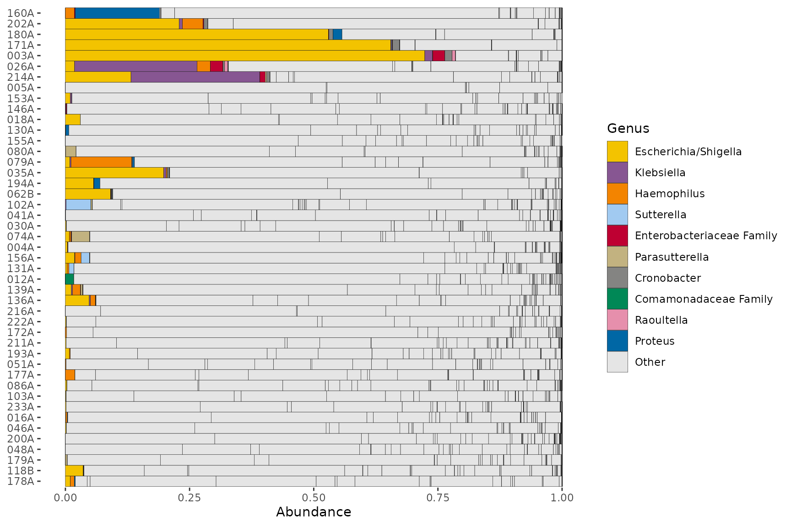

### Custom taxa order and colour palette

Customising taxa order and colour palette are often needed together. The
pair nicely as you can use the names from a custom palette to fix the
taxa order.

``` r
customPal <- tax_palette(
  data = pseq, rank = "Genus", pal = "kelly", n = 20, add = c(Other = "white")
)
tax_palette_plot(customPal)

# I'm interested in Prevotella, so let's put that first
names(customPal) <- c("Prevotella", setdiff(names(customPal), "Prevotella"))
tax_palette_plot(customPal)
```

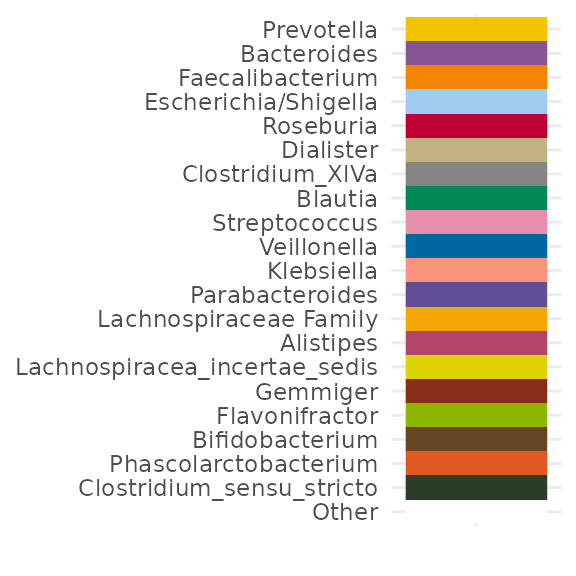

``` r
pseq %>%
  ps_filter(gender == "female") %>%
  tax_sort(by = sum, at = "Genus", tree_warn = FALSE) %>%
  comp_barplot(
    tax_level = "Genus", merge_other = FALSE,
    n_taxa = 12,
    other_name = "Other", # must match a name in palette
    tax_order = names(customPal),
    palette = customPal
  ) +
  coord_flip()
```


Let’s look at the abundance of these same genera in a separate dataset.

``` r
data("shao19")
shao19 %>%
  ps_filter(family_role == "mother", age == 38) %>%
  tax_sort(by = sum, at = "genus", tree_warn = FALSE) %>%
  comp_barplot(
    tax_level = "genus", n_taxa = 12, other_name = "Other", merge_other = FALSE,
    tax_order = names(customPal), palette = customPal
  ) +
  coord_flip()
#> Warning in tax_reorder(ps, tax_order = tax_order, tree_warn = FALSE, ignore = other_name): 5 taxa
#> specified in tax_order are not in phyloseq ps: they are ignored
```


Not all the genera will be present in the other dataset, so we get a
warning. Notice also that whilst the genus-colour pairings are the same,
the legends are not identical, because the taxa that are not in this 2nd
set don’t appear in its legend.

### Merging phyloseq objects to compare them

The best way to create harmonised barcharts for two (or more) separate
datasets (e.g. your data and a public dataset) is to merge the datasets.
Often the data generation methods (e.g. primer sets) won’t match, making
ASV or species-level merging impossible (or not advisable).

You can still try merging at a higher taxonomic rank, such as Class, for
comparison.

``` r
dataset1 <- ps_filter(pseq, gender == "female")
dataset2 <- ps_filter(shao19, family_role == "mother", age == 38)

# first make sure the rank_names are the same format (e.g. both lowercase)
colnames(dataset1@tax_table) <- rank_names(dataset1) %>% tolower()

# remove ranks that are not shared
dataset1 <- dataset1 %>% tax_mutate(kingdom = NULL)

# create a dataset ID variable to distinguish the two datasets after merging
dataset1 <- dataset1 %>% ps_mutate(dataset = "IBD study")
dataset2 <- dataset2 %>% ps_mutate(dataset = "Birth cohort mothers")

# aggregate and merge
combined <- phyloseq::merge_phyloseq(
  dataset1 %>% tax_agg("class") %>% ps_get(),
  dataset2 %>% tax_agg("class") %>% ps_get()
)

combined
#> phyloseq-class experiment-level object
#> otu_table()   OTU Table:         [ 28 taxa and 93 samples ]
#> sample_data() Sample Data:       [ 93 samples by 26 sample variables ]
#> tax_table()   Taxonomy Table:    [ 28 taxa by 2 taxonomic ranks ]
```

Now we can plot the two datasets in separate facets of the same plot.

``` r
combined %>%
  comp_barplot("class", facet_by = "dataset", n_taxa = 12) +
  coord_flip()
```


Or we could plot them as separate plots with the group argument.

``` r
plots <- combined %>% comp_barplot("class", n_taxa = 12, group_by = "dataset")

# combine plots with shared legend
patchwork::wrap_plots(plots, nrow = 2, guides = "collect") &
  theme(axis.ticks.x = element_blank(), axis.text.x = element_blank())
```


### Alphabetical top taxa

Sometimes you might prefer the top taxa to be shown in alphabetical
order.

``` r
# set up for alphabetical sorting
topTaxa <- pseq %>%
  ps_filter(gender == "male") %>%
  tax_top(n = 9, rank = "Genus") %>%
  sort() # this makes them alphabetical

# plot with alphabetical sorting
pseq %>%
  ps_filter(gender == "male") %>%
  tax_sort(by = sum, at = "Genus") %>% # this orders all genera by abundance
  comp_barplot(
    tax_order = topTaxa, # this brings the named taxa to the front
    tax_level = "Genus", n_taxa = 9, merge_other = FALSE, other_name = "Other"
  ) +
  coord_flip()
```

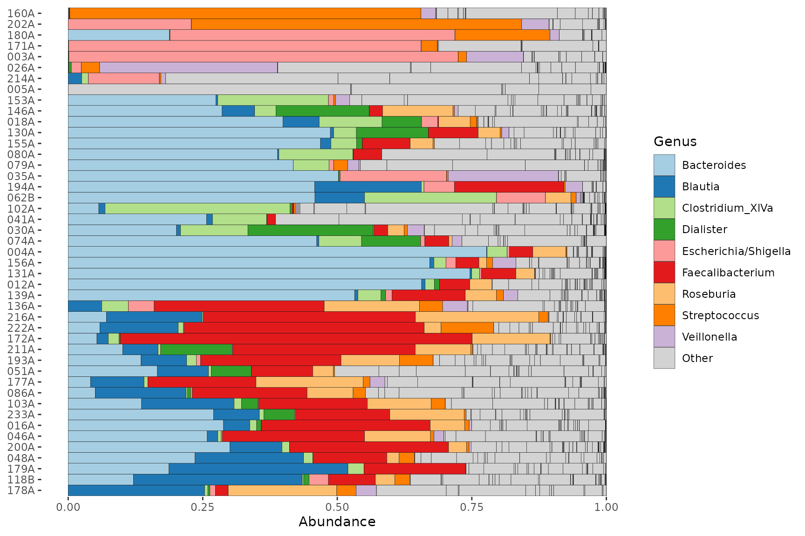

Another way to do this is by reordering the names of a custom palette,
like this:

``` r
# don't add an "Other" colour for now
alphaPal <- tax_palette(pseq, pal = "kelly", rank = "Genus", n = 12, add = NA)
names(alphaPal) <- sort(names(alphaPal))
# now add the "Other" colour to the end
alphaPal["Other"] <- "white"
tax_palette_plot(alphaPal)
```


``` r
pseq %>%
  ps_filter(gender == "male") %>%
  comp_barplot(
    tax_level = "Genus", n_taxa = 12, merge_other = FALSE,
    other_name = "Other", # must match a name in palette
    tax_order = names(alphaPal), palette = alphaPal
  ) +
  coord_flip()
```


### Custom hierarchical sorting and palette

A complex example showing one method for obtaining a hierarchical colour
palette with hues specified by Phylum (or another high rank) and shades
of the hue specified by Family (or another low rank).

``` r
hueRank <- "Phylum"
hueRankPlural <- "Phyla"
shadeRank <- "Family"

# Sort phyloseq at lower, and then higher ranks
pseq2 <- pseq %>%
  ps_filter(gender == "male") %>%
  tax_sort(by = sum, at = shadeRank) %>%
  tax_sort(by = sum, at = hueRank) %>%
  tax_agg(rank = shadeRank)

# Specify number of hues and shades desired
nHues <- 3 # "Other" phyla will be shades of grey
nShades <- 4 # "Other" families will be the lightest shade of each hue

hierarchicalPalInfo <- data.frame(
  hue = as.vector(tt_get(pseq2)[, hueRank]),
  shade = as.vector(tt_get(pseq2)[, shadeRank]),
  counts = taxa_sums(otu_get(pseq2))
)

hierarchicalPalInfo <- hierarchicalPalInfo %>%
  dplyr::mutate(
    hue = forcats::fct_other(
      f = hue, keep = unique(hue)[seq_len(nHues)],
      other_level = paste("Other", hueRankPlural)
    ),
    nChrHue = nchar(as.character(hue)), padHue = max(nChrHue) - nChrHue
  ) %>%
  dplyr::group_by(hue) %>%
  dplyr::mutate(
    shade = forcats::fct_other(
      f = shade, keep = unique(shade)[seq_len(nShades - 1)],
      other_level = "Other"
    )
  ) %>%
  dplyr::ungroup() %>%
  dplyr::mutate(
    nChrShade = nchar(as.character(shade)), padShade = max(nChrShade) - nChrShade,
    Taxa = paste0(hue, ": ", strrep(" ", padHue), shade, strrep(" ", padShade))
  )
```

``` r
hierarchicalPalMatrix <- matrix(
  data = sapply(
    X = seq(from = 30, to = 75, length.out = nShades),
    FUN = function(l) scales::hue_pal(l = l, h.start = 30)(n = nHues)
  ),
  byrow = TRUE, ncol = nHues
)
hierarchicalPalMatrix <- cbind(hierarchicalPalMatrix, grey.colors(n = nShades))

hierarchicalPal <- hierarchicalPalMatrix %>%
  as.vector() %>%
  setNames(unique(hierarchicalPalInfo$Taxa))
```

``` r
tax_palette_plot(hierarchicalPal) +
  theme(axis.text.y.left = element_text(family = "mono"))
```


``` r
pseq2 %>%
  ps_get() %>%
  tax_mutate("Phylum: Family" = hierarchicalPalInfo$Taxa, .keep = "none") %>%
  comp_barplot(
    tax_level = "Phylum: Family", n_taxa = length(hierarchicalPal),
    tax_order = "asis", palette = hierarchicalPal, bar_width = 0.975
  ) +
  coord_flip() +
  theme(legend.text = element_text(family = "mono")) # for text alignment
```

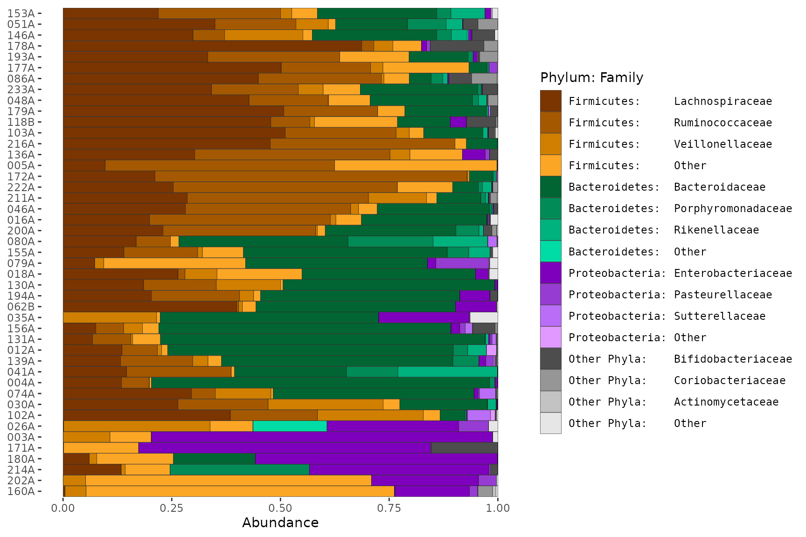

## Averages, faceting or grouping?

### Averaging compositions

Sometimes, to compare microbial compositions across groups, average
compositions are presented. However that “group-averaging” approach
hides a lot of within-group variation, as well as any imbalance in group
sizes.

``` r
pseq %>%
  ps_select(age, DiseaseState) %>% # avoids lots of phyloseq::merge_samples warnings
  ps_filter(DiseaseState != "IBDundef") %>%
  phyloseq::merge_samples(group = "DiseaseState") %>%
  comp_barplot(tax_level = "Genus", n_taxa = 12, bar_width = 0.8) +
  coord_flip() + labs(x = NULL, y = NULL)
#> Warning in asMethod(object): NAs introduced by coercion
```

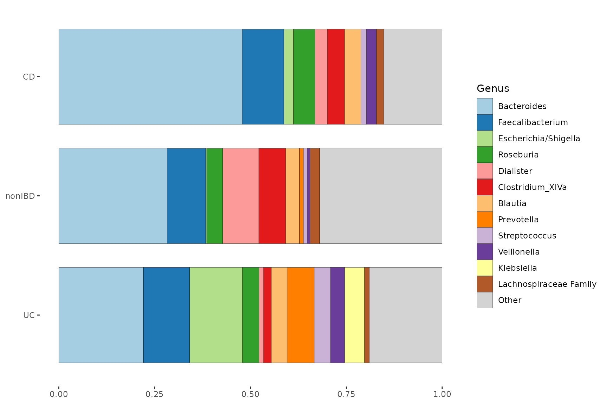

### Faceting

Faceting is where you show each group on a small subplot.

In the plot below can you see that at minority of UC samples have a high
abundance of Escherichia/Shigella or Streptococcus. The merged bars
above might have misled you into thinking all UC samples had somewhat
increased abundances of these taxa.

``` r
pseq %>%
  ps_filter(DiseaseState != "IBDundef") %>% # only one sample in this group
  # convert DiseaseState into ordered factor to control order of facets
  ps_mutate(
    DiseaseState = factor(DiseaseState, levels = c("UC", "nonIBD", "CD"))
  ) %>%
  comp_barplot(
    tax_level = "Genus", n_taxa = 15,
    bar_outline_colour = NA, facet_by = "DiseaseState"
  ) +
  coord_flip()
```


Instead of using the `facet_by` argument in `comp_barplot` you can have
more control over faceting by doing it yourself afterwards. You can use
facet_grid to create row facets.

``` r
pseq %>%
  ps_filter(DiseaseState != "IBDundef") %>% # only one sample in this group
  # convert DiseaseState into ordered factor to control order of facets
  ps_mutate(
    DiseaseState = factor(DiseaseState, levels = c("UC", "CD", "nonIBD"))
  ) %>%
  comp_barplot(
    tax_level = "Genus", n_taxa = 15,
    sample_order = "bray", bar_outline_colour = NA,
  ) +
  facet_grid(
    rows = vars(DiseaseState),
    scales = "free", space = "free" # these options are critically important!
  ) +
  coord_flip() +
  theme(axis.text.y = element_blank(), axis.ticks.y = element_blank())
```


### Grouping

For even greater control than faceting, `comp_barplot` allows you to
generate separate ggplot objects for each group, whilst maintaining the
same taxa colour scheme.

You can assemble these plots into one figure with, for example, the
`patchwork` package, or keep them separate.

*Note that the ordering of the samples may differ between facet and
group_by approaches. In the group_by method, the ordering of the samples
by similarity is done separately for each group, whereas in the facet_by
method, similarity-based ordering is done with all samples and then the
samples are separated by facet afterwards.*

``` r
plot_list <- pseq %>%
  ps_filter(DiseaseState != "IBDundef") %>%
  comp_barplot(n_taxa = 15, tax_level = "Genus", group_by = "DiseaseState")

# Plot them side by side with the patchwork package.
patch <- patchwork::wrap_plots(plot_list, nrow = 1, guides = "collect")
patch & coord_flip() # make all plots horizontal (note: use & instead of +)
```

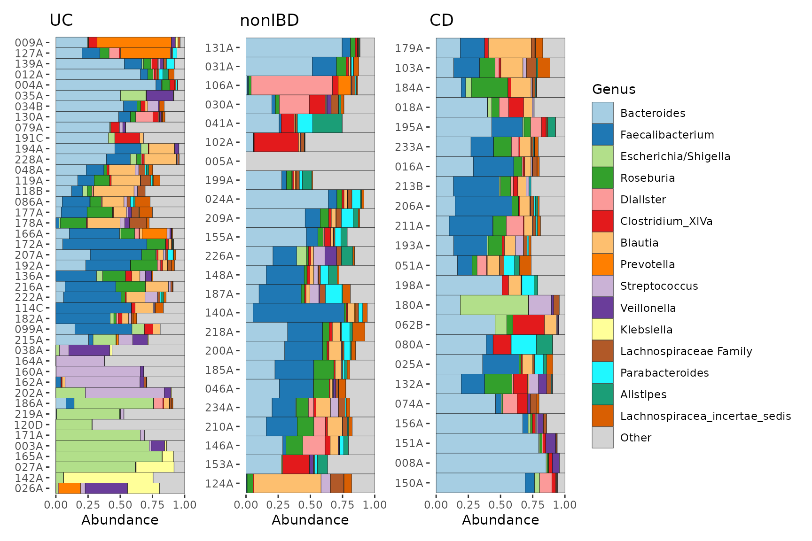

Notice how you can theme all plots with the `&` operator.

See <https://patchwork.data-imaginist.com/index.html> for more examples
of arranging multiple plots.

``` r
patch &
  coord_flip() & labs(x = NULL, y = NULL) &
  theme(
    axis.text.y = element_text(size = 5),
    legend.text = element_text(size = 8)
  ) &
  plot_annotation(
    title = "Microbial composition across disease groups",
    caption = "Caption: patchwork is a great package!",
    theme = theme(plot.title = element_text(size = 14, face = "bold"))
  )
```


## Sorting the barplot

### Sorting by similarity

Sorting the samples on compositional barplots by similarity can make
patterns in the data much easier to see. Check out this unsorted version
of the first barplot in this article.

``` r
pseq %>%
  ps_filter(gender == "female") %>%
  comp_barplot(tax_level = "Genus", sample_order = "asis") +
  coord_flip() +
  ggtitle("Unsorted barcharts are hard to read!")
```


You can play with the dissimilarity measure (set in `sample_order`
argument) and `seriate_method` if you like, but the defaults (Bray
Curtis and OLO Ward) seem to work pretty well most of the time.

When sorting samples by similarity, the default is to treat the “other”
taxa as one group, i.e. when `merge_other = TRUE` and
`order_with_all_taxa = FALSE`.

If you set `order_with_all_taxa = TRUE`, samples are sorted BEFORE
merging taxa. The resulting sample order is then the same as when
`merge_other = FALSE`.

``` r
pseq %>%
  ps_filter(gender == "female") %>%
  comp_barplot(tax_level = "Genus") +
  coord_flip() +
  ggtitle("Samples sorted AFTER merging 'other' taxa")
```


``` r
pseq %>%
  ps_filter(gender == "female") %>%
  comp_barplot(tax_level = "Genus", order_with_all_taxa = TRUE) +
  coord_flip() +
  ggtitle("Samples sorted BEFORE merging 'other' taxa")
```


``` r
pseq %>%
  ps_filter(gender == "female") %>%
  comp_barplot(tax_level = "Genus", merge_other = FALSE) +
  coord_flip() +
  ggtitle("'other' taxa not merged")
```


### Sort by ordination

Coming soon.

### Sort by 1 taxon

To study the distribution of a single taxonomic group across your
samples, you can use `ps_arrange` (with the `.target` argument set to
“otu_table”) and the ‘default’ sample_order setting in `comp_barplot`.

``` r
pseq %>%
  tax_agg("Phylum") %>%
  tax_transform("compositional") %>%
  ps_arrange(desc(Firmicutes), .target = "otu_table") %>%
  comp_barplot(tax_level = "Phylum", sample_order = "asis", counts_warn = FALSE) +
  coord_flip()
```


### Sorting by time

Sometimes you have multiple samples from the same individuals/sites at
several timepoints. You must first order the phyloseq by the time or
ordering variable and then set the comp_barplot sample order to “asis”
(as is) to keep this pre-set order. *The x argument is available since
microViz 0.9.7, and allows you to specify a variable other than the
sample name as the x aesthetic for the ggplot. This is useful for when
you have some missing samples per timepoint or group, but want to fix
consistent x axes scales across facets with scales = “fixed”.*

``` r
data("shao19")

# prepare subset of data
ps <- shao19 %>%
  ps_mutate(family_id = as.numeric(family_id)) %>%
  # take an arbitrary smaller subset of infants and timepoints
  ps_filter(family_role == "child", family_id < 30, infant_age %in% c(4, 7, 21))
```

``` r
ps %>%
  ps_mutate(infant_age = factor(infant_age, levels = unique(infant_age))) %>%
  comp_barplot(
    tax_level = "genus", sample_order = "asis", bar_width = 0.7,
    merge_other = FALSE, x = "infant_age" # x argument available since microViz 0.9.7
  ) +
  facet_wrap(
    facets = vars(family_id), labeller = as_labeller(~ paste("Fam.", .))
  ) +
  theme_bw() + # slightly clearer axes for facets
  labs(x = "Age (days)", y = "Relative Abundance", fill = "Genus") +
  scale_y_continuous(
    expand = expansion(add = c(0, 0.1)), # axis starts exactly at 0
    labels = scales::label_percent()
  )
```

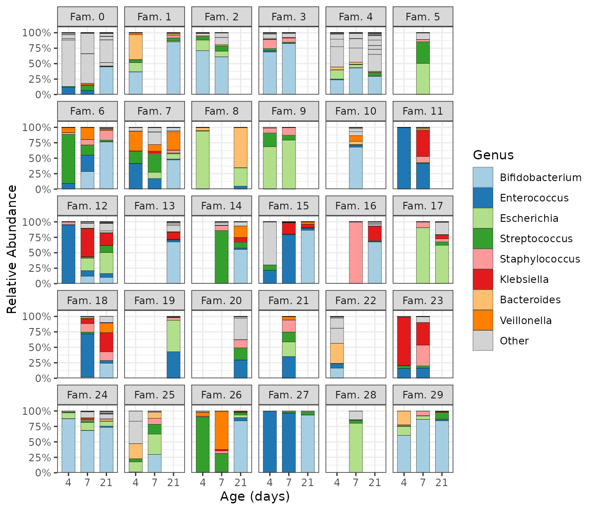

You can try to roughly sort subjects by their microbiome composition by
seriating the samples up front before plotting, and then fixing the
**subject** order by mutating subject into a factor, preserving its
unique levels in their sample-sorted order.

``` r
ps %>%
  ps_seriate(rank = "genus") %>%
  ps_mutate(
    family_id = factor(family_id, levels = unique(family_id)),
    infant_age = factor(infant_age, levels = unique(infant_age))
  ) %>%
  comp_barplot(
    tax_level = "genus", sample_order = "asis", bar_width = 0.7,
    x = "infant_age" # x argument is available since microViz 0.9.7
  ) +
  facet_wrap(
    facets = vars(family_id), labeller = as_labeller(~ paste("Fam.", .))
  ) +
  theme_bw() + # slightly clearer axes for facets
  labs(x = "Age (days)", y = "Relative Abundance") +
  scale_y_continuous(
    expand = expansion(add = c(0, 0.1)), # axis starts exactly at 0
    labels = scales::label_percent()
  )
```


An alternative way to present grouped repeated samples.

``` r
ps %>%
  ps_arrange(family_id) %>%
  ps_mutate(
    family_id = paste("Fam", family_id), # better labels
    family_id = factor(family_id, rev(unique(family_id))) # fix plot order
  ) %>%
  comp_barplot(
    tax_level = "genus", bar_width = 0.7, sample_order = "asis", # don't sort
    x = "family_id" # x argument is available since microViz 0.9.7
  ) +
  facet_wrap(
    facets = vars(infant_age), labeller = as_labeller(~ paste("Age", ., "days")),
    scales = "fixed"
  ) +
  coord_flip() +
  labs(x = "Family ID", y = "Relative abundance") +
  scale_y_continuous(expand = expansion(add = c(0, 0.05))) + # axis starts exactly at 0
  theme_bw() + # slightly clearer axes for facets
  theme(panel.spacing.x = unit(6, "mm")) # space for non-overlapping axis numbers
```

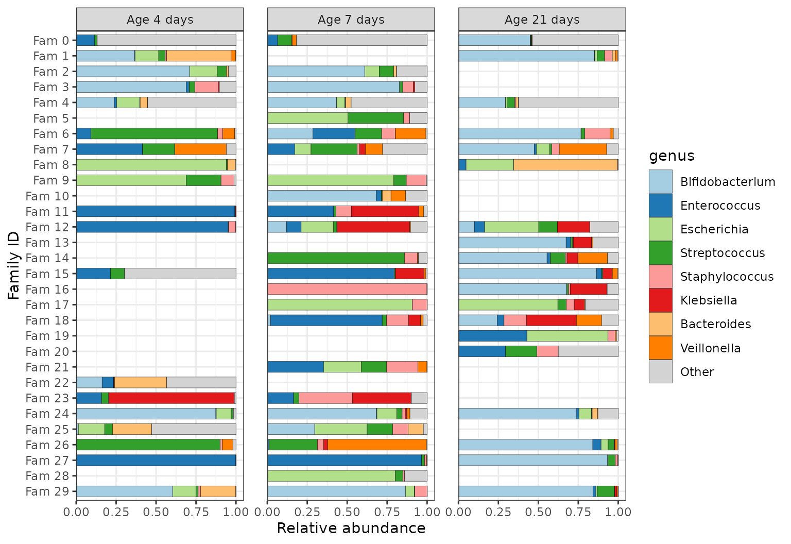

### Faceting by timepoint and another variable

``` r
# prepare arbitrary subset of dataset
data("dietswap", package = "microbiome")
psD <- dietswap %>% ps_filter(group == "DI")
```

Grid faceting to separate samples by timepoint and another grouping
variable, whilst keeping subjects’ samples paired.

``` r
psD %>%
  comp_barplot(
    tax_level = "Genus", n_taxa = 10, sample_order = "asis",
    bar_width = 0.7, x = "subject", # x arg available since microViz 0.9.7
    merge_other = FALSE, bar_outline_colour = "grey25"
  ) +
  facet_grid(
    cols = vars(timepoint.within.group), rows = vars(nationality),
    scales = "free_y", # this only frees y scale per row in grid faceting
    space = "free_y" # allows bars to be same size by freeing facet heights
  ) +
  scale_x_discrete(limits = rev) + # reverses order: top-down alphabetical
  coord_flip()
```


You can try to roughly sort subjects by their microbiome composition by
seriating the samples up front before plotting, and then fixing the
**subject** order by mutating subject into a factor, preserving its
unique levels in their sample-sorted order.

``` r
psD %>%
  ps_seriate(rank = "Genus") %>%
  ps_mutate(subject = factor(subject, levels = unique(subject))) %>%
  comp_barplot(
    tax_level = "Genus", n_taxa = 10, sample_order = "asis",
    bar_width = 0.7, x = "subject", # x arg available since microViz 0.9.7
    merge_other = FALSE, bar_outline_colour = "grey25"
  ) +
  facet_grid(
    cols = vars(timepoint.within.group), rows = vars(nationality),
    labeller = labeller(.cols = as_labeller(~ paste("Timepoint", .))),
    scales = "free_y", # this only frees y scale per row in grid faceting
    space = "free_y" # allows bars to be same size by freeing facet heights
  ) +
  theme(text = element_text(size = 10), panel.spacing.x = unit(5, "mm")) +
  coord_flip()
```


Faceted by timepoint and **grouped** by nationality.

``` r
times_list <- psD %>%
  ps_seriate(rank = "Genus") %>% # can help for approximate subject sorting
  ps_mutate(subject = factor(subject, levels = unique(subject))) %>%
  comp_barplot(
    tax_level = "Genus", n_taxa = 11,
    sample_order = "asis", # don't bother sorting here, will be ignored
    group_by = "nationality", bar_width = 0.7, x = "subject",
    merge_other = FALSE, bar_outline_colour = "grey25"
  )

times_list %>%
  patchwork::wrap_plots(guides = "collect", heights = c(7, 6)) &
  facet_wrap(~timepoint.within.group, nrow = 1) &
  ylab("Relative abundance") &
  coord_flip() &
  theme(text = element_text(size = 10), panel.spacing.x = unit(5, "mm"))
```


## Session info

``` r
devtools::session_info()
#> ─ Session info ───────────────────────────────────────────────────────────────────────────────────
#>  setting  value
#>  version  R version 4.5.2 (2025-10-31)
#>  os       Ubuntu 24.04.3 LTS
#>  system   x86_64, linux-gnu
#>  ui       X11
#>  language en
#>  collate  C.UTF-8
#>  ctype    C.UTF-8
#>  tz       UTC
#>  date     2026-02-17
#>  pandoc   3.1.11 @ /opt/hostedtoolcache/pandoc/3.1.11/x64/ (via rmarkdown)
#>  quarto   NA
#> 
#> ─ Packages ───────────────────────────────────────────────────────────────────────────────────────
#>  package      * version  date (UTC) lib source
#>  ade4           1.7-23   2025-02-14 [1] RSPM
#>  ape            5.8-1    2024-12-16 [1] RSPM
#>  Biobase        2.70.0   2025-10-29 [1] Bioconduc~
#>  BiocGenerics   0.56.0   2025-10-29 [1] Bioconduc~
#>  biomformat     1.38.0   2025-10-29 [1] Bioconduc~
#>  Biostrings     2.78.0   2025-10-29 [1] Bioconduc~
#>  bslib          0.10.0   2026-01-26 [1] RSPM
#>  ca             0.71.1   2020-01-24 [1] RSPM
#>  cachem         1.1.0    2024-05-16 [1] RSPM
#>  cli            3.6.5    2025-04-23 [1] RSPM
#>  cluster        2.1.8.1  2025-03-12 [3] CRAN (R 4.5.2)
#>  codetools      0.2-20   2024-03-31 [3] CRAN (R 4.5.2)
#>  crayon         1.5.3    2024-06-20 [1] RSPM
#>  data.table     1.18.2.1 2026-01-27 [1] RSPM
#>  desc           1.4.3    2023-12-10 [1] RSPM
#>  devtools       2.4.6    2025-10-03 [1] RSPM
#>  digest         0.6.39   2025-11-19 [1] RSPM
#>  dplyr          1.2.0    2026-02-03 [1] RSPM
#>  ellipsis       0.3.2    2021-04-29 [1] RSPM
#>  evaluate       1.0.5    2025-08-27 [1] RSPM
#>  farver         2.1.2    2024-05-13 [1] RSPM
#>  fastmap        1.2.0    2024-05-15 [1] RSPM
#>  forcats        1.0.1    2025-09-25 [1] RSPM
#>  foreach        1.5.2    2022-02-02 [1] RSPM
#>  fs             1.6.6    2025-04-12 [1] RSPM
#>  generics       0.1.4    2025-05-09 [1] RSPM
#>  ggplot2      * 4.0.2    2026-02-03 [1] RSPM
#>  glue           1.8.0    2024-09-30 [1] RSPM
#>  gtable         0.3.6    2024-10-25 [1] RSPM
#>  htmltools      0.5.9    2025-12-04 [1] RSPM
#>  htmlwidgets    1.6.4    2023-12-06 [1] RSPM
#>  igraph         2.2.2    2026-02-12 [1] RSPM
#>  IRanges        2.44.0   2025-10-29 [1] Bioconduc~
#>  iterators      1.0.14   2022-02-05 [1] RSPM
#>  jquerylib      0.1.4    2021-04-26 [1] RSPM
#>  jsonlite       2.0.0    2025-03-27 [1] RSPM
#>  knitr          1.51     2025-12-20 [1] RSPM
#>  labeling       0.4.3    2023-08-29 [1] RSPM
#>  lattice        0.22-7   2025-04-02 [3] CRAN (R 4.5.2)
#>  lifecycle      1.0.5    2026-01-08 [1] RSPM
#>  magrittr       2.0.4    2025-09-12 [1] RSPM
#>  MASS           7.3-65   2025-02-28 [3] CRAN (R 4.5.2)
#>  Matrix         1.7-4    2025-08-28 [3] CRAN (R 4.5.2)
#>  memoise        2.0.1    2021-11-26 [1] RSPM
#>  mgcv           1.9-3    2025-04-04 [3] CRAN (R 4.5.2)
#>  microbiome     1.32.0   2025-10-29 [1] Bioconduc~
#>  microViz     * 0.13.0   2026-02-17 [1] local
#>  multtest       2.66.0   2025-10-29 [1] Bioconduc~
#>  nlme           3.1-168  2025-03-31 [3] CRAN (R 4.5.2)
#>  otel           0.2.0    2025-08-29 [1] RSPM
#>  patchwork    * 1.3.2    2025-08-25 [1] RSPM
#>  permute        0.9-10   2026-02-06 [1] RSPM
#>  phyloseq     * 1.54.0   2025-10-29 [1] Bioconduc~
#>  pillar         1.11.1   2025-09-17 [1] RSPM
#>  pkgbuild       1.4.8    2025-05-26 [1] RSPM
#>  pkgconfig      2.0.3    2019-09-22 [1] RSPM
#>  pkgdown        2.2.0    2025-11-06 [1] RSPM
#>  pkgload        1.5.0    2026-02-03 [1] RSPM
#>  plyr           1.8.9    2023-10-02 [1] RSPM
#>  purrr          1.2.1    2026-01-09 [1] RSPM
#>  R6             2.6.1    2025-02-15 [1] RSPM
#>  ragg           1.5.0    2025-09-02 [1] RSPM
#>  RColorBrewer   1.1-3    2022-04-03 [1] RSPM
#>  Rcpp           1.1.1    2026-01-10 [1] RSPM
#>  registry       0.5-1    2019-03-05 [1] RSPM
#>  remotes        2.5.0    2024-03-17 [1] RSPM
#>  reshape2       1.4.5    2025-11-12 [1] RSPM
#>  rhdf5          2.54.1   2025-12-04 [1] Bioconduc~
#>  rhdf5filters   1.22.0   2025-10-29 [1] Bioconduc~
#>  Rhdf5lib       1.32.0   2025-10-29 [1] Bioconduc~
#>  rlang          1.1.7    2026-01-09 [1] RSPM
#>  rmarkdown      2.30     2025-09-28 [1] RSPM
#>  Rtsne          0.17     2023-12-07 [1] RSPM
#>  S4Vectors      0.48.0   2025-10-29 [1] Bioconduc~
#>  S7             0.2.1    2025-11-14 [1] RSPM
#>  sass           0.4.10   2025-04-11 [1] RSPM
#>  scales         1.4.0    2025-04-24 [1] RSPM
#>  Seqinfo        1.0.0    2025-10-29 [1] Bioconduc~
#>  seriation      1.5.8    2025-08-20 [1] RSPM
#>  sessioninfo    1.2.3    2025-02-05 [1] RSPM
#>  stringi        1.8.7    2025-03-27 [1] RSPM
#>  stringr        1.6.0    2025-11-04 [1] RSPM
#>  survival       3.8-3    2024-12-17 [3] CRAN (R 4.5.2)
#>  systemfonts    1.3.1    2025-10-01 [1] RSPM
#>  textshaping    1.0.4    2025-10-10 [1] RSPM
#>  tibble         3.3.1    2026-01-11 [1] RSPM
#>  tidyr          1.3.2    2025-12-19 [1] RSPM
#>  tidyselect     1.2.1    2024-03-11 [1] RSPM
#>  TSP            1.2.6    2025-11-27 [1] RSPM
#>  usethis        3.2.1    2025-09-06 [1] RSPM
#>  vctrs          0.7.1    2026-01-23 [1] RSPM
#>  vegan          2.7-2    2025-10-08 [1] RSPM
#>  withr          3.0.2    2024-10-28 [1] RSPM
#>  xfun           0.56     2026-01-18 [1] RSPM
#>  XVector        0.50.0   2025-10-29 [1] Bioconduc~
#>  yaml           2.3.12   2025-12-10 [1] RSPM
#> 
#>  [1] /home/runner/work/_temp/Library
#>  [2] /opt/R/4.5.2/lib/R/site-library
#>  [3] /opt/R/4.5.2/lib/R/library
#>  * ── Packages attached to the search path.
#> 
#> ──────────────────────────────────────────────────────────────────────────────────────────────────
```
