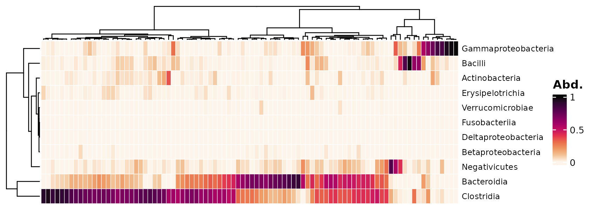
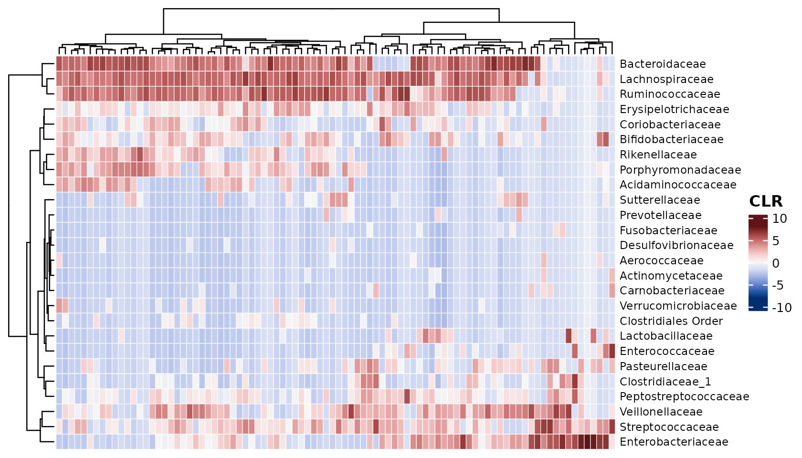
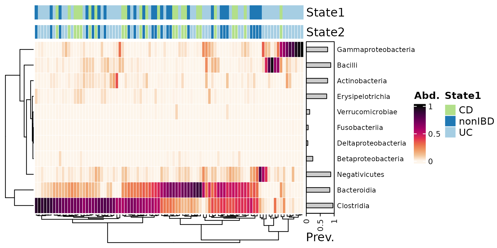
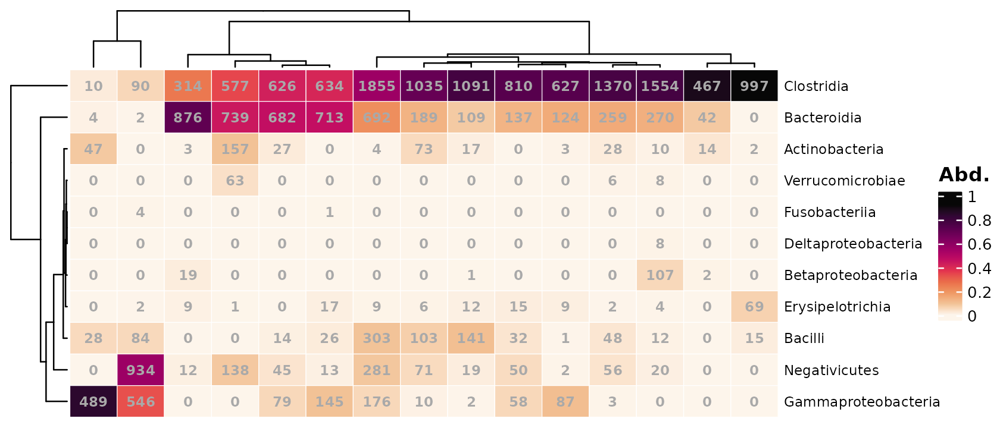
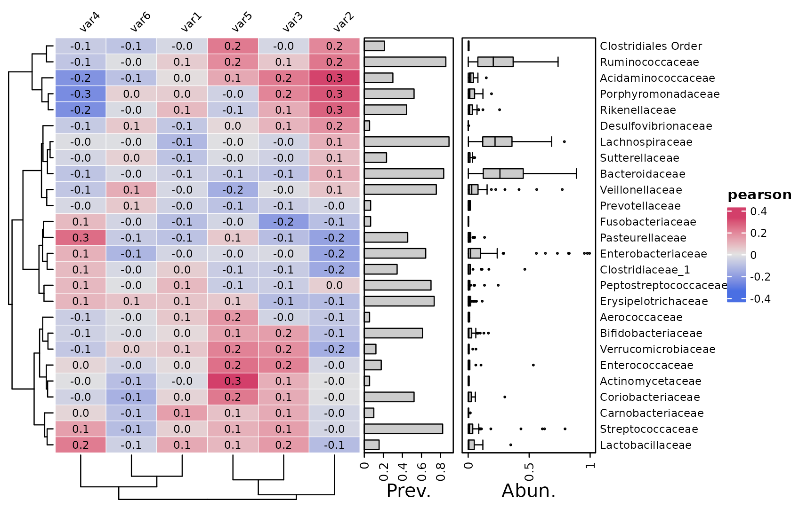
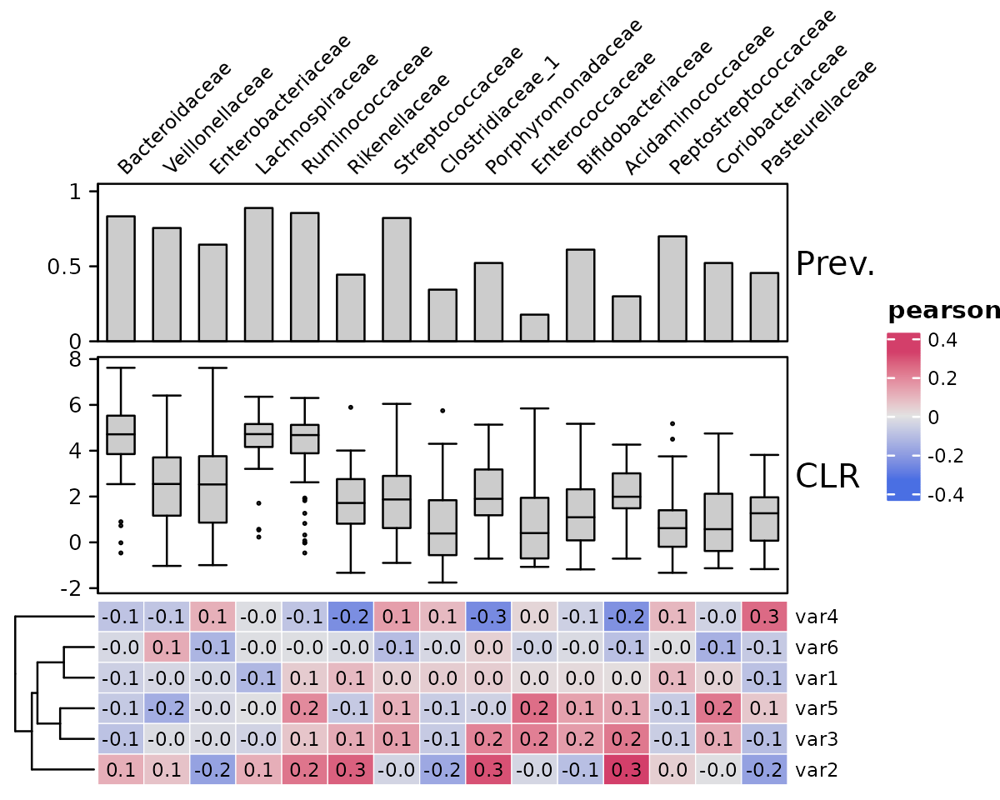
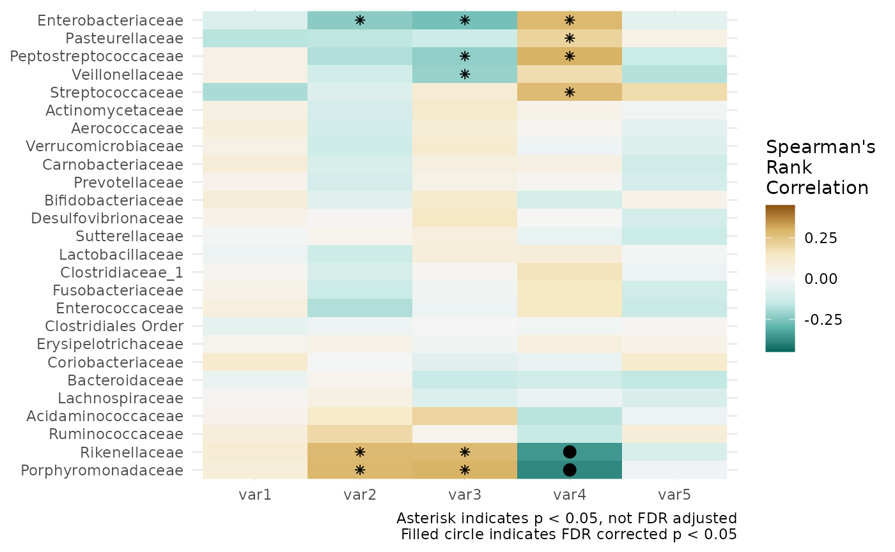

# microViz annotated heatmaps

This article will show you how to plot annotated correlation and
microbial composition heatmaps with microViz.

## Setup

``` r
library(dplyr)
#> 
#> Attaching package: 'dplyr'
#> The following objects are masked from 'package:stats':
#> 
#>     filter, lag
#> The following objects are masked from 'package:base':
#> 
#>     intersect, setdiff, setequal, union
library(phyloseq)
library(microViz)
#> microViz version 0.13.0 - Copyright (C) 2021-2026 David Barnett
#> ! Website: https://david-barnett.github.io/microViz
#> ✔ Useful?  For citation details, run: `citation("microViz")`
#> ✖ Silence? `suppressPackageStartupMessages(library(microViz))`
```

First we’ll get some OTU abundance data from inflammatory bowel disease
patients and controls from the corncob package.

``` r
data("ibd", package = "microViz")
ibd
#> phyloseq-class experiment-level object
#> otu_table()   OTU Table:         [ 36349 taxa and 91 samples ]
#> sample_data() Sample Data:       [ 91 samples by 15 sample variables ]
#> tax_table()   Taxonomy Table:    [ 36349 taxa by 7 taxonomic ranks ]
```

Remove the mostly unclassified species-level data, drop the rare taxa
and fix the taxonomy of the rest. Also drop patients with unclassified
IBD.

``` r
psq <- ibd %>%
  tax_mutate(Species = NULL) %>%
  tax_filter(min_prevalence = 5) %>%
  tax_fix() %>%
  ps_filter(DiseaseState != "IBDundef")
psq
#> phyloseq-class experiment-level object
#> otu_table()   OTU Table:         [ 1599 taxa and 90 samples ]
#> sample_data() Sample Data:       [ 90 samples by 15 sample variables ]
#> tax_table()   Taxonomy Table:    [ 1599 taxa by 6 taxonomic ranks ]
```

## Microbiome heatmaps

Visualise the microbial composition of your samples.

The samples and taxa are sorted by similarity. (*By default this uses
hierarchical clustering with optimal leaf ordering, using euclidean
distances on the transformed data*).

In this example we use a “compositional” transformation, so the Class
abundances are shown as proportions of each sample.

``` r
psq %>%
  tax_transform("compositional", rank = "Class") %>%
  comp_heatmap()
#> Registered S3 method overwritten by 'seriation':
#>   method         from 
#>   reorder.hclust vegan
```



You can easily swap to a symmetrical colour palette for transformations
like “clr” or “standardize”. This is the default symmetrical palette but
you can pick from many.

``` r
psq %>%
  tax_transform("clr", rank = "Family") %>%
  comp_heatmap(colors = heat_palette(sym = TRUE), name = "CLR")
```



### Annotating taxa

``` r
psq %>%
  tax_transform("compositional", rank = "Class") %>%
  comp_heatmap(tax_anno = taxAnnotation(
    Prev. = anno_tax_prev(bar_width = 0.3, size = grid::unit(1, "cm"))
  ))
```


### Legend positioning

Positioning the heatmap legend at the bottom is possible. You can assign
the heatmap to a name and then call `ComplexHeatmap`’s `draw` function.

``` r
heat <- psq %>%
  tax_transform("compositional", rank = "Class") %>%
  comp_heatmap(
    tax_anno = taxAnnotation(
      Prev. = anno_tax_prev(bar_width = 0.3, size = grid::unit(1, "cm"))
    ),
    heatmap_legend_param = list(
      at = 0:5 / 5,
      direction = "horizontal", title_position = "leftcenter",
      legend_width = grid::unit(4, "cm"), grid_height = grid::unit(5, "mm")
    )
  )

ComplexHeatmap::draw(
  object = heat, heatmap_legend_side = "bottom",
  adjust_annotation_extension = FALSE
)
```


### Annotating samples

#### Group membership

2 different methods for annotating each sample’s values of categorical
metadata are possible.

- [`anno_sample()`](https://david-barnett.github.io/microViz/reference/anno_sample.md)
  cannot have borders around each cell, but automatically adds a legend.

- [`anno_sample_cat()`](https://david-barnett.github.io/microViz/reference/anno_sample_cat.md)
  can have cell borders, but requires an extra step to draw a legend

``` r
cols <- distinct_palette(n = 3, add = NA)
names(cols) <- unique(samdat_tbl(psq)$DiseaseState)

psq %>%
  tax_transform("compositional", rank = "Class") %>%
  comp_heatmap(
    tax_anno = taxAnnotation(
      Prev. = anno_tax_prev(bar_width = 0.3, size = grid::unit(1, "cm"))
    ),
    sample_anno = sampleAnnotation(
      State1 = anno_sample("DiseaseState"),
      col = list(State1 = cols), border = FALSE,
      State2 = anno_sample_cat("DiseaseState", col = cols)
    )
  )
```



Let’s try drawing equivalent categorical annotations by two methods.
Both methods can draw annotations with borders and no individual boxes.
This style suits heatmaps with no gridlines (i.e. `grid_col = NA`).

In the example below we have suppressed row ordering with
`cluster_rows = FALSE`, and added spaces between taxa by splitting at
every row with `row_split = 1:11`, which are both
[`ComplexHeatmap::Heatmap()`](https://rdrr.io/pkg/ComplexHeatmap/man/Heatmap.html)
arguments.

``` r
psqC <- psq %>% tax_transform("compositional", rank = "Class")

htmp <- psqC %>%
  comp_heatmap(
    grid_col = NA,
    cluster_rows = FALSE, row_title = NULL,
    row_split = seq_len(ntaxa(ps_get(psqC))),
    tax_anno = taxAnnotation(
      Prev. = anno_tax_prev(bar_width = 0.9, size = grid::unit(1, "cm"), border = F)
    ),
    sample_anno = sampleAnnotation(
      # method one
      State1 = anno_sample("DiseaseState"),
      col = list(State1 = cols), border = TRUE,
      # method two
      State2 = anno_sample_cat(
        var = "DiseaseState", col = cols, box_col = NA, border_col = "black",
        legend_title = "State2"
      )
    )
  )
htmp %>% ComplexHeatmap::draw(
  annotation_legend_list = attr(htmp, "AnnoLegends")
)
```


You can also manually draw a legend with the convenience function
[`anno_cat_legend()`](https://david-barnett.github.io/microViz/reference/anno_cat_legend.md).

``` r
grid::grid.newpage()
anno_cat_legend(
  col = c("a level" = "red", "another level" = "blue", c = "white"),
  border = "black", gap = grid::unit(2, "cm"), ncol = 3
) %>%
  ComplexHeatmap::draw()
```


### Arranging samples

Instead of sorting samples by similarity, you can alternatively arrange
the samples beforehand with ps_arrange or other methods, and then
suppress reordering of the heatmap with sample_seriation = “Identity”

``` r
cols <- distinct_palette(n = 3, add = NA)
names(cols) <- unique(samdat_tbl(psq)$DiseaseState)

psq %>%
  # sort all samples by similarity
  ps_seriate(rank = "Class", tax_transform = "compositional", dist = "bray") %>% 
  # arrange the samples into Disease State groups
  ps_arrange(DiseaseState) %>% 
  tax_transform("compositional", rank = "Class") %>%
  comp_heatmap(
    tax_anno = taxAnnotation(
      Prev. = anno_tax_prev(bar_width = 0.3, size = grid::unit(1, "cm"))
    ),
    sample_anno = sampleAnnotation(
      State1 = anno_sample("DiseaseState"),
      col = list(State1 = cols), border = FALSE,
      State2 = anno_sample_cat("DiseaseState", col = cols)
    ),
    sample_seriation = "Identity" # suppress sample reordering
  )
```


### Numbering cells

If you have fewer samples (and taxa) you might like to label the cells
with their values. By default, the raw counts are shown.

``` r
psq %>%
  tax_transform("compositional", rank = "Class") %>%
  comp_heatmap(samples = 1:15, numbers = heat_numbers())
```



You can easily change to showing the same values as the colours by
setting `numbers_use_counts = FALSE`, and you can/should change the
number of decimals shown too.

``` r
psq %>%
  tax_transform("compositional", rank = "Class") %>%
  comp_heatmap(
    samples = 1:15, numbers_use_counts = FALSE,
    numbers = heat_numbers(decimals = 2)
  )
```


The numbers can any transformation of counts, irrespective of what
transformations were used for the colours, or seriation.

``` r
psq %>%
  tax_transform("binary", undetected = 0, rank = "Class") %>%
  comp_heatmap(
    samples = 1:15, numbers_use_counts = TRUE, numbers_trans = "compositional",
    numbers = heat_numbers(decimals = 2, col = "white"),
    show_heatmap_legend = FALSE
  )
```


To demonstrate that coloration, numbering and seriation can all use
different transformations of the original count data, the example below
we specifies seriating the taxa and samples using the same numerical
values used for the numbers transformation, not the colours, which are
just presence/absence!

``` r
psq %>%
  tax_transform("binary", undetected = 0, rank = "Class") %>%
  comp_heatmap(
    samples = 1:15,
    sample_ser_counts = TRUE, sample_ser_trans = "compositional",
    tax_ser_counts = TRUE, tax_ser_trans = "compositional",
    numbers_use_counts = TRUE, numbers_trans = "compositional",
    numbers = heat_numbers(decimals = 2, col = "white"),
    show_heatmap_legend = FALSE
  )
```


## Correlation heatmaps

Correlation heatmaps can be a nice way to quickly assess patterns of
associations between numerical variables in your dataset, such as
microbial abundances and other metadata.

Let’s make some fake numeric variables to exemplify this.

``` r
set.seed(111) # ensures making same random variables every time!
psq <- psq %>%
  ps_arrange(ibd) %>%
  ps_mutate(
    var1 = rnorm(nsamples(psq), mean = 10, sd = 3),
    var2 = c(
      rnorm(nsamples(psq) * 0.75, mean = 4, sd = 2),
      rnorm(1 + nsamples(psq) / 4, mean = 9, sd = 3)
    ),
    var3 = runif(nsamples(psq), 2, 10),
    var4 = rnorm(nsamples(psq), mean = 100 + nsamples(psq):0, sd = 20) / 20,
    var5 = rnorm(nsamples(psq), mean = 5, sd = 2),
    var6 = rnbinom(nsamples(psq), size = 1:75 / 10, mu = 5)
  )
```

### Calculating correlations

By default, the `cor_heatmap` function will correlate all taxa to all
numerical sample data, using pearson correlation method.

``` r
psq %>%
  tax_agg("Family") %>%
  cor_heatmap(vars = c("var1", "var2", "var3", "var4", "var5", "var6"))
```



It’s easy to change to a different method, i.e. spearman’s rank
correlation or kendall’s tau, which will be reflected in the legend
title. We will also specify to use only the 15 most abundant taxa, by
maximum count, just to make these tutorial figures a little more
compact!

``` r
psq %>%
  tax_agg("Family") %>%
  cor_heatmap(
    taxa = tax_top(psq, 15, by = max, rank = "Family"),
    vars = paste0("var", 1:6), cor = "spearman"
  )
```


*Older versions of microViz `cor_heatmap` had a `tax_transform`
argument. But for flexibility, you must now transform your taxa
**before** passing the psExtra object to `cor_heatmap`.*

Here we have transformed our taxa with the “clr” or centered-log-ratio
transformation prior to correlating. *Notice that the annotations stay
on the same scale, as by default the annotation functions extract the
stored counts data from the psExtra input, not the transformed data.*

``` r
psq %>%
  tax_agg("Family") %>%
  tax_transform("clr", zero_replace = "halfmin") %>%
  cor_heatmap(
    taxa = tax_top(psq, 15, by = max, rank = "Family"),
    vars = paste0("var", 1:6)
  )
```


Let’s transform and scale the taxon abundances before correlating.

``` r
psq %>%
  tax_agg("Family") %>%
  tax_transform("clr", zero_replace = "halfmin") %>%
  cor_heatmap(
    taxa = tax_top(psq, 15, by = max, rank = "Family"),
    vars = paste0("var", 1:6)
  )
```


### Taxon annotations

As seen in the previous plots taxa are annotated by default with
prevalence and relative abundance.

You can transform the taxa for the abundance annotation. The `trans` and
`zero_replace` arguments are sent to
[`tax_transform()`](https://david-barnett.github.io/microViz/reference/tax_transform.md).

``` r
psq %>%
  tax_agg("Family") %>%
  cor_heatmap(
    taxa = tax_top(psq, 15, by = max, rank = "Family"),
    vars = paste0("var", 1:6),
    tax_anno = taxAnnotation(
      Prev. = anno_tax_prev(ylim = 0:1),
      Log10. = anno_tax_box(trans = "log10", zero_replace = "halfmin")
    )
  )
```


You can do multiple transformations and or scaling by supplying a
function, that takes a psExtra or phyloseq object, transforms it, and
returns it.

``` r
psq %>%
  tax_agg("Family") %>%
  cor_heatmap(
    taxa = tax_top(psq, 15, by = max, rank = "Family"),
    vars = paste0("var", 1:6),
    tax_anno = taxAnnotation(
      Log2 = anno_tax_density(
        joyplot_scale = 2, gp = grid::gpar(fill = "black", alpha = 0.2),
        trans = "log2", zero_replace = 1
      ),
      `prop Log2` = anno_tax_density(
        joyplot_scale = 1.5, gp = grid::gpar(fill = "black", alpha = 0.2),
        trans = function(ps) {
          ps %>%
            tax_transform("compositional", zero_replace = 1) %>%
            tax_transform("log2", chain = TRUE)
        }
      )
    )
  )
```


Note that by default the relative abundance is shown only for samples
where the taxon is detected! You can include values for all samples for
all taxa by setting `only_detected = FALSE`.

Let’s try this with a heatmap-style density plot annotation. We’ll
replace zeroes with ones for an interpretable minimum value on the plot.

We’ll compare it side-by-side with the default setting of showing only
distribution of values above the detection threshold.

For zero-inflated microbiome data, showing prevalence and “abundance
when detected” often seems like a more informative annotation.

``` r
psq %>%
  tax_agg("Family") %>%
  cor_heatmap(
    taxa = tax_top(psq, 15, by = max, rank = "Family"),
    vars = paste0("var", 1:6),
    tax_anno = taxAnnotation(
      Prev. = anno_tax_prev(size = grid::unit(10, "mm"), ylim = 0:1),
      All = anno_tax_density(
        size = grid::unit(20, "mm"),
        trans = "log10", zero_replace = 1,
        heatmap_colors = viridisLite::turbo(n = 15),
        type = "heatmap", only_detected = FALSE
      ),
      Default = anno_tax_density(
        size = grid::unit(20, "mm"),
        trans = "log10", zero_replace = 1,
        heatmap_colors = viridisLite::turbo(n = 15),
        type = "heatmap", only_detected = TRUE
      )
    )
  )
```


#### Sorting

By default, rows and columns are sorted using hierarchical clustering
with optimal leaf ordering `"OLO_ward"`. You can use any valid method
from the `seriation` package. You can suppress ordering by using
`seriation_method = "Identity"`. By default this also suppresses column
ordering, so you can set `seriation_method_col = OLO_ward` to keep
ordering.

``` r
psq %>%
  tax_agg("Family") %>%
  tax_sort(by = prev, at = "Family") %>%
  cor_heatmap(
    seriation_method = "Identity",
    seriation_method_col = "OLO_ward",
    taxa = tax_top(psq, 15, by = max, rank = "Family"),
    vars = paste0("var", 1:6),
    tax_anno = taxAnnotation(
      Prev. = anno_tax_prev(ylim = 0:1),
      CLR = anno_tax_box(trans = "clr", zero_replace = "halfmin")
    )
  )
```


#### Taxa annotation side

You can easily put the taxa annotations on another of the heatmap with
e.g. `taxa_side = "left"`

``` r
psq %>%
  tax_agg("Family") %>%
  tax_sort(by = prev, at = "Family") %>%
  cor_heatmap(
    seriation_method = "Identity",
    seriation_method_col = "OLO_ward",
    taxa_side = "left",
    taxa = tax_top(psq, 15, by = max, rank = "Family"),
    vars = paste0("var", 1:6),
    tax_anno = taxAnnotation(
      Prev. = anno_tax_prev(ylim = 0:1),
      CLR = anno_tax_box(trans = "clr", zero_replace = "halfmin")
    )
  )
```


Or on the top or bottom is also possible, this will rotate the heatmap.
Remember to swap the seriation method arguments around!

``` r
psq %>%
  tax_agg("Family") %>%
  tax_sort(by = prev, at = "Family") %>%
  cor_heatmap(
    seriation_method_col = "Identity", # swapped!
    seriation_method = "OLO_ward", # swapped!
    taxa_side = "top",
    taxa = tax_top(psq, 15, by = max, rank = "Family"),
    vars = paste0("var", 1:6),
    tax_anno = taxAnnotation(
      Prev. = anno_tax_prev(ylim = 0:1),
      CLR = anno_tax_box(trans = "clr", zero_replace = "halfmin")
    )
  )
```



### Variable annotation

As well as annotating the taxa, you can also annotate the variables.

``` r
psq %>%
  tax_agg("Family") %>%
  cor_heatmap(
    taxa = tax_top(psq, 15, by = max, rank = "Family"),
    vars = paste0("var", 1:6),
    var_anno = varAnnotation(
      Value = anno_var_box(),
      Zscore = anno_var_density(fun = scale, type = "violin")
    )
  )
```


### Alternative: ggplot correlation heatmaps with p-values

In response to a number of questions/requests about annotating
correlation heatmaps with p-values: `cor_heatmap` cannot do this, so
here is an alternative way using `tax_model`.

``` r
# compute correlations, with p values, and store in a dataframe
correlations_df <- psq %>% 
  tax_model(
    trans = "clr",
    rank = "Family", variables = list("var1", "var2", "var3", "var4", "var5"), 
    type = microViz::cor_test, method = "spearman", 
    return_psx = FALSE, verbose = FALSE
  ) %>% 
  tax_models2stats(rank = "Family")

# get nice looking ordering of correlation estimates using hclust
taxa_hclust <- correlations_df %>% 
  dplyr::select(term, taxon, estimate) %>% 
  tidyr::pivot_wider(
    id_cols = taxon, names_from = term, values_from = estimate
  ) %>% 
  tibble::column_to_rownames("taxon") %>% 
  as.matrix() %>% 
  stats::dist(method = "euclidean") %>% 
  hclust(method = "ward.D2") 

taxa_order <- taxa_hclust$labels[taxa_hclust$order]
```

``` r
library(ggplot2)

correlations_df %>% 
  mutate(p.FDR = p.adjust(p.value, method = "fdr")) %>% 
  ggplot(aes(x = term, y = taxon)) +
  geom_raster(aes(fill = estimate)) +
  geom_point(
    data = function(x) filter(x, p.value < 0.05),
    shape = "asterisk"
  ) +
  geom_point(
    data = function(x) filter(x, p.FDR < 0.05),
    shape = "circle", size = 3
  ) +
  scale_y_discrete(limits = taxa_order) +
  scale_fill_distiller(palette = "BrBG", limits = c(-0.45, 0.45)) + 
  theme_minimal() +
  labs(
    x = NULL, y = NULL, fill = "Spearman's\nRank\nCorrelation",
    caption = paste(
      "Asterisk indicates p < 0.05, not FDR adjusted",
      "Filled circle indicates FDR corrected p < 0.05", sep = "\n"
  ))
```



Additionally, with the `scale_y_dendro` function from the [legendry
package](https://teunbrand.github.io/legendry) you can add a
visualisation of the hclust dendrogram to the y axis. See:
<https://teunbrand.github.io/legendry/reference/scale_y_dendro.html>

## Other stuff

Complicated stuff demonstrated down here, not necessarily useful.

### Custom breaks and seriation

Two approaches to custom colour scale breaks. The first way is better,
because the colour scale is interpolated through the default 11 colours,
instead of only 5.

Transform data and customise only labels.

``` r
psq %>%
  tax_transform("compositional", rank = "Class") %>%
  tax_transform("log10", zero_replace = "halfmin", chain = TRUE) %>%
  comp_heatmap(
    tax_anno = taxAnnotation(
      Prev. = anno_tax_prev(bar_width = 0.3, size = grid::unit(1, "cm"))
    ),
    heatmap_legend_param = list(
      labels = rev(c("100%", " 10%", "  1%", " 0.1%", "0.01%"))
    )
  )
```


This alternative way might be helpful in some cases, maybe… It
demonstrates that custom breaks can be set in
[`heat_palette()`](https://david-barnett.github.io/microViz/reference/heat_palette.md).

``` r
# seriation transform
serTrans <- function(x) {
  tax_transform(x, trans = "log10", zero_replace = "halfmin", chain = TRUE)
}

psq %>%
  tax_transform("compositional", rank = "Class") %>%
  comp_heatmap(
    sample_ser_trans = serTrans, tax_ser_trans = serTrans,
    colors = heat_palette(breaks = c(0.0001, 0.001, 0.01, 0.1, 1), rev = T),
    tax_anno = taxAnnotation(
      Prev. = anno_tax_prev(bar_width = 0.3, size = grid::unit(1, "cm"))
    ),
    heatmap_legend_param = list(at = c(0.0001, 0.001, 0.01, 0.1, 1), break_dist = 1)
  )
```


## Session info

``` r
devtools::session_info()
#> ─ Session info ───────────────────────────────────────────────────────────────
#>  setting  value
#>  version  R version 4.5.2 (2025-10-31)
#>  os       Ubuntu 24.04.3 LTS
#>  system   x86_64, linux-gnu
#>  ui       X11
#>  language en
#>  collate  C.UTF-8
#>  ctype    C.UTF-8
#>  tz       UTC
#>  date     2026-02-17
#>  pandoc   3.1.11 @ /opt/hostedtoolcache/pandoc/3.1.11/x64/ (via rmarkdown)
#>  quarto   NA
#> 
#> ─ Packages ───────────────────────────────────────────────────────────────────
#>  package        * version  date (UTC) lib source
#>  ade4             1.7-23   2025-02-14 [1] RSPM
#>  ape              5.8-1    2024-12-16 [1] RSPM
#>  backports        1.5.0    2024-05-23 [1] RSPM
#>  Biobase          2.70.0   2025-10-29 [1] Bioconduc~
#>  BiocGenerics     0.56.0   2025-10-29 [1] Bioconduc~
#>  biomformat       1.38.0   2025-10-29 [1] Bioconduc~
#>  Biostrings       2.78.0   2025-10-29 [1] Bioconduc~
#>  broom            1.0.12   2026-01-27 [1] RSPM
#>  bslib            0.10.0   2026-01-26 [1] RSPM
#>  ca               0.71.1   2020-01-24 [1] RSPM
#>  cachem           1.1.0    2024-05-16 [1] RSPM
#>  circlize         0.4.17   2025-12-08 [1] RSPM
#>  cli              3.6.5    2025-04-23 [1] RSPM
#>  clue             0.3-66   2024-11-13 [1] RSPM
#>  cluster          2.1.8.1  2025-03-12 [3] CRAN (R 4.5.2)
#>  codetools        0.2-20   2024-03-31 [3] CRAN (R 4.5.2)
#>  colorspace       2.1-2    2025-09-22 [1] RSPM
#>  ComplexHeatmap   2.26.1   2026-02-03 [1] Bioconduc~
#>  corncob          0.4.2    2025-03-29 [1] RSPM
#>  crayon           1.5.3    2024-06-20 [1] RSPM
#>  data.table       1.18.2.1 2026-01-27 [1] RSPM
#>  desc             1.4.3    2023-12-10 [1] RSPM
#>  devtools         2.4.6    2025-10-03 [1] RSPM
#>  digest           0.6.39   2025-11-19 [1] RSPM
#>  doParallel       1.0.17   2022-02-07 [1] RSPM
#>  dplyr          * 1.2.0    2026-02-03 [1] RSPM
#>  ellipsis         0.3.2    2021-04-29 [1] RSPM
#>  evaluate         1.0.5    2025-08-27 [1] RSPM
#>  farver           2.1.2    2024-05-13 [1] RSPM
#>  fastmap          1.2.0    2024-05-15 [1] RSPM
#>  foreach          1.5.2    2022-02-02 [1] RSPM
#>  fs               1.6.6    2025-04-12 [1] RSPM
#>  generics         0.1.4    2025-05-09 [1] RSPM
#>  GetoptLong       1.1.0    2025-11-28 [1] RSPM
#>  ggplot2        * 4.0.2    2026-02-03 [1] RSPM
#>  GlobalOptions    0.1.3    2025-11-28 [1] RSPM
#>  glue             1.8.0    2024-09-30 [1] RSPM
#>  gtable           0.3.6    2024-10-25 [1] RSPM
#>  htmltools        0.5.9    2025-12-04 [1] RSPM
#>  htmlwidgets      1.6.4    2023-12-06 [1] RSPM
#>  igraph           2.2.2    2026-02-12 [1] RSPM
#>  IRanges          2.44.0   2025-10-29 [1] Bioconduc~
#>  iterators        1.0.14   2022-02-05 [1] RSPM
#>  jquerylib        0.1.4    2021-04-26 [1] RSPM
#>  jsonlite         2.0.0    2025-03-27 [1] RSPM
#>  knitr            1.51     2025-12-20 [1] RSPM
#>  labeling         0.4.3    2023-08-29 [1] RSPM
#>  lattice          0.22-7   2025-04-02 [3] CRAN (R 4.5.2)
#>  lifecycle        1.0.5    2026-01-08 [1] RSPM
#>  magrittr         2.0.4    2025-09-12 [1] RSPM
#>  MASS             7.3-65   2025-02-28 [3] CRAN (R 4.5.2)
#>  Matrix           1.7-4    2025-08-28 [3] CRAN (R 4.5.2)
#>  matrixStats      1.5.0    2025-01-07 [1] RSPM
#>  memoise          2.0.1    2021-11-26 [1] RSPM
#>  mgcv             1.9-3    2025-04-04 [3] CRAN (R 4.5.2)
#>  microbiome       1.32.0   2025-10-29 [1] Bioconduc~
#>  microViz       * 0.13.0   2026-02-17 [1] local
#>  multtest         2.66.0   2025-10-29 [1] Bioconduc~
#>  nlme             3.1-168  2025-03-31 [3] CRAN (R 4.5.2)
#>  otel             0.2.0    2025-08-29 [1] RSPM
#>  permute          0.9-10   2026-02-06 [1] RSPM
#>  phyloseq       * 1.54.0   2025-10-29 [1] Bioconduc~
#>  pillar           1.11.1   2025-09-17 [1] RSPM
#>  pkgbuild         1.4.8    2025-05-26 [1] RSPM
#>  pkgconfig        2.0.3    2019-09-22 [1] RSPM
#>  pkgdown          2.2.0    2025-11-06 [1] RSPM
#>  pkgload          1.5.0    2026-02-03 [1] RSPM
#>  plyr             1.8.9    2023-10-02 [1] RSPM
#>  png              0.1-8    2022-11-29 [1] RSPM
#>  purrr            1.2.1    2026-01-09 [1] RSPM
#>  R6               2.6.1    2025-02-15 [1] RSPM
#>  ragg             1.5.0    2025-09-02 [1] RSPM
#>  RColorBrewer     1.1-3    2022-04-03 [1] RSPM
#>  Rcpp             1.1.1    2026-01-10 [1] RSPM
#>  registry         0.5-1    2019-03-05 [1] RSPM
#>  remotes          2.5.0    2024-03-17 [1] RSPM
#>  reshape2         1.4.5    2025-11-12 [1] RSPM
#>  rhdf5            2.54.1   2025-12-04 [1] Bioconduc~
#>  rhdf5filters     1.22.0   2025-10-29 [1] Bioconduc~
#>  Rhdf5lib         1.32.0   2025-10-29 [1] Bioconduc~
#>  rjson            0.2.23   2024-09-16 [1] RSPM
#>  rlang            1.1.7    2026-01-09 [1] RSPM
#>  rmarkdown        2.30     2025-09-28 [1] RSPM
#>  Rtsne            0.17     2023-12-07 [1] RSPM
#>  S4Vectors        0.48.0   2025-10-29 [1] Bioconduc~
#>  S7               0.2.1    2025-11-14 [1] RSPM
#>  sass             0.4.10   2025-04-11 [1] RSPM
#>  scales           1.4.0    2025-04-24 [1] RSPM
#>  Seqinfo          1.0.0    2025-10-29 [1] Bioconduc~
#>  seriation        1.5.8    2025-08-20 [1] RSPM
#>  sessioninfo      1.2.3    2025-02-05 [1] RSPM
#>  shape            1.4.6.1  2024-02-23 [1] RSPM
#>  stringi          1.8.7    2025-03-27 [1] RSPM
#>  stringr          1.6.0    2025-11-04 [1] RSPM
#>  survival         3.8-3    2024-12-17 [3] CRAN (R 4.5.2)
#>  systemfonts      1.3.1    2025-10-01 [1] RSPM
#>  textshaping      1.0.4    2025-10-10 [1] RSPM
#>  tibble           3.3.1    2026-01-11 [1] RSPM
#>  tidyr            1.3.2    2025-12-19 [1] RSPM
#>  tidyselect       1.2.1    2024-03-11 [1] RSPM
#>  TSP              1.2.6    2025-11-27 [1] RSPM
#>  usethis          3.2.1    2025-09-06 [1] RSPM
#>  vctrs            0.7.1    2026-01-23 [1] RSPM
#>  vegan            2.7-2    2025-10-08 [1] RSPM
#>  viridisLite      0.4.3    2026-02-04 [1] RSPM
#>  withr            3.0.2    2024-10-28 [1] RSPM
#>  xfun             0.56     2026-01-18 [1] RSPM
#>  XVector          0.50.0   2025-10-29 [1] Bioconduc~
#>  yaml             2.3.12   2025-12-10 [1] RSPM
#> 
#>  [1] /home/runner/work/_temp/Library
#>  [2] /opt/R/4.5.2/lib/R/site-library
#>  [3] /opt/R/4.5.2/lib/R/library
#>  * ── Packages attached to the search path.
#> 
#> ──────────────────────────────────────────────────────────────────────────────
```
