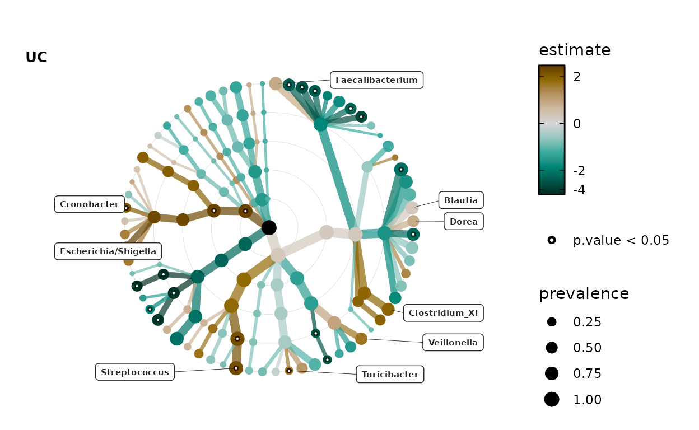
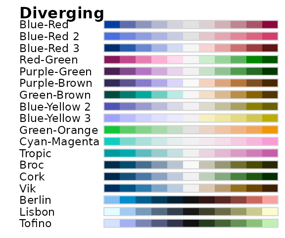
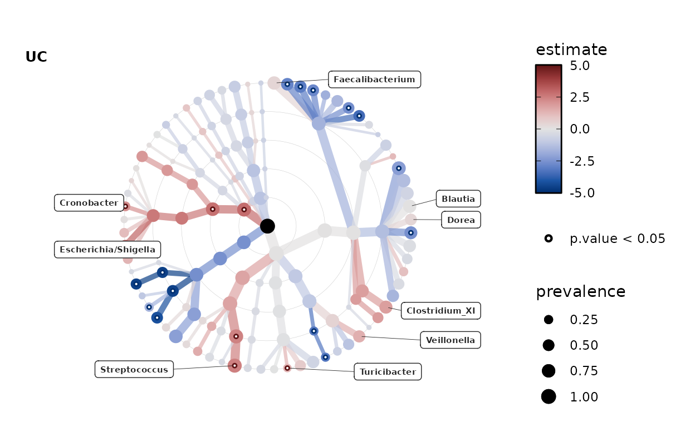
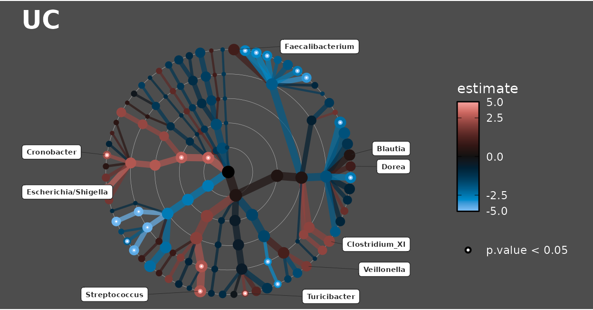
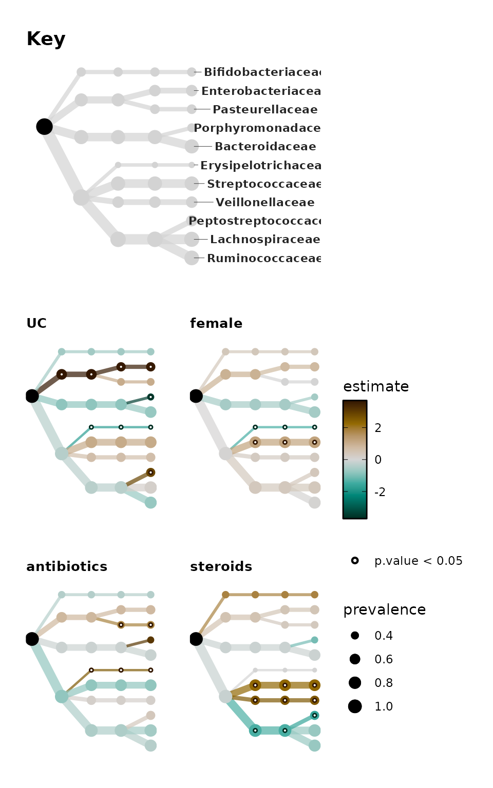
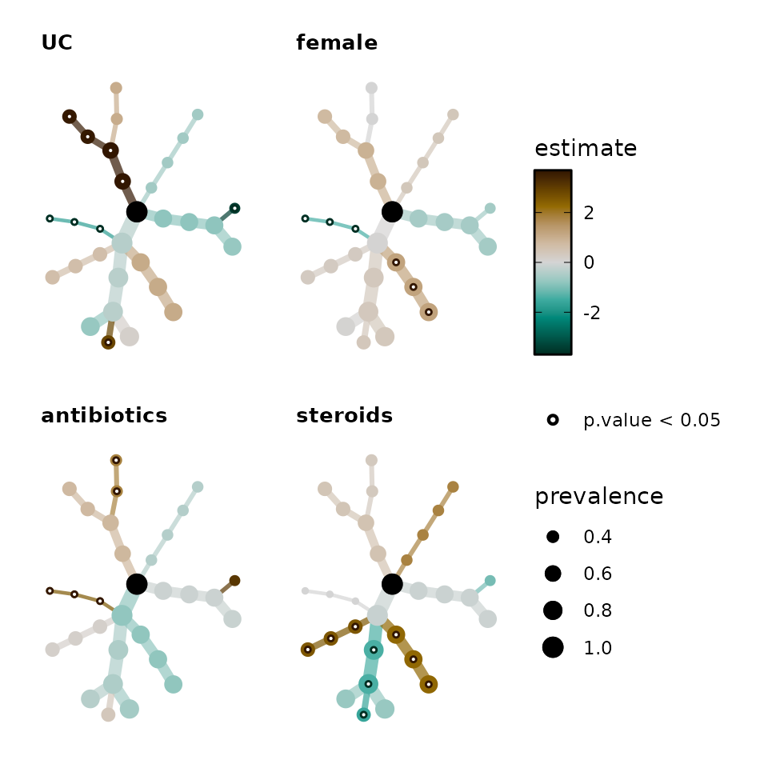

# Statistical modelling of individual taxa

### Warning: do not copy taxatree_models examples from versions before 0.11.0

The documentation from earlier versions of microViz included an
incorrect example of `taxatree_models` use. Specifically, it
accidentally demonstrated log transforming abundance data before
aggregation. Sincere apologies to anyone who followed this incorrect
procedure. Examples have been corrected in microViz docs and website for
version 0.11.0 and later. Please reach out to me with any questions
about this issue.

This article will give an example of statistical modelling of the
abundances of individual taxa, and visual presentation of the results
using microViz *taxonomic association tree* plots.

### Setup

``` r
library(microViz)
#> microViz version 0.13.0 - Copyright (C) 2021-2026 David Barnett
#> ! Website: https://david-barnett.github.io/microViz
#> ✔ Useful?  For citation details, run: `citation("microViz")`
#> ✖ Silence? `suppressPackageStartupMessages(library(microViz))`
library(corncob)
library(dplyr)
#> 
#> Attaching package: 'dplyr'
#> 
#> The following objects are masked from 'package:stats':
#> 
#>     filter, lag
#> 
#> The following objects are masked from 'package:base':
#> 
#>     intersect, setdiff, setequal, union
library(ggplot2)
```

First we’ll get some OTU abundance data from inflammatory bowel disease
patients and controls from the corncob package.

``` r
data("ibd")
ibd
#> phyloseq-class experiment-level object
#> otu_table()   OTU Table:         [ 36349 taxa and 91 samples ]
#> sample_data() Sample Data:       [ 91 samples by 15 sample variables ]
#> tax_table()   Taxonomy Table:    [ 36349 taxa by 7 taxonomic ranks ]
```

We’ll keep only the Ulcerative Colitis and Healthy Control samples, to
simplify the analyses for this example. We’ll also remove the Species
rank information, as most OTUs in this dataset are not assigned to a
species. We’ll also use `tax_fix` to fill any gaps where the Genus is
unknown, with the family name or whatever higher rank classification is
known.

``` r
phylo <- ibd %>%
  ps_filter(DiseaseState %in% c("UC", "nonIBD")) %>%
  tax_mutate(Species = NULL) %>%
  tax_fix()
phylo
#> phyloseq-class experiment-level object
#> otu_table()   OTU Table:         [ 29304 taxa and 67 samples ]
#> sample_data() Sample Data:       [ 67 samples by 15 sample variables ]
#> tax_table()   Taxonomy Table:    [ 29304 taxa by 6 taxonomic ranks ]
```

Let’s have a quick look at the sample data using the `skimr` package.

``` r
phylo %>%
  samdat_tbl() %>%
  dplyr::mutate(across(where(is.character), as.factor)) %>%
  skimr::skim()
#> Warning: There was 1 warning in `dplyr::summarize()`.
#> ℹ In argument: `dplyr::across(tidyselect::any_of(variable_names),
#>   mangled_skimmers$funs)`.
#> ℹ In group 0: .
#> Caused by warning:
#> ! There was 1 warning in `dplyr::summarize()`.
#> ℹ In argument: `dplyr::across(tidyselect::any_of(variable_names),
#>   mangled_skimmers$funs)`.
#> Caused by warning in `sorted_count()`:
#> ! Variable contains value(s) of "" that have been converted to "empty".
```

|                                                  |            |
|:-------------------------------------------------|:-----------|
| Name                                             | Piped data |
| Number of rows                                   | 67         |
| Number of columns                                | 16         |
| \_\_\_\_\_\_\_\_\_\_\_\_\_\_\_\_\_\_\_\_\_\_\_   |            |
| Column type frequency:                           |            |
| factor                                           | 15         |
| numeric                                          | 1          |
| \_\_\_\_\_\_\_\_\_\_\_\_\_\_\_\_\_\_\_\_\_\_\_\_ |            |
| Group variables                                  | None       |

Data summary

**Variable type: factor**

| skim_variable | n_missing | complete_rate | ordered | n_unique | top_counts                        |
|:--------------|----------:|--------------:|:--------|---------:|:----------------------------------|
| .sample_name  |         0 |             1 | FALSE   |       67 | 003: 1, 004: 1, 005: 1, 009: 1    |
| sample        |         0 |             1 | FALSE   |       67 | 003: 1, 004: 1, 005: 1, 009: 1    |
| gender        |         0 |             1 | FALSE   |        2 | fem: 36, mal: 31                  |
| DiseaseState  |         0 |             1 | FALSE   |        2 | UC: 43, non: 24                   |
| steroids      |         0 |             1 | FALSE   |        2 | nos: 42, ste: 25                  |
| imsp          |         0 |             1 | FALSE   |        2 | noi: 44, ims: 23                  |
| abx           |         0 |             1 | FALSE   |        2 | noa: 53, abx: 14                  |
| mesalamine    |         0 |             1 | FALSE   |        2 | nom: 61, mes: 6                   |
| ibd           |         0 |             1 | FALSE   |        2 | ibd: 43, non: 24                  |
| activity      |         0 |             1 | FALSE   |        5 | con: 24, mil: 15, ina: 11, mod: 9 |
| active        |         0 |             1 | FALSE   |        3 | act: 32, con: 24, ina: 11         |
| race          |         0 |             1 | FALSE   |        5 | Whi: 54, Bla: 4, Oth: 4, nof: 3   |
| fhx           |         0 |             1 | FALSE   |        7 | nof: 39, fhx: 17, non: 7, lev: 1  |
| imspLEVEL     |         0 |             1 | FALSE   |        7 | non: 21, sto: 11, lev: 9, lev: 9  |
| SampleType    |         0 |             1 | FALSE   |        2 | sto: 56, emp: 11                  |

**Variable type: numeric**

| skim_variable | n_missing | complete_rate |  mean |   sd |  p0 | p25 | p50 | p75 | p100 | hist  |
|:--------------|----------:|--------------:|------:|-----:|----:|----:|----:|----:|-----:|:------|
| age           |         0 |             1 | 12.09 | 4.81 |   3 | 8.5 |  12 |  15 |   24 | ▅▇▇▅▂ |

Let’s make some sample data variables that are easier to use and compare
in the statistical modelling ahead. We will convert dichotomous
categorical variables into similar binary variables (values: 1 for true,
or 0 for false). We will also scale and center the numeric variable for
age.

``` r
phylo <- phylo %>%
  ps_mutate(
    UC = ifelse(DiseaseState == "UC", yes = 1, no = 0),
    female = ifelse(gender == "female", yes = 1, no = 0),
    antibiotics = ifelse(abx == "abx", yes = 1, no = 0),
    steroids = ifelse(steroids == "steroids", yes = 1, no = 0),
    age_scaled = scale(age, center = TRUE, scale = TRUE)
  )
```

### Modelling one taxon at a time

#### TSS log2 linear regression

We will start by creating a linear regression model for one genus,
*Bacteroides*. We will transform the count data by first making it
proportions with `tax_transform("compositional")`. We will replace the
zeros with half the minimum observed abundance proportion (of any taxon)
before log2 transformation. We do this second transformation step by
passing trans = “log2” to the tax_model function. This two-step
transformation is borrowed from MaAsLin2 (except in MaAsLin2 the
compositional transformation is named “Total Sum Scaling (TSS)”).

``` r
parabacteroides_lm <- phylo %>%
  tax_fix() %>%
  tax_transform("compositional", rank = "Genus") %>%
  tax_model(
    type = "lm", rank = "Genus", taxa = "Parabacteroides",
    trans = "log2", trans_args = list(zero_replace = "halfmin"),
    variables = c("UC", "female", "antibiotics", "steroids", "age_scaled"),
    return_psx = FALSE
  )
#> Modelling: Parabacteroides
parabacteroides_lm$Parabacteroides
#> 
#> Call:
#> Parabacteroides ~ UC + female + antibiotics + steroids + age_scaled
#> 
#> Coefficients:
#> (Intercept)           UC       female  antibiotics     steroids   age_scaled  
#>    -6.36997     -4.20062     -0.62692      0.07118     -0.95014      0.19781
```

``` r
summary(parabacteroides_lm$Parabacteroides)
#> 
#> Call:
#> Parabacteroides ~ UC + female + antibiotics + steroids + age_scaled
#> 
#> Residuals:
#>    Min     1Q Median     3Q    Max 
#> -7.344 -2.111 -1.308  2.297  7.492 
#> 
#> Coefficients:
#>             Estimate Std. Error t value Pr(>|t|)    
#> (Intercept) -6.36997    0.95271  -6.686    8e-09 ***
#> UC          -4.20062    1.22791  -3.421  0.00112 ** 
#> female      -0.62692    0.87225  -0.719  0.47505    
#> antibiotics  0.07118    1.18629   0.060  0.95235    
#> steroids    -0.95014    1.11976  -0.849  0.39946    
#> age_scaled   0.19781    0.49236   0.402  0.68926    
#> ---
#> Signif. codes:  0 '***' 0.001 '**' 0.01 '*' 0.05 '.' 0.1 ' ' 1
#> 
#> Residual standard error: 3.452 on 61 degrees of freedom
#> Multiple R-squared:  0.3109, Adjusted R-squared:  0.2545 
#> F-statistic: 5.505 on 5 and 61 DF,  p-value: 0.0003018
```

This model suggests *Parabacteroides* abundances are significantly lower
in Ulcerative Colitis patients than controls, on average.

#### Plotting TSS log2 data

Let’s boxplot the transformed data to see what this *Parabacteroides*
association looks like as a crude group difference.

``` r
plot_data <- phylo %>%
  tax_fix() %>%
  tax_transform("compositional", rank = "Genus") %>%
  tax_transform("log2", zero_replace = "halfmin", chain = TRUE) %>%
  ps_get() %>%
  ps_otu2samdat("Parabacteroides") %>% # adds Parabacteroides as sample data!
  samdat_tbl()

ggplot(plot_data, aes(x = DiseaseState, y = Parabacteroides)) +
  geom_boxplot(width = 0.5, colour = "grey35") +
  geom_jitter(width = 0.2, alpha = 0.5) +
  scale_y_continuous(
    breaks = log2(1 / 2^(0:13)),
    labels = function(x) paste0(100 * round(2^x, digits = 5), "%"),
    limits = c(log2(0.00005), log2(0.25))
  ) +
  theme_bw()
```


#### Beta binomial regression

You can also use other regression modelling functions that take a
formula. For example the beta binomial modelling provided in the corncob
package. This approach models both abundance and dispersion, and
directly uses untransformed counts. By default, microViz’s
[`tax_model()`](https://david-barnett.github.io/microViz/reference/tax_model.md)
will use the same formula for both abundance and dispersion modelling,
but you can override this by setting the `phi.formula` argument
yourself. See
[`vignette("corncob-intro", package = "corncob")`](https://statdivlab.github.io/corncob/articles/corncob-intro.html)
for more info on these models.

``` r
parabacteroides_bb <- phylo %>%
  tax_fix() %>%
  tax_model(
    type = corncob::bbdml, rank = "Genus", taxa = "Parabacteroides",
    variables = c("UC", "female", "antibiotics", "steroids", "age_scaled"),
    return_psx = FALSE
  )
#> Modelling: Parabacteroides
parabacteroides_bb$Parabacteroides
#> 
#> Call:
#> Parabacteroides ~ UC + female + antibiotics + steroids + age_scaled
#> 
#> 
#> Coefficients associated with abundance:
#>             Estimate Std. Error t value Pr(>|t|)    
#> (Intercept) -3.22672    0.67443  -4.784 1.33e-05 ***
#> UC          -1.99769    0.93236  -2.143   0.0366 *  
#> female      -0.20320    0.65852  -0.309   0.7588    
#> antibiotics -0.22137    1.56656  -0.141   0.8881    
#> steroids     0.41015    1.47997   0.277   0.7827    
#> age_scaled   0.04753    0.39951   0.119   0.9057    
#> ---
#> Signif. codes:  0 '***' 0.001 '**' 0.01 '*' 0.05 '.' 0.1 ' ' 1
#> 
#> 
#> Coefficients associated with dispersion:
#>             Estimate Std. Error t value Pr(>|t|)   
#> (Intercept) -2.54699    0.85001  -2.996  0.00409 **
#> UC          -0.93739    1.21342  -0.773  0.44311   
#> female      -0.12331    0.83238  -0.148  0.88277   
#> antibiotics -0.16097    1.97520  -0.081  0.93534   
#> steroids     1.57666    1.87989   0.839  0.40527   
#> age_scaled  -0.02351    0.52912  -0.044  0.96472   
#> ---
#> Signif. codes:  0 '***' 0.001 '**' 0.01 '*' 0.05 '.' 0.1 ' ' 1
#> 
#> 
#> Log-likelihood: -211.25
```

### Model all the taxa!

Now we will fit a similar model for almost every taxon at every rank.
The code for `taxatree_models` is quite similar to `tax_model`. However,
you might need to run `tax_prepend_ranks` to ensure that each taxon at
each rank is always unique. As an example of the problem, Actinobacteria
is the name of both a Phylum and a Class!

``` r
lm_models <- phylo %>%
  tax_fix() %>%
  tax_prepend_ranks() %>%
  # it makes sense to perform the compositional transformation BEFORE filtering
  tax_transform("compositional", rank = "Genus", keep_counts = TRUE) %>%
  tax_filter(min_prevalence = 0.1, undetected = 0, use_counts = TRUE) %>%
  taxatree_models(
    type = lm,
    trans = "log2", trans_args = list(zero_replace = "halfmin"),
    ranks = NULL, # uses every rank available except the first
    variables = c("UC", "female", "antibiotics", "steroids", "age_scaled")
  )
#> Proportional min_prevalence given: 0.1 --> min 7/67 samples.
#> 2026-02-17 09:21:53.025508 - modelling at rank: Phylum
#> 2026-02-17 09:21:53.187684 - modelling at rank: Class
#> 2026-02-17 09:21:53.453394 - modelling at rank: Order
#> 2026-02-17 09:21:53.760894 - modelling at rank: Family
#> 2026-02-17 09:21:54.297745 - modelling at rank: Genus
```

Why filter the taxa? *It’s less likely that we are interested in rare
taxa, and models of rare taxon abundances are more likely to be
unreliable. Reducing the the number of taxa modelled also makes
visualising the results easier!*

``` r
lm_models
#> psExtra object - a phyloseq object with extra slots:
#> 
#> phyloseq-class experiment-level object
#> otu_table()   OTU Table:         [ 68 taxa and 67 samples ]
#> sample_data() Sample Data:       [ 67 samples by 19 sample variables ]
#> tax_table()   Taxonomy Table:    [ 68 taxa by 6 taxonomic ranks ]
#> 
#> otu_get(counts = TRUE)        [ 68 taxa and 67 samples ]
#> 
#> psExtra info:
#> tax_agg = "Genus" tax_trans = "compositional" 
#> 
#> taxatree_models list:
#> Ranks: Phylum/Class/Order/Family/Genus
```

#### Getting stats from the models

Next we will get a data.frame containing the regression coefficient
estimates, test statistics and corresponding p values from all these
regression models. The function
[`taxatree_models2stats()`](https://david-barnett.github.io/microViz/reference/models2stats.md)
can do this for any type of model that has a
[`broom::tidy()`](https://generics.r-lib.org/reference/tidy.html)
method, as well as for beta binomial regression models calculated with
the `corncob` package
[`bbdml()`](https://statdivlab.github.io/corncob/reference/bbdml.html)
function.

``` r
lm_stats <- taxatree_models2stats(lm_models)
lm_stats
#> psExtra object - a phyloseq object with extra slots:
#> 
#> phyloseq-class experiment-level object
#> otu_table()   OTU Table:         [ 68 taxa and 67 samples ]
#> sample_data() Sample Data:       [ 67 samples by 19 sample variables ]
#> tax_table()   Taxonomy Table:    [ 68 taxa by 6 taxonomic ranks ]
#> 
#> otu_get(counts = TRUE)        [ 68 taxa and 67 samples ]
#> 
#> psExtra info:
#> tax_agg = "Genus" tax_trans = "compositional" 
#> 
#> taxatree_stats dataframe:
#> 134 taxa at 5 ranks: Phylum, Class, Order, Family, Genus 
#> 5 terms: UC, female, antibiotics, steroids, age_scaled
```

``` r
lm_stats %>% taxatree_stats_get()
#> # A tibble: 670 × 8
#>    term        taxon          rank  formula estimate std.error statistic p.value
#>    <fct>       <chr>          <fct> <chr>      <dbl>     <dbl>     <dbl>   <dbl>
#>  1 UC          P: Firmicutes  Phyl… `P: Fi…   0.0430     0.455    0.0945  0.925 
#>  2 female      P: Firmicutes  Phyl… `P: Fi…  -0.297      0.324   -0.919   0.362 
#>  3 antibiotics P: Firmicutes  Phyl… `P: Fi…  -0.793      0.440   -1.80    0.0763
#>  4 steroids    P: Firmicutes  Phyl… `P: Fi…  -0.747      0.415   -1.80    0.0771
#>  5 age_scaled  P: Firmicutes  Phyl… `P: Fi…   0.144      0.183    0.788   0.434 
#>  6 UC          P: Bacteroide… Phyl… `P: Ba…  -2.58       1.63    -1.58    0.120 
#>  7 female      P: Bacteroide… Phyl… `P: Ba…  -1.01       1.16    -0.870   0.388 
#>  8 antibiotics P: Bacteroide… Phyl… `P: Ba…   1.52       1.58     0.962   0.340 
#>  9 steroids    P: Bacteroide… Phyl… `P: Ba…  -1.67       1.49    -1.12    0.266 
#> 10 age_scaled  P: Bacteroide… Phyl… `P: Ba…  -0.340      0.655   -0.519   0.605 
#> # ℹ 660 more rows
```

#### Adjusting p values

Using the
[`taxatree_stats_p_adjust()`](https://david-barnett.github.io/microViz/reference/taxatree_stats_p_adjust.md)
function, you can correct for multiple testing / control the false
discovery rate or family-wise error rate.

Instead of applying these adjustment methods across all 88 taxa models
at all ranks, the default behaviour is to control the family-wise error
rate per rank.

``` r
lm_stats <- taxatree_stats_p_adjust(
  data = lm_stats, method = "BH", grouping = "rank"
)
# notice the new variable
lm_stats %>% taxatree_stats_get()
#> # A tibble: 670 × 9
#> # Groups:   rank [5]
#>    term   taxon rank  formula estimate std.error statistic p.value p.adj.BH.rank
#>    <fct>  <chr> <fct> <chr>      <dbl>     <dbl>     <dbl>   <dbl>         <dbl>
#>  1 UC     P: F… Phyl… `P: Fi…   0.0430     0.455    0.0945  0.925          0.925
#>  2 female P: F… Phyl… `P: Fi…  -0.297      0.324   -0.919   0.362          0.569
#>  3 antib… P: F… Phyl… `P: Fi…  -0.793      0.440   -1.80    0.0763         0.386
#>  4 stero… P: F… Phyl… `P: Fi…  -0.747      0.415   -1.80    0.0771         0.386
#>  5 age_s… P: F… Phyl… `P: Fi…   0.144      0.183    0.788   0.434          0.584
#>  6 UC     P: B… Phyl… `P: Ba…  -2.58       1.63    -1.58    0.120          0.415
#>  7 female P: B… Phyl… `P: Ba…  -1.01       1.16    -0.870   0.388          0.569
#>  8 antib… P: B… Phyl… `P: Ba…   1.52       1.58     0.962   0.340          0.569
#>  9 stero… P: B… Phyl… `P: Ba…  -1.67       1.49    -1.12    0.266          0.569
#> 10 age_s… P: B… Phyl… `P: Ba…  -0.340      0.655   -0.519   0.605          0.715
#> # ℹ 660 more rows
```

### Plot all the taxatree_stats!

[`taxatree_plots()`](https://david-barnett.github.io/microViz/reference/taxatree_plots.md)
allows you to plot statistics (e.g. point estimates and significance)
from all of the taxa models onto a tree layout. The taxon models are
organised by rank, radiating out from the central root node from
e.g. Phyla around the center to Genera in the outermost ring.

[`taxatree_plots()`](https://david-barnett.github.io/microViz/reference/taxatree_plots.md)
itself returns a list of plots, which you can arrange into one figure
with the [`patchwork`](https://patchwork.data-imaginist.com/) package
for example (and/or
[`cowplot`](https://wilkelab.org/cowplot/articles/plot_grid.html)).

``` r
lm_stats %>%
  taxatree_plots(
    node_size_range = c(1, 3), var_renamer = toupper
  ) %>%
  patchwork::wrap_plots(
    ncol = 2, guides = "collect"
  )
```


#### Taxatree Key

But how do we know which taxa are which nodes? We can create a labelled
grey tree with `taxatree_plotkey`. This labels taxa based on certain
conditions.

``` r
set.seed(123) # label position
key <- taxatree_plotkey(
  data = lm_stats,
  taxon_renamer = function(x) stringr::str_remove(x, "[PFG]: "),
  # 2 lines of conditions below, for filtering taxa to be labelled
  rank == "Phylum" | rank == "Genus" & prevalence > 0.25,
  !grepl("Kingdom", taxon)
) +
  # add a bit more space for the longer labels by expanding the x axis
  scale_x_continuous(expand = expansion(mult = 0.2))
# all phyla are labelled, and all genera with a prevalence of over 0.2
# except for any taxa whose names (partly) match "Kingdom"
# (i.e. an unclassified taxon)
key
```


##### Key + Trees

Let’s put the key and some of the trees together in one `patchwork`
figure. Getting the sizing right on these combined plots can be very
tricky! Pay attention to the absolute height and width of the plot
output.

[`gridExtra::grid.arrange()`](https://rdrr.io/pkg/gridExtra/man/arrangeGrob.html)
or
[`cowplot::plot_grid()`](https://wilkelab.org/cowplot/reference/plot_grid.html)
are alternatives you can also try.
[`cowplot::get_legend()`](https://wilkelab.org/cowplot/reference/get_legend.html)
can be particularly useful.

``` r
trees <- lm_stats %>%
  taxatree_plots(node_size_range = c(1, 2.25)) %>%
  .[1:4] %>%
  patchwork::wrap_plots(
    ncol = 2, guides = "collect"
  )

panel <- patchwork::wrap_plots(key, trees, nrow = 1, widths = 8:7)
set.seed(111)
panel
```


You could save the plot with
[`ggsave()`](https://ggplot2.tidyverse.org/reference/ggsave.html) like
this.

``` r
set.seed(111)
ggsave("test.png", panel, width = 13, height = 5.5, dpi = 120, device = "png")
```

##### Alternative label styling

You can change the default styling of the labels by first suppressing
the automatic drawing of labels with `.draw_label = FALSE` in
[`taxatree_plotkey()`](https://david-barnett.github.io/microViz/reference/taxatree_plotkey.md)
and then adding your own custom-style labels with
[`taxatree_plot_labels()`](https://david-barnett.github.io/microViz/reference/taxatree_plot_labels.md).
Here we will draw some yellow labels.

``` r
taxatree_plotkey(
  data = lm_stats, .draw_label = FALSE,
  rank %in% c("Phylum", "Family") & !grepl("Bacteria", taxon),
  prevalence > 0.2 | rank == "Phylum"
) %>%
  taxatree_plot_labels(
    taxon_renamer = function(x) stringr::str_remove(x, "[PFGO]: "),
    # default fun is ggrepel::geom_text_repel
    fun = ggrepel::geom_label_repel,
    # arguments modifying label style
    size = 2.5, alpha = 0.5, colour = "black", fill = "gold1",
    label.size = 0.05, label.r = unit(0.05, "lines"),
    label.padding = unit(0.15, "lines"), segment.size = 0.5,
    # arguments affecting label positioning
    box.padding = 0.05, x_nudge = 0.4, y_nudge = 0.05,
    hjust = 0.5, seed = 123
  )
#> Warning: Duplicated aesthetics after name standardisation: hjust
#> Duplicated aesthetics after name standardisation: hjust
#> Duplicated aesthetics after name standardisation: hjust
#> Duplicated aesthetics after name standardisation: hjust
```


#### Directly labelling taxa

You can directly label taxatree_plots too, but it is better to only do
this for a few taxa. You must run
[`taxatree_label()`](https://david-barnett.github.io/microViz/reference/taxatree_label.md)
first to create a “label” indicator variable.

``` r
lm_stats %>%
  taxatree_label(
    rank == "Genus", p.value < 0.05 | prevalence > 0.5, estimate > 0
  ) %>%
  taxatree_plots() %>%
  .[[1]] %>% # show only the first plot
  taxatree_plot_labels(
    taxon_renamer = function(x) stringr::str_remove(x, "G: "),
    fun = ggrepel::geom_label_repel, x_nudge = 0.7, hjust = 0.5, size = 2
  )
#> Warning: Duplicated aesthetics after name standardisation: hjust
#> Duplicated aesthetics after name standardisation: hjust
#> Duplicated aesthetics after name standardisation: hjust
#> Duplicated aesthetics after name standardisation: hjust
#> Warning: Removed 1 row containing missing values or values outside the scale range
#> (`geom_label_repel()`).
```



#### Changing color palette

Choosing another color palette is easy, just name any diverging palette
from colorspace hcl diverging palettes. See your options below.

``` r
colorspace::hcl_palettes(type = "diverging", plot = TRUE, n = 11)
```



By default, the colour scale is transformed by taking the square root of
the absolute values. But you can change this to “identity” to have no
palette transformation.

By default the range of the data is used to set symmetrical limits on
the colour scale, which are the same for all plots in the list produced.
You can set alternative limits. If some data lie outside these limits,
their values will be “squished” to match the max or min limit value.

For finer control of the palette luminance range, you can set custom
values for l1 and l2, e.g. if the extremes are too bright or dark. This
is done by default for the Green-Brown palette.

``` r
lm_stats %>%
  taxatree_label(
    rank == "Genus", p.value < 0.05 | prevalence > 0.5, estimate > 0
  ) %>%
  taxatree_plots(
    colour_lims = c(-5, 5), colour_trans = "identity",
    palette = "Blue-Red 3", l2 = 90
  ) %>%
  .[[1]] %>% # show only the first plot
  taxatree_plot_labels(
    taxon_renamer = function(x) stringr::str_remove(x, "G: "),
    fun = ggrepel::geom_label_repel, x_nudge = 0.7, hjust = 0.5, size = 2
  )
#> Warning: Duplicated aesthetics after name standardisation: hjust
#> Duplicated aesthetics after name standardisation: hjust
#> Duplicated aesthetics after name standardisation: hjust
#> Duplicated aesthetics after name standardisation: hjust
#> Warning: Removed 1 row containing missing values or values outside the scale range
#> (`geom_label_repel()`).
```



Palettes like “Berlin” that go through a black midpoint would probably
only make sense with a darker background!

``` r
lm_stats %>%
  taxatree_label(
    rank == "Genus", p.value < 0.05 | prevalence > 0.5, estimate > 0
  ) %>%
  taxatree_plots(
    palette = "Berlin", colour_lims = c(-5, 5), size_guide = NULL
  ) %>%
  .[[1]] %>% # show only the first plot
  taxatree_plot_labels(
    taxon_renamer = function(x) stringr::str_remove(x, "G: "),
    fun = ggrepel::geom_label_repel,
    x_nudge = 0.7, xlim = c(-1.7, 1.5), hjust = 0.5, size = 2
  ) +
  theme(
    text = element_text(colour = "white"),
    plot.background = element_rect(fill = "grey30"),
    plot.title = element_text(size = 20, colour = "white")
  )
#> Warning: Duplicated aesthetics after name standardisation: hjust
#> Duplicated aesthetics after name standardisation: hjust
#> Duplicated aesthetics after name standardisation: hjust
#> Duplicated aesthetics after name standardisation: hjust
#> Warning: Removed 1 row containing missing values or values outside the scale range
#> (`geom_label_repel()`).
```



#### Sorting taxa nodes

If you like, you can sort the nodes by sorting the taxa in the ps_extra
object.

``` r
lm_stats %>%
  tax_sort(by = "prev", at = "Genus") %>%
  taxatree_plots() %>%
  .[[1]] # show only the first plot
```


You can chain multiple
[`tax_sort()`](https://david-barnett.github.io/microViz/reference/tax_sort.md)
calls together to fine-tune the order of the nodes on the tree to your
own preference.

``` r
lm_stats %>%
  tax_sort(by = "prev", at = "Family") %>%
  tax_sort(by = "name", at = "Phylum") %>%
  tax_sort(by = "rev") %>%
  taxatree_plots() %>%
  .[[1]] # show only the first plot
```


#### Plotting adjusted p values

Remember we made adjusted p values earlier? Let’s plot those instead.
Just to show how it’s done, we’ll also change the symbol used to
identify the significant sites to a cross, and we’ll also relax the
significance threshold to 0.1.

It looks like only the disease state (having ulcerative colitis) shows
any significant associations after this FDR correction.

``` r
lm_stats %>%
  taxatree_plots(
    sig_stat = "p.adj.BH.rank", sig_threshold = 0.1,
    sig_shape = "cross", sig_size = 1.5,
    node_size_range = c(1, 3), var_renamer = toupper
  ) %>%
  .[1:4] %>% # keep only first 4 plots
  patchwork::wrap_plots(
    ncol = 2, guides = "collect"
  )
```


#### Plotting multiple significance markers

You can also plot multiple significance markers. You must start with the
strictest threshold. Here we will plot the FDR corrected significance
markers at for p.adj \< 0.05 (as thick white crosses) and then also
unadjusted significance markers for p \< 0.05 (as outlined white
circles).

``` r
lm_stats %>%
  taxatree_plots(
    sig_stat = c("p.adj.BH.rank", "p.value"), sig_threshold = 0.05,
    sig_shape = c("cross", "circle filled"), sig_colour = "white",
    sig_size = c(1.5, 1), sig_stroke = c(1, 0.25),
    node_size_range = c(1, 3), var_renamer = toupper
  ) %>%
  .[1:4] %>% # keep only first 4 plots
  patchwork::wrap_plots(
    ncol = 2, guides = "collect"
  )
```


### Beta-binomial regression example

The corncob package provides beta-binomial regression models. See the
paper [here](https://www.ncbi.nlm.nih.gov/pmc/articles/PMC7514055/), and
the helpful package vignette:
[`vignette("corncob-intro", package = "corncob")`](https://statdivlab.github.io/corncob/articles/corncob-intro.html).

We will filter the taxa more strictly (by a higher prevalence threshold)
before this type of modelling. We do not need to transform the data, as
this approach uses counts.

``` r
bb_models <- phylo %>%
  tax_fix() %>%
  tax_prepend_ranks() %>%
  tax_filter(min_prevalence = 0.3) %>%
  taxatree_models(
    type = corncob::bbdml,
    ranks = c("Phylum", "Class", "Order", "Family"),
    variables = c("UC", "female", "antibiotics", "steroids", "age_scaled")
  )
#> Proportional min_prevalence given: 0.3 --> min 21/67 samples.
#> 2026-02-17 09:22:23.817635 - modelling at rank: Phylum
#> 2026-02-17 09:22:23.933287 - modelling at rank: Class
#> 2026-02-17 09:22:24.099894 - modelling at rank: Order
#> 2026-02-17 09:22:24.306106 - modelling at rank: Family
bb_models
#> psExtra object - a phyloseq object with extra slots:
#> 
#> phyloseq-class experiment-level object
#> otu_table()   OTU Table:         [ 105 taxa and 67 samples ]
#> sample_data() Sample Data:       [ 67 samples by 19 sample variables ]
#> tax_table()   Taxonomy Table:    [ 105 taxa by 6 taxonomic ranks ]
#> 
#> 
#> taxatree_models list:
#> Ranks: Phylum/Class/Order/Family
```

When extracting stats from corncob beta-binomial models, you need to
specify which parameter estimate you want, “mu” for differential
abundance, or “phi” for differential variability or overdispersion.

``` r
bb_stats <- taxatree_models2stats(bb_models, param = "mu")
bb_stats
#> psExtra object - a phyloseq object with extra slots:
#> 
#> phyloseq-class experiment-level object
#> otu_table()   OTU Table:         [ 105 taxa and 67 samples ]
#> sample_data() Sample Data:       [ 67 samples by 19 sample variables ]
#> tax_table()   Taxonomy Table:    [ 105 taxa by 6 taxonomic ranks ]
#> 
#> 
#> taxatree_stats dataframe:
#> 30 taxa at 4 ranks: Phylum, Class, Order, Family 
#> 5 terms: UC, female, antibiotics, steroids, age_scaled
bb_stats %>% taxatree_stats_get()
#> # A tibble: 150 × 9
#>    term     taxon rank  formula parameter estimate std.error t.statistic p.value
#>    <fct>    <chr> <fct> <chr>   <chr>        <dbl>     <dbl>       <dbl>   <dbl>
#>  1 UC       P: F… Phyl… `P: Fi… mu         -0.375      0.434     -0.864    0.392
#>  2 female   P: F… Phyl… `P: Fi… mu          0.0227     0.309      0.0734   0.942
#>  3 antibio… P: F… Phyl… `P: Fi… mu         -0.781      0.478     -1.63     0.108
#>  4 steroids P: F… Phyl… `P: Fi… mu         -0.162      0.426     -0.380    0.705
#>  5 age_sca… P: F… Phyl… `P: Fi… mu          0.294      0.188      1.56     0.124
#>  6 UC       P: B… Phyl… `P: Ba… mu         -0.814      0.558     -1.46     0.150
#>  7 female   P: B… Phyl… `P: Ba… mu         -0.559      0.349     -1.60     0.115
#>  8 antibio… P: B… Phyl… `P: Ba… mu         -0.116      0.706     -0.164    0.871
#>  9 steroids P: B… Phyl… `P: Ba… mu         -0.130      0.656     -0.197    0.844
#> 10 age_sca… P: B… Phyl… `P: Ba… mu         -0.0967     0.264     -0.366    0.716
#> # ℹ 140 more rows
```

``` r
bb_stats %>%
  taxatree_plots(
    node_size_range = c(1, 4), colour_trans = "identity"
  ) %>%
  # keep only first 4 plots
  .[1:4] %>%
  patchwork::wrap_plots(
    ncol = 2, guides = "collect"
  )
```


#### Alternative layouts

You do not need to make circular tree plots if you don’t want to!

``` r
alt_trees <- bb_stats %>%
  taxatree_plots(
    node_size_range = c(1, 4), circular = FALSE, colour_trans = "identity"
  ) %>%
  # keep only first 4 plots
  .[1:4] %>%
  patchwork::wrap_plots(
    ncol = 2, guides = "collect"
  ) & # & is used by patchwork to modify multiple ggplots (instead of +)
  coord_flip() &
  scale_y_reverse()

alt_trees
```


Let’s add the key for this layout and label it manually with
[`taxatree_plot_labels()`](https://david-barnett.github.io/microViz/reference/taxatree_plot_labels.md).

``` r
alt_tree_key <- bb_stats %>%
  taxatree_plotkey(circular = FALSE, .draw_label = FALSE, rank == "Family") %>%
  taxatree_plot_labels(
    circular = FALSE, hjust = 0.5, force = 0, nudge_y = 2, size = 3,
    taxon_renamer = function(x) stringr::str_remove(x, "[PFG]: ")
  ) +
  coord_flip() +
  scale_y_reverse(expand = expansion(add = c(0.5, 1.5))) +
  theme(plot.title = element_text(size = 14))

patchwork::wrap_plots(alt_tree_key, alt_trees, nrow = 2, heights = 1:2)
```



You don’t have to use a regular tree!

Alternative layouts from the igraph package are possible, such as the
Kamada and Kawai spring algorithm (“kk”) or Fruchterman and Reingold
force-directed algorithm (“fr”). You must set a layout_seed number for
these layouts to ensure they are always the same.

``` r
bb_stats %>%
  taxatree_plots(
    node_size_range = c(1, 4),
    colour_trans = "identity", layout = "kk", layout_seed = 321
  ) %>%
  # keep only first 4 plots
  .[1:4] %>%
  patchwork::wrap_plots(
    ncol = 2, guides = "collect"
  )
```



## Session info

``` r
devtools::session_info()
#> ─ Session info ───────────────────────────────────────────────────────────────
#>  setting  value
#>  version  R version 4.5.2 (2025-10-31)
#>  os       Ubuntu 24.04.3 LTS
#>  system   x86_64, linux-gnu
#>  ui       X11
#>  language en
#>  collate  C.UTF-8
#>  ctype    C.UTF-8
#>  tz       UTC
#>  date     2026-02-17
#>  pandoc   3.1.11 @ /opt/hostedtoolcache/pandoc/3.1.11/x64/ (via rmarkdown)
#>  quarto   NA
#> 
#> ─ Packages ───────────────────────────────────────────────────────────────────
#>  package            * version       date (UTC) lib source
#>  ade4                 1.7-23        2025-02-14 [1] RSPM
#>  ape                  5.8-1         2024-12-16 [1] RSPM
#>  backports            1.5.0         2024-05-23 [1] RSPM
#>  base64enc            0.1-6         2026-02-02 [1] RSPM
#>  Biobase              2.70.0        2025-10-29 [1] Bioconduc~
#>  BiocGenerics         0.56.0        2025-10-29 [1] Bioconduc~
#>  biomformat           1.38.0        2025-10-29 [1] Bioconduc~
#>  Biostrings           2.78.0        2025-10-29 [1] Bioconduc~
#>  broom                1.0.12        2026-01-27 [1] RSPM
#>  bslib                0.10.0        2026-01-26 [1] RSPM
#>  cachem               1.1.0         2024-05-16 [1] RSPM
#>  checkmate            2.3.4         2026-02-03 [1] RSPM
#>  cli                  3.6.5         2025-04-23 [1] RSPM
#>  cluster              2.1.8.1       2025-03-12 [3] CRAN (R 4.5.2)
#>  codetools            0.2-20        2024-03-31 [3] CRAN (R 4.5.2)
#>  colorspace           2.1-2         2025-09-22 [1] RSPM
#>  corncob            * 0.4.2         2025-03-29 [1] RSPM
#>  crayon               1.5.3         2024-06-20 [1] RSPM
#>  data.table           1.18.2.1      2026-01-27 [1] RSPM
#>  desc                 1.4.3         2023-12-10 [1] RSPM
#>  detectseparation     0.3           2022-08-26 [1] RSPM
#>  devtools             2.4.6         2025-10-03 [1] RSPM
#>  digest               0.6.39        2025-11-19 [1] RSPM
#>  dplyr              * 1.2.0         2026-02-03 [1] RSPM
#>  ellipsis             0.3.2         2021-04-29 [1] RSPM
#>  evaluate             1.0.5         2025-08-27 [1] RSPM
#>  farver               2.1.2         2024-05-13 [1] RSPM
#>  fastmap              1.2.0         2024-05-15 [1] RSPM
#>  foreach              1.5.2         2022-02-02 [1] RSPM
#>  fs                   1.6.6         2025-04-12 [1] RSPM
#>  generics             0.1.4         2025-05-09 [1] RSPM
#>  ggforce              0.5.0         2025-06-18 [1] RSPM
#>  ggplot2            * 4.0.2         2026-02-03 [1] RSPM
#>  ggraph               2.2.2         2025-08-24 [1] RSPM
#>  ggrepel              0.9.6         2024-09-07 [1] RSPM
#>  glue                 1.8.0         2024-09-30 [1] RSPM
#>  graphlayouts         1.2.2         2025-01-23 [1] RSPM
#>  gridExtra            2.3           2017-09-09 [1] RSPM
#>  gtable               0.3.6         2024-10-25 [1] RSPM
#>  htmltools            0.5.9         2025-12-04 [1] RSPM
#>  htmlwidgets          1.6.4         2023-12-06 [1] RSPM
#>  igraph               2.2.2         2026-02-12 [1] RSPM
#>  IRanges              2.44.0        2025-10-29 [1] Bioconduc~
#>  iterators            1.0.14        2022-02-05 [1] RSPM
#>  jquerylib            0.1.4         2021-04-26 [1] RSPM
#>  jsonlite             2.0.0         2025-03-27 [1] RSPM
#>  knitr                1.51          2025-12-20 [1] RSPM
#>  labeling             0.4.3         2023-08-29 [1] RSPM
#>  lattice              0.22-7        2025-04-02 [3] CRAN (R 4.5.2)
#>  lifecycle            1.0.5         2026-01-08 [1] RSPM
#>  lpSolveAPI           5.5.2.0-17.15 2026-02-13 [1] RSPM
#>  magrittr             2.0.4         2025-09-12 [1] RSPM
#>  MASS                 7.3-65        2025-02-28 [3] CRAN (R 4.5.2)
#>  Matrix               1.7-4         2025-08-28 [3] CRAN (R 4.5.2)
#>  memoise              2.0.1         2021-11-26 [1] RSPM
#>  mgcv                 1.9-3         2025-04-04 [3] CRAN (R 4.5.2)
#>  microbiome           1.32.0        2025-10-29 [1] Bioconduc~
#>  microViz           * 0.13.0        2026-02-17 [1] local
#>  multtest             2.66.0        2025-10-29 [1] Bioconduc~
#>  nlme                 3.1-168       2025-03-31 [3] CRAN (R 4.5.2)
#>  numDeriv             2016.8-1.1    2019-06-06 [1] RSPM
#>  otel                 0.2.0         2025-08-29 [1] RSPM
#>  patchwork            1.3.2         2025-08-25 [1] RSPM
#>  permute              0.9-10        2026-02-06 [1] RSPM
#>  phyloseq             1.54.0        2025-10-29 [1] Bioconduc~
#>  pillar               1.11.1        2025-09-17 [1] RSPM
#>  pkgbuild             1.4.8         2025-05-26 [1] RSPM
#>  pkgconfig            2.0.3         2019-09-22 [1] RSPM
#>  pkgdown              2.2.0         2025-11-06 [1] RSPM
#>  pkgload              1.5.0         2026-02-03 [1] RSPM
#>  plyr                 1.8.9         2023-10-02 [1] RSPM
#>  polyclip             1.10-7        2024-07-23 [1] RSPM
#>  purrr                1.2.1         2026-01-09 [1] RSPM
#>  R6                   2.6.1         2025-02-15 [1] RSPM
#>  ragg                 1.5.0         2025-09-02 [1] RSPM
#>  RColorBrewer         1.1-3         2022-04-03 [1] RSPM
#>  Rcpp                 1.1.1         2026-01-10 [1] RSPM
#>  registry             0.5-1         2019-03-05 [1] RSPM
#>  remotes              2.5.0         2024-03-17 [1] RSPM
#>  repr                 1.1.7         2024-03-22 [1] RSPM
#>  reshape2             1.4.5         2025-11-12 [1] RSPM
#>  rhdf5                2.54.1        2025-12-04 [1] Bioconduc~
#>  rhdf5filters         1.22.0        2025-10-29 [1] Bioconduc~
#>  Rhdf5lib             1.32.0        2025-10-29 [1] Bioconduc~
#>  rlang                1.1.7         2026-01-09 [1] RSPM
#>  rmarkdown            2.30          2025-09-28 [1] RSPM
#>  ROI                  1.0-2         2026-01-12 [1] RSPM
#>  ROI.plugin.lpsolve   1.0-2         2023-07-07 [1] RSPM
#>  Rtsne                0.17          2023-12-07 [1] RSPM
#>  S4Vectors            0.48.0        2025-10-29 [1] Bioconduc~
#>  S7                   0.2.1         2025-11-14 [1] RSPM
#>  sass                 0.4.10        2025-04-11 [1] RSPM
#>  scales               1.4.0         2025-04-24 [1] RSPM
#>  Seqinfo              1.0.0         2025-10-29 [1] Bioconduc~
#>  sessioninfo          1.2.3         2025-02-05 [1] RSPM
#>  skimr                2.2.2         2026-01-10 [1] RSPM
#>  slam                 0.1-55        2024-11-13 [1] RSPM
#>  stringi              1.8.7         2025-03-27 [1] RSPM
#>  stringr              1.6.0         2025-11-04 [1] RSPM
#>  survival             3.8-3         2024-12-17 [3] CRAN (R 4.5.2)
#>  systemfonts          1.3.1         2025-10-01 [1] RSPM
#>  textshaping          1.0.4         2025-10-10 [1] RSPM
#>  tibble               3.3.1         2026-01-11 [1] RSPM
#>  tidygraph            1.3.1         2024-01-30 [1] RSPM
#>  tidyr                1.3.2         2025-12-19 [1] RSPM
#>  tidyselect           1.2.1         2024-03-11 [1] RSPM
#>  trust                0.1-9         2026-02-11 [1] RSPM
#>  tweenr               2.0.3         2024-02-26 [1] RSPM
#>  usethis              3.2.1         2025-09-06 [1] RSPM
#>  utf8                 1.2.6         2025-06-08 [1] RSPM
#>  vctrs                0.7.1         2026-01-23 [1] RSPM
#>  vegan                2.7-2         2025-10-08 [1] RSPM
#>  viridis              0.6.5         2024-01-29 [1] RSPM
#>  viridisLite          0.4.3         2026-02-04 [1] RSPM
#>  withr                3.0.2         2024-10-28 [1] RSPM
#>  xfun                 0.56          2026-01-18 [1] RSPM
#>  XVector              0.50.0        2025-10-29 [1] Bioconduc~
#>  yaml                 2.3.12        2025-12-10 [1] RSPM
#> 
#>  [1] /home/runner/work/_temp/Library
#>  [2] /opt/R/4.5.2/lib/R/site-library
#>  [3] /opt/R/4.5.2/lib/R/library
#>  * ── Packages attached to the search path.
#> 
#> ──────────────────────────────────────────────────────────────────────────────
```
