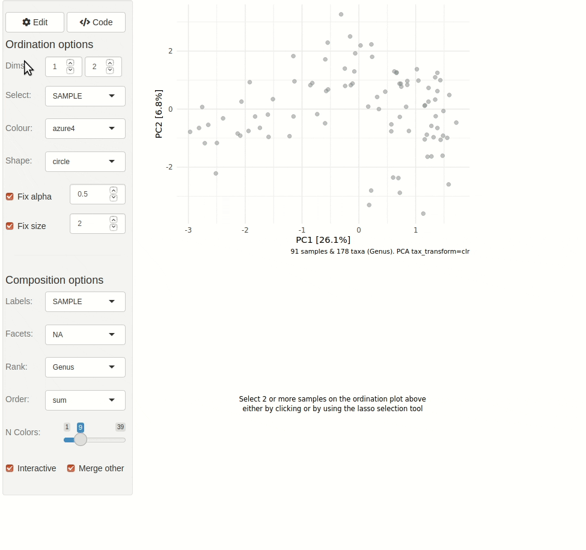

# Interactive Ordination Plot

This article shows you how to quickly get started with interactive
exploration of your data/ ordination plot.

``` r

library(phyloseq)
library(microViz)
#> microViz version 0.13.1 - Copyright (C) 2021-2026 David Barnett
#> ! Website: https://david-barnett.github.io/microViz
#> ✔ Useful?  For citation details, run: `citation("microViz")`
#> ✖ Silence? `suppressPackageStartupMessages(library(microViz))`
```

### Example

Example data loaded from the corncob package. All you need is a valid
phyloseq object, and to run `tax_fix` to [ensure the tax_table doesn’t
contain problematic
names](https://david-barnett.github.io/microViz/articles/web-only/tax-fixing.html).

``` r

pseq <- microViz::ibd %>%
  tax_fix() %>%
  phyloseq_validate()
```

The gif animation below shows the result of running `ord_explore`, the
animation starts immediately after interactively selecting “Genus” level
aggregation, “clr” transformation, and the “PCA” ordination method from
the “Edit” menu.

``` R
ord_explore(pseq)
```



### Another (old) example

Get example dataset from the phyloseq package and clean up the taxa just
a little.

``` r

data("enterotype", package = "phyloseq")
taxa_names(enterotype)[1] <- "Unclassified" # replace strange "-1" name
ps <- tax_fix(enterotype) # remove NA taxa and similar
#> Row named: Unclassified
#> contains no non-unknown values, returning:
#> 'Unclassified' for all replaced levels.
#> Consider editing this tax_table entry manually.
#> Row named: Bacteria
#> contains no non-unknown values, returning:
#> 'Bacteria' for all replaced levels.
#> Consider editing this tax_table entry manually.
```

Create simple Bray-Curtis PCoA to explore interactively.

``` r

ord1 <- ps %>%
  tax_transform("identity", rank = "Genus") %>%
  dist_calc("bray") %>% # bray curtis
  ord_calc() # automagically picks PCoA
#> Warning: otu_table of counts is NOT available!
#> Available otu_table contains 50166 values that are not non-negative integers
```

Start interactive Shiny app. Note that the gif animation shown is from
an outdated version of microViz. More recent versions of `ord_explore`
allow editing the ordination shown, and generating `ord_plot` code.

``` r

ord_explore(data = ord1, auto_caption = NA)
```


Note: GIF is sped up x2: redrawing plots is not instantaneous, but
pretty quick unless your dataset has many 1000s of samples. Date of
creation: 29/03/2021

## Session info

``` r

devtools::session_info()
#> ─ Session info ───────────────────────────────────────────────────────────────
#>  setting  value
#>  version  R version 4.6.0 (2026-04-24)
#>  os       Ubuntu 24.04.4 LTS
#>  system   x86_64, linux-gnu
#>  ui       X11
#>  language en
#>  collate  C.UTF-8
#>  ctype    C.UTF-8
#>  tz       UTC
#>  date     2026-05-21
#>  pandoc   3.8.3 @ /opt/hostedtoolcache/pandoc/3.8.3/x64/ (via rmarkdown)
#>  quarto   NA
#> 
#> ─ Packages ───────────────────────────────────────────────────────────────────
#>  package      * version   date (UTC) lib source
#>  ade4           1.7-24    2026-03-21 [1] RSPM
#>  ape            5.8-1     2024-12-16 [1] RSPM
#>  Biobase        2.72.0    2026-04-28 [1] Bioconduc~
#>  BiocGenerics   0.58.1    2026-05-14 [1] Bioconduc~
#>  biomformat     1.40.0    2026-04-28 [1] Bioconduc~
#>  Biostrings     2.80.0    2026-04-28 [1] Bioconduc~
#>  bslib          0.11.0    2026-05-16 [1] RSPM
#>  cachem         1.1.0     2024-05-16 [1] RSPM
#>  cli            3.6.6     2026-04-09 [1] RSPM
#>  cluster        2.1.8.2   2026-02-05 [3] CRAN (R 4.6.0)
#>  codetools      0.2-20    2024-03-31 [3] CRAN (R 4.6.0)
#>  crayon         1.5.3     2024-06-20 [1] RSPM
#>  data.table     1.18.4    2026-05-06 [1] RSPM
#>  desc           1.4.3     2023-12-10 [1] RSPM
#>  devtools       2.5.2     2026-04-30 [1] RSPM
#>  digest         0.6.39    2025-11-19 [1] RSPM
#>  dplyr          1.2.1     2026-04-03 [1] RSPM
#>  ellipsis       0.3.3     2026-04-04 [1] RSPM
#>  evaluate       1.0.5     2025-08-27 [1] RSPM
#>  farver         2.1.2     2024-05-13 [1] RSPM
#>  fastmap        1.2.0     2024-05-15 [1] RSPM
#>  foreach        1.5.2     2022-02-02 [1] RSPM
#>  fs             2.1.0     2026-04-18 [1] RSPM
#>  generics       0.1.4     2025-05-09 [1] RSPM
#>  ggplot2        4.0.3     2026-04-22 [1] RSPM
#>  glue           1.8.1     2026-04-17 [1] RSPM
#>  gtable         0.3.6     2024-10-25 [1] RSPM
#>  htmltools      0.5.9     2025-12-04 [1] RSPM
#>  htmlwidgets    1.6.4     2023-12-06 [1] RSPM
#>  igraph         2.3.1     2026-05-04 [1] RSPM
#>  IRanges        2.46.0    2026-04-28 [1] Bioconduc~
#>  iterators      1.0.14    2022-02-05 [1] RSPM
#>  jquerylib      0.1.4     2021-04-26 [1] RSPM
#>  jsonlite       2.0.0     2025-03-27 [1] RSPM
#>  knitr          1.51      2025-12-20 [1] RSPM
#>  lattice        0.22-9    2026-02-09 [3] CRAN (R 4.6.0)
#>  lifecycle      1.0.5     2026-01-08 [1] RSPM
#>  magrittr       2.0.5     2026-04-04 [1] RSPM
#>  MASS           7.3-65    2025-02-28 [3] CRAN (R 4.6.0)
#>  Matrix         1.7-5     2026-03-21 [3] CRAN (R 4.6.0)
#>  memoise        2.0.1     2021-11-26 [1] RSPM
#>  mgcv           1.9-4     2025-11-07 [3] CRAN (R 4.6.0)
#>  microbiome     1.34.0    2026-04-28 [1] Bioconduc~
#>  microViz     * 0.13.1    2026-05-21 [1] local
#>  multtest       2.68.0    2026-04-28 [1] Bioconduc~
#>  nlme           3.1-169   2026-03-27 [3] CRAN (R 4.6.0)
#>  otel           0.2.0     2025-08-29 [1] RSPM
#>  permute        0.9-10    2026-02-06 [1] RSPM
#>  phyloseq     * 1.56.0    2026-04-28 [1] Bioconduc~
#>  pillar         1.11.1    2025-09-17 [1] RSPM
#>  pkgbuild       1.4.8     2025-05-26 [1] RSPM
#>  pkgconfig      2.0.3     2019-09-22 [1] RSPM
#>  pkgdown        2.2.0     2025-11-06 [1] RSPM
#>  pkgload        1.5.2     2026-04-22 [1] RSPM
#>  plyr           1.8.9     2023-10-02 [1] RSPM
#>  purrr          1.2.2     2026-04-10 [1] RSPM
#>  R6             2.6.1     2025-02-15 [1] RSPM
#>  ragg           1.5.2     2026-03-23 [1] RSPM
#>  RColorBrewer   1.1-3     2022-04-03 [1] RSPM
#>  Rcpp           1.1.1-1.1 2026-04-24 [1] RSPM
#>  reshape2       1.4.5     2025-11-12 [1] RSPM
#>  rlang          1.2.0     2026-04-06 [1] RSPM
#>  rmarkdown      2.31      2026-03-26 [1] RSPM
#>  Rtsne          0.17      2023-12-07 [1] RSPM
#>  S4Vectors      0.50.1    2026-05-13 [1] Bioconduc~
#>  S7             0.2.2     2026-04-22 [1] RSPM
#>  sass           0.4.10    2025-04-11 [1] RSPM
#>  scales         1.4.0     2025-04-24 [1] RSPM
#>  Seqinfo        1.2.0     2026-04-28 [1] Bioconduc~
#>  sessioninfo    1.2.3     2025-02-05 [1] RSPM
#>  stringi        1.8.7     2025-03-27 [1] RSPM
#>  stringr        1.6.0     2025-11-04 [1] RSPM
#>  survival       3.8-6     2026-01-16 [3] CRAN (R 4.6.0)
#>  systemfonts    1.3.2     2026-03-05 [1] RSPM
#>  textshaping    1.0.5     2026-03-06 [1] RSPM
#>  tibble         3.3.1     2026-01-11 [1] RSPM
#>  tidyr          1.3.2     2025-12-19 [1] RSPM
#>  tidyselect     1.2.1     2024-03-11 [1] RSPM
#>  usethis        3.2.1     2025-09-06 [1] RSPM
#>  vctrs          0.7.3     2026-04-11 [1] RSPM
#>  vegan          2.7-3     2026-03-04 [1] RSPM
#>  withr          3.0.2     2024-10-28 [1] RSPM
#>  xfun           0.57      2026-03-20 [1] RSPM
#>  XVector        0.52.0    2026-04-28 [1] Bioconduc~
#>  yaml           2.3.12    2025-12-10 [1] RSPM
#> 
#>  [1] /home/runner/work/_temp/Library
#>  [2] /opt/R/4.6.0/lib/R/site-library
#>  [3] /opt/R/4.6.0/lib/R/library
#>  * ── Packages attached to the search path.
#> 
#> ──────────────────────────────────────────────────────────────────────────────
```
