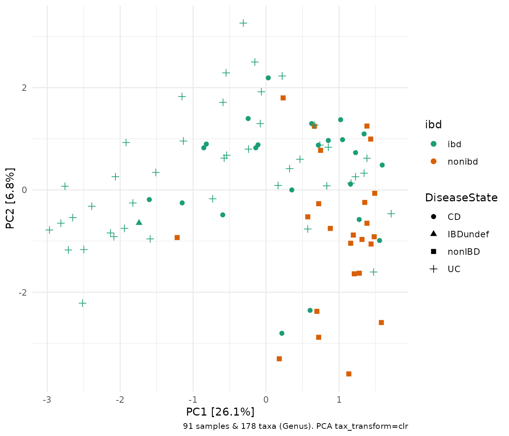
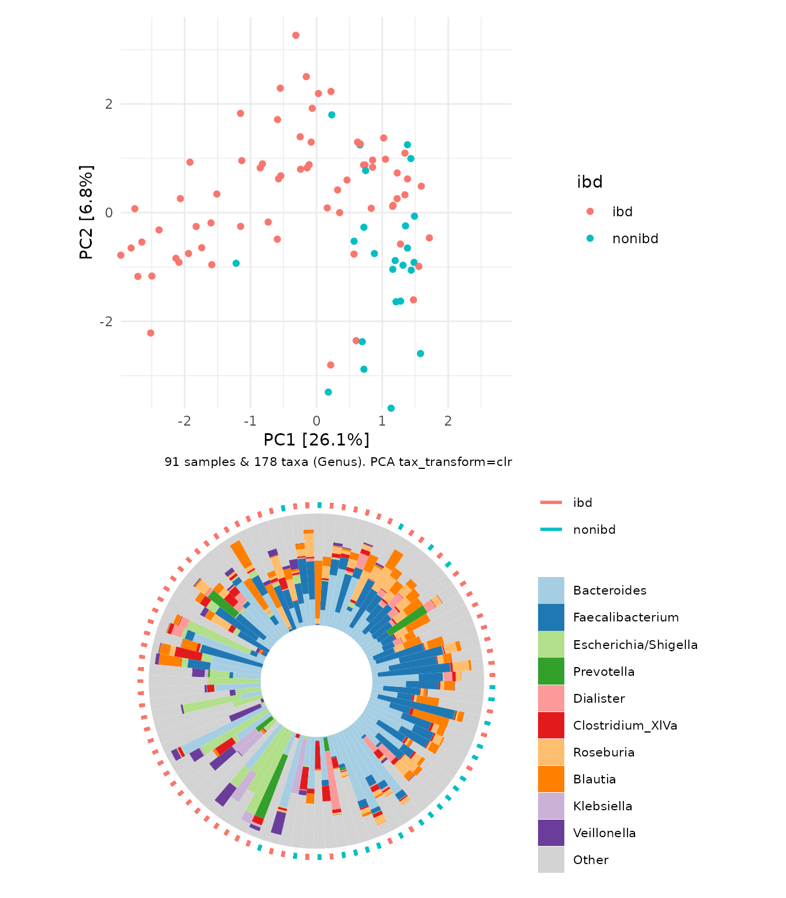
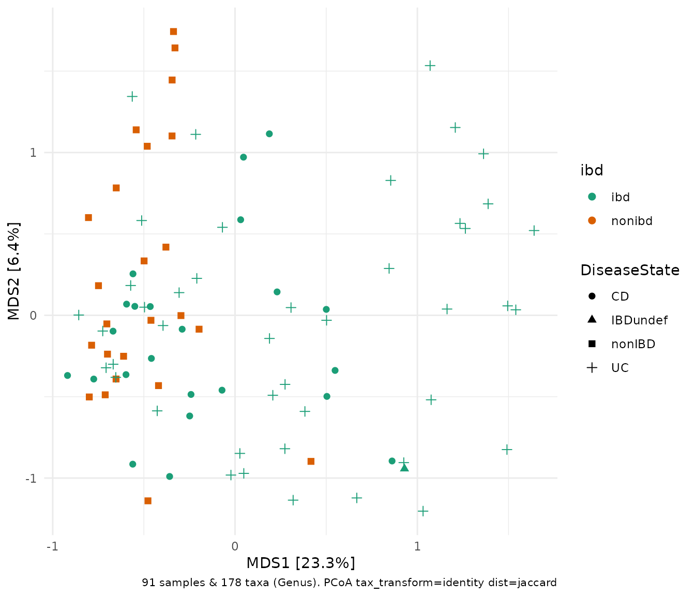
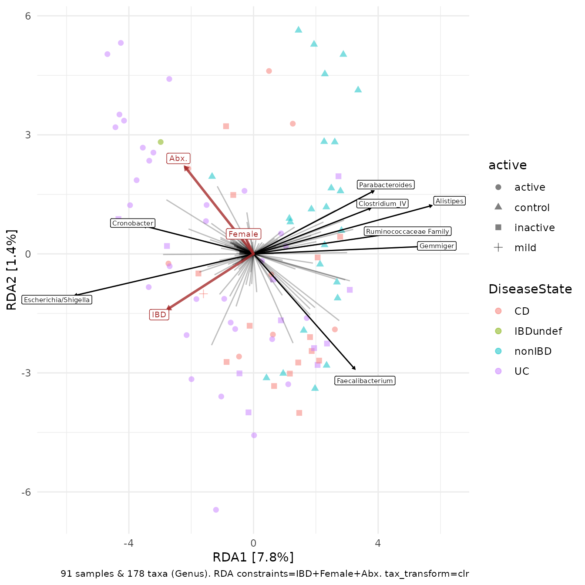

# Ordination plots

## Intro

This article will show you how to create and customise ordination plots,
like [PCA](#pca) and [RDA](#rda), with microViz.

For an even quicker start with ordinating your phyloseq data, check out
the `ord_explore` [Shiny
app](https://david-barnett.github.io/microViz/articles/web-only/ordination-interactive.html),
which allows you to create ordination plots with a point and click
interface, and generates `ord_plot` code for you to copy. Return to this
article to understand more about creating and customising your
ordination plotting script.

``` r
library(phyloseq)
library(ggplot2)
library(microViz)
#> microViz version 0.13.0 - Copyright (C) 2021-2026 David Barnett
#> ! Website: https://david-barnett.github.io/microViz
#> ✔ Useful?  For citation details, run: `citation("microViz")`
#> ✖ Silence? `suppressPackageStartupMessages(library(microViz))`
knitr::opts_chunk$set(fig.width = 7, fig.height = 6)
```

We will use example data from stool samples from an inflammatory bowel
disease (IBD) study, borrowed from the great `corncob` package. See the
article about [working with phyloseq
objects](https://david-barnett.github.io/microViz/articles/web-only/phyloseq.html)
if you want to get started with your own data, or just to learn more
about manipulating phyloseq objects with microViz.

``` r
ibd <- microViz::ibd
ibd
#> phyloseq-class experiment-level object
#> otu_table()   OTU Table:         [ 36349 taxa and 91 samples ]
#> sample_data() Sample Data:       [ 91 samples by 15 sample variables ]
#> tax_table()   Taxonomy Table:    [ 36349 taxa by 7 taxonomic ranks ]
```

First we fix any uninformative tax_table entries and check the phyloseq
object (see the article on [fixing your
tax_table](https://david-barnett.github.io/microViz/articles/web-only/tax-fixing.html)
for more info).

``` r
ibd <- tax_fix(ibd) # try tax_fix_interactive if you have problems with your own data
ibd <- phyloseq_validate(ibd, remove_undetected = TRUE)
```

## Motivation

Ordination plots are a great way to see any clustering or other patterns
of microbiota (dis)similarity in (many) samples. Ordinations like PCA or
PCoA show the largest patterns of variation in your data, and
constrained ordination techniques like RDA or CCA can show you microbial
variation that could be explained by other variables in your sample_data
(but interpret constrained ordinations with care, and ideally test for
the statistical significance of any hypothesised associations using a
method like PERMANOVA, see
[`dist_permanova()`](https://david-barnett.github.io/microViz/reference/dist_permanova.md)).

Check out the GUide to STatistical Analysis in Microbial Ecology (GUSTA
ME)[website](https://sites.google.com/site/mb3gustame/) for a gentle
theoretical introduction to
[PCA](https://sites.google.com/site/mb3gustame/indirect-gradient-analysis/principal-components-analysis),
[PCoA](https://sites.google.com/site/mb3gustame/dissimilarity-based-methods/principal-coordinates-analysis),
[RDA](https://sites.google.com/site/mb3gustame/constrained-analyses/redundancy-analysis),
[CCA](https://sites.google.com/site/mb3gustame/constrained-analyses/canonical-correspondence-analysis)
and more.

Ordination plots can also be paired with barplots for greater insight
into microbial compositions, e.g. see
[`ord_plot_iris()`](https://david-barnett.github.io/microViz/reference/ord_plot_iris.md)
and the
[`ord_explore()`](https://david-barnett.github.io/microViz/reference/ord_explore.md)
interactive [Shiny
app](https://david-barnett.github.io/microViz/articles/web-only/ordination-interactive.html).

## Prepare your microbes

When creating an ordination plot, you first need to prepare the
microbiota variables.

- Decide at which taxonomic rank to aggregate your data, e.g. “Genus”

- Consider transforming the microbial counts, e.g. using the “clr”
  (centred log ratio) transformation, which is often recommended for
  compositional data ([like sequencing
  data](https://doi.org/10.3389/fmicb.2017.02224 "Gloor 2017"))

``` r
ibd %>%
  tax_transform(trans = "clr", rank = "Genus")
#> psExtra object - a phyloseq object with extra slots:
#> 
#> phyloseq-class experiment-level object
#> otu_table()   OTU Table:         [ 178 taxa and 91 samples ]
#> sample_data() Sample Data:       [ 91 samples by 15 sample variables ]
#> tax_table()   Taxonomy Table:    [ 178 taxa by 6 taxonomic ranks ]
#> 
#> otu_get(counts = TRUE)        [ 178 taxa and 91 samples ]
#> 
#> psExtra info:
#> tax_agg = "Genus" tax_trans = "clr"
```

- Some methods, such as [PCoA](#pcoa), require a matrix of pairwise
  distances between samples, which you can easily calculate with
  [`dist_calc()`](https://david-barnett.github.io/microViz/reference/dist_calc.md).
  Normally you should NOT transform your data when using a
  distance-based method, but it is useful to record an “identity”
  transformation anyway, to make it clear you have not transformed your
  data.

``` r
ibd %>%
  tax_transform(trans = "identity", rank = "Genus") %>%
  dist_calc("bray") # bray curtis distance
#> psExtra object - a phyloseq object with extra slots:
#> 
#> phyloseq-class experiment-level object
#> otu_table()   OTU Table:         [ 178 taxa and 91 samples ]
#> sample_data() Sample Data:       [ 91 samples by 15 sample variables ]
#> tax_table()   Taxonomy Table:    [ 178 taxa by 6 taxonomic ranks ]
#> 
#> psExtra info:
#> tax_agg = "Genus" tax_trans = "identity" 
#> 
#> bray distance matrix of size 91 
#> 0.8294664 0.7156324 0.5111652 0.5492537 0.8991251 ...
```

- Some dissimilarity measures, such as unweighted UniFrac, do not
  consider the abundance of each taxon when calculating dissimilarity,
  and so may be (overly) sensitive to differences in rare/low-abundance
  taxa. So you might want to filter out very rare taxa, with
  [`tax_filter()`](https://david-barnett.github.io/microViz/reference/tax_filter.md)
  before using `dist_calc(ps, dist = "unifrac")`. Distances that are
  (implicitly) abundance weighted, including Generalised UniFrac,
  Bray-Curtis and Aitchison distance, should be less sensitive to rare
  taxa / filtering threshold choices.

### psExtra

Notice that the objects created above are of class “psExtra”. This is an
S4 class object that holds your phyloseq object with additional slots
for stuff created from this phyloseq object, such as a distance matrix,
as well as info on any transformation and aggregation applied to your
taxa. microViz uses this to automatically create plot captions, to help
you and your collaborators remember how you made each plot! You can
access the phyloseq object, distance matrix and other parts of a psExtra
object with
[`ps_get()`](https://david-barnett.github.io/microViz/reference/psExtra-accessors.md),
[`dist_get()`](https://david-barnett.github.io/microViz/reference/psExtra-accessors.md),
and friends.

## PCA - Principal Components Analysis

Principal ***Components*** Analysis is an unconstrained method that does
not use a distance matrix. PCA directly uses the (transformed) microbial
variables, so you do not need
[`dist_calc()`](https://david-barnett.github.io/microViz/reference/dist_calc.md).
`ord_calc` performs the ordination (adding it to the psExtra object) and
[`ord_plot()`](https://david-barnett.github.io/microViz/reference/ord_plot.md)
creates the ggplot2 scatterplot (which you can customise like other
ggplot objects).

Each point is a sample, and samples that appear closer together are
typically more similar to each other than samples which are further
apart. So by colouring the points by IBD status you can see that the
microbiota from people with IBD is often, but not always, highly
distinct from people without IBD.

``` r
ibd %>%
  tax_transform("clr", rank = "Genus") %>%
  # when no distance matrix or constraints are supplied, PCA is the default/auto ordination method
  ord_calc() %>%
  ord_plot(color = "ibd", shape = "DiseaseState", size = 2) +
  scale_colour_brewer(palette = "Dark2")
```



One benefit of not using a distance matrix, is that you can plot taxa
“loadings” onto your PCA axes, using the plot_taxa argument. microViz
plots all of the taxa loading vectors in light grey, and you choose how
many of the vectors to label, starting with the longest arrows
(alternatively you can name particular taxa to label).

The relative length of each loading vector indicates its contribution to
each PCA axis shown, and allows you to roughly estimate which samples
will contain more of that taxon e.g. samples on the left of the plot
below, will typically contain more *Escherichia*/*Shigella* than samples
on the right, and this taxon contributes heavily to the PC1 axis.

``` r
ibd %>%
  tax_transform("clr", rank = "Genus") %>%
  # when no distance matrix or constraints are supplied, PCA is the default/auto ordination method
  ord_calc(method = "PCA") %>%
  ord_plot(color = "ibd", shape = "DiseaseState", plot_taxa = 1:5, size = 2) +
  scale_colour_brewer(palette = "Dark2")
```


microViz also allows you directly visualize the sample compositions on a
circular barplot or “iris plot” (named because it looks kinda like an
eyeball) alongside the PCA plot. The samples on the iris plot are
automatically arranged by their rotational position around the
center/origin of the PCA plot.

``` r
ibd %>%
  tax_transform("clr", rank = "Genus") %>%
  # when no distance matrix or constraints are supplied, PCA is the default/auto ordination method
  ord_calc() %>%
  ord_plot_iris(tax_level = "Genus", ord_plot = "above", anno_colour = "ibd")
```



Here we created the ordination plot as a quick accompaniment to the
circular barchart, but it is more flexible to create and customise the
ordination plot and iris plot separately, and then pair them afterwards
with patchwork. See the `ord_plot_iris`
[docs](https://david-barnett.github.io/microViz/reference/ord_plot_iris.html)
for examples.

## PCoA - Principal Co-ordinates Analysis

Principal ***Co-ordinates*** Analysis is also an unconstrained method,
but it does require a distance matrix. In an ecological context, a
distance (or more generally a “dissimilarity”) measure indicates how
different a pair of (microbial) ecosystems are. This can be calculated
in many ways.

### Aitchison distance

The [Euclidean
distance](https://en.wikipedia.org/wiki/Euclidean_distance) is similar
to the distance we humans are familiar with in the physical world. The
results of a PCA is practically equivalent to a PCoA with Euclidean
distances. The Aitchison distance is a dissimilarity measure calculated
as the Euclidean distance between observations (samples) after
performing a centered log ratio (“clr”) transformation. That is why the
Aitchison distance PCoA, below, looks the same as the PCA we made
earlier. However, we cannot use plot_taxa, as the taxa loadings are only
available for PCA (and related methods like RDA).

``` r
ibd %>%
  tax_transform("identity", rank = "Genus") %>% # don't transform!
  dist_calc("aitchison") %>%
  ord_calc("PCoA") %>%
  ord_plot(color = "ibd", shape = "DiseaseState", size = 2) +
  scale_colour_brewer(palette = "Dark2")
```


Note that PCoA is also known as MDS, for (metric) Multi-Dimensional
Scaling, hence the axes names.

### Ecological dissimilarities

Over the years, ecologists have invented numerous ways of quantifying
dissimilarity between pairs of ecosystems. One ubiquitous example is the
[Bray-Curtis](https://en.wikipedia.org/wiki/Bray%E2%80%93Curtis_dissimilarity)
dissimilarity measure, shown below.

``` r
ibd %>%
  tax_transform("identity", rank = "Genus") %>% # don't transform!
  dist_calc("bray") %>%
  ord_calc("PCoA") %>%
  ord_plot(color = "ibd", shape = "DiseaseState", size = 2) +
  scale_colour_brewer(palette = "Dark2")
```


Beyond Bray-Curtis, microViz
[`dist_calc()`](https://david-barnett.github.io/microViz/reference/dist_calc.md)
can also help you calculate all the other ecological distances listed in
[`phyloseq::distanceMethodList`](https://rdrr.io/pkg/phyloseq/man/distanceMethodList.html)
such the Jensen-Shannon Divergence, `"jsd"`, or Jaccard dissimilarity
`"jaccard"`. Beware that if you want a binary dissimilarity measure from
[`vegan::vegdist()`](https://vegandevs.github.io/vegan/reference/vegdist.html)
(i.e. only using presence/absence info, and noting all the caveats about
sensitivity to low abundance taxa) you will need to pass
`binary = TRUE`, as below.

``` r
ibd %>%
  tax_transform("identity", rank = "Genus") %>%
  dist_calc(dist = "jaccard", binary = TRUE) %>%
  ord_calc("PCoA") %>%
  ord_plot(color = "ibd", shape = "DiseaseState", size = 2) +
  scale_colour_brewer(palette = "Dark2")
```



### UniFrac distances

If you have a phylogenetic tree available, and [attached to your
phyloseq
object](https://david-barnett.github.io/microViz/articles/web-only/phyloseq.html#getting-your-data-into-phyloseq).
You can calculate dissimilarities from the [UniFrac
family](https://en.wikipedia.org/wiki/UniFrac) of methods, which take
into account the phylogenetic relatedness of the taxa / sequences in
your samples when calculating dissimilarity. Un-weighted UniFrac,
`dist_calc(dist = "unifrac")`, does not consider the relative abundance
of taxa, only their presence (detection) or absence, which can make it
(overly) sensitive to rare taxa, sequencing artefacts, and abundance
filtering choices. Conversely, weighted UniFrac, `"wunifrac"`, does put
(perhaps too much) more importance on highly abundant taxa, when
determining dissimilarities. The Generalised UniFrac, `"gunifrac"`,
finds a balance between these two extremes, and by adjusting the
`gunifrac_alpha` argument of
[`dist_calc()`](https://david-barnett.github.io/microViz/reference/dist_calc.md),
you can tune this balance to your liking (although the 0.5 default
should be fine!).

Below is a Generalised UniFrac example using a different, and tiny,
example dataset from the phyloseq package that has a phylogenetic tree.

You should **not** aggregate taxa before using a phylogenetic distance
measure, but you can and probably should register the choice not to
transform or aggregate, as below.

``` r
data("esophagus", package = "phyloseq")
esophagus %>%
  phyloseq_validate(verbose = FALSE) %>%
  tax_transform("identity", rank = "unique") %>%
  dist_calc("gunifrac", gunifrac_alpha = 0.5)
#> psExtra object - a phyloseq object with extra slots:
#> 
#> phyloseq-class experiment-level object
#> otu_table()   OTU Table:         [ 58 taxa and 3 samples ]
#> sample_data() Sample Data:       [ 3 samples by 1 sample variables ]
#> tax_table()   Taxonomy Table:    [ 58 taxa by 1 taxonomic ranks ]
#> phy_tree()    Phylogenetic Tree: [ 58 tips and 57 internal nodes ]
#> 
#> psExtra info:
#> tax_agg = "unique" tax_trans = "identity" 
#> 
#> gunifrac_0.5 distance matrix of size 3 
#> 0.4404284 0.4332325 0.4969773 ...
```

## Further dimensions

You can show other dimensions / axes of an ordination than just the
first two, by setting the axes argument. You can judge from the
variation explained by each successive axis (on a scree plot) whether
this is worthwhile information to show, e.g. in the example below, it
could be interesting to also show the 3rd axis, but not any others.

``` r
ibd %>%
  tax_transform("identity", rank = "Genus") %>% # don't transform!
  dist_calc("bray") %>%
  ord_calc("PCoA") %>%
  ord_get() %>%
  phyloseq::plot_scree() + theme(axis.text.x = element_text(size = 6))
```


Let us view the 1st and 3rd axes.

``` r
ibd %>%
  tax_transform("identity", rank = "Genus") %>% # don't transform!
  dist_calc("bray") %>%
  ord_calc("PCoA") %>%
  ord_plot(axes = c(1, 3), color = "ibd", shape = "DiseaseState", size = 2) +
  scale_colour_brewer(palette = "Dark2")
```


## Univariable distribution side panels

As the ordination figures are (pretty much) just standard ggplot
objects, integration with other ggplot extensions like `ggside` is
typically possible. Below are a couple of examples using the `ggside`
package to add univariable distribution plots for each PC, split by the
same groups as in the main plot.

### Side panel boxplots

``` r
ibd %>%
  tax_transform("identity", rank = "Genus") %>%
  dist_calc(dist = "aitchison") %>%
  ord_calc("PCoA") %>%
  ord_plot(color = "ibd", shape = "DiseaseState", size = 2) +
  scale_colour_brewer(palette = "Dark2", aesthetics = c("fill", "colour")) +
  theme_bw() +
  ggside::geom_xsideboxplot(aes(fill = ibd, y = ibd), orientation = "y") +
  ggside::geom_ysideboxplot(aes(fill = ibd, x = ibd), orientation = "x") +
  ggside::scale_xsidey_discrete(labels = NULL) +
  ggside::scale_ysidex_discrete(labels = NULL) +
  ggside::theme_ggside_void()
```


### Side panel density plots

``` r
ibd %>%
  tax_transform("identity", rank = "Genus") %>%
  dist_calc(dist = "aitchison") %>%
  ord_calc("PCoA") %>%
  ord_plot(color = "ibd", shape = "DiseaseState", size = 2) +
  scale_colour_brewer(palette = "Dark2", aesthetics = c("fill", "colour"), name = "IBD") +
  theme_bw() +
  ggside::geom_xsidedensity(aes(fill = ibd), alpha = 0.5, show.legend = FALSE) +
  ggside::geom_ysidedensity(aes(fill = ibd), alpha = 0.5, show.legend = FALSE) +
  ggside::theme_ggside_void()
```


## RDA - Redundancy Analysis

Redundancy analysis is a constrained ordination method. It displays the
microbial variation that can also be explained by selected constraint
variables.

*Behind the scenes, a linear regression model is created for each
microbial abundance variable (using the constraints as the explanatory
variables) and a PCA is performed using the fitted values of the
microbial abundances.*

Starting from the same phyloseq object `ibd` the code below first
creates a couple of binary (0/1) numeric variables to use a constraint
variables. This is easy enough with ps_mutate.

Then we aggregate and transform our taxa, and like PCA we skip the
dist_calc step.

``` r
ibd %>%
  ps_mutate(
    IBD = as.numeric(ibd == "ibd"),
    Female = as.numeric(gender == "female"),
    Abx. = as.numeric(abx == "abx")
  ) %>%
  tax_transform("clr", rank = "Genus") %>%
  ord_calc(
    constraints = c("IBD", "Female", "Abx."),
    # method = "RDA", # Note: you can specify RDA explicitly, and it is good practice to do so, but microViz can guess automatically that you want an RDA here (helpful if you don't remember the name?)
    scale_cc = FALSE # doesn't make a difference
  ) %>%
  ord_plot(
    colour = "DiseaseState", size = 2, alpha = 0.5, shape = "active",
    plot_taxa = 1:8
  )
```



## Customising your ordination plot

The plot above looks okay by default, but it is fairly easy to tweak
ord_plot further to get the style just how you want it. The code below
has comments to explain which part makes which changes to the plot.

``` r
# first we make a function that replaces any unwanted "_" in our taxa labels with spaces
library(stringr)
renamer <- function(x) str_replace(x, pattern = "_", replacement = " ")

ibd %>%
  ps_mutate(
    IBD = as.numeric(ibd == "ibd"),
    Female = as.numeric(gender == "female"),
    Abx. = as.numeric(abx == "abx")
  ) %>%
  tax_transform("clr", rank = "Genus") %>%
  ord_calc(
    constraints = c("IBD", "Female", "Abx."),
    method = "RDA",
    scale_cc = FALSE # doesn't make a difference
  ) %>%
  ord_plot(
    colour = "DiseaseState", size = 2, alpha = 0.5, shape = "active",
    auto_caption = NA, # remove the helpful automatic caption
    plot_taxa = 1:8, taxon_renamer = renamer, # renamer is the function we made earlier
    tax_vec_length = 5, # this value is a scalar multiplier for the biplot score vectors
    tax_lab_length = 6, # this multiplier moves the labels, independently of the arrowheads
    tax_lab_style = tax_lab_style(size = 1.8, alpha = 0.5), # create a list of options to tweak the taxa labels' default style
    constraint_vec_length = 3, # this adjusts the length of the constraint arrows, and the labels track these lengths by default
    constraint_vec_style = vec_constraint(1.5, alpha = 0.5), # this styles the constraint arrows
    constraint_lab_style = constraint_lab_style(size = 3) # this styles the constraint labels
  ) +
  # the functions below are from ggplot2:
  # You can pick a different colour scale, such as a color_brewer palette
  scale_colour_brewer(palette = "Set1") +
  # You can set any scale's values manually, such as the shapes used
  scale_shape_manual(values = c(
    active = "circle", mild = "circle cross",
    inactive = "circle open", control = "square open"
  )) +
  # this is how you add a title and subtitle
  ggtitle(
    label = "[Insert your exciting interpretations here?]",
    subtitle = "RDA with clr-transformed genera: constraints in red, taxa in black"
  ) +
  # and this is how you make your own caption
  labs(caption = "91 samples, 178 genera. Type 2 scaling.") +
  # this is one way to set the aspect ratio of the plot
  coord_fixed(ratio = 1, clip = "off")
```


### Custom labels

[`tax_lab_style()`](https://david-barnett.github.io/microViz/reference/Ordination-labels.md)
is a helper function that gives you some options for customising the
look of the taxa loading labels, including, in this example, using
rotated, bold and italic text for the taxa names.

[`constraint_lab_style()`](https://david-barnett.github.io/microViz/reference/Ordination-labels.md)
is a similar helper function for customising the constraint labels. When
rotating labels (not text) the ggtext package must be installed.

``` r
ibd %>%
  ps_mutate(
    IBD = as.numeric(ibd == "ibd"),
    Female = as.numeric(gender == "female"),
    Abx. = as.numeric(abx == "abx")
  ) %>%
  tax_transform("clr", rank = "Genus") %>%
  ord_calc(
    constraints = c("IBD", "Female", "Abx."),
    method = "RDA",
    scale_cc = FALSE # doesn't make a difference
  ) %>%
  ord_plot(
    colour = "DiseaseState", size = 2, alpha = 0.5, shape = "active",
    auto_caption = NA,
    plot_taxa = 1:8, taxon_renamer = renamer,
    # with rotated labels, it is nicer to keep lab_length closer to vec_length
    tax_vec_length = 4.5, tax_lab_length = 4.6,
    tax_lab_style = tax_lab_style(
      type = "text", max_angle = 90, fontface = "bold.italic"
    ),
    constraint_vec_style = vec_constraint(1.5, alpha = 0.5),
    constraint_vec_length = 3, constraint_lab_length = 3.3,
    constraint_lab_style = constraint_lab_style(
      alpha = 0.8, size = 3, max_angle = 90, perpendicular = TRUE
    )
  ) +
  # SETTING A FIXED RATIO IDENTICAL TO THE aspect_ratio ARGUMENT IN
  # tax_lab_style() IS NECESSARY FOR THE ANGLES OF TEXT TO ALIGN WITH ARROWS!
  coord_fixed(ratio = 1, clip = "off", xlim = c(-6, 6)) +
  # The scales below are set the same as in the previous customisation:
  scale_colour_brewer(palette = "Set1") +
  scale_shape_manual(values = c(
    active = "circle", mild = "circle cross",
    inactive = "circle open", control = "square open"
  ))
```


## Partial ordinations

Tutorial coming soon, for now see
[`ord_plot()`](https://david-barnett.github.io/microViz/reference/ord_plot.md)
for examples.

## Session info

``` r
devtools::session_info()
#> ─ Session info ───────────────────────────────────────────────────────────────
#>  setting  value
#>  version  R version 4.5.2 (2025-10-31)
#>  os       Ubuntu 24.04.3 LTS
#>  system   x86_64, linux-gnu
#>  ui       X11
#>  language en
#>  collate  C.UTF-8
#>  ctype    C.UTF-8
#>  tz       UTC
#>  date     2026-02-17
#>  pandoc   3.1.11 @ /opt/hostedtoolcache/pandoc/3.1.11/x64/ (via rmarkdown)
#>  quarto   NA
#> 
#> ─ Packages ───────────────────────────────────────────────────────────────────
#>  package      * version  date (UTC) lib source
#>  ade4           1.7-23   2025-02-14 [1] RSPM
#>  ape            5.8-1    2024-12-16 [1] RSPM
#>  Biobase        2.70.0   2025-10-29 [1] Bioconduc~
#>  BiocGenerics   0.56.0   2025-10-29 [1] Bioconduc~
#>  biomformat     1.38.0   2025-10-29 [1] Bioconduc~
#>  Biostrings     2.78.0   2025-10-29 [1] Bioconduc~
#>  bslib          0.10.0   2026-01-26 [1] RSPM
#>  cachem         1.1.0    2024-05-16 [1] RSPM
#>  cli            3.6.5    2025-04-23 [1] RSPM
#>  clue           0.3-66   2024-11-13 [1] RSPM
#>  cluster        2.1.8.1  2025-03-12 [3] CRAN (R 4.5.2)
#>  codetools      0.2-20   2024-03-31 [3] CRAN (R 4.5.2)
#>  commonmark     2.0.0    2025-07-07 [1] RSPM
#>  crayon         1.5.3    2024-06-20 [1] RSPM
#>  data.table     1.18.2.1 2026-01-27 [1] RSPM
#>  desc           1.4.3    2023-12-10 [1] RSPM
#>  devtools       2.4.6    2025-10-03 [1] RSPM
#>  digest         0.6.39   2025-11-19 [1] RSPM
#>  dplyr          1.2.0    2026-02-03 [1] RSPM
#>  ellipsis       0.3.2    2021-04-29 [1] RSPM
#>  evaluate       1.0.5    2025-08-27 [1] RSPM
#>  farver         2.1.2    2024-05-13 [1] RSPM
#>  fastmap        1.2.0    2024-05-15 [1] RSPM
#>  fBasics        4052.98  2025-12-07 [1] RSPM
#>  foreach        1.5.2    2022-02-02 [1] RSPM
#>  fs             1.6.6    2025-04-12 [1] RSPM
#>  generics       0.1.4    2025-05-09 [1] RSPM
#>  ggplot2      * 4.0.2    2026-02-03 [1] RSPM
#>  ggrepel        0.9.6    2024-09-07 [1] RSPM
#>  ggside         0.4.1    2025-11-25 [1] RSPM
#>  ggtext         0.1.2    2022-09-16 [1] RSPM
#>  glue           1.8.0    2024-09-30 [1] RSPM
#>  gridtext       0.1.5    2022-09-16 [1] RSPM
#>  gtable         0.3.6    2024-10-25 [1] RSPM
#>  GUniFrac       1.9      2025-08-25 [1] RSPM
#>  htmltools      0.5.9    2025-12-04 [1] RSPM
#>  htmlwidgets    1.6.4    2023-12-06 [1] RSPM
#>  igraph         2.2.2    2026-02-12 [1] RSPM
#>  inline         0.3.21   2025-01-09 [1] RSPM
#>  IRanges        2.44.0   2025-10-29 [1] Bioconduc~
#>  iterators      1.0.14   2022-02-05 [1] RSPM
#>  jquerylib      0.1.4    2021-04-26 [1] RSPM
#>  jsonlite       2.0.0    2025-03-27 [1] RSPM
#>  knitr          1.51     2025-12-20 [1] RSPM
#>  labeling       0.4.3    2023-08-29 [1] RSPM
#>  lattice        0.22-7   2025-04-02 [3] CRAN (R 4.5.2)
#>  lifecycle      1.0.5    2026-01-08 [1] RSPM
#>  litedown       0.9      2025-12-18 [1] RSPM
#>  magrittr       2.0.4    2025-09-12 [1] RSPM
#>  markdown       2.0      2025-03-23 [1] RSPM
#>  MASS           7.3-65   2025-02-28 [3] CRAN (R 4.5.2)
#>  Matrix         1.7-4    2025-08-28 [3] CRAN (R 4.5.2)
#>  matrixStats    1.5.0    2025-01-07 [1] RSPM
#>  memoise        2.0.1    2021-11-26 [1] RSPM
#>  mgcv           1.9-3    2025-04-04 [3] CRAN (R 4.5.2)
#>  microbiome     1.32.0   2025-10-29 [1] Bioconduc~
#>  microViz     * 0.13.0   2026-02-17 [1] local
#>  modeest        2.4.0    2019-11-18 [1] RSPM
#>  multtest       2.66.0   2025-10-29 [1] Bioconduc~
#>  nlme           3.1-168  2025-03-31 [3] CRAN (R 4.5.2)
#>  otel           0.2.0    2025-08-29 [1] RSPM
#>  patchwork      1.3.2    2025-08-25 [1] RSPM
#>  permute        0.9-10   2026-02-06 [1] RSPM
#>  phyloseq     * 1.54.0   2025-10-29 [1] Bioconduc~
#>  pillar         1.11.1   2025-09-17 [1] RSPM
#>  pkgbuild       1.4.8    2025-05-26 [1] RSPM
#>  pkgconfig      2.0.3    2019-09-22 [1] RSPM
#>  pkgdown        2.2.0    2025-11-06 [1] RSPM
#>  pkgload        1.5.0    2026-02-03 [1] RSPM
#>  plyr           1.8.9    2023-10-02 [1] RSPM
#>  purrr          1.2.1    2026-01-09 [1] RSPM
#>  R6             2.6.1    2025-02-15 [1] RSPM
#>  ragg           1.5.0    2025-09-02 [1] RSPM
#>  RColorBrewer   1.1-3    2022-04-03 [1] RSPM
#>  Rcpp           1.1.1    2026-01-10 [1] RSPM
#>  remotes        2.5.0    2024-03-17 [1] RSPM
#>  reshape2       1.4.5    2025-11-12 [1] RSPM
#>  rhdf5          2.54.1   2025-12-04 [1] Bioconduc~
#>  rhdf5filters   1.22.0   2025-10-29 [1] Bioconduc~
#>  Rhdf5lib       1.32.0   2025-10-29 [1] Bioconduc~
#>  rlang          1.1.7    2026-01-09 [1] RSPM
#>  rmarkdown      2.30     2025-09-28 [1] RSPM
#>  rmutil         1.1.10   2022-10-27 [1] RSPM
#>  rpart          4.1.24   2025-01-07 [3] CRAN (R 4.5.2)
#>  Rtsne          0.17     2023-12-07 [1] RSPM
#>  S4Vectors      0.48.0   2025-10-29 [1] Bioconduc~
#>  S7             0.2.1    2025-11-14 [1] RSPM
#>  sass           0.4.10   2025-04-11 [1] RSPM
#>  scales         1.4.0    2025-04-24 [1] RSPM
#>  Seqinfo        1.0.0    2025-10-29 [1] Bioconduc~
#>  sessioninfo    1.2.3    2025-02-05 [1] RSPM
#>  spatial        7.3-18   2025-01-01 [3] CRAN (R 4.5.2)
#>  stable         1.1.7    2026-02-15 [1] RSPM
#>  stabledist     0.7-2    2024-08-17 [1] RSPM
#>  statip         0.2.3    2019-11-17 [1] RSPM
#>  statmod        1.5.1    2025-10-09 [1] RSPM
#>  stringi        1.8.7    2025-03-27 [1] RSPM
#>  stringr      * 1.6.0    2025-11-04 [1] RSPM
#>  survival       3.8-3    2024-12-17 [3] CRAN (R 4.5.2)
#>  systemfonts    1.3.1    2025-10-01 [1] RSPM
#>  textshaping    1.0.4    2025-10-10 [1] RSPM
#>  tibble         3.3.1    2026-01-11 [1] RSPM
#>  tidyr          1.3.2    2025-12-19 [1] RSPM
#>  tidyselect     1.2.1    2024-03-11 [1] RSPM
#>  timeDate       4052.112 2026-01-28 [1] RSPM
#>  timeSeries     4052.112 2025-12-12 [1] RSPM
#>  usethis        3.2.1    2025-09-06 [1] RSPM
#>  vctrs          0.7.1    2026-01-23 [1] RSPM
#>  vegan          2.7-2    2025-10-08 [1] RSPM
#>  withr          3.0.2    2024-10-28 [1] RSPM
#>  xfun           0.56     2026-01-18 [1] RSPM
#>  xml2           1.5.2    2026-01-17 [1] RSPM
#>  XVector        0.50.0   2025-10-29 [1] Bioconduc~
#>  yaml           2.3.12   2025-12-10 [1] RSPM
#> 
#>  [1] /home/runner/work/_temp/Library
#>  [2] /opt/R/4.5.2/lib/R/site-library
#>  [3] /opt/R/4.5.2/lib/R/library
#>  * ── Packages attached to the search path.
#> 
#> ──────────────────────────────────────────────────────────────────────────────
```
