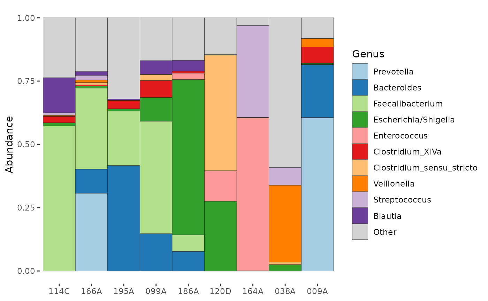
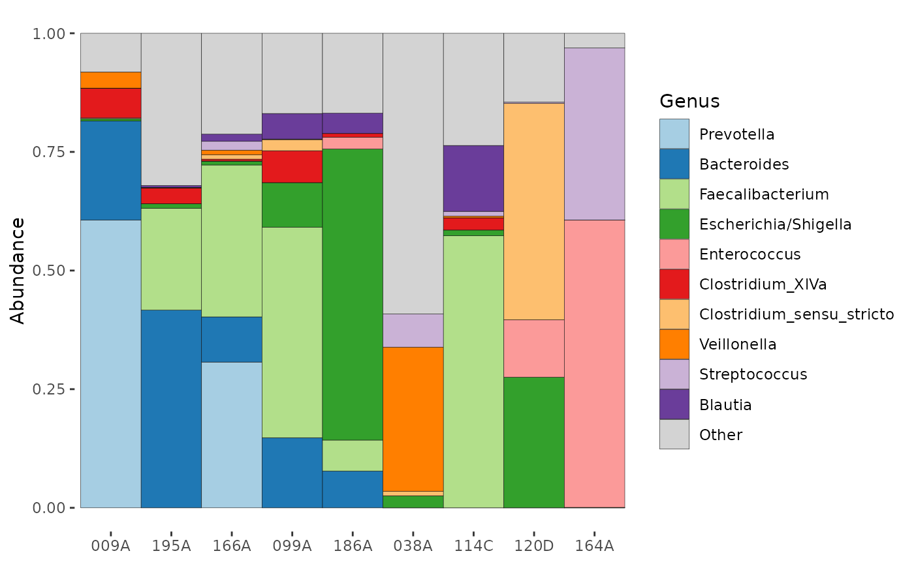

# Working with phyloseq objects

## Intro

This tutorial will show you how microViz makes working with phyloseq
objects easier.

``` r
library(dplyr)
#> 
#> Attaching package: 'dplyr'
#> The following objects are masked from 'package:stats':
#> 
#>     filter, lag
#> The following objects are masked from 'package:base':
#> 
#>     intersect, setdiff, setequal, union
library(phyloseq)
library(microViz)
#> microViz version 0.13.0 - Copyright (C) 2021-2026 David Barnett
#> ! Website: https://david-barnett.github.io/microViz
#> ✔ Useful?  For citation details, run: `citation("microViz")`
#> ✖ Silence? `suppressPackageStartupMessages(library(microViz))`
```

## Getting your data into phyloseq

phyloseq objects are probably the most commonly used data format for
working with microbiome data in R.

The creator of phyloseq, [Paul J. McMurdie](https://github.com/joey711),
explains the structure of phyloseq objects and how to construct them on
the [phyloseq
website](https://joey711.github.io/phyloseq/import-data.html#phyloseq-ize_data_already_in_r).

- [biom format](http://biom-format.org/) files can be imported to
  phyloseq with the
  [`import_biom`](https://joey711.github.io/phyloseq/import-data.html#the_import_family_of_functions)
  function. Such biom files are generated (or can be) from many
  processing tools including QIIME
  [1](http://qiime.org/tutorials/index.md) /
  [2](https://docs.qiime2.org/2021.8/tutorials/exporting/),
  [MetaPhlAn](http://segatalab.cibio.unitn.it/tools/metaphlan/), and
  [NG-Tax](https://doi.org/10.3389/fgene.2019.01366).

- [mothur](https://mothur.org/) output is also directly supported via
  phyloseq’s
  [`import_mothur`](https://joey711.github.io/phyloseq/import-data.html#_import_mothur)
  function.

- [DADA2](https://benjjneb.github.io/dada2/) output can converted to
  phyloseq according to these [DADA2 handoff
  instructions](https://benjjneb.github.io/dada2/tutorial.html#bonus-handoff-to-phyloseq)

Don’t worry too much about getting all of your sample metadata into your
biom file or phyloseq object at the start, as
[`ps_join()`](https://david-barnett.github.io/microViz/reference/ps_join.md)
makes it easy to add sample data later.

``` r
# This tutorial will just use some example data
# It is already available as a phyloseq object from the corncob package
example_ps <- microViz::ibd
example_ps
#> phyloseq-class experiment-level object
#> otu_table()   OTU Table:         [ 36349 taxa and 91 samples ]
#> sample_data() Sample Data:       [ 91 samples by 15 sample variables ]
#> tax_table()   Taxonomy Table:    [ 36349 taxa by 7 taxonomic ranks ]
```

### Validating your phyloseq

phyloseq checks that your sample and taxa names are consistent across
the different slots of the phyloseq object. microViz provides
[`phyloseq_validate()`](https://david-barnett.github.io/microViz/reference/phyloseq_validate.md)
to check for and fix other possible problems with your phyloseq that
might cause problems in later analyses. It is recommended to run this at
the start of your analyses, and fix any problems identified.

``` r
example_ps <- phyloseq_validate(example_ps, remove_undetected = TRUE)
#> Short values detected in phyloseq tax_table (nchar<4) :
#> Consider using tax_fix() to make taxa uniquely identifiable
example_ps <- tax_fix(example_ps)
```

## microViz and phyloseq overview

Once you have a valid phyloseq object, microViz provides several helpful
functions for manipulating that object. The names and syntax of some
functions will be familiar to users of dplyr, and reading [the dplyr
help pages](https://dplyr.tidyverse.org/) may be useful for getting the
most out of these functions.

- Add a data.frame of metadata to the sample_data slot with
  [`ps_join()`](https://david-barnett.github.io/microViz/reference/ps_join.md)

- Compute new sample_data variables with
  [`ps_mutate()`](https://david-barnett.github.io/microViz/reference/ps_mutate.md)

- Subset or reorder variables in sample_data with
  [`ps_select()`](https://david-barnett.github.io/microViz/reference/ps_select.md)

- Subset samples based on sample_data variables with
  [`ps_filter()`](https://david-barnett.github.io/microViz/reference/ps_filter.md)

- Reorder samples (can be useful for examining sample data or plotting)
  with:

  - [`ps_reorder()`](https://david-barnett.github.io/microViz/reference/ps_reorder.md)
    : manually set sample order

  - [`ps_arrange()`](https://david-barnett.github.io/microViz/reference/ps_arrange.md)
    : order samples using sample_data variables

  - [`ps_seriate()`](https://david-barnett.github.io/microViz/reference/ps_seriate.md)
    : order samples according to microbiome similarity

- Remove duplicated/repeated samples with
  [`ps_dedupe()`](https://david-barnett.github.io/microViz/reference/ps_dedupe.md)

- Remove samples with missing values in sample_data with
  [`ps_drop_incomplete()`](https://david-barnett.github.io/microViz/reference/ps_drop_incomplete.md)

Check out the examples section on each function’s
[reference](https://david-barnett.github.io/microViz/reference/index.html#section-manipulating-sample-data)
page for extensive usage examples.

## Example sample manipulation

Lets look at the sample data already in our example phyloseq.

``` r
# 91 samples, with 15 sample_data variables
example_ps
#> phyloseq-class experiment-level object
#> otu_table()   OTU Table:         [ 36349 taxa and 91 samples ]
#> sample_data() Sample Data:       [ 91 samples by 15 sample variables ]
#> tax_table()   Taxonomy Table:    [ 36349 taxa by 7 taxonomic ranks ]
# return sample data as a tibble for pretty printing
samdat_tbl(example_ps)
#> # A tibble: 91 × 16
#>    .sample_name sample gender   age DiseaseState steroids imsp  abx   mesalamine
#>    <chr>        <chr>  <chr>  <int> <chr>        <chr>    <chr> <chr> <chr>     
#>  1 099A         099-AX female    17 UC           steroids imsp  noabx nomes     
#>  2 199A         199-AX female     5 nonIBD       nostero… noim… noabx nomes     
#>  3 062B         062-BZ male      16 CD           steroids imsp  noabx nomes     
#>  4 194A         194-AZ male      15 UC           steroids noim… noabx nomes     
#>  5 166A         166-AX female    20 UC           nostero… noim… abx   nomes     
#>  6 219A         219-AX female    18 UC           nostero… imsp  abx   nomes     
#>  7 132A         132-AX female    12 CD           steroids imsp  noabx nomes     
#>  8 026A         026-AX male      10 UC           steroids imsp  abx   nomes     
#>  9 102A         102-AZ male       3 nonIBD       nostero… noim… noabx nomes     
#> 10 140A         140-AX female     5 nonIBD       nostero… noim… noabx nomes     
#> # ℹ 81 more rows
#> # ℹ 7 more variables: ibd <chr>, activity <chr>, active <chr>, race <chr>,
#> #   fhx <chr>, imspLEVEL <chr>, SampleType <chr>
```

Maybe you want to only select participants who have IBD (not controls).
You can do that by filtering samples based on the values of the sample
data variable: ibd

``` r
example_ps %>% ps_filter(ibd == "ibd") # it is essential to use `==` , not just one `=`
#> phyloseq-class experiment-level object
#> otu_table()   OTU Table:         [ 24490 taxa and 67 samples ]
#> sample_data() Sample Data:       [ 67 samples by 15 sample variables ]
#> tax_table()   Taxonomy Table:    [ 24490 taxa by 7 taxonomic ranks ]
# notice that taxa that no longer appear in the remaining 67 samples have been removed!
```

More complicated filtering rules can be applied. Let’s say you want
female IBD patients with “mild” or “severe” activity, who are at least
13 years old.

``` r
partial_ps <- example_ps %>%
  ps_filter(
    gender == "female",
    activity %in% c("mild", "severe"),
    age >= 13
  )
partial_ps
#> phyloseq-class experiment-level object
#> otu_table()   OTU Table:         [ 2600 taxa and 9 samples ]
#> sample_data() Sample Data:       [ 9 samples by 15 sample variables ]
#> tax_table()   Taxonomy Table:    [ 2600 taxa by 7 taxonomic ranks ]
```

Let’s have a look at the sample data of these participants. We will also
arrange the samples grouped by disease and in descending age order, and
select only a few interesting variables to show.

``` r
partial_ps %>%
  ps_arrange(DiseaseState, desc(age)) %>%
  ps_select(DiseaseState, age, matches("activ"), abx) %>% # selection order is respected
  samdat_tbl() # this adds the .sample_name variable
#> # A tibble: 9 × 6
#>   .sample_name DiseaseState   age activity active abx  
#>   <chr>        <chr>        <int> <chr>    <chr>  <chr>
#> 1 195A         CD              13 mild     active noabx
#> 2 164A         UC              21 severe   active abx  
#> 3 166A         UC              20 severe   active abx  
#> 4 038A         UC              19 mild     active noabx
#> 5 114C         UC              19 mild     active noabx
#> 6 099A         UC              17 severe   active noabx
#> 7 009A         UC              15 severe   active noabx
#> 8 120D         UC              14 mild     active noabx
#> 9 186A         UC              14 severe   active abx
```

You can also sort sample by microbiome similarity with
[`ps_seriate()`](https://david-barnett.github.io/microViz/reference/ps_seriate.md).

``` r
partial_ps %>%
  tax_agg("Genus") %>%
  ps_seriate(dist = "bray", method = "OLO_ward") %>% # these are the defaults
  comp_barplot(tax_level = "Genus", sample_order = "asis", n_taxa = 10)
#> Registered S3 method overwritten by 'seriation':
#>   method         from 
#>   reorder.hclust vegan
```



``` r
# note that comp_barplot with sample_order = "bray" will run
# this ps_seriate call internally, so you don't have to!
```

You can also arrange samples by abundance of one of more microbes using
[`ps_arrange()`](https://david-barnett.github.io/microViz/reference/ps_arrange.md)
with `.target = "otu_table"`. Arranging by taxon can only be done at the
current taxonomic rank, so we will aggregate to Genus level first.

``` r
# Arranging by decreasing Bacteroides abundance
partial_ps %>%
  tax_agg("Genus") %>%
  ps_arrange(desc(Bacteroides), .target = "otu_table") %>%
  otu_get() %>% # get the otu table
  .[, 1:6] # show only a subset of the otu_table
#> OTU Table:          [6 taxa and 9 samples]
#>                      taxa are columns
#>      Prevotella Clostridium_XlVa Hallella Veillonella Bacteroides Blautia
#> 009A       4480              462        4         250        1542       0
#> 195A          0               40        0           1         514       5
#> 166A        549                7        0          17         170      27
#> 099A          0               60        0           0         132      48
#> 186A          0                7        0           0          69      38
#> 038A          0                0        0         192           0       0
#> 114C          0               44        0           6           0     236
#> 120D          0                0        0           0           0       0
#> 164A          0                0        0           0           0       0

# Plot samples' compositions in this order
partial_ps %>%
  tax_agg("Genus") %>%
  ps_arrange(desc(Bacteroides), .target = "otu_table") %>%
  comp_barplot(tax_level = "Genus", sample_order = "asis", n_taxa = 10)
```



``` r
# Notice this is sorted by bacteroides counts
# (this doesn't quite match relative abundance % due to sequencing depth variation)
```

## Other notes:

### `ps_filter()` vs. `phyloseq::subset_samples()`

As well as filtering your samples,
[`ps_filter()`](https://david-barnett.github.io/microViz/reference/ps_filter.md)
might also modify the otu_table and tax_table of the phyloseq object
(unlike
[`phyloseq::subset_samples()`](https://rdrr.io/pkg/phyloseq/man/subset_samples-methods.html),
which never does this).

Why does it do this?  
If you remove many samples from your dataset, often your phyloseq object
will be left with taxa that never occur in any of the remaining samples
(i.e. total counts of zero).
[`ps_filter()`](https://david-barnett.github.io/microViz/reference/ps_filter.md)
removes those absent taxa by default.

If you don’t want this, you can set the `.keep_all_taxa` argument to
`TRUE` in `ps_filter`.

## Technical log

``` r
devtools::session_info()
#> ─ Session info ───────────────────────────────────────────────────────────────
#>  setting  value
#>  version  R version 4.5.2 (2025-10-31)
#>  os       Ubuntu 24.04.3 LTS
#>  system   x86_64, linux-gnu
#>  ui       X11
#>  language en
#>  collate  C.UTF-8
#>  ctype    C.UTF-8
#>  tz       UTC
#>  date     2026-02-17
#>  pandoc   3.1.11 @ /opt/hostedtoolcache/pandoc/3.1.11/x64/ (via rmarkdown)
#>  quarto   NA
#> 
#> ─ Packages ───────────────────────────────────────────────────────────────────
#>  package      * version  date (UTC) lib source
#>  ade4           1.7-23   2025-02-14 [1] RSPM
#>  ape            5.8-1    2024-12-16 [1] RSPM
#>  Biobase        2.70.0   2025-10-29 [1] Bioconduc~
#>  BiocGenerics   0.56.0   2025-10-29 [1] Bioconduc~
#>  biomformat     1.38.0   2025-10-29 [1] Bioconduc~
#>  Biostrings     2.78.0   2025-10-29 [1] Bioconduc~
#>  bslib          0.10.0   2026-01-26 [1] RSPM
#>  ca             0.71.1   2020-01-24 [1] RSPM
#>  cachem         1.1.0    2024-05-16 [1] RSPM
#>  cli            3.6.5    2025-04-23 [1] RSPM
#>  cluster        2.1.8.1  2025-03-12 [3] CRAN (R 4.5.2)
#>  codetools      0.2-20   2024-03-31 [3] CRAN (R 4.5.2)
#>  crayon         1.5.3    2024-06-20 [1] RSPM
#>  data.table     1.18.2.1 2026-01-27 [1] RSPM
#>  desc           1.4.3    2023-12-10 [1] RSPM
#>  devtools       2.4.6    2025-10-03 [1] RSPM
#>  digest         0.6.39   2025-11-19 [1] RSPM
#>  dplyr        * 1.2.0    2026-02-03 [1] RSPM
#>  ellipsis       0.3.2    2021-04-29 [1] RSPM
#>  evaluate       1.0.5    2025-08-27 [1] RSPM
#>  farver         2.1.2    2024-05-13 [1] RSPM
#>  fastmap        1.2.0    2024-05-15 [1] RSPM
#>  foreach        1.5.2    2022-02-02 [1] RSPM
#>  fs             1.6.6    2025-04-12 [1] RSPM
#>  generics       0.1.4    2025-05-09 [1] RSPM
#>  ggplot2        4.0.2    2026-02-03 [1] RSPM
#>  glue           1.8.0    2024-09-30 [1] RSPM
#>  gtable         0.3.6    2024-10-25 [1] RSPM
#>  htmltools      0.5.9    2025-12-04 [1] RSPM
#>  htmlwidgets    1.6.4    2023-12-06 [1] RSPM
#>  igraph         2.2.2    2026-02-12 [1] RSPM
#>  IRanges        2.44.0   2025-10-29 [1] Bioconduc~
#>  iterators      1.0.14   2022-02-05 [1] RSPM
#>  jquerylib      0.1.4    2021-04-26 [1] RSPM
#>  jsonlite       2.0.0    2025-03-27 [1] RSPM
#>  knitr          1.51     2025-12-20 [1] RSPM
#>  labeling       0.4.3    2023-08-29 [1] RSPM
#>  lattice        0.22-7   2025-04-02 [3] CRAN (R 4.5.2)
#>  lifecycle      1.0.5    2026-01-08 [1] RSPM
#>  magrittr       2.0.4    2025-09-12 [1] RSPM
#>  MASS           7.3-65   2025-02-28 [3] CRAN (R 4.5.2)
#>  Matrix         1.7-4    2025-08-28 [3] CRAN (R 4.5.2)
#>  memoise        2.0.1    2021-11-26 [1] RSPM
#>  mgcv           1.9-3    2025-04-04 [3] CRAN (R 4.5.2)
#>  microbiome     1.32.0   2025-10-29 [1] Bioconduc~
#>  microViz     * 0.13.0   2026-02-17 [1] local
#>  multtest       2.66.0   2025-10-29 [1] Bioconduc~
#>  nlme           3.1-168  2025-03-31 [3] CRAN (R 4.5.2)
#>  otel           0.2.0    2025-08-29 [1] RSPM
#>  permute        0.9-10   2026-02-06 [1] RSPM
#>  phyloseq     * 1.54.0   2025-10-29 [1] Bioconduc~
#>  pillar         1.11.1   2025-09-17 [1] RSPM
#>  pkgbuild       1.4.8    2025-05-26 [1] RSPM
#>  pkgconfig      2.0.3    2019-09-22 [1] RSPM
#>  pkgdown        2.2.0    2025-11-06 [1] RSPM
#>  pkgload        1.5.0    2026-02-03 [1] RSPM
#>  plyr           1.8.9    2023-10-02 [1] RSPM
#>  purrr          1.2.1    2026-01-09 [1] RSPM
#>  R6             2.6.1    2025-02-15 [1] RSPM
#>  ragg           1.5.0    2025-09-02 [1] RSPM
#>  RColorBrewer   1.1-3    2022-04-03 [1] RSPM
#>  Rcpp           1.1.1    2026-01-10 [1] RSPM
#>  registry       0.5-1    2019-03-05 [1] RSPM
#>  remotes        2.5.0    2024-03-17 [1] RSPM
#>  reshape2       1.4.5    2025-11-12 [1] RSPM
#>  rhdf5          2.54.1   2025-12-04 [1] Bioconduc~
#>  rhdf5filters   1.22.0   2025-10-29 [1] Bioconduc~
#>  Rhdf5lib       1.32.0   2025-10-29 [1] Bioconduc~
#>  rlang          1.1.7    2026-01-09 [1] RSPM
#>  rmarkdown      2.30     2025-09-28 [1] RSPM
#>  Rtsne          0.17     2023-12-07 [1] RSPM
#>  S4Vectors      0.48.0   2025-10-29 [1] Bioconduc~
#>  S7             0.2.1    2025-11-14 [1] RSPM
#>  sass           0.4.10   2025-04-11 [1] RSPM
#>  scales         1.4.0    2025-04-24 [1] RSPM
#>  Seqinfo        1.0.0    2025-10-29 [1] Bioconduc~
#>  seriation      1.5.8    2025-08-20 [1] RSPM
#>  sessioninfo    1.2.3    2025-02-05 [1] RSPM
#>  stringi        1.8.7    2025-03-27 [1] RSPM
#>  stringr        1.6.0    2025-11-04 [1] RSPM
#>  survival       3.8-3    2024-12-17 [3] CRAN (R 4.5.2)
#>  systemfonts    1.3.1    2025-10-01 [1] RSPM
#>  textshaping    1.0.4    2025-10-10 [1] RSPM
#>  tibble         3.3.1    2026-01-11 [1] RSPM
#>  tidyr          1.3.2    2025-12-19 [1] RSPM
#>  tidyselect     1.2.1    2024-03-11 [1] RSPM
#>  TSP            1.2.6    2025-11-27 [1] RSPM
#>  usethis        3.2.1    2025-09-06 [1] RSPM
#>  utf8           1.2.6    2025-06-08 [1] RSPM
#>  vctrs          0.7.1    2026-01-23 [1] RSPM
#>  vegan          2.7-2    2025-10-08 [1] RSPM
#>  withr          3.0.2    2024-10-28 [1] RSPM
#>  xfun           0.56     2026-01-18 [1] RSPM
#>  XVector        0.50.0   2025-10-29 [1] Bioconduc~
#>  yaml           2.3.12   2025-12-10 [1] RSPM
#> 
#>  [1] /home/runner/work/_temp/Library
#>  [2] /opt/R/4.5.2/lib/R/site-library
#>  [3] /opt/R/4.5.2/lib/R/library
#>  * ── Packages attached to the search path.
#> 
#> ──────────────────────────────────────────────────────────────────────────────
```
