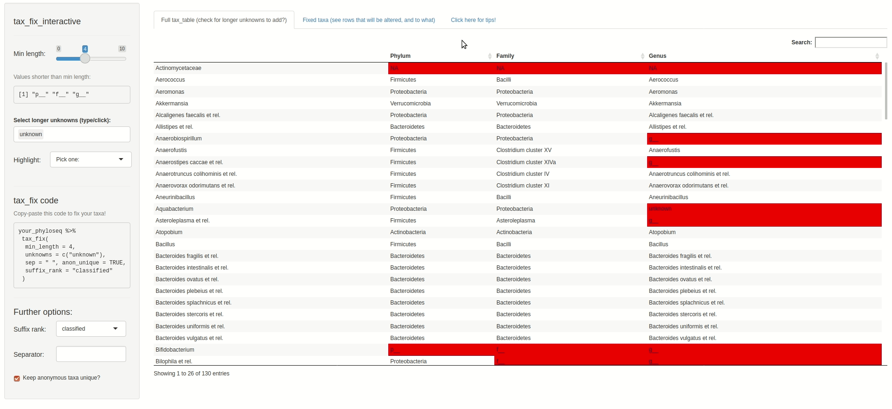

# Fixing your tax_table

## Quick start / TLDR

Use
[`tax_fix()`](https://david-barnett.github.io/microViz/reference/tax_fix.md)
on your phyloseq data with default arguments to repair most `tax_table`
problems (missing or uninformative values). If you still encounter
errors using e.g. `tax_agg`, try using the Shiny app
[`tax_fix_interactive()`](https://david-barnett.github.io/microViz/reference/tax_fix_interactive.md)
to help you generate `tax_fix` code that will fix your particular
`tax_table` problems.

------------------------------------------------------------------------

``` r
library(phyloseq)
suppressPackageStartupMessages(library(microViz))
```

## Intro

This article will explain some of the common problems that can occur in
your phyloseq `tax_table`, and that might cause problems for
e.g. `tax_agg`. You can fix these problems with the help of `tax_fix`
and `tax_fix_interactive`.

## Fixing problems

Let’s look at some example data from the corncob package:

``` r
pseq <- microViz::ibd
pseq
#> phyloseq-class experiment-level object
#> otu_table()   OTU Table:         [ 36349 taxa and 91 samples ]
#> sample_data() Sample Data:       [ 91 samples by 15 sample variables ]
#> tax_table()   Taxonomy Table:    [ 36349 taxa by 7 taxonomic ranks ]
```

The Species rank appears to be blank for many entries. This is a problem
you may well encounter in your data: unique sequences or OTUs often
cannot be annotated at lower taxonomic ranks.

``` r
tax_table(pseq)[40:54, 4:7] # highest 3 ranks not shown, to save space
#> Taxonomy Table:     [15 taxa by 4 taxonomic ranks]:
#>        Order               Family               Genus                  Species
#> OTU.40 "Enterobacteriales" "Enterobacteriaceae" "Escherichia/Shigella" ""     
#> OTU.41 "Coriobacteriales"  "Coriobacteriaceae"  "Gordonibacter"        ""     
#> OTU.42 "Clostridiales"     "Ruminococcaceae"    "Faecalibacterium"     ""     
#> OTU.43 "Clostridiales"     "Ruminococcaceae"    ""                     ""     
#> OTU.44 "Bacteroidales"     "Prevotellaceae"     "Prevotella"           ""     
#> OTU.45 "Bacteroidales"     "Bacteroidaceae"     "Bacteroides"          ""     
#> OTU.46 "Enterobacteriales" "Enterobacteriaceae" "Klebsiella"           ""     
#> OTU.47 "Bacteroidales"     "Prevotellaceae"     "Prevotella"           ""     
#> OTU.48 "Clostridiales"     "Lachnospiraceae"    "Blautia"              ""     
#> OTU.49 "Clostridiales"     "Ruminococcaceae"    "Faecalibacterium"     ""     
#> OTU.50 "Enterobacteriales" "Enterobacteriaceae" "Escherichia/Shigella" ""     
#> OTU.51 "Bacteroidales"     "Prevotellaceae"     "Prevotella"           ""     
#> OTU.52 "Clostridiales"     "Lachnospiraceae"    "Clostridium_XlVa"     ""     
#> OTU.53 "Bacteroidales"     "Prevotellaceae"     "Prevotella"           ""     
#> OTU.54 "Clostridiales"     "Lachnospiraceae"    ""                     ""
```

If we would try to aggregate at Genus or Family rank level, we discover
that blank values at these ranks prevent taxonomic aggregation. This is
because, for example, it looks like OTU.43 and OTU.54 share the same
(empty) Genus name, ““, despite being different at a higher rank,
Family.

``` r
# tax_agg(pseq, rank = "Family") # this fails, and sends (helpful) messages about taxa problems
```

So we should run `tax_fix` first, which will fix **most** problems with
default settings, allowing taxa to be aggregated successfully (at any
rank). If you still have errors when using tax_agg after tax_fix,
carefully read the error and accompanying messages. Often you can copy
suggested tax_fix code from the tax_agg error. You should generally also
have a look around your tax_table for other uninformative values, using
[tax_fix_interactive](https://david-barnett.github.io/microViz/articles/web-only/tax-fixing.html#interactive-solutions).

``` r
pseq %>%
  tax_fix() %>%
  tax_agg(rank = "Family")
#> psExtra object - a phyloseq object with extra slots:
#> 
#> phyloseq-class experiment-level object
#> otu_table()   OTU Table:         [ 59 taxa and 91 samples ]
#> sample_data() Sample Data:       [ 91 samples by 15 sample variables ]
#> tax_table()   Taxonomy Table:    [ 59 taxa by 5 taxonomic ranks ]
#> 
#> psExtra info:
#> tax_agg = "Family"
```

### What does tax_fix do?

`tax_fix` searches all the ranks of the phyloseq object `tax_table` for:

- short values, like “g\_\_”, ““,” “, etc. (any with fewer characters
  than min_length)

- common, longer but uninformative values like “unknown” (see full list
  at
  [`?tax_fix`](https://david-barnett.github.io/microViz/reference/tax_fix.md))

- NAs

`tax_fix` replaces these values with the next higher taxonomic rank,
e.g. an “unknown” Family within the Order Clostridiales will be renamed
“Clostridiales Order”, as seen below.

``` r
pseq %>%
  tax_fix(min_length = 4) %>%
  tax_agg("Family") %>%
  # ps_get() %>% # needed in older versions of microViz (< 0.10.0)
  tax_table() %>%
  .[1:8, 3:5] # removes the first 2 ranks and shows only first 8 rows for nice printing
#> Taxonomy Table:     [8 taxa by 3 taxonomic ranks]:
#>                       Class           Order             Family                 
#> Ruminococcaceae       "Clostridia"    "Clostridiales"   "Ruminococcaceae"      
#> Bacteroidaceae        "Bacteroidia"   "Bacteroidales"   "Bacteroidaceae"       
#> Prevotellaceae        "Bacteroidia"   "Bacteroidales"   "Prevotellaceae"       
#> Lachnospiraceae       "Clostridia"    "Clostridiales"   "Lachnospiraceae"      
#> Veillonellaceae       "Negativicutes" "Selenomonadales" "Veillonellaceae"      
#> Clostridiales Order   "Clostridia"    "Clostridiales"   "Clostridiales Order"  
#> Peptostreptococcaceae "Clostridia"    "Clostridiales"   "Peptostreptococcaceae"
#> Porphyromonadaceae    "Bacteroidia"   "Bacteroidales"   "Porphyromonadaceae"
```

### Interactive solutions

You can use
[`tax_fix_interactive()`](https://david-barnett.github.io/microViz/reference/tax_fix_interactive.md)
to explore your data’s `tax_table` visually, and interactively find and
fix problematic entries. You can then copy your automagically
personalised `tax_fix` code from `tax_fix_interactive`’s output, to
paste into your script. Below is a screen capture video of `tax_fix` in
action, using some other artificially mangled example data (see details
at `?tax_fix_interactive()`).

``` r
tax_fix_interactive(example_data)
```



### Other possible problems

1.  **Completely unclassified taxa** (aka taxa where all values in their
    `tax_table` row are either too short or listed in unknowns argument)
    will be replaced at all ranks with their unique row name by default
    (or alternatively with a generic name of “unclassified \[highest
    rank\]”, which is useful if you want to aggregate all the
    unclassified sequences together with
    [`tax_agg()`](https://david-barnett.github.io/microViz/reference/tax_agg.md))
2.  **Unclassified taxa that also have short / unknown row names**,
    e.g. the unclassified taxon called “-1” in the example “enterotype”
    dataset from phyloseq. If something like this happens in your data,
    rename the taxa manually,
    (e.g. `taxa_names(enterotype)[1] <- "unclassified taxon"` or give
    them all completely different names with
    [`tax_name()`](https://david-barnett.github.io/microViz/reference/tax_name.md).
3.  T**axa with the same `tax_table` entry repeated across multiple
    ranks**: This is a problem for functions like
    [`taxatree_plots()`](https://david-barnett.github.io/microViz/reference/taxatree_plots.md),
    which need distinct entries at each rank to build the tree structure
    for plotting. This might happen after you `tax_fix` data with
    problem 1. of this list, or in data from e.g. microarray methods
    like HITchip. The solution is to use
    [`tax_prepend_ranks()`](https://david-barnett.github.io/microViz/reference/tax_prepend_ranks.md)
    (after `tax_fix`) to add the first character of the rank to all
    tax_table entries (you will also need set the `tax_fix` argument
    suffix_rank = “current”).
4.  **Informative but duplicated `tax_table` entries:** e.g. you don’t
    want to delete/replace a genus name completely, but it is shared by
    two families and thus blocking `tax_agg`. The solution is to rename
    (one of) these values manually to make them distinct.
    `tax_table(yourPhyloseq)["targetTaxonName", "targetRank"] <- "newBetterGenusName"`
5.  **Really long taxa_names():** e.g. you have DNA sequences as names.
    See
    [`tax_name()`](https://david-barnett.github.io/microViz/reference/tax_name.md)
    for an easy way to rename all your taxa.

## Abundance filtering as a solution

Sequences that are unclassified at fairly high ranks e.g. Class are
often very low abundance (or possibly represent sequencing
errors/chimeras), if you are using data from an environment that is
typically well represented in reference databases. So if you are
struggling with what to do with unclassified taxa, consider if you can
just remove them first using
[`tax_filter()`](https://david-barnett.github.io/microViz/reference/tax_filter.md)
(perhaps using fairly relaxed filtering criteria like min_prevalence of
2 samples, or min_total_abundance of 1000 reads, and keeping the
tax_level argument as NA, so that no aggregation is attempted before
filtering).

## Alternatives

[`microbiome::aggregate_taxa()`](https://rdrr.io/pkg/microbiome/man/aggregate_taxa.html)
also solves some `tax_table` problems, e.g. where multiple distinct
genera converge again to the same species name like “” or “s\_\_”, it
will make unique taxa names by pasting together **all** of the rank
names. However this can produce some very long names, which need to be
manually shortened before use in plots. Plus, it doesn’t replace names
like “s\_\_” if they only occur once. Moreover, when creating ordination
plots with microViz, only
[`tax_agg()`](https://david-barnett.github.io/microViz/reference/tax_agg.md)
will record the aggregation level for provenance tracking and automated
plot captioning.

## Session info

``` r
devtools::session_info()
#> ─ Session info ───────────────────────────────────────────────────────────────
#>  setting  value
#>  version  R version 4.5.2 (2025-10-31)
#>  os       Ubuntu 24.04.3 LTS
#>  system   x86_64, linux-gnu
#>  ui       X11
#>  language en
#>  collate  C.UTF-8
#>  ctype    C.UTF-8
#>  tz       UTC
#>  date     2026-02-17
#>  pandoc   3.1.11 @ /opt/hostedtoolcache/pandoc/3.1.11/x64/ (via rmarkdown)
#>  quarto   NA
#> 
#> ─ Packages ───────────────────────────────────────────────────────────────────
#>  package      * version  date (UTC) lib source
#>  ade4           1.7-23   2025-02-14 [1] RSPM
#>  ape            5.8-1    2024-12-16 [1] RSPM
#>  Biobase        2.70.0   2025-10-29 [1] Bioconduc~
#>  BiocGenerics   0.56.0   2025-10-29 [1] Bioconduc~
#>  biomformat     1.38.0   2025-10-29 [1] Bioconduc~
#>  Biostrings     2.78.0   2025-10-29 [1] Bioconduc~
#>  bslib          0.10.0   2026-01-26 [1] RSPM
#>  cachem         1.1.0    2024-05-16 [1] RSPM
#>  cli            3.6.5    2025-04-23 [1] RSPM
#>  cluster        2.1.8.1  2025-03-12 [3] CRAN (R 4.5.2)
#>  codetools      0.2-20   2024-03-31 [3] CRAN (R 4.5.2)
#>  crayon         1.5.3    2024-06-20 [1] RSPM
#>  data.table     1.18.2.1 2026-01-27 [1] RSPM
#>  desc           1.4.3    2023-12-10 [1] RSPM
#>  devtools       2.4.6    2025-10-03 [1] RSPM
#>  digest         0.6.39   2025-11-19 [1] RSPM
#>  dplyr          1.2.0    2026-02-03 [1] RSPM
#>  ellipsis       0.3.2    2021-04-29 [1] RSPM
#>  evaluate       1.0.5    2025-08-27 [1] RSPM
#>  farver         2.1.2    2024-05-13 [1] RSPM
#>  fastmap        1.2.0    2024-05-15 [1] RSPM
#>  foreach        1.5.2    2022-02-02 [1] RSPM
#>  fs             1.6.6    2025-04-12 [1] RSPM
#>  generics       0.1.4    2025-05-09 [1] RSPM
#>  ggplot2        4.0.2    2026-02-03 [1] RSPM
#>  glue           1.8.0    2024-09-30 [1] RSPM
#>  gtable         0.3.6    2024-10-25 [1] RSPM
#>  htmltools      0.5.9    2025-12-04 [1] RSPM
#>  htmlwidgets    1.6.4    2023-12-06 [1] RSPM
#>  igraph         2.2.2    2026-02-12 [1] RSPM
#>  IRanges        2.44.0   2025-10-29 [1] Bioconduc~
#>  iterators      1.0.14   2022-02-05 [1] RSPM
#>  jquerylib      0.1.4    2021-04-26 [1] RSPM
#>  jsonlite       2.0.0    2025-03-27 [1] RSPM
#>  knitr          1.51     2025-12-20 [1] RSPM
#>  lattice        0.22-7   2025-04-02 [3] CRAN (R 4.5.2)
#>  lifecycle      1.0.5    2026-01-08 [1] RSPM
#>  magrittr       2.0.4    2025-09-12 [1] RSPM
#>  MASS           7.3-65   2025-02-28 [3] CRAN (R 4.5.2)
#>  Matrix         1.7-4    2025-08-28 [3] CRAN (R 4.5.2)
#>  memoise        2.0.1    2021-11-26 [1] RSPM
#>  mgcv           1.9-3    2025-04-04 [3] CRAN (R 4.5.2)
#>  microViz     * 0.13.0   2026-02-17 [1] local
#>  multtest       2.66.0   2025-10-29 [1] Bioconduc~
#>  nlme           3.1-168  2025-03-31 [3] CRAN (R 4.5.2)
#>  otel           0.2.0    2025-08-29 [1] RSPM
#>  permute        0.9-10   2026-02-06 [1] RSPM
#>  phyloseq     * 1.54.0   2025-10-29 [1] Bioconduc~
#>  pillar         1.11.1   2025-09-17 [1] RSPM
#>  pkgbuild       1.4.8    2025-05-26 [1] RSPM
#>  pkgconfig      2.0.3    2019-09-22 [1] RSPM
#>  pkgdown        2.2.0    2025-11-06 [1] RSPM
#>  pkgload        1.5.0    2026-02-03 [1] RSPM
#>  plyr           1.8.9    2023-10-02 [1] RSPM
#>  purrr          1.2.1    2026-01-09 [1] RSPM
#>  R6             2.6.1    2025-02-15 [1] RSPM
#>  ragg           1.5.0    2025-09-02 [1] RSPM
#>  RColorBrewer   1.1-3    2022-04-03 [1] RSPM
#>  Rcpp           1.1.1    2026-01-10 [1] RSPM
#>  remotes        2.5.0    2024-03-17 [1] RSPM
#>  reshape2       1.4.5    2025-11-12 [1] RSPM
#>  rhdf5          2.54.1   2025-12-04 [1] Bioconduc~
#>  rhdf5filters   1.22.0   2025-10-29 [1] Bioconduc~
#>  Rhdf5lib       1.32.0   2025-10-29 [1] Bioconduc~
#>  rlang          1.1.7    2026-01-09 [1] RSPM
#>  rmarkdown      2.30     2025-09-28 [1] RSPM
#>  S4Vectors      0.48.0   2025-10-29 [1] Bioconduc~
#>  S7             0.2.1    2025-11-14 [1] RSPM
#>  sass           0.4.10   2025-04-11 [1] RSPM
#>  scales         1.4.0    2025-04-24 [1] RSPM
#>  Seqinfo        1.0.0    2025-10-29 [1] Bioconduc~
#>  sessioninfo    1.2.3    2025-02-05 [1] RSPM
#>  stringi        1.8.7    2025-03-27 [1] RSPM
#>  stringr        1.6.0    2025-11-04 [1] RSPM
#>  survival       3.8-3    2024-12-17 [3] CRAN (R 4.5.2)
#>  systemfonts    1.3.1    2025-10-01 [1] RSPM
#>  textshaping    1.0.4    2025-10-10 [1] RSPM
#>  tibble         3.3.1    2026-01-11 [1] RSPM
#>  tidyselect     1.2.1    2024-03-11 [1] RSPM
#>  usethis        3.2.1    2025-09-06 [1] RSPM
#>  vctrs          0.7.1    2026-01-23 [1] RSPM
#>  vegan          2.7-2    2025-10-08 [1] RSPM
#>  withr          3.0.2    2024-10-28 [1] RSPM
#>  xfun           0.56     2026-01-18 [1] RSPM
#>  XVector        0.50.0   2025-10-29 [1] Bioconduc~
#>  yaml           2.3.12   2025-12-10 [1] RSPM
#> 
#>  [1] /home/runner/work/_temp/Library
#>  [2] /opt/R/4.5.2/lib/R/site-library
#>  [3] /opt/R/4.5.2/lib/R/library
#>  * ── Packages attached to the search path.
#> 
#> ──────────────────────────────────────────────────────────────────────────────
```
