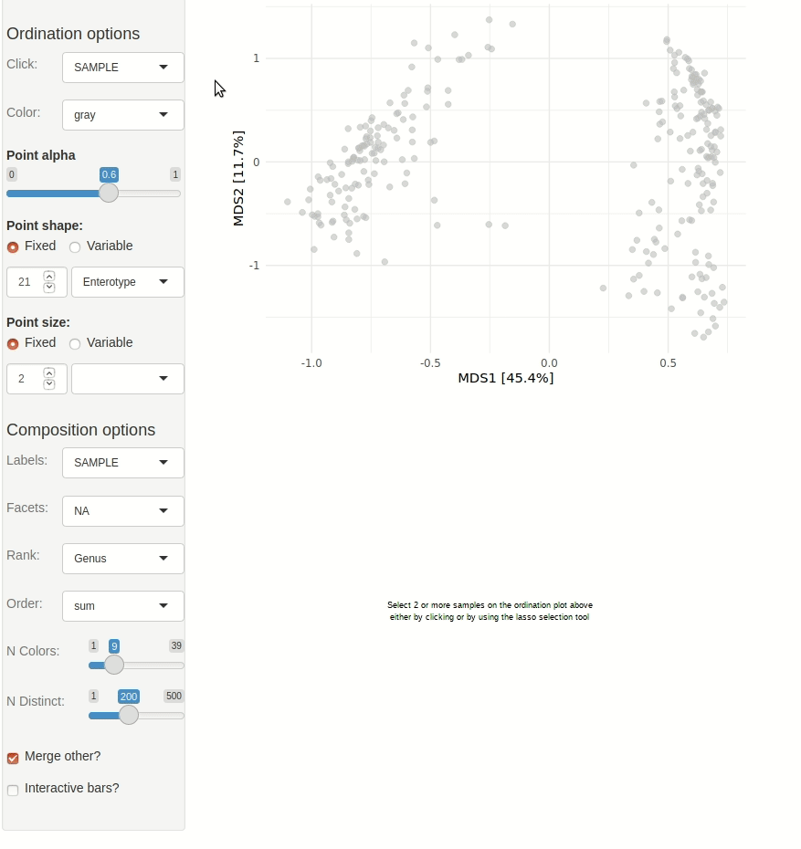

```{r, include = FALSE}
knitr::opts_chunk$set(
  collapse = TRUE,
  comment = "#>"
)
```

```{r setup}
library(phyloseq)
library(microViz)
```

Get example data and clean up the taxa just a little.

```{r get data}
data("enterotype", package = "phyloseq")
taxa_names(enterotype)[1] <- "Unclassified" # replace strange "-1" name
ps <- tax_fill_unknowns(enterotype) # remove NA taxa and similar
```

Create simple Bray-Curtis PCoA to explore interactively.

```{r create ordination}
ord1 <- ps %>%
  tax_transform("identity", rank = "Genus") %>% 
  dist_calc("bray") %>% # bray curtis
  ord_calc() # automagically picks PCoA
```

Start interactive Shiny App

``` r
ord_explore(data = ord1, auto_caption = NA)
```

{width=90%}

# Session info
```{r}
devtools::session_info()
```


