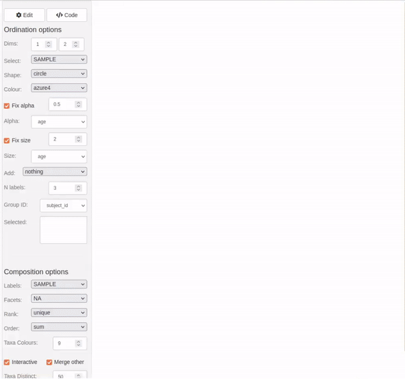

```{r, include = FALSE}
knitr::opts_chunk$set(
  collapse = TRUE,
  comment = "#>"
)
```

## Introduction

This article will demonstrate some of the data processing steps, statistical analyses, and visualisations that can be performed with the microViz package. It will also provide some tips for how to use microViz with your own data, and point you to other articles for more details.

```{r setup}
set.seed(1) # for reproducible stochastic processes
library(phyloseq)
library(ggplot2)
library(patchwork) # for combining multiple plots
library(microViz)
```

The data used in this article are derived from faecal samples obtained from infants and mothers participating in a large birth cohort study.

```{r}
shao19
```

```{r}
?shao19 # for more details on the dataset
```

**Note:** These human gut microbiota data were generated from shotgun metagenomic sequencing, but microViz can be (and has been) used with microbiota data from various other sources, including 16S and ITS marker gene amplicon sequencing techniques, as well as HITChip profiling. Environmental and *in vitro* microbiota datasets are all also welcome in microViz, not just human gut bugs.

If you can put your data in a phyloseq object, then you can use microViz with it. If you need guidance on how to create a phyloseq object from your own data: [see this article for resource links](https://david-barnett.github.io/microViz/articles/web-only/phyloseq.html#getting-your-data-into-phyloseq "Getting your data into phyloseq").

## Checking your data

You can check the basic characteristics of your phyloseq dataset using standard phyloseq functions. microViz also provides a few helper functions.

```{r}
sample_names(shao19) %>% head()
```

Note: These taxa already have informative unique names, but if your taxa_names are just numbers or sequences, look at the `tax_rename()` function for one way to replace them with more readable/informative unique names.

```{r}
taxa_names(shao19) %>% head()
```

```{r}
sample_variables(shao19)
```

```{r}
samdat_tbl(shao19) # retrieve sample_data as a tibble
```

```{r}
otu_get(shao19, taxa = 1:3, samples = 1:5) # look at a tiny part of the otu_table
```

```{r}
rank_names(shao19)
```

```{r}
tax_table(shao19) %>% head(3)
```

The function `phyloseq_validate()` can be used to check for common problems with phyloseq objects, so I suggest running it on your data before trying to start your analyses.

```{r}
shao19 <- phyloseq_validate(shao19) # no messages or warnings means no detected problems
```

### Fixing your tax_table

One common problem you will encounter either when you run phyloseq_validate or shortly after, are problematic entries in the taxonomy table. For example if many or all of the "species" rank entries are `"s__"` or `"unknown_species"` or `NA` etc. The same species name should not appear under multiple genera, so these duplicated or uninformative entries need to be replaced before you can proceed.

[See this article](https://david-barnett.github.io/microViz/articles/web-only/tax-fixing.html "Fixing your tax_table") for a discussion of how to fix these problems using `tax_fix()` and maybe `tax_fix_interactive()` and/or `tax_filter()`. As a last resort you could also try deleting entirely unwanted taxa by using `tax_select()`.

## Modify your sample_data

Later in these example analyses we will need modified version of the sample variables stored in the sample_data slot of the phyloseq object. The `ps_mutate()` function provides an easy way to modify your phyloseq sample_data (ps is short for phyloseq). You can use `ps_mutate()` in a similar way to `dplyr::mutate()`. If you are unfamiliar with the `{dplyr}` package, I highly recommend you look at the [dplyr website](https://dplyr.tidyverse.org/), to learn about some incredibly handy tools for data transformation, and because several of the microViz data transformation functions are used in a similar way.

```{r}
shao19 <- shao19 %>%
  ps_mutate(
    Csection = ifelse(birth_mode == "c_section", yes = 1, no = 0),
    birth_mode3 = dplyr::recode(
      c_section_type,
      Elective_CS = "CS Elective", Emergency_CS = "CS Emergency", .missing = "Vaginal"
    )
  )
```

## Subset your samples

For the first part of this example analyses we will look at only one sample per infant, from the timepoint when they were 4 days old. The microViz function `ps_filter()` makes this easy. You use `ps_filter()` in a similar way to `dplyr::filter()`, to filter samples using variables in the sample_data.

We will also use `ps_dedupe()` to "deduplicate" samples, to ensure that we definitely only keep one sample per family (e.g. if any infant has more than one sample at age 4, or if there are twins).

-   **Note 1:** Observe that `==` is used here, not `=`

-   **Note 2**: By default, `ps_filter()` also removes taxa that no longer appear in the filtered dataset (zero total counts). This is different to `phyloseq::subset_samples()` and `phyloseq::prune_samples()`.

```{r}
shao4d <- shao19 %>%
  ps_filter(family_role == "child", infant_age == 4, .keep_all_taxa = TRUE) %>%
  ps_dedupe(vars = "family_id")
shao4d
```

## Composition barplot

Let us look at the compositions of infant samples from age of 4 days, grouping the samples by birth mode. The `comp_barplot()` function make generating an attractive and informative ggplot2 bar chart easy: by default it automatically sorts the samples by microbiota similarity, sorts the taxa by overall abundance, and applies a sensible categorical colour palette with many colours. Taxa not assigned a colour are merged into one light grey bar by default, but can be shown un-merged, as in this example.

```{r message=FALSE, fig.height=6, fig.width=7}
shao4d %>%
  comp_barplot("genus", n_taxa = 15, merge_other = FALSE, label = NULL) +
  facet_wrap(vars(birth_mode), scales = "free") + # scales = "free" is IMPORTANT!
  coord_flip() +
  ggtitle(
    "Neonatal gut microbiota composition at 4 days",
    "Substanstial differences are visible in profiles of high abundance taxa"
  ) +
  theme(axis.ticks.y = element_blank(), strip.text = element_text(face = "bold"))
```

As practice, try modifying this barplot by changing some of the `comp_barplot()` arguments, try for example: using a different dissimilarity measure to sort the samples, displaying a different taxonomic rank, colouring fewer taxa, and/or removing the bar outlines.

Check out [the article on composition bar plots](https://david-barnett.github.io/microViz/articles/web-only/compositions.html "Composition bar plots") for more guidance and ideas.

## Ordination plot

microViz provides an easy workflow for creating ordination plots including [PCA](https://sites.google.com/site/mb3gustame/indirect-gradient-analysis/pca "GUSTA ME PCA introduction"), [PCoA](https://sites.google.com/site/mb3gustame/dissimilarity-based-methods/principal-coordinates-analysis "GUSTA ME PCoA introduction") and [NMDS](https://sites.google.com/site/mb3gustame/dissimilarity-based-methods/nmds "GUSTA ME NMDS introduction") using ggplot2, including plotting taxa loadings arrows for PCA. Preparing for an ordination plot requires a few steps.

1.  `tax_filter()` to filter out rare taxa - this is an optional step, relevant for some ordination methods
2.  `tax_agg()` to aggregate taxa at your chosen taxonomic rank, e.g. genus
3.  `tax_transform()` to transform the abundance counts (important for PCA, but inappropriate for many dissimilarity-based ordinations)
4.  `dist_calc()` to calculate a sample-sample distance or dissimilarity matrix (only needed for [dissimilarity-based methods](https://sites.google.com/site/mb3gustame/dissimilarity-based-methods "GUSTA Me dissimilarity based methods"), e.g. PCoA or NMDS)
5.  `ord_calc()` to perform the ordination analysis
6.  `ord_plot()` to plot any two dimensions of your ordinated data

```{r}
shao4d_psX <- shao4d %>%
  # keep only taxa belonging to genera that have over 100 counts in at least 5% of samples
  tax_filter(min_prevalence = 0.05, undetected = 100, tax_level = "genus") %>%
  # aggregate counts at genus-level & transform with robust CLR transformation
  tax_transform(trans = "rclr", rank = "genus") %>%
  # no distances are needed for PCA: so skip dist_calc and go straight to ord_calc
  ord_calc(method = "PCA")

shao4d_psX
```

**Note:** microViz will record your choices in steps 2 through 5, by adding additional information to the phyloseq object, which is now called a "[psExtra](https://david-barnett.github.io/microViz/articles/ps_extra-replaced.html "A note on ps_extra to psExtra transition")". By default the psExtra object will also store: the original counts OTU table (before any transformation); the distance matrix; and ordination object. To retrieve each of these, use `ps_get(counts = TRUE)`, `dist_get()`, or `ord_get()`.

```{r, fig.width=7.5, fig.height=7}
PCA_plot <- shao4d_psX %>%
  ord_plot(
    colour = "birth_mode", shape = "birth_mode",
    plot_taxa = 10:1,
    tax_vec_length = 0.3,
    tax_lab_style = tax_lab_style(
      type = "label", max_angle = 90, aspect_ratio = 1,
      size = 2.5, alpha = 0.8, fontface = "bold", # style the labels
      label.r = unit(0, "mm") # square corners of labels - see ?geom_label
    )
  ) +
  coord_fixed(ratio = 1, clip = "off", xlim = c(-2, 2))
# match coord_fixed() ratio to tax_lab_style() aspect_ratio for correct text angles

PCA_plot
```

As this PCA plot is a ggplot object, you can adjust the aesthetic scales (colour, shape, size etc.) and theme elements in [the usual ggplot ways](https://ggplot2.tidyverse.org/ "ggplot2 website"). However, styling the taxon loadings arrows and labels can only be done within the `ord_plot()` call itself.

```{r, fig.width=7, fig.height=7.5}
PCA_plot_custom <- PCA_plot +
  # add a convex hull around the points for each group, to aid the eye
  stat_chull(
    mapping = aes(colour = birth_mode, linetype = birth_mode),
    linewidth = 0.5, alpha = 0.5, show.legend = FALSE
  ) +
  scale_shape_manual(
    name = "Birth mode",
    values = c("circle", "circle open"), labels = c("C-section", "Vaginal")
  ) +
  # set a custom colour scale and customise the legend order and appearance
  scale_color_manual(
    name = "Birth mode",
    values = c("black", "grey45"), labels = c("C-section", "Vaginal"),
    guide = guide_legend(override.aes = list(size = 4))
  ) +
  # add a title and delete the automatic caption
  labs(title = "4-day-old gut microbiota and birth mode", caption = NULL) +
  # put the legend at the bottom and draw a border around it
  theme(legend.position = "bottom", legend.background = element_rect())

PCA_plot_custom
```

There are many choices to make during ordination analysis and visualisation. Try customising the ordination plot itself: change the arguments in `ord_plot()` (e.g. map the shape aesthetic to the infant sex, and plot the 1st & 4th principal components); or use ggplot functions to change the appearance of the plot (e.g. pick a new theme or modify the current theme to remove the the panel.grid).

Try out some different choices for the ordination analysis itself, e.g. make an NMDS plot using Bray-Curtis dissimilarities calculating using class-level data. If that sounds like too much typing, you might like to skip ahead to the section on creating and exploring [Interactive ordination plots] with `ord_explore()`.

**Note 1:** Most of the distance calculation and ordination analysis methods are implemented or collected within the brilliant [vegan package](https://vegandevs.github.io/vegan/articles/FAQ-vegan.html "What is vegan?") developed by the statisticians Jari Oksanen and Gavin Simpson, amongst others. microViz uses vegan functions internally, and provides a ggplot2 approach to visualising the ordination results.

**Note 2:** Constrained and conditioned ordination analyses, e.g. RDA, are also possible. If you understand the rationale behind these analyses, feel free to try out setting the constraints and/or conditions arguments in `ord_calc()`. If these concepts are new to you, the [**"GUSTA ME"** ***GUide to STatistical Analysis in Microbial Ecology***](https://sites.google.com/site/mb3gustame/) website is one good resource for learning more about useful methods like [redundancy analysis](https://sites.google.com/site/mb3gustame/constrained-analyses/rda "Redundancy analysis") and [partial redundancy analysis](https://sites.google.com/site/mb3gustame/constrained-analyses/rda/partial-redundancy-analysis "Partial redundancy analysis"). It is easy to produce quite misleading plots through the misuse of [constrained analyses](https://sites.google.com/site/mb3gustame/constrained-analyses "GUSTA ME constrained analyses intro"), so be careful! 😇

## Ordination-sorted circular barplot

For additional insight into your ordination plot results, microViz provides a novel approach to pairing a circular microbiota composition bar chart, or "iris" plot, with an ordination plot. The samples on the circular bar chart are ordered using the rotational order of the samples on the ordination plot axes!

```{r, fig.width=12, fig.height=7}
irisPlot <- shao4d_psX %>%
  ord_plot_iris(
    axes = c(1, 2), tax_level = "genus", n_taxa = 8,
    anno_binary = "Csection", # add an annotation ring indicating C-section birth
    anno_binary_style = list(size = 0.5, colour = "black"), # from ord plot colour scale
    ord_plot = "none" # we'll reuse the customised PCA plot from earlier
  ) +
  guides(fill = guide_legend(ncol = 3)) +
  theme(legend.position = "bottom")

patchwork::wrap_plots(PCA_plot_custom, irisPlot, nrow = 1, widths = c(5, 4))
```

## Interactive ordination plots

Want to create an ordination plot and/or explore your dataset, but don't fancy much typing?

Starting with just a validated phyloseq object you can run `ord_explore()` to interactively create and explore ordination plots.

```{r, eval=FALSE}
ord_explore(shao19)
```



As shown in the video clip above, your default web browser will open a new window (or tab), and display an interactive `{shiny}` application. Select options from the menu to build an interactive ordination plot, and click on/lasso select samples to view their compositions. Click the "Options" button to change the ordination settings. Click on the "Code" button to generate code that you can copy-paste into your script/notebook to reproduce the ordination plot.

## Composition heatmap

Heatmaps can be a useful way to display taxonomic composition of your samples, in addition to or instead of bar charts. You can transform the taxa using `tax_transform()`, various kinds of log transformations (including clr or rclr) can be helpful to illustrate relative abundance patterns for both low abundance and high abundance taxa on the same plot. This is an advantage of heatmaps over `comp_barplot()`, where patterns involving low relative abundance taxa can be hard to spot.

```{r, fig.width=8.5, fig.height=3.5}
shao4d %>%
  tax_transform(trans = "rclr", rank = "genus") %>%
  tax_filter(min_prevalence = 0.1, use_counts = TRUE) %>%
  comp_heatmap(
    colors = heat_palette(sym = TRUE), grid_col = NA,
    sample_side = "bottom", name = "Robust\nCLR",
    sample_anno = sampleAnnotation(
      "Birth mode" = anno_sample("birth_mode3"),
      col = list("Birth mode" = c(
        "CS Elective" = "black", "CS Emergency" = "orange", "Vaginal" = "lightgrey"
      ))
    )
  )
```

See the microViz [heatmaps article](https://david-barnett.github.io/microViz/articles/web-only/heatmaps.html "Heatmaps") for more guidance on making composition heatmaps.

[See the ComplexHeatmap online book](https://jokergoo.github.io/ComplexHeatmap-reference/book/ "ComplexHeatmap book") for more information on controlling the display of Complex Heatmaps.

## Statistical testing

microViz can also help you perform and visualise the results of statistical tests. A couple of simple examples follow.

### PERMANOVA

One common method for assessing whether a variable has is associated with an overall difference in microbiota composition in your dataset is permutational multivariate analysis of variance (PERMANOVA). For a great introduction to PERMANOVA, [see this resource by Marti J Anderson](https://doi.org/10.1002/9781118445112.stat07841 "Permutational Multivariate Analysis of Variance (PERMANOVA)").

vegan provides the `vegan::adonis2()` function for performing PERMANOVA analyses. microViz provides a convenience function, `dist_permanova()` which allows you to use the distance matrix stored in a psExtra object to perform PERMANOVA with adonis2, and store the result in the psExtra too.

```{r}
shao4d_perm <- shao4d %>%
  tax_transform("identity", rank = "genus") %>%
  dist_calc("aitchison") %>%
  dist_permanova(
    variables = c("birth_mode", "sex", "number_reads"),
    n_perms = 99, # you should use more permutations in your real analyses!
    n_processes = 1
  )

shao4d_perm %>% perm_get()
```

### Differential abundance testing

microViz provides functions for applying various statistical modelling methods to microbiome data, see the [statistical modelling article for a longer discussion](https://david-barnett.github.io/microViz/articles/web-only/modelling-taxa.html "Statistical modelling of individual taxa").

microViz does not introduce any novel statistical method for differential abundance testing, but allows you to apply various methods, including those from other packages, on multiple taxa across multiple taxonomic ranks of aggregation, using the `taxatree_models()` function. If you want to apply statistical tests to many or all taxa in a single rank, you could use the `tax_model()` function.

microViz offers a somewhat novel general approach to visualising the results (effect estimates and significance) of many tests across multiple ranks, "Taxonomic Association Trees", a heatmap-style visualisation with results arranged in a tree structure, following the hierarchy of taxonomic rank relationships in the taxonomy table: `taxatree_plots()`.

#### Taxonomic association tree plots

Starting with a simple approach borrowed from [MaAsLin2](https://huttenhower.sph.harvard.edu/maaslin/), let's perform simple linear regression using log2-transformed relative abundances (as the dependent variable). We will test for differences in the average relative abundance of each taxon between infants born by C-section and vaginally delivered infants.

```{r}
# First transform and filter the taxa, ready for statistical modelling #

shao4d_log2prop <- shao4d %>%
  # prepend the 1st letter of the rank to each tax_table entry, to ensure all are unique
  tax_prepend_ranks() %>%
  tax_transform(
    trans = "compositional", rank = "genus",
    add = "halfmin" # adds half the minimum observed abundance to all values
  ) %>% #
  # for various statistical, biological, and practical reasons, let's strictly filter taxa
  tax_filter(min_prevalence = 0.1, use_counts = TRUE) %>%
  tax_transform(
    trans = "log2", # pseudocount added earlier allows us to use a log transform
    chain = TRUE # chain = TRUE allows the 2nd transformation
  )

shao4d_log2prop
```

```{r}
shao4d_treeStats <- shao4d_log2prop %>%
  # run all the statistical models
  taxatree_models(
    ranks = c("phylum", "class", "order", "family", "genus"),
    variables = "Csection", type = lm # modelling function
  ) %>%
  # extract stats from the models
  taxatree_models2stats(.keep_models = TRUE) %>%
  # adjust the p values for multiple testing, within each rank
  taxatree_stats_p_adjust(method = "fdr", grouping = "rank")
```

```{r}
shao4d_treeStats
```

The models are stored in a nested list. A list of ranks containing lists of taxa.

```{r}
taxatree_models_get(shao4d_treeStats)$genus$`g: Phocaeicola`
```

The stats extracted from each model (with the help of `broom::tidy()`) are stored in a tibble (data frame).

```{r}
taxatree_stats_get(shao4d_treeStats)
```

Let's make a labelled tree plot:

```{r}
treePlotsSimple <- shao4d_treeStats %>%
  # specify which taxa will get labeled (adds a "label" variable to the stats tibble)
  taxatree_label(p.adj.fdr.rank < 0.01, rank %in% c("phylum", "genus")) %>%
  # make the plots (1 per predictor variable, so a list of 1 in this example)
  taxatree_plots(
    sig_stat = "p.adj.fdr.rank", sig_threshold = 0.01,
    drop_ranks = FALSE # drop_ranks = TRUE has a bug in version 0.10.4 :(
  )

treePlotsSimple %>% str(max.level = 1) # just a list with a single ggplot inside
```

```{r, fig.width=7, fig.height=5}
treePlotsSimple$Csection %>%
  # add labels to the plot, only for the taxa indicated earlier
  taxatree_plot_labels(
    taxon_renamer = function(x) gsub(x = x, pattern = "[pg]: ", replacement = "")
  ) +
  coord_fixed(expand = TRUE, clip = "off") + # allow scale expansion
  scale_x_continuous(expand = expansion(mult = 0.2)) # make space for labels
```

Check out the [statistical modelling article](https://david-barnett.github.io/microViz/articles/web-only/modelling-taxa.html "Statistical modelling of individual taxa") for many more tree examples, including covariate-adjusted regression.

## Longitudinal data?

microViz doesn't yet contain much functionality designed for longitudinal data (more specifically, multiple timepoints of microbiome data from the same individual/site/experimental run/etc.), but there are already a few ways you can use microViz to help visualise your repeated samples.

Let us create a dataset containing 10 infants with numerous samples across multiple ages.

```{r}
# some dplyr wrangling to get the names of the infants we want!
repeatedInfants <- shao19 %>%
  samdat_tbl() %>%
  dplyr::filter(family_role == "child") %>%
  dplyr::group_by(subject_id) %>%
  dplyr::summarise(nSamples = dplyr::n()) %>%
  dplyr::arrange(desc(nSamples)) %>%
  dplyr::pull(subject_id) %>%
  head(10)

shaoRepeated <- shao19 %>%
  ps_filter(subject_id %in% repeatedInfants) %>%
  ps_arrange(subject_id, infant_age) %>% # put the samples in age order, per infant
  ps_mutate(age_factor = factor(infant_age)) # useful for plotting

samdat_tbl(shaoRepeated)
```

Try `ord_explore()` on this dataset (or any dataset with repeated samples arranged in time order).

You can try: colour samples by subject_id, map the size of the points to infant_age, and try selecting "paths" and infants from the "add" menu, to follow infants trajectories over time.

```{r, eval=FALSE}
ord_explore(shaoRepeated)
```

Use the "Code" button to get example code, and you'll be able to recreate something fun like this.

```{r, fig.width=6, fig.height=5}
shaoRepeated %>%
  tax_transform(rank = "genus", trans = "identity") %>%
  dist_calc(dist = "bray") %>%
  ord_calc(method = "auto") %>%
  ord_plot(colour = "subject_id", alpha = 0.5, size = "infant_age") %>%
  add_paths(
    id_var = "subject_id",
    id_values = c("A01166_ba", "SID523133_ba", "A01173_ba", "SID512120_ba", "SID519128_ba"),
    mapping = aes(colour = subject_id)
  ) +
  scale_color_viridis_d(option = "turbo")
```

To learn how to sort samples by time, or in some other manual order, such as in the example below, check out the [section on sorting samples by time in the composition barplots article](https://david-barnett.github.io/microViz/articles/web-only/compositions.html#sorting-by-time "Sort barcharts by time").

[](https://david-barnett.github.io/microViz/articles/web-only/compositions.html#sorting-by-time)

## Session info

```{r}
devtools::session_info()
```
