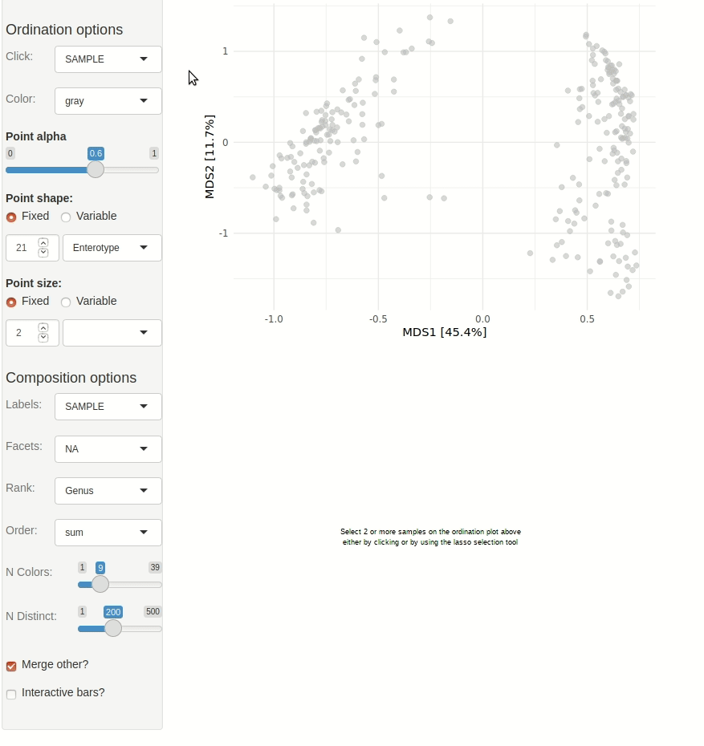

```{r, include = FALSE}
knitr::opts_chunk$set(
  collapse = TRUE,
  comment = "#>"
)
```

This article shows you how to quickly get started with interactive exploration of your data/ ordination plot.

```{r setup}
library(phyloseq)
library(microViz)
```

## Example

Example data loaded from the corncob package. All you need is a valid phyloseq object, and to run `tax_fix` to [ensure the tax_table doesn't contain problematic names](https://david-barnett.github.io/microViz/articles/web-only/tax-fixing.html).

```{r example}
pseq <- microViz::ibd %>%
  tax_fix() %>%
  phyloseq_validate()
```

The gif animation below shows the result of running `ord_explore`, the animation starts immediately after interactively selecting "Genus" level aggregation, "clr" transformation, and the "PCA" ordination method from the "Edit" menu.

``` {.R}
ord_explore(pseq)
```


## Another (old) example

Get example dataset from the phyloseq package and clean up the taxa just a little.

```{r get data}
data("enterotype", package = "phyloseq")
taxa_names(enterotype)[1] <- "Unclassified" # replace strange "-1" name
ps <- tax_fix(enterotype) # remove NA taxa and similar
```

Create simple Bray-Curtis PCoA to explore interactively.

```{r create ordination}
ord1 <- ps %>%
  tax_transform("identity", rank = "Genus") %>%
  dist_calc("bray") %>% # bray curtis
  ord_calc() # automagically picks PCoA
```

Start interactive Shiny app. Note that the gif animation shown is from an outdated version of microViz. More recent versions of `ord_explore` allow editing the ordination shown, and generating `ord_plot` code.

``` {.r}
ord_explore(data = ord1, auto_caption = NA)
```



# Session info

```{r session info}
devtools::session_info()
```
