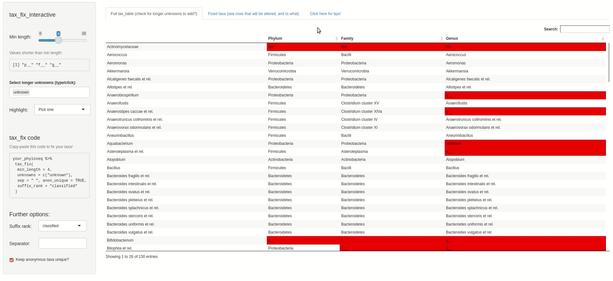

```{r, include = FALSE}
knitr::opts_chunk$set(
  collapse = TRUE,
  comment = "#>"
)
```

## Quick start / TLDR

Use `tax_fix()` on your phyloseq data with default arguments to repair most `tax_table` problems (missing or uninformative values). If you still encounter errors using e.g. `tax_agg`, try using the Shiny app `tax_fix_interactive()` to help you generate `tax_fix` code that will fix your particular `tax_table` problems.

------------------------------------------------------------------------

```{r setup}
library(phyloseq)
suppressPackageStartupMessages(library(microViz))
```

## Intro

This article will explain some of the common problems that can occur in your phyloseq `tax_table`, and that might cause problems for e.g. `tax_agg`. You can fix these problems with the help of `tax_fix` and `tax_fix_interactive`.

## Fixing problems

Let's look at some example data from the corncob package:

```{r example data}
pseq <- corncob::ibd_phylo
pseq
```

The Species rank appears to be blank for many entries. This is a problem you may well encounter in your data: unique sequences or OTUs often cannot be annotated at lower taxonomic ranks.

```{r example tt look}
tax_table(pseq)[40:54, 4:7] # highest 3 ranks not shown, to save space
```

If we would try to aggregate at Genus or Family rank level, we discover that blank values at these ranks prevent taxonomic aggregation. This is because, for example, it looks like OTU.43 and OTU.54 share the same (empty) Genus name, "", despite being different at a higher rank, Family.

```{r tax_agg fail}
# tax_agg(pseq, rank = "Family") # this fails, and sends (helpful) messages about taxa problems
```

So we should run `tax_fix` first, which will fix **most** problems with default settings, allowing taxa to be aggregated successfully (at any rank). If you still have errors when using tax_agg after tax_fix, carefully read the error and accompanying messages. Often you can copy suggested tax_fix code from the tax_agg error. You should generally also have a look around your tax_table for other uninformative values, using [tax_fix_interactive](https://david-barnett.github.io/microViz/articles/web-only/tax-fixing.html#interactive-solutions).

```{r tax_agg success}
pseq %>% tax_fix() %>% tax_agg(rank = "Family")
```

### What does tax_fix do?

`tax_fix` searches all the ranks of the phyloseq object `tax_table` for:

-   short values, like "g\_\_", "", " ", etc. (any with fewer characters than min_length)

-   common, longer but uninformative values like "unknown" (see full list at `?tax_fix`)

-   NAs

`tax_fix` replaces these values with the next higher taxonomic rank, e.g. an "unknown" Family within the Order Clostridiales will be renamed "Clostridiales Order", as seen below.

```{r tax_fix look}
pseq %>% tax_fix(min_length = 4) %>% 
  tax_agg("Family") %>% 
  # ps_get() %>% # needed in older versions of microViz (< 0.10.0)
  tax_table() %>% 
  .[1:8, 3:5] # removes the first 2 ranks and shows only first 8 rows for nice printing
```

### Interactive solutions

You can use `tax_fix_interactive()` to explore your data's `tax_table` visually, and interactively find and fix problematic entries. You can then copy your automagically personalised `tax_fix` code from `tax_fix_interactive`'s output, to paste into your script. Below is a screen capture video of `tax_fix` in action, using some other artificially mangled example data (see details at `?tax_fix_interactive()`).

``` {.r .R}
tax_fix_interactive(example_data)
```



### Other possible problems

1.  **Completely unclassified taxa** (aka taxa where all values in their `tax_table` row are either too short or listed in unknowns argument) will be replaced at all ranks with their unique row name by default (or alternatively with a generic name of "unclassified [highest rank]", which is useful if you want to aggregate all the unclassified sequences together with `tax_agg()`)
2.  **Unclassified taxa that also have short / unknown row names**, e.g. the unclassified taxon called "-1" in the example "enterotype" dataset from phyloseq. If something like this happens in your data, rename the taxa manually, (e.g. `taxa_names(enterotype)[1] <- "unclassified taxon"` or give them all completely different names with `tax_name()`.
3.  T**axa with the same `tax_table` entry repeated across multiple ranks**: This is a problem for functions like `taxatree_plots()`, which need distinct entries at each rank to build the tree structure for plotting. This might happen after you `tax_fix` data with problem 1. of this list, or in data from e.g. microarray methods like HITchip. The solution is to use `tax_prepend_ranks()` (after `tax_fix`) to add the first character of the rank to all tax_table entries (you will also need set the `tax_fix` argument suffix_rank = "current").
4.  **Informative but duplicated `tax_table` entries:** e.g. you don't want to delete/replace a genus name completely, but it is shared by two families and thus blocking `tax_agg`. The solution is to rename (one of) these values manually to make them distinct. `tax_table(yourPhyloseq)["targetTaxonName", "targetRank"] <- "newBetterGenusName"`
5.  **Really long taxa_names():** e.g. you have DNA sequences as names. See `tax_name()` for an easy way to rename all your taxa.

## Abundance filtering as a solution

Sequences that are unclassified at fairly high ranks e.g. Class are often very low abundance (or possibly represent sequencing errors/chimeras), if you are using data from an environment that is typically well represented in reference databases. So if you are struggling with what to do with unclassified taxa, consider if you can just remove them first using `tax_filter()` (perhaps using fairly relaxed filtering criteria like min_prevalence of 2 samples, or min_total_abundance of 1000 reads, and keeping the tax_level argument as NA, so that no aggregation is attempted before filtering).

## Alternatives

`microbiome::aggregate_taxa()` also solves some `tax_table` problems, e.g. where multiple distinct genera converge again to the same species name like "" or "s\_\_", it will make unique taxa names by pasting together **all** of the rank names. However this can produce some very long names, which need to be manually shortened before use in plots. Plus, it doesn't replace names like "s\_\_" if they only occur once. Moreover, when creating ordination plots with microViz, only `tax_agg()` will record the aggregation level for provenance tracking and automated plot captioning.

## Session info

```{r session info}
devtools::session_info()
```
